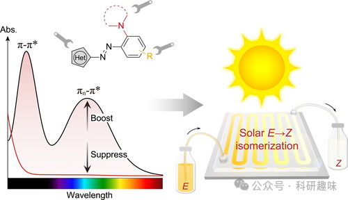
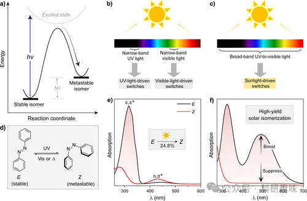

#  【Angew】抛弃紫外线，只需太阳光：新型分子设计实现超过80%的E-Z转化率 

本研究报告了一种新型的太阳光照下的异氰酸酯光开关，通过改善 E 型异氰酸酯的吸收谱，实现了高效的 E→Z 光同化反应。

## **摘要**

在这篇文章中，研究者们针对最广泛研究的光开关 —— 异氰酸酯开关，报告了一种新型的太阳光照下的 E→Z 光同化策略。传统的异氰酸酯开关通常需要特定波长的紫外光来实现有效的光转化，这限制了它们在太阳光下的应用。为了克服这一限制，研究者们采用了一种简单而可调的分子设计策略，通过增强 E 型异氰酸酯的可见光吸收，同时抑制 Z 型异氰酸酯的吸收，实现了在广谱的紫外到可见光范围内的高效 E→Z 光转化。这种策略通过引入一个强烈的可见光吸收带，使得 E 型异氰酸酯的吸收显著强于 Z 型异氰酸酯，从而实现了在未经过滤的太阳光下的 80-90%的 E→Z 光同化产率。研究者们通过实验验证了这种设计策略，并合成了一系列化合物来证明其有效性。此外，研究还表明，这种新型的太阳光照下的异氰酸酯开关不仅可以实现高效的光转化，还可以在不影响正向转化的情况下实现逆转化，为开发可持续的太阳光驱动系统和高效的太阳能转换技术提供了巨大的机会。

## **细节**

- 研究者们通过引入一个强烈的可见光吸收带，提高了 E 型异氰酸酯的吸收，同时抑制了 Z 型异氰酸酯的吸收，实现了在太阳光下的高效 E→Z 光同化。
- 这种新型的太阳光照下的异氰酸酯开关可以实现高达 80-90%的 E→Z 光同化产率。
- 通过扩展 πn 共轭系统，研究者们成功地将吸收光谱向红外区域移动，使得异氰酸酯开关的吸收达到了 600nm 以上。
- 研究表明，这种新型的异氰酸酯开关不仅可以在太阳光下实现高效的前向光同化，还可以在可见光下实现有效的逆向 Z→E 光同化。
- 研究者们通过合成和测试一系列化合物，证明了其分子设计策略的有效性和普适性，为其他类型的光开关提供了设计指导。
- 这项研究为开发利用太阳光的可持续光驱系统和太阳能转换技术开辟了新的途径。

## **参考文献**

>Z.-Y. Zhang, D. Dong, T. Bösking, T. Dang, C. Liu, W. Sun, M. Xie, S. Hecht, T. Li, Angew. Chem. Int. Ed. 2024, e202404528. https://doi.org/10.1002/anie.202404528
