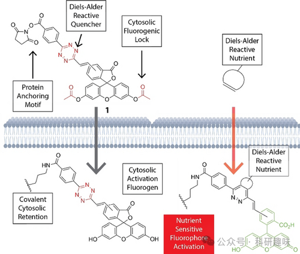
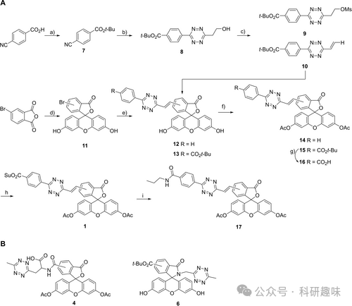
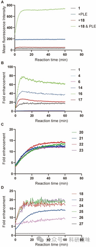
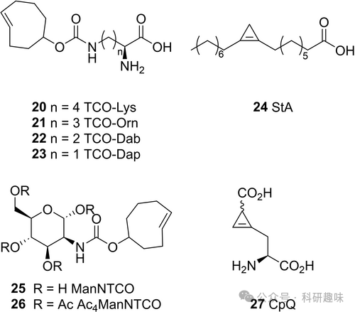
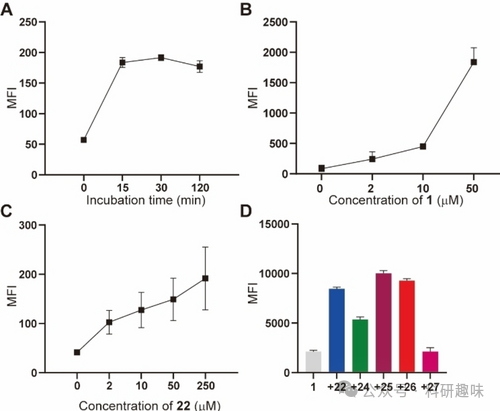
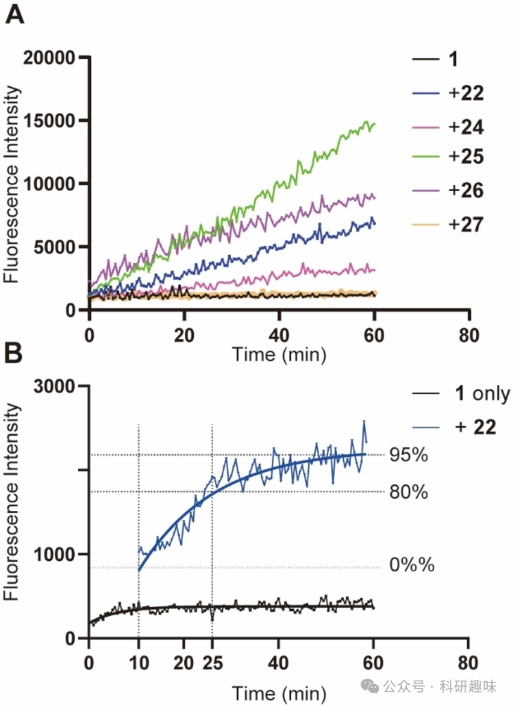
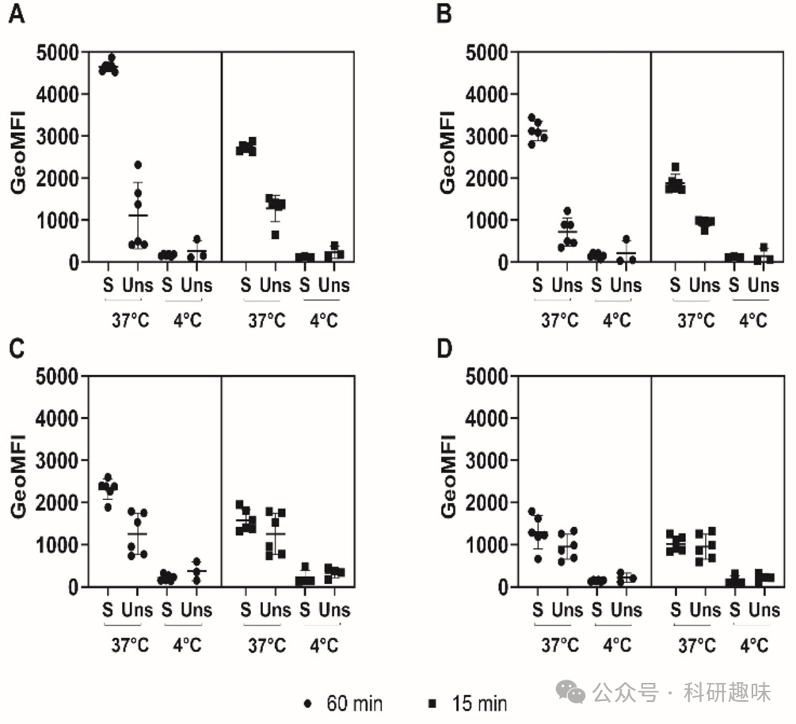

#  【Angew】细胞怎么吸收营养物质？正交荧光探针，实时观测细胞摄取 
 

### 总结

本研究开发了一种生物正交的双荧光探针CFSE-Tz，用于实时监测哺乳动物细胞摄取营养物质的过程。

## 摘要

研究人员设计并合成了一种新型的双条件荧光探针CFSE-Tz，用于在活细胞中实时监测和量化氨基酸、脂肪酸和N-乙酰氨基酸等营养物质的摄取。该探针利用IEDDA，通过细胞内酯酶的水解和与营养物质上的应激环氧化合物反应，实现了荧光的开启，从而在流式细胞和活细胞显微镜下监测营养物质的摄取。研究表明，CFSE-Tz探针对于监测T细胞激活过程中的营养物质摄取具有重要意义，为研究免疫代谢学提供了新的工具。

### 观点

1. 1. 营养物质的摄取对于细胞的生存、生长和分化至关重要，但单细胞水平上量化小分子营养物质的摄取非常困难。CFSE-Tz探针通过IEDDA反应提供了一种新方法来研究细胞内的营养物质摄取。
2. 2. CFSE-Tz探针设计基于CFSE分子，通过引入四烯基作为第二个荧光抑制剂，使得探针在细胞内酯酶水解后及时与营养物质上的应激环氧化合物反应，产生荧光信号。

1. 1. 研究人员合成了一系列IEDDA反应活性的营养物质类库，包括氨基酸、脂肪酸和N-乙酰氨基酸，并评估了这些营养物质与CFSE-Tz探针的反应速率和荧光增强倍数。

1. 1. CFSE-Tz探针在HeLa细胞中的毒性测试表明，探针对细胞没有显著的毒性，即使在较高浓度下也能保持细胞活性。

1. 1. 通过流式细胞和活细胞显微镜的实验，证明了CFSE-Tz探针能够在实时监测的情况下，观察到细胞对不同营养物质的摄取过程

1. 1. 在研究中，CFSE-Tz探针被用于比较未激活和激活的T细胞对营养物质的摄取差异，结果显示激活的T细胞对脂肪酸的摄取显著增加，而对某些氨基酸的摄取则没有明显变化。

1. 1. 研究总结指出，CFSE-Tz探针在研究免疫代谢学时具有重要价值，尽管存在一些局限性，如反应时间限制和化学修饰对细胞摄取路径的潜在影响，但这种方法为进一步研究细胞营养物质摄取提供了新的视角。

### 参考文献

> Wang, Y.; Torres‐García, D.; Mostert, T. P.; Reinalda, L.; Van Kasteren, S. I. A Bioorthogonal Dual Fluorogenic Probe for the Live‐Cell Monitoring of Nutrient Uptake by Mammalian Cells. Angew Chem Int Ed 2024, e202401733. https://doi.org/10.1002/anie.202401733.
