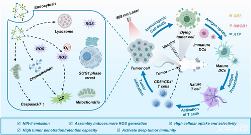
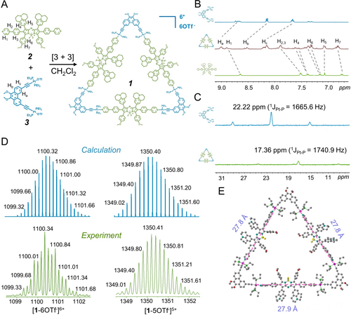

#  【Angew】近红外激活ROS光敏剂，7 mm穿透深度，诱发深层肿瘤ICD 
 

本研究首次报道了一种可由近红外光激活的铂 (II) 金属环状复合物，作为高效的免疫原性细胞死亡（ICD）诱导剂，用于深部肿瘤的化疗和光疗免疫治疗，具有极佳的组织渗透能力和 ROS产生能力 ，并能显著降低副作用。

## **摘要**

本研究通过协调驱动的自组装合成了一种新型的铂 (II) 金属环状复合物（1），它能够在近红外光（NIR）激活下诱导免疫原性细胞死亡（ICD）。该复合物在体内外都显示出对肿瘤细胞具有高选择性和高效的杀伤能力，能够有效克服顺铂耐药，并在深部肿瘤中产生 ROS。1的设计基于 aza-BODIPY 配体（2）和铂 (II) 受体（3）的自组装，其在 NIR 光照下产生 ROS 的能力是自由配体的约 25 倍。在体外实验中，1表现出显著的细胞摄取能力和广谱杀瘤活性，并能够在多细胞肿瘤球体（MCTs）中产生大量 ICD。在体内实验中，1通过激活 CD8/CD4 T 细胞反应和 Foxp3 T 细胞抑制，作为一个强效的 ICD 诱导剂，显示出极低剂量（5 μM）下的高效 ICD 诱导能力，并且几乎没有副作用。这一发现为金属基的 ICD 诱导剂在免疫治疗中的应用开辟了新的途径。

## **细节**

**ICD 诱导剂的开发需求：**

- 尽管铬基药物在治疗肿瘤方面表现出色，但它们也具有免疫抑制特性，这严重限制了它们在免疫治疗中的应用。因此，开发能够激活充分免疫反应且副作用最小的 ICD 诱导剂对于深部肿瘤的治疗至关重要。

**铂 (II) 金属环状复合物的设计与特点：**

- 研究者们设计了一种铂 (II) 金属环状复合物（1），它通过 NIR 光激活，能够在深部肿瘤中产生 ROS，并具有良好的组织和 ROS 渗透能力，以及优异的抗扩散和抗 ROS 消耗能力。这种复合物能够在极低的浓度下诱导 ICD，并显示出对正常组织的低毒性。

**光学和 ROS 生成性质：**

- 1展现了优异的光学性质，包括 NIR 光激发和强 ROS 产生能力，以及深组织的光和 ROS 渗透能力。它在 DMSO / 水混合溶液中表现出良好的抗荧光淬灭能力，并且在存在生物硫类化合物的情况下也具有良好的稳定性。

**理论计算和 ICD 机制：**

- 通过理论计算，研究者们发现1相比于自由配体，具有更多的能级通道，这有助于提高内 ISC效率，从而增强 ROS 生成能力。1通过诱导 DAMPs 的释放，包括 CRT 表达、ATP 分泌和 HMGB1 释放，在体外实验中显示出强大的 ICD 诱导能力。

**体内实验和免疫治疗效果：**

- 在体内实验中，1在光疗和化疗的联合作用下，显示出对深部肿瘤的有效治疗效果，能够激活强大的免疫反应，并且在治疗过程中几乎没有观察到对主要器官的损伤。

**对比其他 Pt 基药物：**

- 与顺铂和奥沙利铂等临床上常用的 Pt 基药物相比，1在更低的剂量下展现出更高的细胞毒性和更强的 ICD 诱导能力，同时具有更好的生物相容性和安全性。

## **参考文献**

>C. Li, L. Tu, Y. Xu, M. Li, J. Du, P. J. Stang, Y. Sun, Y. Sun, *Angew. Chem. Int. Ed.* 2024, e202406392. https://doi.org/10.1002/anie.202406392
