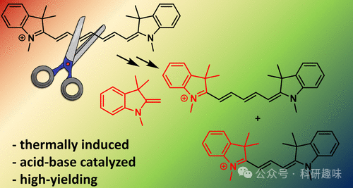
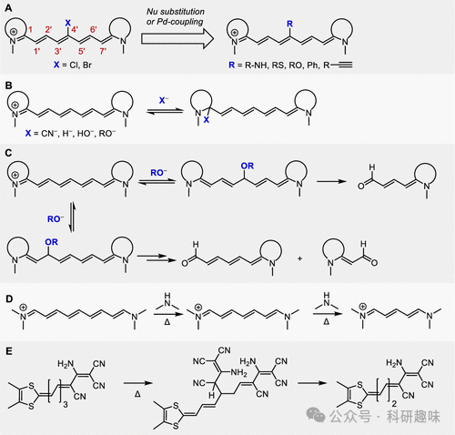
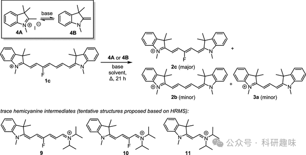
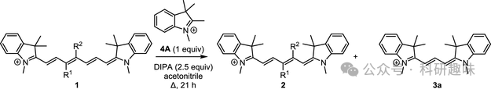
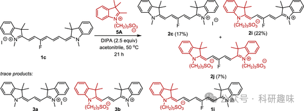
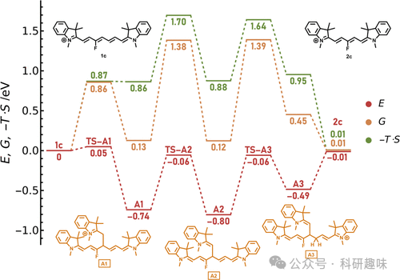

#  【JACS】Cy7-Cy5-Cy3互变，一个不小心你合成的Cy7可能变成Cy5和Cy3 
 

### 总结

这篇文章主要报道了一种热缩短反应，即在特定条件下将花菁类染料（Cy7）的七元烷链缩短为五元烷链（Cy5）和三元烷链（Cy3）的过程，并对该反应机制进行了深入研究。

## 摘要

本研究揭示了花菁类染料（Cy7）在热条件下发生链短缩合反应的现象，通过实验和理论计算验证了该过程的机制。研究人员发现，在适当的温度、溶剂和催化剂存在下，Cy7 可以转化为具有五元烷链的 Cy5 和三元烷链的 Cy3。通过高效液相色谱（HPLC）、高分辨率质谱（HRMS）和核磁共振（NMR）分析，确定了反应产物，并发现吸电子或者给电子基团的存在对反应效率有显著影响。此外，研究还涉及到了 Cy5 衍生物的稳定性和反应性，以及在不同条件下的异构化合物交换反应。通过量子化学计算，对反应路径进行了详细的探讨，包括反应动力学和能级，以及涉及的中间体和过渡态。这项工作不仅提供了对花菁类染料化学稳定性和反应性的深入了解，而且为这类染料的合成和应用提供了有价值的指导。

## 细节

- • 热缩短反应是一种在特定条件下将 Cy7 转化为 Cy5 和 Cy3 的有效途径，该过程受温度、溶剂、催化剂和基团替代者的影响。

- • 实验结果表明，吸电子基团的存在能够提高 Cy5 的产率，而在 C4' 位置的取代则对链短反应产生负面影响。

- • Cy5 衍生物在相似条件下不会发生链短反应，但可以通过交换反应改变其末端杂环结构。

- • 量子化学计算揭示了热缩短反应的能量概貌，包括反应前体、过渡态和产物的能量变化，以及反应路径上的关键步骤。

- • 该研究对于理解和控制花菁类染料的化学稳定性和反应性具有重要意义，有助于优化这类染料在生物成像和药物递送等领域的应用。

## 参考文献

>Okoročenkova, J.; Filgas, J.; Khan, N. M.; Slavíček, P.; Klán, P. Thermal Truncation of Heptamethine Cyanine Dyes. J. Am. Chem. Soc. **2024**, jacs.4c02116. https://doi.org/10.1021/jacs.4c02116.
