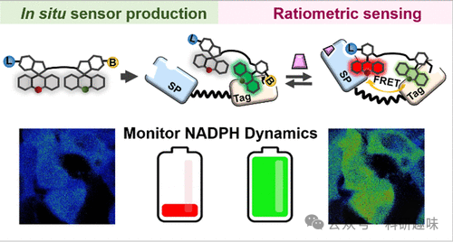
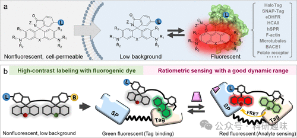
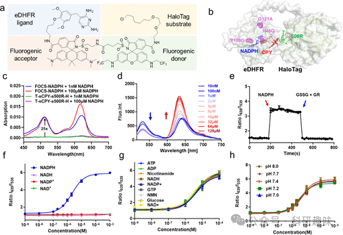
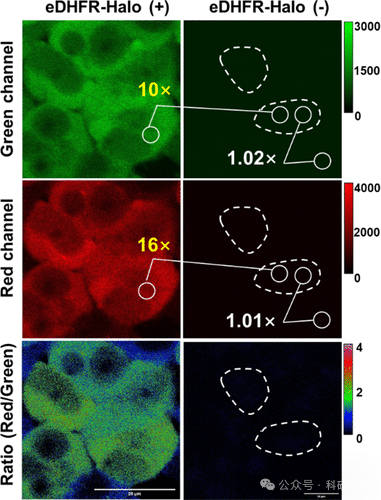
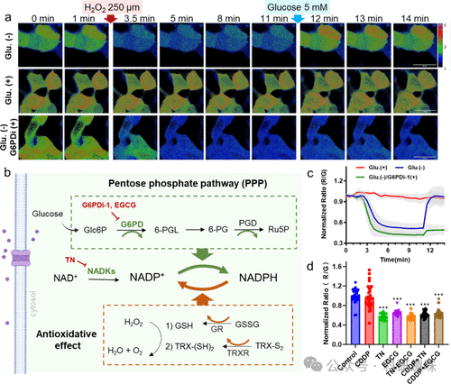

#  【JACS】NADPH探针新贵，基于FRET的双罗丹明荧光传感器 
 

## 总结

这篇文章报道了一种新型的基于罗丹明的荧光传感器FOCS-NADPH，用于实时监测细胞内NADPH的动态变化。

## 摘要

文章首先介绍了基于罗丹明的荧光共振能量转移（FRET）的生物传感器(**FOCS-NADPH**)，这种传感器能够通过分析生物分子的动态变化来监测细胞内**NADPH**的浓度。该传感器由两种荧光罗丹明和两种配体（HaloTag和eDHFR）组成，通过这种方式，传感器可以在生物体内形成一个的1:1的FRET对，从而实现对**NADPH**浓度的比例测量。该传感器具有良好的动态范围、pH不敏感性和快速的响应速度，特别针对细胞质内**NADPH**的检测进行了优化。研究人员通过实验验证了传感器对**NADPH**的选择性和对其他类似代谢物的抗干扰能力。此外，还展示了如何使用**FOCS-NADPH**传感器来实时监测生活细胞中**NADPH**的动态变化，以及如何探究**NADPH**代谢网络的调节机制。最后，研究人员讨论了未来可能的传感器改进方向，包括开发新的染料和蛋白质以检测其他代谢物，以及如何通过同时监测多种荧光信号来实现多种代谢物的同时检测。

## 观点

1. 1. 基于FRET的荧光传感器能够实时监测细胞内NADPH的动态变化。
2. 2. **FOCS-NADPH**传感器的设计原理基于将两种荧光罗丹明与HaloTag和eDHFR蛋白质相结合，形成一个1:1的FRET对，这种设计可以确保传感器的高效标记和比例测量。

1. 1. **FOCS-NADPH**传感器对**NADPH**具有高度的选择性和对pH变化的不敏感性，这使得它在不同的细胞环境中都能稳定工作。

1. 1. 实验结果显示，**FOCS-NADPH**传感器能够在细胞中有效地监测到氧化应激或药物暴露后NADPH浓度的快速反应。

1. 1. 通过使用**FOCS-NADPH**传感器，研究人员发现了**NADPH**在葡萄糖代谢中的关键作用，
2. 2. 未来的研究方向可能包括开发新的传感器以检测其他代谢物，并通过多色荧光技术实现同时监测多种代谢物的能力。

## 参考文献

> Chang, H.; Clemens, S.; Gao, P.; Li, Q.; Zhao, H.; Wang, L.; Zhang, J.; Zhou, P.; Johnsson, K.; Wang, L. Fluorogenic Rhodamine-Based Chemigenetic Biosensor for Monitoring Cellular NADPH Dynamics. J. Am. Chem. Soc. 2024, jacs.3c13137. https://doi.org/10.1021/jacs.3c13137.
