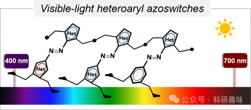
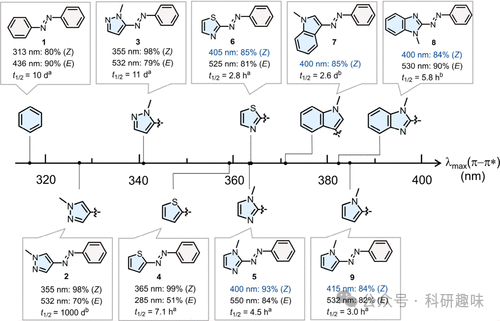
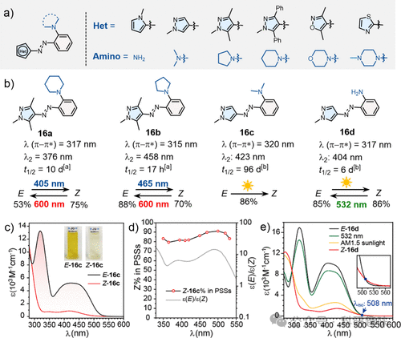
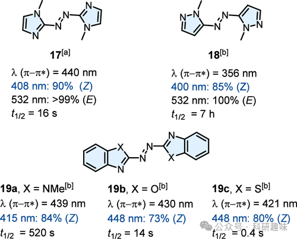
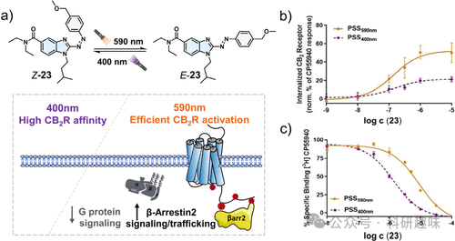
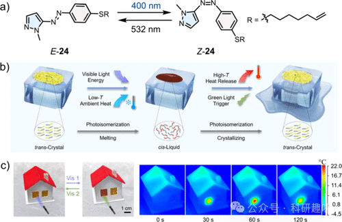
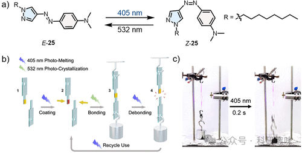
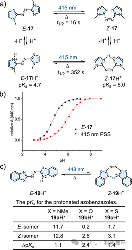

#  【JACS】活久见，JACS竟然出了综述类的文章，一文看懂可见光激活的分子开关 
 

## 总结

本文主要介绍了可见光激活的偶氮光开关的研究进展，以及其在光药物、太阳能存储、可剥离胶粘剂和pH开关等应用中的潜在价值。

## 摘要

本文综述了可见光激活的偶氮光开关的研究进展。偶氮化合物是一类具有可逆光学性质的分子开关，通过选择电子丰富的杂环化合物或在苯环上引入电子给体，可以实现可见光下的光异构化反应。文章首先介绍了单杂环偶氮开关的设计策略，包括通过选择富电子的杂环或在苯环上引入电子给体官能团来实现可见光激活，以及通过改变杂环的连接位置来调控光开关的性质。接着讨论了双杂环偶氮开关的研究，包括对称和非对称的双杂环结构，以及它们在可见光范围内的光开关性能。文章还探讨了偶氮化合物在光药物、太阳能存储、可剥离胶粘剂和pH开关等领域的应用潜力。最后，文章提出了未来研究的挑战和机遇，包括理论引导的分子设计、合成方法的进一步发展、红外光激活的偶氮化合物的探索、光开关性能与热稳定性之间的平衡、以及利用杂环的独特功能性来开发新的应用场景。

## 细节

- • 单杂环偶氮开关可以通过选择富电子的杂环或在苯环上引入电子给体官能团来实现可见光激活的光异构化反应。

- • 双杂环偶氮开关的研究展示了对称和非对称结构在可见光范围内的光开关性能，以及它们在应用中的潜在优势。

- • 偶氮开关在光药物领域具有巨大的应用潜力，可以通过可见光控制药物活性，实现精准的光控药物释放。

- • 偶氮开关在太阳能存储领域的应用，特别是在光子分子太阳热存储系统中，展示了其在提高能量密度和存储效率方面的优势。

- • 偶氮开关可以作为可剥离胶粘剂的关键组分，通过可见光激活来控制粘附和分离过程。

- • 偶氮开关还可以作为pH开关，通过光异构化反应来调节溶液的pH值，具有在化学过程中控制pH值的潜力。

- • 未来研究的挑战和机遇包括开发新的合成方法、探索红外光激活的异噬环芳基酰胺、平衡光开关性能与热稳定性，以及开发利用杂环功能性的新应用。

## 参考文献

> Dang, T.; Zhang, Z.-Y.; Li, T. Visible-Light-Activated Heteroaryl Azoswitches: Toward a More Colorful Future. J. Am. Chem. Soc. 2024, jacs.4c03135. https://doi.org/10.1021/jacs.4c03135.
