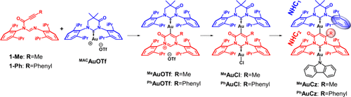
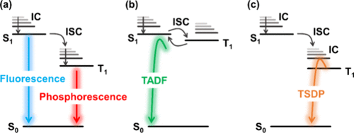

#  【JACS】热激活延迟荧光（TADF）和热激活延迟磷光（TSDP）的有机结合 
 

## 简要

**Au (I) 金属复合物** **AuCz** 具有双金属桥接结构，通过调节分子几何形状实现了热激活延迟荧光（TADF）和热激活延迟磷光（TSDP）的双重发射。

## 介绍

本文详细介绍了一种新型的双金属桥接结构的 Au (I) 金属复合物**AuCz**，该复合物具有交错二碳化合物结构，能够通过调节分子几何形状实现从低三重态到高能辐射态的热激活。在晶体状态下，**AuCz**展现出蓝绿色的 TSDP 发射，具有超过 70 μs的辐射寿命和 42% 的量子产率。在PS胶基薄膜中，**AuCz**显示出蓝色发射，其中包含了 TADF 和 TSDP 两种发射机制的共存，具有高达 62% 的量子产率和两种不同的辐射寿命。研究表明，**AuCz**复合物的发射性质与其分子结构和不同的基态构形有关，这为设计和合成智能材料提供了一个新的方向。

## 细节

- **AuCz**复合物的分子结构特征包括大的永久二碳化合物之间的二面角以及相对较低的配体旋转屏障，这些特性使得**AuCz**能够在不同的环境中展现出不同的发射行为。
- 在晶体状态下，**AuCz**通过热激活的内转换过程实现了 TSDP，这一过程涉及到高能三重态的非辐射能量转移。
- 在PS胶基膜中，**AuCz**的发射机制包括 TADF 和 TSDP，这是由于存在不同的基态构形，这些构形能够在室温下通过热激活实现从三重态到单重态的能量转移。
- 通过对**AuCz**复合物的温度依赖性研究，发现其中一个构形（**AuCz-TADF**）的辐射寿命随温度的降低而显著增加，而另一个构形（**AuCz-TSDP**）的辐射寿命则随温度的降低而减小。

## 参考文献

>https://doi.org/10.1021/jacs.4c02930
