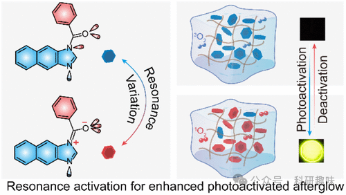
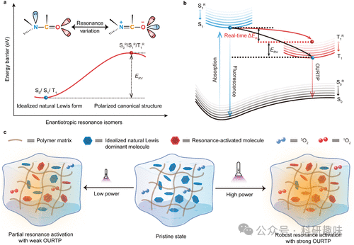
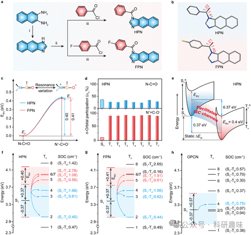
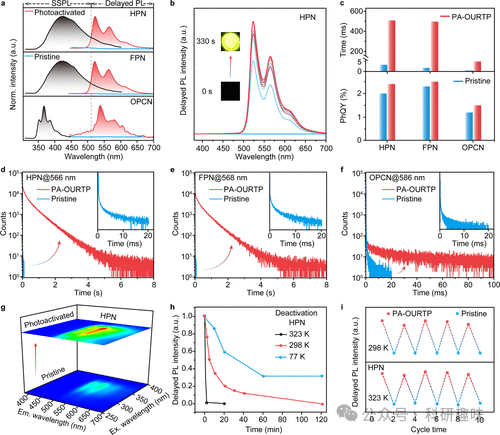
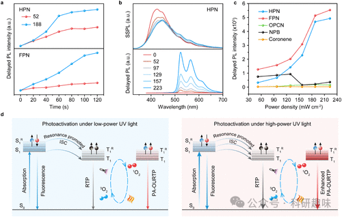

#  【JACS】通过共振调控三重态的比例，实现有机超长室温磷光 

## 总结

本研究报道了一种通过引入自适应N-C=O结构实现动态三重激发态调控的有机超长室温磷光材料的策略。

## 摘要

本文通过引入自适应N-C=O结构，实现了对有机超长室温磷光（PA-OURTP）材料中三重激发态丰度的动态调控。研究者合成了两种含有N-C=O共振结构的新型磷光体，即**HPN**和**FPN**，以及一个没有共振结构的对照物质**OPCN**。实验结果表明，在高功率紫外线照射下，**HPN**和**FPN**展现出更强的光激活有机超长室温磷光（photoactivated organic ultralong room temperature phosphorescence，**PA-OURTP**）性能，其寿命可达约500 ms，明显优于**OPCN**。这种增强的PA-OURTP效应是由于N-C=O结构的激发导致的增强的系间穿越（ISC），该过程有效地生成了过量的三重激发态激子。此外，研究还揭示了动态光激活机制，并探讨了N-C=O结构在三重激发态调控中的作用。最后，该研究还展示了**HPN**/PMMA基材料在信息加密应用中的潜力，实现了可重复使用的信息加密设备，能够在空气中保持超过30分钟的扫描时间。

## 细节

- • 通过引入自适应N-C=O结构，可以动态调控有机材料中三重激发态的比例，从而实现有机超长室温磷光（PA-OURTP）的增强。

- • **HPN**和**FPN**在高功率紫外线照射下表现出更高效的PA-OURTP性能，其长生存时间和量子产率（QY）高于对照物质**OPCN**。

- • 实验结果显示，N-C=O结构的激发可以增强系间穿越（ISC），有助于生成更多的三重激发态激子。

- • **HPN**/PMMA基材料的PA-OURTP性能可以通过调整掺入浓度和薄膜厚度进行优化。
- • 研究还发现，N-C=O结构的动态变化可以通过调整外部光的强度来加速，从而在高功率光激下实现三重激发态丰度的增加。
- • 本研究提供了一种有效的策略，用于动态调控三重激发态，为高性能PA-OURTP材料的开发和其在高级有机光电子应用中的潜在价值提供了新的途径。

## 参考文献

> Xie, G.; Guo, N.; Xue, X.; Yang, Q.; Liu, X.; Li, H.; Li, H.; Tao, Y.; Chen, R.; Huang, W. Resonance-Induced Dynamic Triplet Exciton Population for Photoactivated Organic Ultralong Room Temperature Phosphorescence. J. Am. Chem. Soc. 2024, jacs.4c06577. https://doi.org/10.1021/jacs.4c06577.
