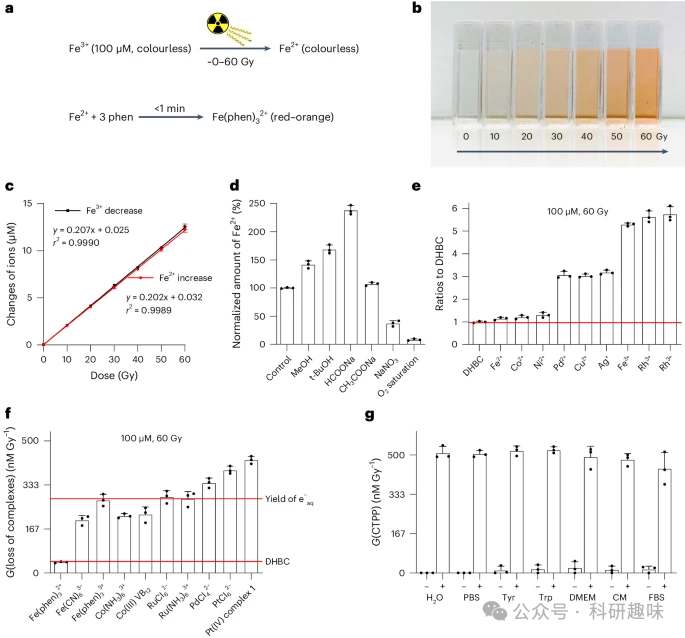
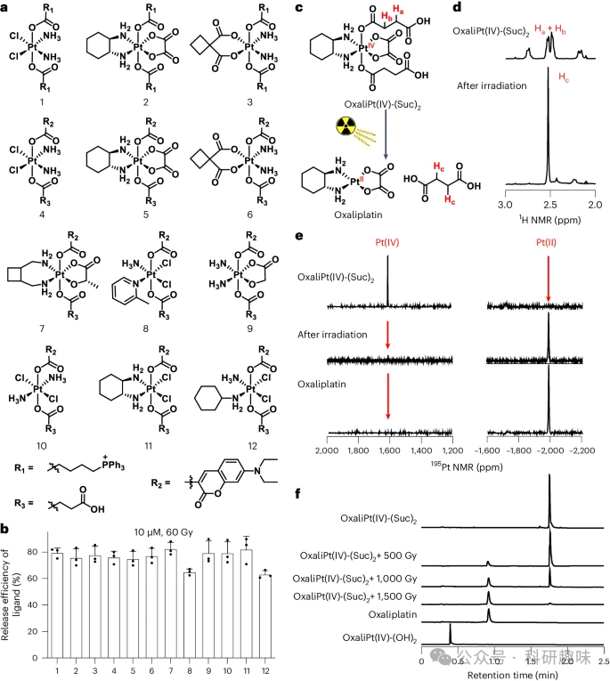
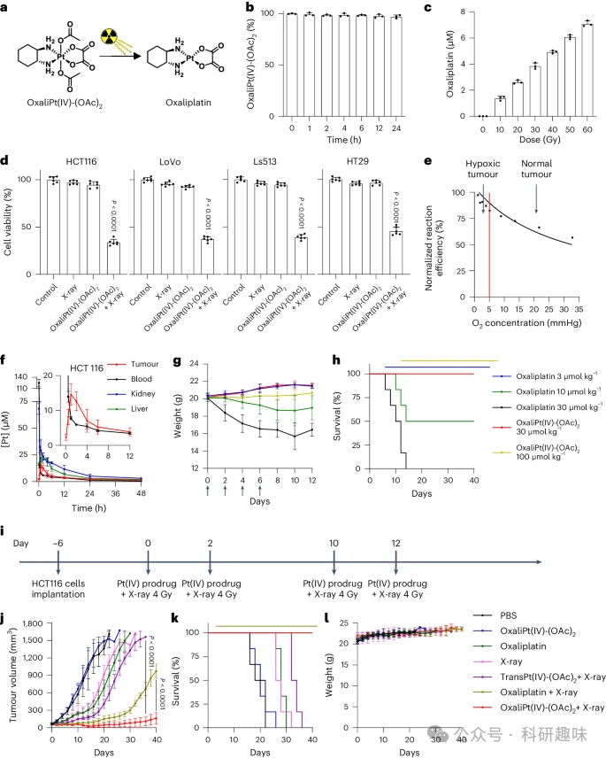
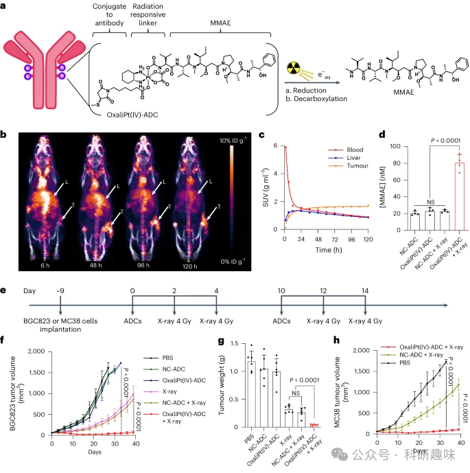

#  【Nat. Biomed. Eng.】化疗不够，放疗来凑，利用辐射诱导的铂药释放能够更好的抑制肿瘤 
 

## 总结

本研究揭示了利用辐射疗法诱导的铂基化疗药物前体物的还原反应，可以在肿瘤中有效释放抗癌药物，从而增强放化疗的疗效。

## 摘要

研究人员发现，通过辐射疗法诱导的水分子裂解产生的高度还原性电子可以有效地将铂(IV)复合物还原为铂(II)药物，并在体内释放出来。这一发现为放化疗结合治疗提供了新的策略。在体外实验中，研究人员证明了多种铂(IV)复合物在辐射条件下能够释放出对应的铂(II)药物，且在动物模型中，这种辐射诱导的药物释放方法显示出显著的肿瘤抑制作用，甚至能够实现几乎完全的肿瘤消退。此外，研究还展示了利用抗体药物共轭（ADC）技术，通过辐射诱导的方式释放抗肿瘤药物MMAE，这一方法在小鼠模型中显示出了良好的治疗效果。这项研究的成果可能会扩大辐射疗法的应用范围，并为肿瘤治疗提供了一个新的、可能更加精准和有效的方法。

## 观点

- • 辐射诱导水分子产生的高度还原性电子能够有效还原铂(IV)复合物，释放出抗癌活性的铂(II)药物。
image.png

#### 图1. 辐射诱导的金属络合物还原快速、高效、具有生物兼容性，而且一般可在水中使用。

- • 辐射诱导的铂(IV)复合物还原反应在体外和体内实验中均得到了证实，表明这一策略具有很好的可行性。
image.png

#### 图 2：辐射可轻易还原铂(IV)配合物，释放出轴向配体和相应的铂(II)药物。

- • 利用辐射诱导的药物释放方法，可以在肿瘤中实现对抗肿瘤药物的局部精准释放，从而提高治疗效果并减少副作用。
image.png

#### 图 3：放疗诱导的奥沙利铂控释可抑制癌细胞生长，并促使小鼠肿瘤消退。

- • 通过ADC技术，可以将辐射诱导的药物释放与特定的靶点结合，进一步提高肿瘤治疗的靶向性和效率。
image.png

#### 图 4：放疗激活铂(IV)原药策略在 ADC 中的应用。

- • 研究结果表明，辐射诱导的铂(IV)前体物的还原和药物释放在动物模型中显示出了显著的肿瘤抑制作用，为临床应用提供了希望。
- • 这一研究为放化疗结合治疗提供了新的思路，可能会对未来的肿瘤治疗策略产生重要影响。

## 参考文献

> Fu, Q., Zhang, S., Shen, S. et al. Radiotherapy-triggered reduction of platinum-based chemotherapeutic prodrugs in tumours. Nat. Biomed. Eng (2024). https://doi.org/10.1038/s41551-024-01239-x
