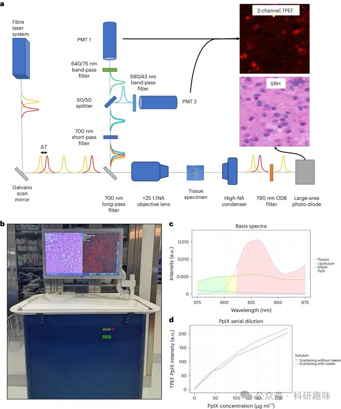
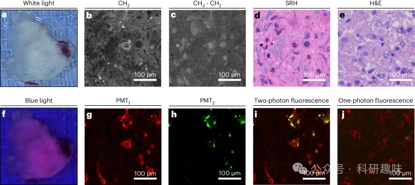
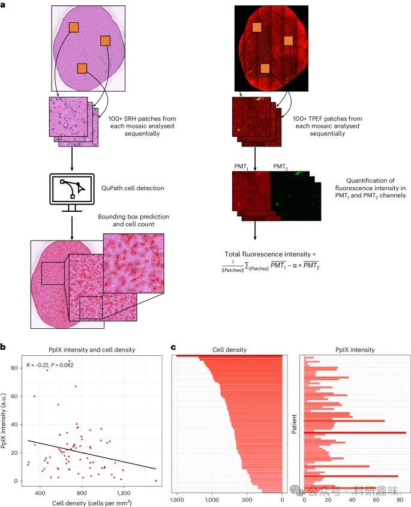
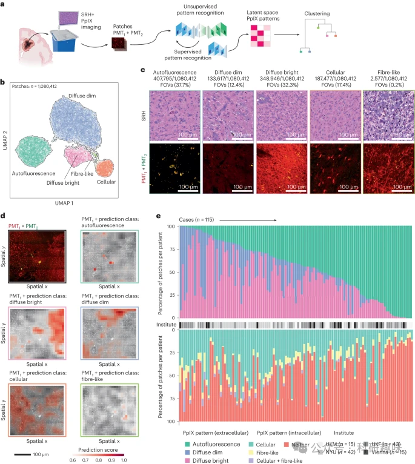
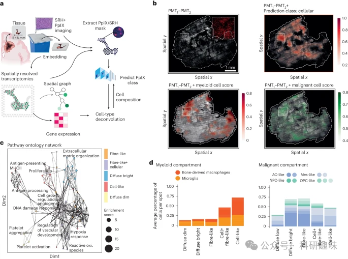
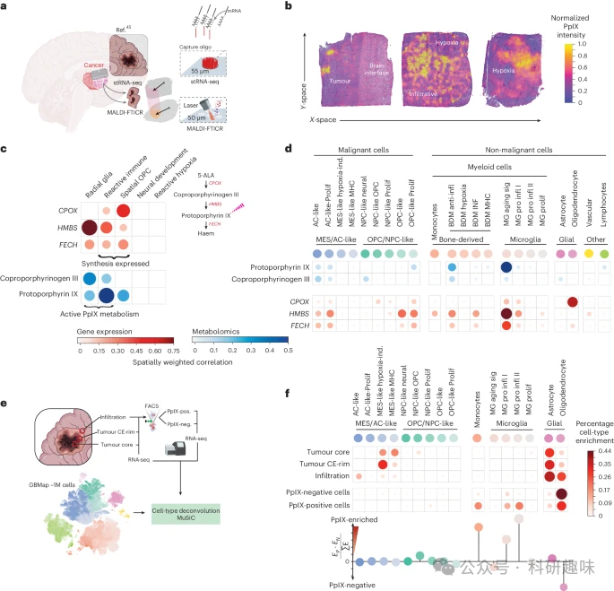

#  【Nat. Biomed. Eng.】拉曼+双光子，打破传统，荧光标记并非只针对癌细胞！ 
 

## 总结
这篇文章讲的是脑肿瘤手术中使用的5-ALA荧光引导技术。过去认为这种技术可以特异性标记肿瘤细胞，帮助外科医生更精准切除肿瘤。然而，文章通过新的研究发现，荧光标记物不仅会在癌细胞聚集，还会在肿瘤相关巨噬细胞聚集，这与过去的想法并不相同。该研究将有助于我们更好地理解脑肿瘤的形成过程，为脑肿瘤的治疗带来新思路。
## 摘要

研究团队开发了一种多模态光学系统，能够同时进行拉曼组织学（SRH）和双光子激发荧光显微（TPEF）成像，以在新鲜的人类高级胶质瘤组织中定位PpIX。在115例胶质瘤患者的研究中，发现组织细胞密度与5-ALA诱导的荧光强度之间存在弱负相关。通过半监督聚类分析，研究者们识别出五种不同的PpIX荧光模式，并通过空间解析代谢组学分析发现，PpIX主要积累在具有免疫细胞特征的细胞中，尤其是肿瘤相关巨噬细胞。进一步的数据集分析验证了这一发现，并表明巨噬细胞在代谢和积累PpIX方面比其他细胞类型更为活跃。这些发现提供了一种新的方法来直观地观察和理解胶质瘤的免疫微环境。

## 观点

- • 通过结合SRH和TPEF技术，研究者们能够在新鲜的人类高级胶质瘤组织中精确地定位和可视化PpIX的分布，这为研究胶质瘤的代谢特性和微环境提供了新的工具。

- • 研究表明，组织细胞密度与5-ALA诱导的荧光强度之间存在弱负相关，这与以往认为荧光强度与肿瘤细胞浸润密度正相关的观点不一致。

- • 通过半监督聚类分析，研究者们识别出五种PpIX荧光模式，这些模式有助于理解PpIX在肿瘤组织中的分布特征。

- • 空间解析代谢组学分析结果表明，PpIX主要积累在肿瘤免疫微环境中的巨噬细胞中，而不是在肿瘤细胞中，这一发现对于理解胶质瘤的免疫生物学具有重要意义。

- • 通过对外部数据集的分析，研究者们进一步验证了PpIX在巨噬细胞中的积累和代谢，并表明巨噬细胞在这一过程中的作用可能比肿瘤细胞更为重要。

- • 研究结果挑战了5-ALA诱导的胶质瘤细胞内荧光的观点，并指出了新的研究方向，即通过观察巨噬细胞中的PpIX积累来评估胶质瘤的免疫微环境。

## 参考文献

> Nasir-Moin, M.; Wadiura, L. I.; Sacalean, V.; Juros, D.; Movahed-Ezazi, M.; Lock, E. K.; Smith, A.; Lee, M.; Weiss, H.; Müther, M.; Alber, D.; Ratna, S.; Fang, C.; Suero-Molina, E.; Hellwig, S.; Stummer, W.; Rössler, K.; Hainfellner, J. A.; Widhalm, G.; Kiesel, B.; Reichert, D.; Mischkulnig, M.; Jain, R.; Straehle, J.; Neidert, N.; Schnell, O.; Beck, J.; Trautman, J.; Pastore, S.; Pacione, D.; Placantonakis, D.; Oermann, E. K.; Golfinos, J. G.; Hollon, T. C.; Snuderl, M.; Freudiger, C. W.; Heiland, D. H.; Orringer, D. A. Localization of Protoporphyrin IX during Glioma-Resection Surgery via Paired Stimulated Raman Histology and Fluorescence Microscopy. Nat. Biomed. Eng 2024. https://doi.org/10.1038/s41551-024-01217-3.
