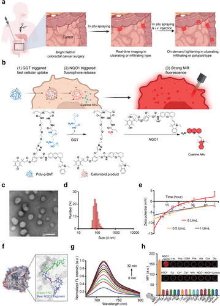
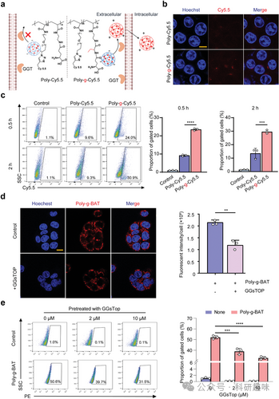
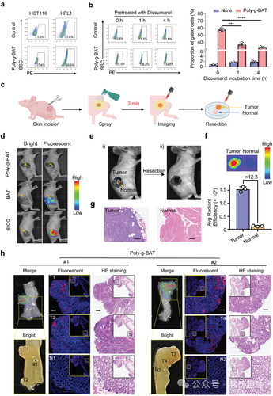
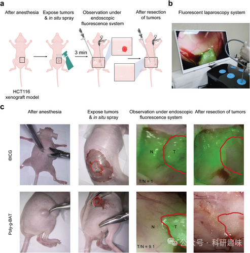
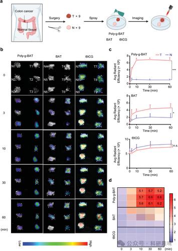



#  【Adv. Mater.】既要又要还要，可注射、可喷涂，快速高信噪比的新型荧光手术导航探针 
 

## 总结

本研究开发了一种可注射和喷雾的荧光纳米探针Poly-g-BAT，用于快速实时检测人类结肠癌。该探针能够通过内化和激活机制，在新鲜切除的人类结肠癌组织和动物模型中实现快速的肿瘤成像，显著提高了肿瘤与正常组织的信噪比（TNR），并能够识别微小的前肿瘤性病变。

## 摘要

研究人员设计并合成了一种新型的荧光纳米探针Poly-g-BAT，Poly-g-BAT通过GGT催化的γ-谷氨酸水解快速内化，并在肿瘤细胞内通过NQO1激活，释放出近红外荧光探针，实现肿瘤的快速成像。实验结果表明，Poly-g-BAT在新鲜人类结肠癌组织和小鼠模型中的应用，能够通过喷雾方式实现3分钟左右肿瘤边界的显著可视化，并且信噪比（&gt;12.3）高于使用ICG或其他探针。此外，通过肌注的方式，Poly-g-BAT还能够识别直径小于1mm的微小结肠癌病变。研究还评估了Poly-g-BAT的生物安全性，证明了其在动物模型中的良好生物相容性。这一发现为肿瘤切除手术提供了一种新的、高效的荧光成像指导方法，有望在临床应用中提高肿瘤切除的精确性和安全性。

## 观点

### Poly-g-BAT纳米探针能够通过GGT和NQO1的酶活性快速内化和激活，实现肿瘤特异性成像。
这一设计策略克服了现有荧光探针在肿瘤成像中的局限性，如非特异性成像和操作过程中的组织污染问题。

#### 图1. γ-谷氨酰水解介导的细胞快速吸收

### 通过实验验证，Poly-g-BAT在体内外条件下均展现出对肿瘤组织的高特异性和高TNR值，这表明该探针具有潜在的临床应用价值，能够在手术中辅助快速准确地识别和切除肿瘤组织。

#### 图2. 小鼠模型原位喷洒后的荧光成像

### Poly-g-BAT探针的设计和应用展示了一种新型的肿瘤成像技术，它不仅能够通过喷雾形式快速标记肿瘤边界，还能够通过静脉注射识别微小的肿瘤病变，这对于提高结肠癌手术的精确性和降低复发风险具有重要意义。

#### 图3. 原位喷涂聚-g-BAT引导的肿瘤切除术

### 研究还强调了Poly-g-BAT探针的生物安全性，通过对小鼠的长期观察和组织学分析，证明了其在体内的良好生物相容性和低毒性，为未来的临床试验和应用打下了基础。

#### 图4. 使用 Poly-g-BAT、BAT 和 ICG 进行人体结肠组织成像

## 参考文献

> Zhang, B.; Lu, J.; Lin, X.; Wang, J.; Li, Q.; Jin, T.; Shi, Q.; Lu, Y.; Zhang, J.; Deng, J.; Zhang, Y.; Guo, Y.; Gao, J.; Chen, H.; Yan, Y.; Wu, J.; Gao, J.; Che, J.; Dong, X.; Gu, Z.; Lin, N. Injectable and Sprayable Fluorescent Nanoprobe for Rapid Real‐Time Detection of Human Colorectal Tumors. Advanced Materials 2024, 2405275. https://doi.org/10.1002/adma.202405275.
