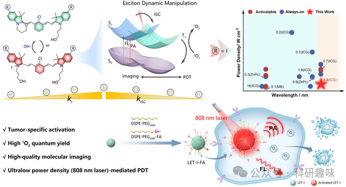
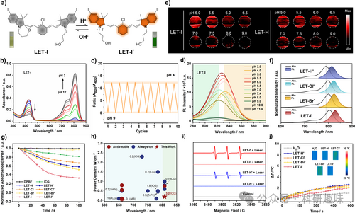
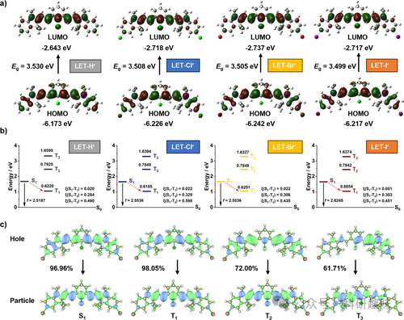
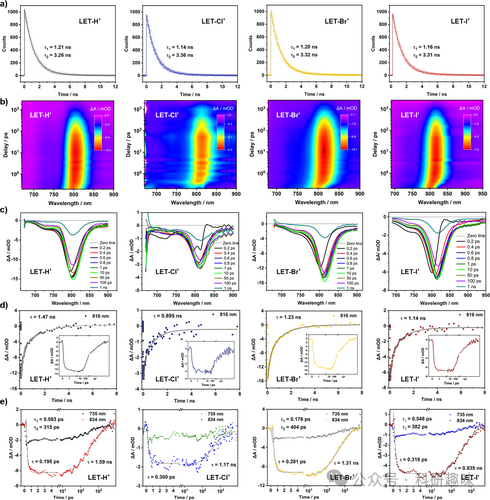
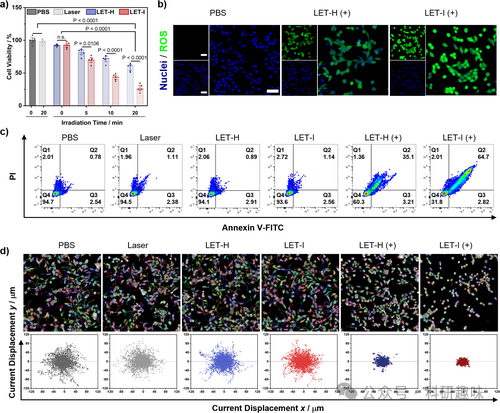
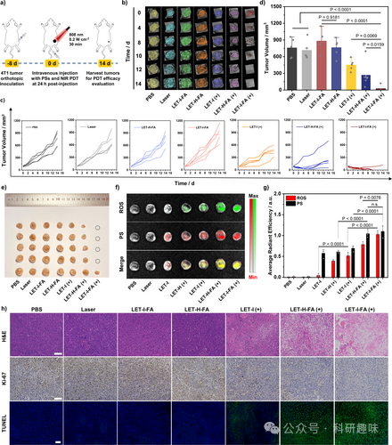


#  【Angew. Chem.】单线态氧产生效率是目前最好材料的3.2倍！！新型pH激活近红外光敏剂助力光动力疗法。 
 
## 核心
本研究通过分析肿瘤微环境酸性激活的长波长光敏剂的激子动力学，开发了一系列用于可追溯光动力治疗的新型近红外光敏剂。

## 摘要
在本研究中，研究人员通过设计一系列以花菁类染料为基础的长波长（约808 nm）光敏剂（LET-R，R=H, Cl, Br, I），这些光敏剂能够在肿瘤微环境的酸性条件下被激活，从而产生单线态氧（1O2），并在808 nm激光激发下实现荧光（FL）/光声学（PA）双模态分子成像引导的光动力治疗（PDT）。LET-I剂在激活后显示出强烈的光吸收和FL发射特性，并且其1O2产量是已知单线态氧最高产率的长波光敏剂ICG的3.2倍（`存疑，ICG的单线态氧产率是否可以用来做标准，``原文``：````3.``2``-fold higher than that of ICG, the reported highest yield for LW PSs`）。通过瞬态光谱分析和理论计算，研究人员确认了LET-I的显著提高的系间穿越（ISC）和增强的长波长荧光发射特性。FA修饰的LET-I探针（LET-I-FA）能够实现特异性靶向肿瘤的激活FL/PA双模态成像，并在极低的808 nm激光功率密度（0.2 W cm）下，无需光热能量同步，实现肿瘤的光动力消除。研究表明，通过分析激子动力学来筛选可激活的长波光敏剂，为精准PDT提供了新的策略。
## 细节

### 传统的PDT存在系统性光敏性和穿透深度的限制，而长波长光敏剂（LW PSs）能够克服这些限制，特别是在肿瘤微环境的酸性条件下被激活的LW PSs，它们能够在808 nm激光激发下产生1O2，实现高效的PDT。

### 花菁类染料衍生物作为光敏剂的优势在于其强的近红外光吸收能力、结构的灵活性以及可调整的性质。

#### 图1. pH 活化、光物理和光化学特性。

### LET-R光敏剂的设计基于花菁类染料骨架，引入了环己烷环以增加分子的稳定性，并通过酸性条件下的特定化学键断裂来实现光学性质的改变。

#### 图2. 理论计算分析

### 通过瞬态光谱和密度泛函理论（DFT）计算，研究人员揭示了LET-I光敏剂的高荧光量子产率（Φf）和1O2量子产率（Φ1O2）的原理，这与I原子诱导的系间穿越（ISC）过程和放射性衰变有关。

#### 图3. 激子动力学剖析

### LET-I探针在体内实验中表现出优异的肿瘤靶向性和生物相容性，能够在不引起显著体重变化的情况下，有效抑制肿瘤生长。

#### 图4. 体外 PDT 疗效

### 研究人员利用多模态成像技术，包括荧光成像和光声学成像，来追踪LET-I探针在体内的行为，并验证了其在肿瘤微环境中的特异性激活。

#### 图5. 体内PDT疗效

### 本研究的结果提供了一种新的筛选可激活长波光敏剂的方法，为光动力治疗提供了新的思路，并有望在临床治疗中得到应用。

## 参考文献

> Liu, Y.; Zhang, J.; Zhou, X.; Wang, Y.; Lei, S.; Feng, G.; Wang, D.; Huang, P.; Lin, J. Dissecting Exciton Dynamics in pH‐Activatable Long‐Wavelength Photosensitizers for Traceable Photodynamic Therapy. Angew Chem Int Ed 2024, e202408064. https://doi.org/10.1002/anie.202408064.
