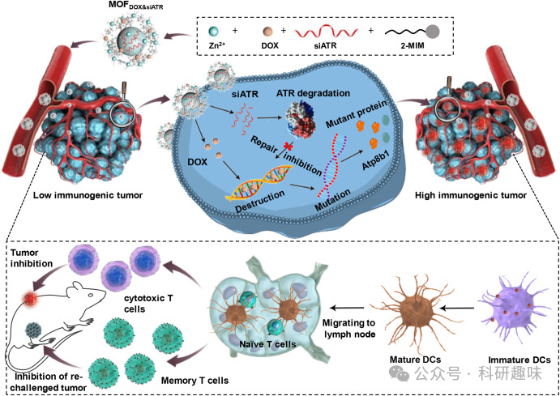
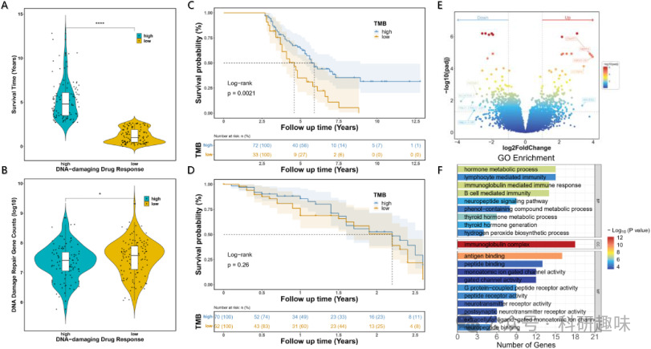
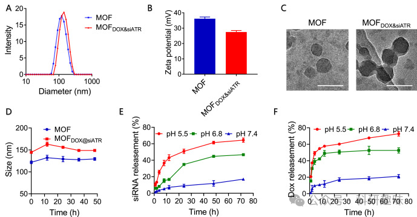
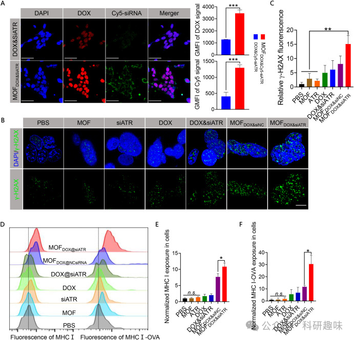
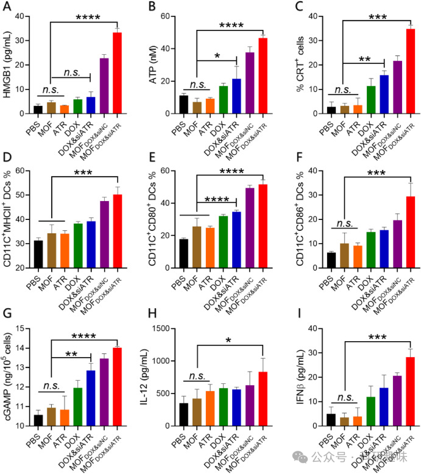
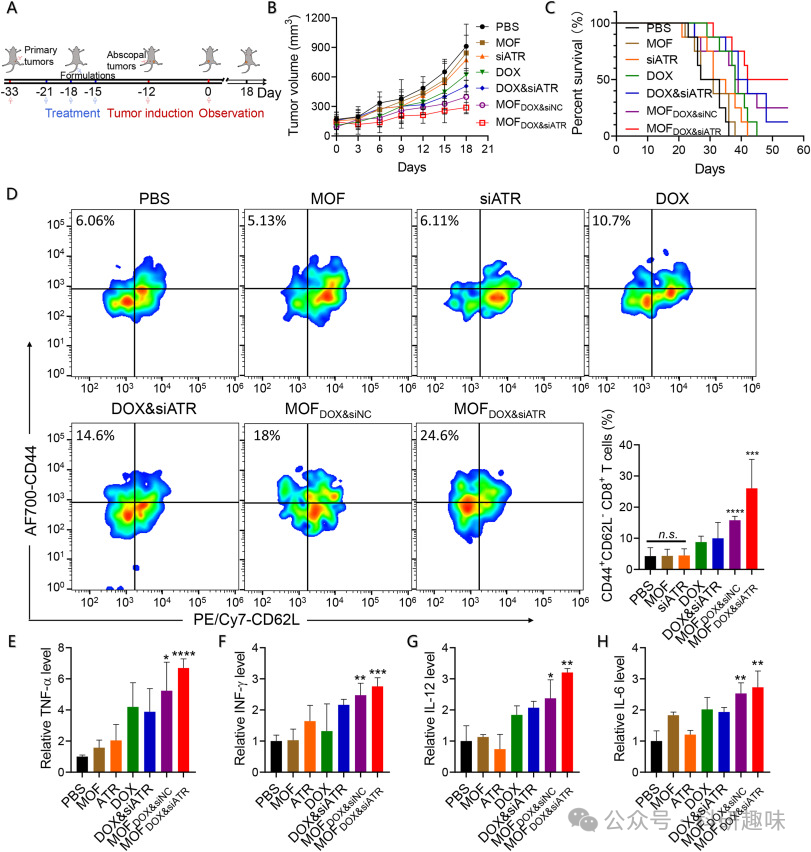
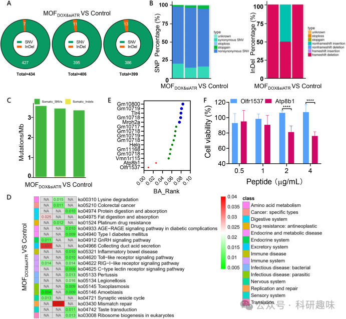


#  【Biomaterials】提高低免疫原性肿瘤的免疫反应性，改善胰腺癌患者的预后 

## 总结

本研究开发了一种基于金属有机框架（MOF）的纳米调节剂（MOFDOX&siATR），用于在肿瘤细胞中介导DNA损伤，增加肿瘤突变负荷（TMB），从而提高胰腺癌的新抗原表达，增强肿瘤免疫原性，提高免疫治疗的效果。

## 摘要

研究团队针对低免疫原性的胰腺癌，设计并合成了一种纳米调节剂MOFDOX&siATR，该剂充当DNA损伤剂和DNA修复抑制剂的载体，通过调控肿瘤细胞的DNA稳定性，有效地增加了肿瘤突变负荷，促进了新抗原Atp8b1的表达，从而增强了胰腺癌的免疫原性。实验结果显示，MOFDOX&siATR能够显著诱导肿瘤细胞发生免疫原性死亡（ICD），激活树突状细胞（DCs），增强抗肿瘤免疫应答。在小鼠模型中，MOFDOX&siATR显示出显著的抗肿瘤效果，并能够诱导免疫记忆效应，抑制肿瘤复发和转移。这一发现为低免疫原性肿瘤的免疫治疗提供了新的策略和可能性。

## 观点

- • 低免疫原性的肿瘤对免疫治疗的反应不佳，增加肿瘤突变负荷（TMB）是提高肿瘤免疫原性和治疗效果的关键。
- • MOFDOX&siATR纳米调节剂通过同时释放DNA损伤药物DOX和DNA修复抑制剂siATR，实现了对肿瘤细胞DNA稳定性的精确调控。

- • 通过exome测序技术，研究发现MOFDOX&siATR治疗后的肿瘤细胞出现了大量的体细胞突变，特别是非同义突变，这些突变可能导致新抗原的产生，增强了肿瘤的免疫原性。

- • MOFDOX&siATR诱导的肿瘤细胞ICD能够有效激活DCs，促进其成熟，提高了抗肿瘤免疫应答。

- • 在小鼠模型中，MOFDOX&siATR不仅显示出抑制肿瘤生长的效果，还能够诱导免疫记忆效应，有助于防止肿瘤复发和转移。

- • 研究结果表明，通过介导DNA损伤和抑制DNA修复，可以有效地提高低免疫原性肿瘤的免疫治疗反应。

## 参考文献

> Wang, J.; Wu, C.; Wang, Y.; Shen, Y.; Wu, K.; Shi, Y.; Cao, T.; Yuan, S.; Zhu, Y.; Bai, Y.; Huang, J.; Zhang, Y.; Deng, J. Nano-Enabled Regulation of DNA Damage in Tumor Cells to Enhance Neoantigen-Based Pancreatic Cancer Immunotherapy. Biomaterials 2024, 122710. https://doi.org/10.1016/j.biomaterials.2024.122710.

