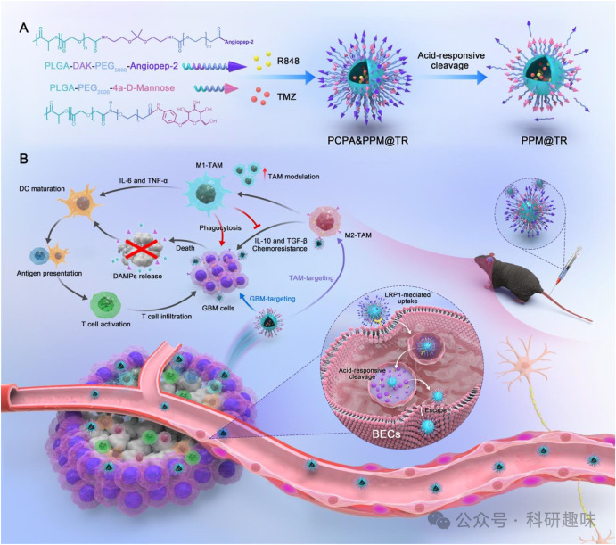
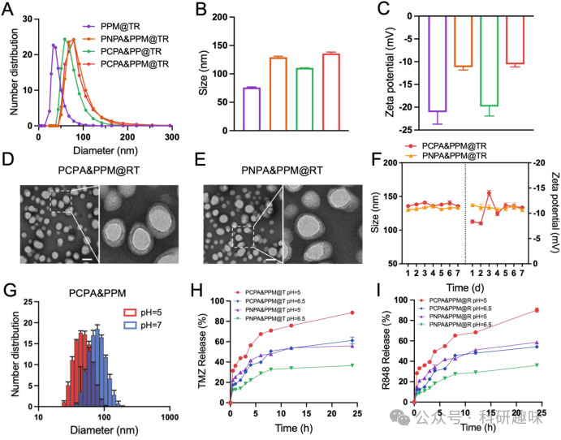
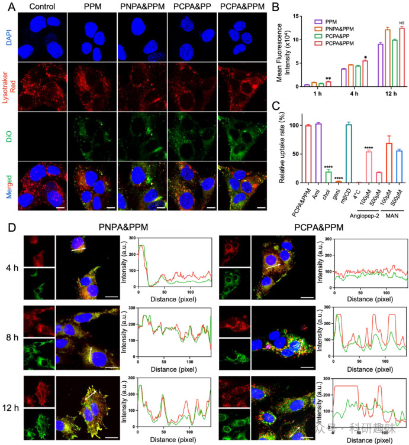
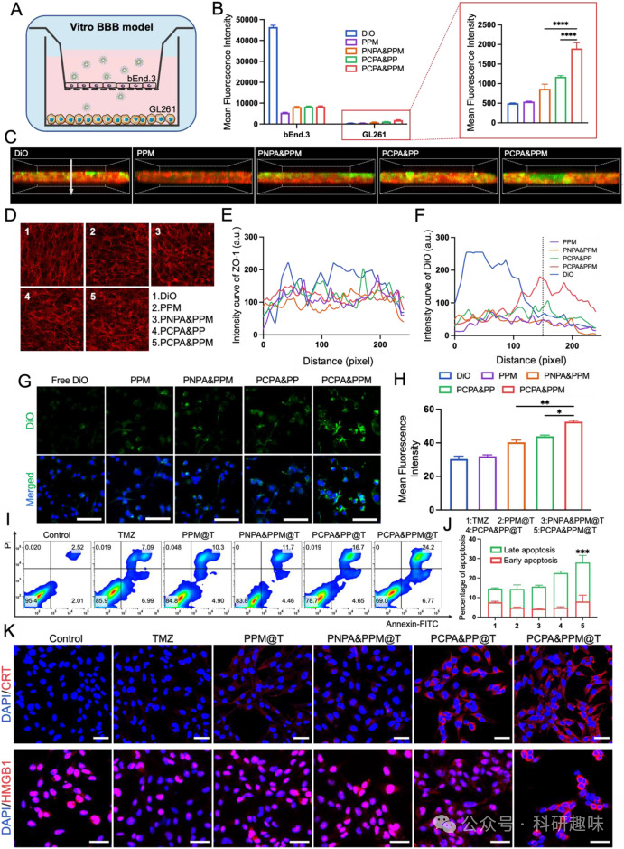
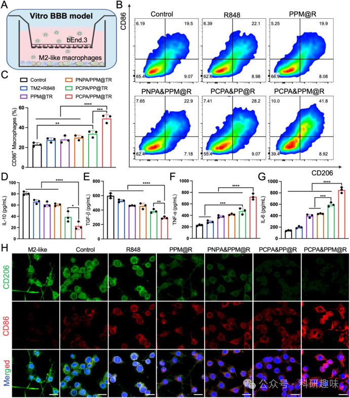
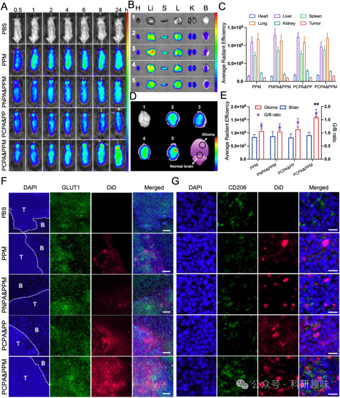



#  【Biomaterials】新型pH-响应材料，增强胶质母细胞瘤（GBM）对化疗和免疫治疗的敏感性。 
 

## 胶质瘤的靶向治疗

## 总结

本研究发展了一种靶向肿瘤相关巨噬细胞（TAMs）的pH-响应分层脑靶向胶束复合物，用于增强胶质母细胞瘤（GBM）对化疗和免疫治疗的敏感性。

# 摘要

研究人员设计并合成了一种pH-响应分层脑靶向胶束复合物，载有TMZ和R848，用于结合化疗和免疫治疗对抗GBM。该复合体PCPA&PPM@TR采用了Angiopep-2和甘露糖类似物（MAN）的双层修饰策略，其中Angiopep-2通过pH-响应的链接基团在外层装饰，而MAN在中层。实验结果表明，PCPA&PPM@TR能有效地跨越血脑屏障（BBB），并且在GBM和TAMs中具有同时靶向作用的能力。在体内实验中，PCPA&PPM@TR显著提高了药物在GBM组织中的累积，并且通过重编程TAMs从M2型到M1型，减少了GBM对TMZ的耐药，增强了抗肿瘤免疫反应。进一步的研究表明，PCPA&PPM@TR治疗后，GBM动物的生存期显著延长，GBM的增殖得到了有效抑制，同时也改善了肿瘤免疫微环境。此外，该复合体具有良好的生物相容性和低毒性。这项研究提供了一种新的GBM治疗策略，通过靶向TAMs来增强化疗药物的疗效，并激活抗肿瘤免疫反应。

## 观点

### **GBM对化疗和免疫治疗的耐药主要是由TAMs在GBM微环境中的存在引起的。**

TAMs，特别是M2型TAMs，支持GBM的生长、血管生成和免疫抑制，对GBM的化疗耐药和进展起到关键作用。因此，通过调控TAMs可能是克服GBM耐药的有效策略。

### **设计了一种pH-响应分层脑靶向胶束复合物PCPA&PPM@TR，用于靶向TAMs和GBM细胞。**

该复合体通过Angiopep-2与BBB上的受体相互作用，实现有效的脑靶传递。在酸性肿瘤微环境中，Angiopep-2可以脱落，从而实现逃逸酸性内吞体并达到GBM和TAMs的靶向投递。

#### PCPA&PPM@TR 的制备和表征

#### 细胞摄取和溶酶体逃逸

### **PCPA&PPM@TR能够有效地重编程M2型TAMs为M1型TAMs，从而减少GBM的化疗耐药。**

R848的投递能够激活TAMs，促使其从促炎的M1型向抗炎的M2型转化，这不仅减少了对TMZ的耐药性，还增强了免疫死亡细胞的免疫原性。

#### 体外 BBB 渗透性、细胞毒性和 ICD 效果评估

### **在体内实验中，PCPA&PPM@TR显著提高了药物在GBM组织中的累积，并延长了动物的生存期。**

与其他对照组相比，PCPA&PPM@TR治疗组显示出更好的抗GBM效果，包括生存期的显著延长和GBM增殖的抑制。

### **PCPA&PPM@TR改善了肿瘤免疫微环境，促进了效应T细胞的浸润。**

治疗后，CD4和CD8 T细胞在GBM组织中的比例显著增加，而Treg细胞的比例则显著降低，表明PCPA&PPM@TR能够促进抗肿瘤免疫反应。

#### PCPA&PPM@R 在 Transwell 模型中的巨噬细胞重编程能力

### **PCPA&PPM@TR具有良好的生物相容性和低毒性。**

实验结果表明，PCPA&PPM@TR的治疗并没有显著改变动物的体重或主要器官的比例，也没有引起显著的组织损伤。

#### 生物分布和体内靶向 GBM 输送

### **该研究提供了一种新的GBM治疗策略，通过靶向TAMs来增强化疗药物的疗效，并激活抗肿瘤免疫反应。**

通过特异地靶向和重编程TAMs，PCPA&PPM@TR为GBM的治疗提供了新的思路，可能在未来的临床应用中发挥重要作用。

## 参考文献

> Li, J.; Yang, J.; Jiang, S.; Tian, Y.; Zhang, Y.; Xu, L.; Hu, B.; Shi, H.; Li, Z.; Ran, G.; Huang, Y.; Ruan, S. Targeted Reprogramming of Tumor-Associated Macrophages for Overcoming Glioblastoma Resistance to Chemotherapy and Immunotherapy. Biomaterials 2024, 122708. https://doi.org/10.1016/j.biomaterials.2024.122708.
