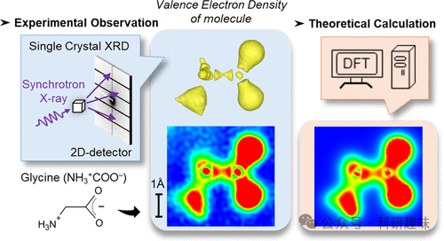
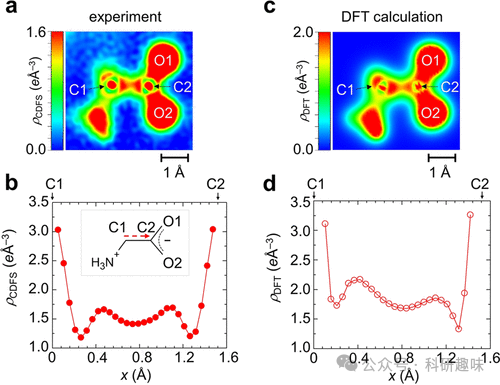
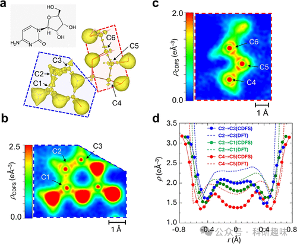
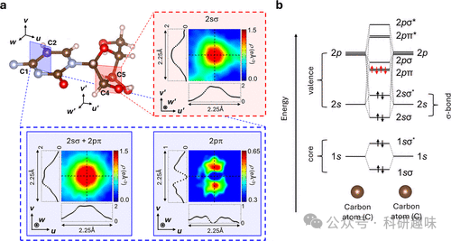
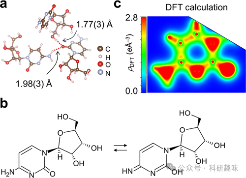

#  【JACS】单晶+理论计算，有望揭露真实世界中化学键的本质 
 

## 总结

这项研究主要通过实验和理论计算的方法，对有机晶体中化学键的自然界实空间电子密度分布进行了直接观测和精确分析，揭示了化学键的复杂性质，并验证了长程校正的密度泛函理论在描述分子轨道能量上的准确性。

## 摘要

在这篇论文中，研究者们通过使用同步辐射X射线衍射技术，成功地在真实空间中直接观测到了有机晶体中的价电子密度分布。他们采用了核差分傅里叶合成（CDFS）方法，通过从晶体的单晶X射线衍射数据中提取价电子密度分布，并与高精度的理论计算结果进行了比较。这些理论计算使用了长程校正的密度泛函理论（LC-DFT），该理论能够地再现分子轨道能量。研究结果显示，实验观测到的价电子密度分布与理论计算的结果高度一致，这证明了CDFS方法在观测和分析化学键的有效性。

作者专注于研究糖酸和胞嘧啶分子中的化学键，包括碳-碳单键、碳-氧双键以及芳香环中的π键。通过对比实验和理论数据，他们发现了化学键中电子密度的细节结构和相位，这些发现与理论预测相符合。此外，研究还揭示了分子间的氢键和共轭系统中的电子重排，以及在晶体场中的电荷分布如何影响化学键的性质。这些发现对于理解和设计功能材料，尤其是有机半导体和生物大分子，具有重要意义。

## 观点

1. 1. **化学键的实空间电子密度分布可以通过CDFS方法直接观测**，这一方法通过同步辐射X射线衍射数据来提取价电子密度分布，与理论计算结果相比，能够提供关于化学键性质的直接实验证据。

1. 1. **长程校正的密度泛函理论（LC-DFT）在描述分子轨道能量上表现出色**，能够量量地再现实验观测到的电子密度分布，特别是在描述分子轨道能量时。
2. 2. **实验和理论计算结果之间的一致性验证了CDFS方法的有效性**，这为进一步研究化学键的动态行为和反应机制提供了有力的工具。

1. 1. **研究发现了化学键中电子密度的细节结构和相位**，这些发现对于理解化学键的本质具有重要意义，并且与理论预测相符合。
2. 2. **晶体场对化学键的电荷分布有显著影响**，这可能会影响分子的化学性质和反应性，如氢键和共轭系统中的电子重排。

1. 1. **对有机晶体中特定类型的化学键的研究提供了新的视角**，例如碳-碳单键、碳-氧双键和π键，这对于设计和优化有机半导体和生物大分子具有潜在的应用价值。

1. 1. **研究结果对于开发新的功能材料具有重要意义**，特别是在有机电子和药物设计领域，其中包括了对胞嘧啶等生物分子的深入研究。

## 参考文献

> Hara, T.; Hasebe, M.; Tsuneda, T.; Naito, T.; Nakamura, Y.; Katayama, N.; Taketsugu, T.; Sawa, H. Unveiling the Nature of Chemical Bonds in Real Space. J. Am. Chem. Soc. 2024, jacs.4c05673. https://doi.org/10.1021/jacs.4c05673.

