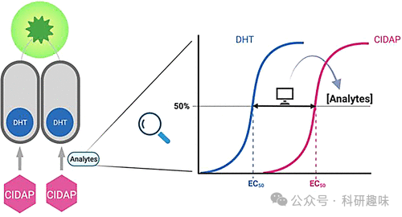
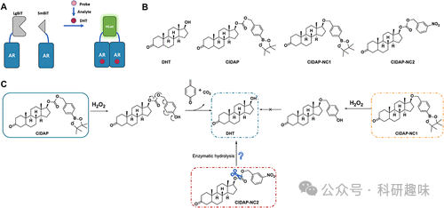
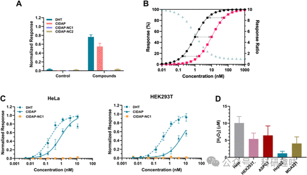
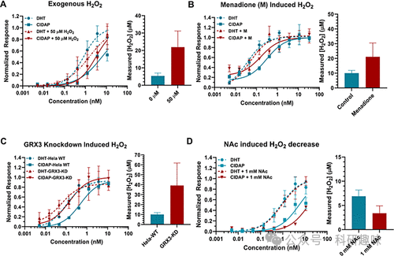

#  【JACS】超低浓度的分析物如何检测，试试信号放大系统吧 
 

## 总结

本研究发展了一种新型的信号放大系统，用于在活细胞中定量测量氧化性物质的浓度，特别是双氧水（H2O2），该系统基于化学诱导的二聚体形成和生物素的自发光发射。

## 摘要

在本研究中，研究人员设计并合成了一种新型的放大系统，用于在活细胞中精确测量低浓度的氧化还原信号分子，如水化氢（H2O2）。该系统结合了NanoBiT系统和雄激素受体（AR）二聚体化作为报告机制。研究人员首先研究了H2O2与AR之间的相互作用，并设计了一个以H2O2为靶点的化学诱导型放大可测量probe（**CIDAP**）。**CIDAP**通过与H2O2反应，释放出与AR结合的分子，进而诱导NanoBiT的两个分 分型（LgBiT和SmBiT）形成活性纳米荧光素酶（nLuc），从而产生生物荧光信号。该系统能够在不影响细胞生物系统的前提下，使用极低浓度的probe来测量H2O2的浓度。研究人员通过对不同细胞系的实验验证，证明了该系统在多种细胞环境中的适用性和灵活性。此外，该系统还能够检测到其他化合物（如N-乙酰氨酸胺）对H2O2水平的影响。通过对**CIDAP**系统的模拟验证，研究人员还讨论了该系统与现有的H2O2检测方法（如HyPer）的差异。最后，研究人员强调了该系统在研究低浓度分析物（如H2O2、H2S和NO）时的潜在应用，以及其在探索红氧化信号通路和疾病发展中的作用。

## 观点

### 研发的放大系统能够定量测量活细胞中的H2O2浓度。

该系统利用H2O2触发的AR二聚体化和NanoBiT生物素光发射，实现了对H2O2的精确检测。

#### 图 1. 基于化学诱导二聚化的可扩增探针（CIDAP）的设计

### **CIDAP**的设计基于H2O2的特定化学反应。

研究人员通过对H2O2与AR之间相互作用的研究，设计了能够特异性反应并释放与AR结合的分子的probe。

#### 图2. 将 CIDAP 系统作为细胞过氧化物水平量化方法的改进和评估

### 系统设计考虑了对细胞生物系统的最小干扰。

通过使用低浓度的probe，系统确保了在测量过程中对细胞环境的微小扰动。

### **CIDAP**系统在多种细胞系中得到验证。

实验结果显示，该系统能够在不同的细胞线中测量H2O2的浓度变化，证明了其广泛的适用性。

#### 图 3. 不同条件下细胞中 H2O2 水平的定量。

### 系统能够检测生物利基化合物对H2O2水平的影响。

例如，使用N-乙酰氨酸胺可以观察到H2O2水平的变化，展示了该系统在研究细胞红氧化应激响应中的应用。

### 与HyPer等现有H2O2检测方法相比，**CIDAP**系统具有独特的优势。

**CIDAP**系统能够在更广的H2O2浓度范围内进行测量，并且能够检测到由基因和化学促进剂引起的H2O2水平变化。

### 该研究为未来探索其他低浓度分析物提供了一个平台。

研究人员指出，**CIDAP**系统可以通过改变适当的probe化学进行调整，以适用于其他氧化还原信号分子的测量。

## 参考文献

> Zhang, B.; Lu, J.; Lin, X.; Wang, J.; Li, Q.; Jin, T.; Shi, Q.; Lu, Y.; Zhang, J.; Deng, J.; Zhang, Y.; Guo, Y.; Gao, J.; Chen, H.; Yan, Y.; Wu, J.; Gao, J.; Che, J.; Dong, X.; Gu, Z.; Lin, N. Injectable and Sprayable Fluorescent Nanoprobe for Rapid Real‐Time Detection of Human Colorectal Tumors. Advanced Materials 2024, 2405275. https://doi.org/10.1002/adma.202405275.
