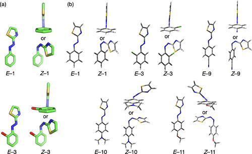
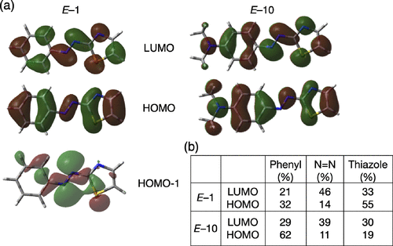

 

#  JACS:是时候抛弃偶氮苯了，新型的可见光开关 
 
 原创

Photoswitches

光控开关

偶氮基光开关吸收特定波长的光并在其反式（E）和顺式（Z）异构体之间进行可逆转换，这种特殊的性质已被广泛应用于材料科学、生物学、和药理学等各个领域。光开关的性能是根据不同的因素决定的，如吸收最大波长（λmax）、量子产率（Φ）、E和Z异构体在光稳定状态（PSS）的相对丰度、异构体的热稳定性和耐疲劳的光开关周期。对于传统的偶氮苯光开关，调整光谱特性从而改变光开关特性的一种方法是在苯环上替换合适的官能团。基于 "杂芳基偶氮 "的光开关由于其源于杂环芳基的光物理特性，最近受到了极大的关注。

①

【 合成 】

根据化合物结构的不同，作者采取了不同的合成方式，对于无取代的化合物（1-5）和氰基取代的化合物（9），作者采用的策略是先噻唑啉环化，让后氧化，同时作者使用氧化银代替空气作为氧化剂提高了氧化反应的产率，对于邻位取代的化合物（6-8），作者在使用相同的方法得到硝基取代的产物后，通过锌粉还原得到氨基取代物，然后通过碘甲烷反应得到不同甲基取代的化合物，而对于对位取代的化合物（10，11），作者是通过氨基噻唑和取代苯直接偶联得到的（图1a，方案1和方案S1-S4）。

图1.PAT衍生物及其合成过程

②

【材料制备及表征】

作者在常温下测试了PAT衍生物的光开关能力。其中，化合物的1的E异构体的最大吸收波长相比于偶氮苯红移了大约47 nm，同时，在405 nm的光照射下，化合物1的结构发生了明显的变化，其在光稳定状态下，有85%的分子呈现Z异构体，此外，其E-Z异构化也可以在430 nm的光照下发生，但是效率没有前者高。另一方面，在525 nm的光照射下，大部分化合物1都转变成了E异构体（图2a）。

然后，作者研究了邻位或对位取代的影响。吸电子基团F、Cl、Br、I和CN取代对2-5和9的吸收光谱影响不大，与1相比，它们的最大吸收波长只有轻微的红移，但是这些化合物都表现出与1类似的可逆光异构化特性。有趣的是，与1相比，3和4的苯基邻位上分别的Cl和Br，其呈现出更为高效的E→Z光异构化，然而，Z异构体的n → π\*光谱带与E异构体的光谱带有部分重叠，这导致了它们Z→E的光异构化效率较低。给电子基团NH2（6）、NHMe（7）、NMe2（8和10）和OMe（11）的取代基则对吸收光谱的影响比较大，与1相比，它们的最大吸收波长发生了20-161 nm的红移（图2i）。更重要的是，6、7和10的E→Z和Z→E光异构化分别发生在较长波长的光照射下（图2d和图S47和S48）。由于7和10的热弛豫较快，作者还利用激光闪光光解对其光异构化过程进行了分析，结果显示它们会在508 nm （7）和476 nm（10）的吸光度突然下降，但是10还有另外一个现象，其在550纳米的吸光度短暂增加，然后缓慢恢复到原来的吸光度（图2g，h）。

通过比较几种PAT衍生物的光异构化能力，作者发现11表现出最好的正向E→Z（92%）和反向Z→E（88%）的光异构化能力，这可能是11的E和Z异构体的π→π\*（Δλmax = 53 nm）和n→π\*（Δλmax ≅ 5 nm）过渡带分离得最开。

图2. (a-f) 在25°C的乙腈中1-3、6、9和11的紫外-可见吸收光谱在照射前（BI，黑线）和在405或470 nm（405 PSS，470 PSS；红线）和525或625 nm（525 PSS，625 PSS；蓝线）的PSS下的吸收光谱。(g, h) 使用激光闪光光解法获得7和10在508和476 nm处的吸收变化（拟合，红色曲线）。(i) 1-11的λmax值的图表，

③

【晶体结构】

为了更深入地了解PAT光开关的分子几何构型，作者对这些化合物的E和Z异构体的单晶进行了详细分析。1和3的E异构体采用了类似于偶氮苯的苯基和噻唑部分共平面的构象（图3a），然而，Z异构体采用一种不寻常的T形构象，两个芳香环呈正交构象，噻唑的S原苯芳香环正对，这与偶氮苯的Z异构体形成齐平排列的两个苯环的扭曲几何形成鲜明对比。Z-1的X射线晶体结构清楚地显示了一个完美的T形构象，二面角为89.7°（苯基-CNNC）。对于带有氯取代基的Z-3，苯基-CNNC的二面角为98.4°，略微偏离了T形构象（图3a）。

图3. (a) 1和3的E和Z异构体的单晶X射线结构（绿色=C；蓝色=N；金色=S；红色=Cl）。为了清晰起见，氢原子被省略了。(b) E和Z异构体的1，3，9，10和11的几何优化计算构象。

④

【 体内抗菌效果 】

为了进一步了解异构化的分子结构、分子轨道能级和异构化能垒，作者在乙腈介质中进行密度泛函（DFT）计算，1、3、9、10和11的E异构体中，苯基、偶氮和噻唑基团处于同一平面。然而，1、3和9的Z异构体则是一种正交几何结构，其中噻唑环的S原子苯环正对（图3b）。对于Z-1和Z-3，其计算结果与真实情况相符，然后作者进一步模拟计算了1、3、9、10和11的E和Z异构体的吸收光谱，大部分结果与实验相符，都显现了强的π→π\*和弱的n→π\*电子跃迁，在π → π\*转移过程中，噻唑的电子密度下降比苯更多，而偶氮基团的电子密度增加。这种从富电子噻唑到偶氮基团的分子内电荷转移性质，是1的吸收光谱与偶氮苯相比出现红移的原因。而在10中观察到了从NMe2取代苯到偶氮基团和噻唑的巨大电子密度转移，这有助于其在π → π\*转移带中的进一步红移。

图4.（a）E-1和E-10的LUMO，HOMO和HOMO-1。（b）E-1和E-10中具有π和π\*性质（苯基，N═N和噻唑基）的不同基团的HOMO和LUMO电子分布。

⑤

【 稳定性 】

对于生物学，光开关应该在还原环境中（如细胞质）具备一定的稳定性。一般情况下，还原剂（如DTT和谷胱甘肽）会与偶氮基发生反应，生成肼，作者通过将1-3、9和11孵育在含有还原剂DTT（0.1 mM）或谷胱甘肽（1 mM）的BRB80缓冲液和乙腈（50/50 v/v）混合物中来测试它们的稳定性，结果表明，源自偶氮色团的吸收光谱保持不变，表明PATs的E和Z异构体在DTT和谷胱甘肽还原剂中具有极好的稳定性。然而，带有吸电子的CN基团的9的Z异构体不稳定（图6d）。

图5. 在含有谷胱甘肽还原剂（1 mM）的水溶液（BRB80缓冲液：乙腈=1:1 v/v）中，1-3、9和11（20 μM）孵育60分钟后吸光度随时间的变化。

⑥

【 结论 】

作者展示了一类新型的五元“杂环芳基偶氮”光开关，可在可见光照射时发生可逆异构化。直接连接苯基偶氮色团的噻唑光开关与传统偶氮苯和其他杂环芳基偶氮化合物的光谱特性非常不同，这些化合物能够使用可见光（405和525 nm）照射可逆地进行异构化，通过在苯环上引入邻位和对位取代基，可以进一步调节PAT的光开关性质（λmax，t1/2和PSS比率）。特别是，具有邻位NH2取代基的化合物在可见光（525和625 nm）辐照下表现出可逆的光异构化，具有比可见光可切换偶氮苯更小的热稳定性补偿效应和更长的半衰期。此外，PAT光开关在还原剂存在下表现出极佳的稳定性。

Lin, R.; Hashim, P. K.; Sahu, S.; Amrutha, A. S.; Cheruthu, N. M.; Thazhathethil, S.; Takahashi, K.; Nakamura, T.; Kikukawa, T.; Tamaoki, N. Phenylazothiazoles as Visible-Light Photoswitches. J. Am. Chem. Soc. 2023,. https://doi.org/10.1021/jacs.3c00609.

[细菌纤维素的可视化和耐药菌的消除](http://mp.weixin.qq.com/s?__biz=MzkzOTI1OTMwNg==&amp;mid=2247483811&amp;idx=1&amp;sn=497b8c4b0ff461323fb2e1c24e03312e&amp;chksm=c2f2e566f5856c702e030d1f5c01ae034d7ddc9705f2b363e6eca0c9e6e8e7f9a07fb30b0e09&amp;scene=21#wechat_redirect)

[阿兹海默症早期标志物检测](http://mp.weixin.qq.com/s?__biz=MzkzOTI1OTMwNg==&amp;mid=2247483762&amp;idx=1&amp;sn=440a62325ac837766d790470b2feb1ad&amp;chksm=c2f2e5b7f5856ca11307adc886208ba8631f4e6d1aff91f790f0ebce02f346d7467e9532211e&amp;scene=21#wechat_redirect)

预览时标签不可点

素材来源官方媒体/网络新闻

  继续滑动看下一个 

 轻触阅读原文 

    

