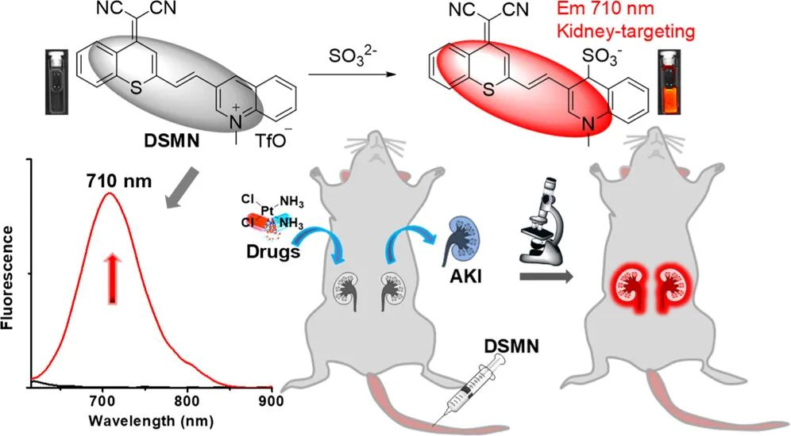
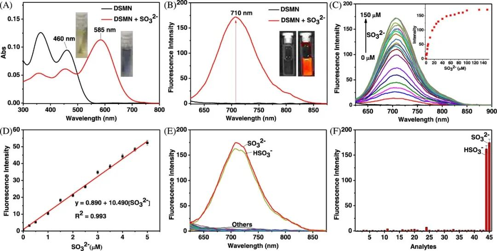
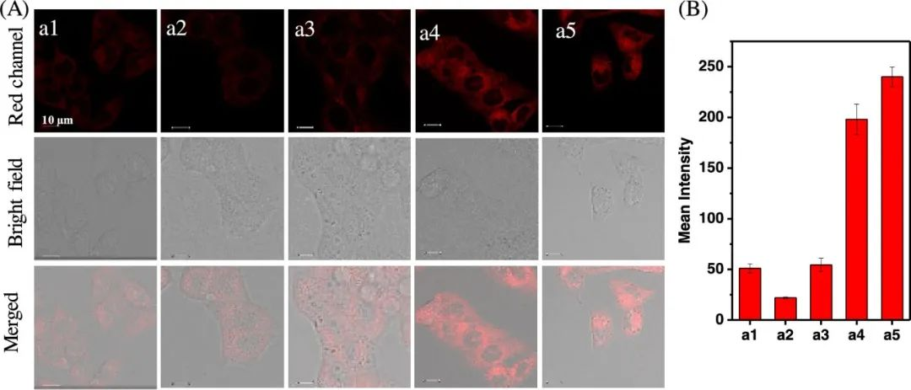
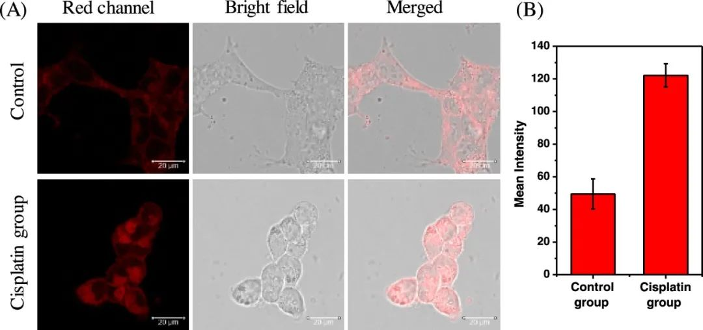
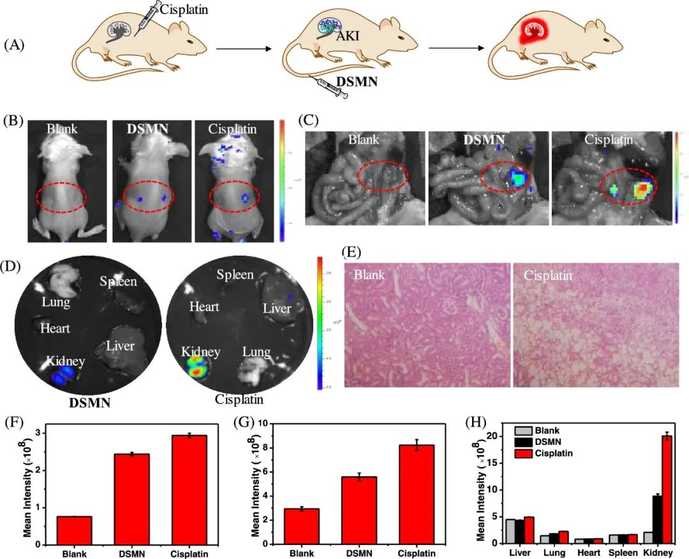

#  【Anal. Chem.】[华中师范大学冯国强团队] 急性深肾损伤怎么判断，查一下SO2浓度先 
 

研究人员报道了一款高度敏感的近红外荧光探针DSMN，并以此首次揭示了SO2与药物诱导的AKI之间的关联。该探针对SO32-/HSO3-具有选择性的迅速响应，同时具备较大的斯托克斯位移（125 nm）。借助这些独特特性，该探针成功地应用于活细胞和小鼠体内SO2的检测。更为重要的是，该探针能够有选择性地定位于肾脏，从而监测肾脏中二氧化硫浓度的变化。基于这一特性，DSMN还成功用于检测顺铂诱导的AKI，研究结果表明，二氧化硫是药物诱导的AKI的新生物标志物，而DSMN则是研究和诊断此类疾病的有力工具。

## **DSMN合成及溶液测试**

DSMN的合成比较简单，只需要通过二氰亚甲基-苯并噻喃与喹啉醛缩合就能得到，由于整个分子是A-π–A的结构，因此在正常条件下整个分子几乎没有荧光，而当其与SO2反应后，其电子分布就变成了D-π–A，因此其荧光信号得到大幅度增强，为了验证这一原理，作者在溶液中测试了其对SO2的响应，结果表明，在与SO2反应后，其吸收从480nm红移到了585纳米（图1A），而荧光的最大发射波长则出现在710nm，与没有反应相比，其荧光信号增强了约350倍（图1B），并且在0-5 μM内保持良好的线性关系（图1C,D）,通过计算得到在此条件下，DSMN对SO2的检测限为13 nM。此外，DSMN对SO2有着非常好的选择性，在多种干扰离子的存在下，DSMN的荧光响应只与SO2相关。

图1.(A) 加入 Na2SO3（100 μM）后 DSMN（10 μM）的吸收光谱和颜色变化。(B) 加入 Na2SO3（100 μM）后 DSMN（10 μM）的荧光光谱和发射颜色变化。(C) 加入不同浓度的 Na2SO3（0-150 μM）后 DSMN（10 μM）的荧光光谱变化。插入 710 纳米波长处的荧光饱和曲线。(D) 710 纳米波长处的荧光强度与 0 至 5 μM 的 SO32- 浓度的线性关系。(E) DSMN 在 710 纳米波长处对各种分析物（除 GSH 外，每种分析物的浓度均为 100 μM）的荧光光谱和 (F) 强度变化。

## **细胞水平检测**

有了溶液测试的结果后，作者就开始着手进行细胞水平的检测，首先，作者使用MTT方法测定了DSMN的生物相容性，确保其无毒后使用Hela细胞验证了其对SO2的检测效果，通过结合FA,GSH及NaS2O3的加入，作者确定了DSMN不仅能够检测内源性的SO2，也可以对外源性SO2进行检测（图2A,B）。在此基础上，作者使用顺铂刺激HEK293t细胞来模拟AKI环境，结果表明当HEK293t与DSMN一起孵育后，其荧光信号大幅度增强，这表明AKI的产生伴随着大量SO2的生成。（图3A,B）

图2. (A) 染色 DSMN（10 μM）的细胞图像。细胞(a1) 仅用 DSMN 染色 0.5 小时；(a2) 与 FA（200 μM）孵育 30 分钟，然后用 DSMN 染色 0.5 小时；(a3) 与 FA（200 μM）孵育 30 分钟，然后与 GSH（500 μM）和 Na2S2O3（250 μM）孵育 0.5 h，然后用 DSMN 染色 0.5 h；（a4 和 a5）分别用 60 和 90 μM Na2SO3 孵育 0.5 h，然后用 DSMN 染色 0.5 h。(B) 图像（a1-a5）的荧光定量。红色通道：λex/λem = 633/(670-750) nm。

图3. (A) HEK293t 细胞图像。对照组：细胞仅用 DSMN（10 μM）染色 0.5 小时。顺铂组：细胞先用顺铂（1 mM）处理 8 小时，然后用 DSMN（10 μM）染色 30 分钟。(B) 图像荧光定量。红色通道：λex/λem = 633/(670-750) nm。

## **动物水平检测SO2**

紧接着，作者在动物水平检验了DSMN对SO2的检测能力，结果表明，DMSN会在小鼠的肾脏部位进行富集，并且在15分钟左右便可以达到最大值。而在检测性能方面，作者首先通过FA+DSMN+SO2的方式验证了荧光信号的变化确实与SO2相关，接着，作者使用顺铂诱导小鼠，然后使用DSMN进行活体成像，结果表明，与空白组相比，DSMN 组和顺铂组在肾脏区域显示出更强的荧光，其中顺铂组的荧光最强（图 4B），而解剖小鼠腹部后，可以更清楚地观察到顺铂组小鼠的肾脏荧光最强（图 4C）,并且荧光信号只出现在肾脏部分（图4D），同时，肾切片的H&E染色分析表明，顺铂治疗后的肾脏表现出明显的炎症，表明顺铂诱导的AKI模型建立成功（图4E）。

图4. (A) DSMN 用于检测顺铂诱导的 AKI 的图解。(B）小鼠原位和（C）腹部解剖后的荧光图像。空白组：小鼠静脉注射清水。顺铂组：小鼠腹腔注射顺铂（20 毫克/千克）48 小时，然后静脉注射 DSMN 0.5 小时。（D）（C）中 DSMN 组和顺铂组的离体器官图像。(E) 肾脏组织的 H&E 染色。(F，G）（B）和（C）的荧光强度。(H）（D）中器官的荧光强度与空白小鼠器官的荧光强度比较。误差条代表标准偏差（±S.D.），n = 3。λex = 580 nm，λem = 710 nm。

## **结论**

作者构建了基于二氰亚甲基-4H-苯并噻喃的近红外荧光探针 DSMN，可用于监测药物诱导的 AKI。该探针在 710 纳米波长处对二氧化硫显示出明显的比色和近红外荧光变化，具有高选择性和灵敏度以及较大的斯托克斯位移（125 纳米波长）。该探针的细胞毒性低，可以检测活细胞中内源性二氧化硫浓度的变化。更重要的是，DSMN 可选择性地靶向肾脏，可用于原位或体外监测顺铂诱导的 AKI。因此，通过 DSMN，作者首次建立了 SO2 水平变化与顺铂诱导的 AKI 之间的联系，表明 SO2 可作为 AKI 的新标记物。

>Jiang, S.; Hong, J.; Gong, S.; Li, Q.; Feng, G. Kidney-Targeted Near-Infrared Fluorescence Probe Reveals That SO 2 Is a Biomarker for Cisplatin-Induced Acute Kidney Injury. Anal. Chem. 2023, acs.analchem.3c02691. https://doi.org/10.1021/acs.analchem.3c02691.

