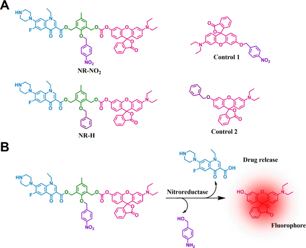
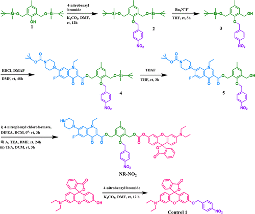
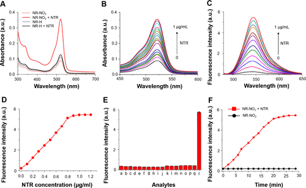
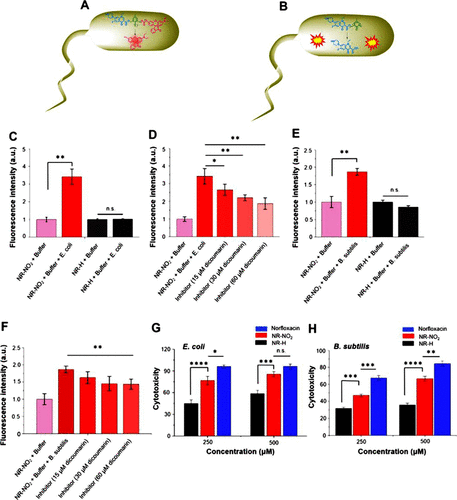
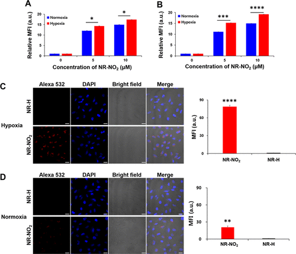
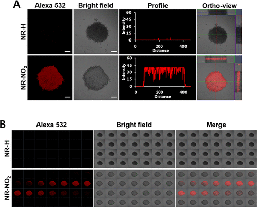
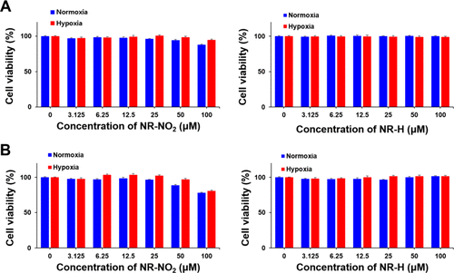
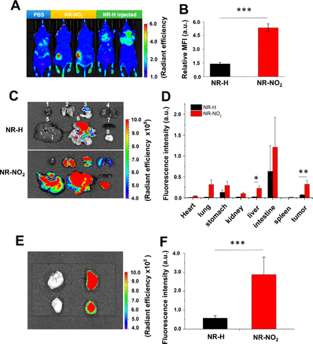

 

#  【J. Med. Chem.】 突破性科技：低氧活化智能探针，实现癌症双重诊断成像及靶向治疗细菌感染！ 
 

Grenemal

读完需要

11

全文字数：3622

**Introduction**

引言

尽管癌症治疗取得了显著进展，但耐药性问题依然具有挑战性。研究表明，肿瘤微环境中的内部病原体，包括细菌，会导致抗癌药物的耐药性，给癌症治疗带来独特挑战。细菌能代谢药物，导致药效下降，使得化疗难以根除癌细胞。此外，细菌还可以充当贮藏库，助长癌细胞扩散。更重要的是，癌症细菌在细胞内的定位使其对免疫系统和抗生素的攻击更具抵抗力。尽管各种抗生素对独立的细菌已取得成功，但对细胞内癌症感染的疗效却未能得到明显展现，从而对治疗这种强化癌症疾病提出了挑战。相关挑战还包括监测疾病进展和治疗效果。医学成像技术如磁共振成像（MRI）和正电子发射断层扫描（PET）通常与抗生素结合使用，以创建组合诊断和治疗工具，即所谓的“诊疗一体化”。然而，这些技术存在局限性，通常不适用于快速疾病监测或先导优化。

目前，人们正在积极努力开发治疗探针，将选择性荧光探针与疾病特异性治疗剂结合起来。在经过优化后，这类药物具有价格低廉、易于化学修饰，并对用户相对友好。然而，将细菌感染与癌症、炎症等其他病症区分开来，仍然是传染病医疗保健领域的一大挑战。此外，癌症相关细菌会显著降低癌症治疗的效果。细菌能代谢化疗药物并改变肿瘤微环境中癌细胞的自噬作用，从而导致耐药性增强。此外，一些革兰氏阳性细菌，如镰刀菌，能随着原发肿瘤细胞迁移到远处，促进癌症生长和扩散，可能会恶化癌症预后。因此，作者仍然需要抗微生物制剂，可以作为癌症治疗药物或与癌症治疗药物结合使用，并且有助于识别细菌感染。

**Results and Discussion**

结果与讨论

研究团队合成了一种缺氧激活治疗原药NR-NO2，以及几种对照探针。NR-NO2原药由三部分构成：罗丹明荧光团（用于发射荧光）、4-硝基苄基（用于缺氧感应）以及诺氟沙星（作为药物成分）。原药和探针共用一种激活方式，因此当4-硝基苄基连接到甲酚时，细胞毒性和内在荧光效应会受到抑制。

图1. 原药 NR-NO2的设计策略

**合成与表征**

Synthesis and Characterization

硝基的酶催化还原（生成相应的胺并随后进行1,6消除）会导致活性荧光团和药物从NR-NO2中释放，实现对疾病状况的荧光监测。如图2所示，从商品化的原料开始，NR-NO2及其对比化合物的合成最多不超过五个步骤。为了研究硝基还原酶将NR-NO2原药还原成相应的胺（苯胺）的能力，作者监测了紫外-可见吸收光谱的变化，并在相同的生理条件下，在不同浓度的NTR存在下监测了原药的荧光发射。结果表明在加入NTR后，NR-NO2（5 μM）在522 nm处的吸收峰值增加了约4倍（见图3A、B）。同样，在相同浓度的NTR存在下，545 nm波长处的荧光发射强度增加了23倍。在λem = 545 nm处，NR-NO2的荧光强度随NTR浓度的增加而增加（见图3C）。此外，用不同剂量的 NTR（0-1.2 μg/mL）处理 NR-NO2 后，其荧光发射在 545 nm 处逐渐增强（图 1C），λem = 545 nm 处的强度与 NTR 浓度几乎呈线性关系，最高可达 0.8 μg/mL（图 3D）。以此计算得出的检测限为 54.2 纳克/毫升，这表明 NR-NO2 在检测硝基还原酶活性方面具有很高的灵敏度。此外，在 PBS 中与 NTR 培养 30 分钟后，对原药 NR-NO2（10 μM）进行高分辨质谱（HRMS）分析，发现两个峰分别对应于诺氟沙星（[M + H] = 320.1411）和罗丹明（[M + H] = 388.1547）。这些信号的出现证明 NR-NO2 的分解与预期相符（图1）。在此基础上，作者测定了NR-NO2 对硝基还原酶的化学选择性（图3E）及反应性（图3F），结果表明NR-NO2可提供体内缺氧条件下活性的定量信息。

图2. NR-NO2 原药的合成

图 3.硝基还原酶（NTR）处理前后 NR-NO2 和 NR-H 的光物理特性。(A) 在 NTR 存在和不存在的情况下记录的 NR-NO2 和 NR-H （10 μM）的紫外吸收光谱。在不同浓度的 NTR（0-1 μg/mL）存在下记录的 NR-NO2 的荧光吸收（B）和发射（C）（λex = 525 nm）光谱。(D) 在不同 NTR 浓度下测定的 NR-NO2（10 μM）的发射强度。(E) 在血清中存在不同潜在干扰物的情况下记录的 NR-NO2 探针（10 μM）的荧光响应：(F）在 NTR（0.5 μg/mL）存在下观察到的 NR-NO2 （10 μM）发射强度随时间的变化。

**抗菌**

Antimicrobial

接着，作者评估了探针NR-NO2在监测和治疗癌症及细菌感染中的潜在应用。首先，通过对活细菌进行荧光强度测量，证实了NR-NO2对硝基还原酶活性的敏感性和特异性（图4C-D）。NR-NO2的处理显著增强了活大肠杆菌的荧光强度，而对照组NR-H没有变化，这支持了NR-NO2通过NTR介导的还原作用在活细菌中的检测能力。此外，NR-NO2还显示出对革兰氏阴性和阳性细菌中硝基还原酶活性的检测能力。其次，NR-NO2表现出强大的抗菌效果，并且这种抗菌效果并不受细菌革兰氏阴阳的影响，显示出其作为杀菌剂的治疗潜力(图4G-H)。

图 2.NR-NO2 检测和杀死活细菌。(A) NR-NO2 在细菌中的荧光增强机制示意图；(B) 导致细菌细胞毒性的活性药物释放机制。(C）在不同浓度的抑制剂存在下，大肠杆菌细胞裂解液的荧光强度，以及进一步记录的荧光强度（D）。(E) B. subtilis 在琼脂培养基中生长两小时后细胞裂解物的相对荧光强度，以及 (F) 用不同浓度的双香豆素处理后记录的荧光强度。NR-NO2、NR-H 或诺氟沙星在（G）大肠杆菌和（H）枯草杆菌存在下培养 24 小时后的细胞毒性。

**细胞实验**

Cell

**细胞：**缺氧选择性作者通过荧光激活细胞分选（FACS）分析，在缺氧和常氧条件下测试了NR-NO2对A549和HeLa细胞的选择性靶向能力。在两种浓度下，缺氧条件下的相对平均荧光强度明显高于正常氧含量条件（图 3A-B）。此外，作者通过共焦激光扫描显微镜（CLSM）监测活性荧光团释放的过程，结果显示，在缺氧条件下，A549细胞中检测到强烈的荧光，而在常氧条件下观察到的荧光信号相对较小（图3C-D）。相比之下，对照原药NR-H处理的细胞几乎没有荧光。这表明NR-NO2能有效区分缺氧和常氧细胞。

图 3.A549 和 HeLa 细胞的体外荧光成像。在缺氧和常氧条件下培养 8 小时后，用 NR-NO2 和 NR-H（5 和 10 μM）处理 30 分钟的（A）A549 细胞和（B）HeLa 细胞的荧光激活细胞分拣（FACS）。在缺氧（C）和常氧（D）条件下，用 NR-NO2 或 NR-H（10 μM）培养 30 分钟的 A549 细胞的代表性共焦激光扫描显微镜（CLSM）图像。

**细胞球：**作者采用荧光显微镜成像对培养的A549和HeLa细胞球进行了评估，结果显示在与NR-NO2或NR-H培养后，只有NR-NO2组显示出强烈的荧光信号，而NR-H组则显示出极弱的荧光。球体的荧光强度受到探针的孵育时间和浓度的影响。与HeLa细胞相比，更高浓度的NR-NO2在A549球中产生更强的荧光强度。

图 4.用 NR-NO2 或 NR-H 培养 A549 细胞球的体外荧光成像。

**细胞毒性：**作者通过使用3-(4,5-二甲基噻唑-2-基)-2,5-二苯基溴化四氮唑（MTT）检测法，对经过NR-NO2和NR-H处理的A549和HeLa细胞系进行了细胞增殖分析，以考虑生物探针的细胞毒性。结果显示，这两种原药在0至100 μM浓度范围内的细胞存活率均≥80%（图5），表明它们的毒性较小。这一发现支持了NR-NO2对细菌具有选择性细胞毒性，但对癌细胞无毒的观点。

图 5.用不同浓度的 NR-NO2 或 NR-H（0、3.125、6.25、12.5、25、50 和 100 μM）处理 A549（A）和 HeLa（B）细胞，测量细胞毒性.

**小鼠实验**

In Vivo

作者通过在异种移植肿瘤模型和体内器官中研究NR-NO2的荧光发射，评估了其作为肿瘤靶向荧光原药的潜力。实验结果表明，治疗后2.5至29小时内，NR-NO2组在肿瘤部位的荧光强度一直较高，且明显高于NR-H对照组（图6A-B）。作者采集了部分器官和肿瘤组织，以比较它们各自的荧光强度，接受 NR-NO2 治疗的小鼠的肿瘤、肠道和胃中则观察到明显的荧光，在心脏、脾脏、肝脏和肾脏中检测到的体外荧光信号相对较弱（图 6C）。此外，对注射NR-NO2和NR-H两组收集的肿瘤进行的比较显示，NR-NO2的荧光强度增加了4.5倍（图6E,F）。这突显了选择性激活原药的设计策略，即在硝基还原酶存在的情况下释放活性罗丹明以用于肿瘤检测。

图 6.基于体内和体外荧光成像的肿瘤检测。(A) 与 PBS 或对照组相比，NR-NO2 组和 NR-H 组A549 肿瘤小鼠（n = 5）在治疗后 17 h 的体内光学图像；(B) 两组在肿瘤区域的相应定量比较。(C) 两组小鼠(1)心脏、(2)肺、(3)胃、(4)肾脏、(5)肝脏、(6)肠道、(7)脾脏和(8)肿瘤等多个器官在 29 h 后提取的代表性体外荧光图像，以及(D)器官和肿瘤荧光强度的相应比较。(E）肿瘤组织（n = 4）的体外荧光图像，以及 NR-NO2 组和 NR-H 组荧光强度的定量比较（F）。

**Conclusions**

结论

结论作者报道了一种含有罗丹明荧光团和诺氟沙星的特异性原药，这种原药具备抗菌和癌症诊断的潜力。这些原药在细菌和实体瘤中通过硝基还原酶活化，突显了在细菌感染和实体瘤检测方面的应用前景。

Karan, S.; Cho, M. Y.; Lee, H.; Kim, H. M.; Park, H. S.; Han, E. H.; Sessler, J. L.; Hong, K. S. Hypoxia-Directed and Self-Immolative Theranostic Agent: Imaging and Treatment of Cancer and Bacterial Infections. J. Med. Chem. 2023. https://doi.org/10.1021/acs.jmedchem.3c01274.

**关注并回复文章DOI获取全文：**

10.1016/j.nanoms.2020.06.001

**点击蓝字 关注我们**

[【Adv. Mater.】"背"上细菌不仅能促进M1型转变，还能重新极化肿瘤相关巨噬细胞](http://mp.weixin.qq.com/s?__biz=MzkzOTI1OTMwNg==&amp;mid=2247484419&amp;idx=3&amp;sn=4bbeac46f0a5792cf647a8f175ce0edc&amp;chksm=c2f2e0c6f58569d0650117a88809c3f7951a88eafa1dfc1cb6ce0f047dc14e8e45b5ee345220&amp;scene=21#wechat_redirect)

[【Angew】定点开启，无毒副作用的光敏剂设计新方法](http://mp.weixin.qq.com/s?__biz=MzkzOTI1OTMwNg==&amp;mid=2247484193&amp;idx=1&amp;sn=0f1905dd02260722dbb84b9bac54e187&amp;chksm=c2f2e7e4f5856ef2f93a30a066edb3f5ee57744b277b59becb2084ec05cfe58b4250a6420c0d&amp;scene=21#wechat_redirect)

[【Biomaterials】不喝酒也会就酒精肝，非酒精性脂肪肝怎么治疗？](http://mp.weixin.qq.com/s?__biz=MzkzOTI1OTMwNg==&amp;mid=2247484070&amp;idx=1&amp;sn=ddb4abe02a40c21f436e651e97f4dc7d&amp;chksm=c2f2e663f5856f75d96a041aab2f889327ac3cf956c58b43334c898982327f293c7303c5e624&amp;scene=21#wechat_redirect)

预览时标签不可点

素材来源官方媒体/网络新闻

  继续滑动看下一个 

 轻触阅读原文 

   

