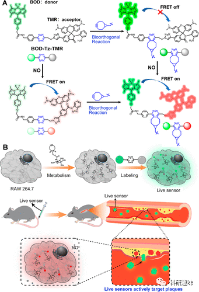
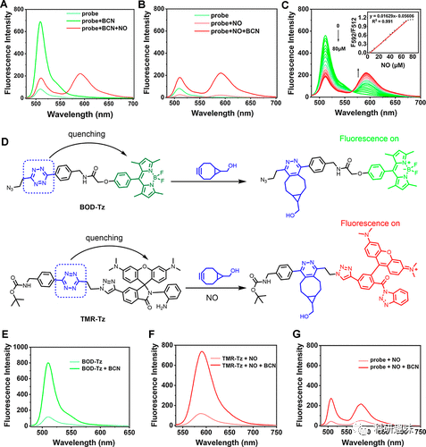
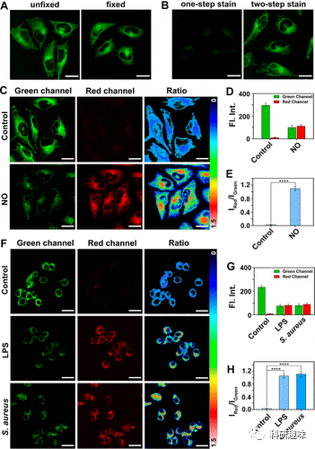
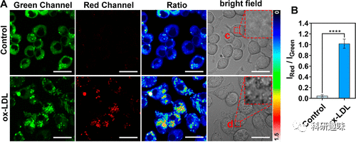
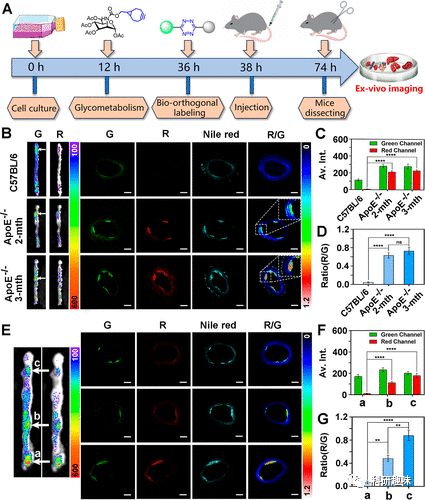
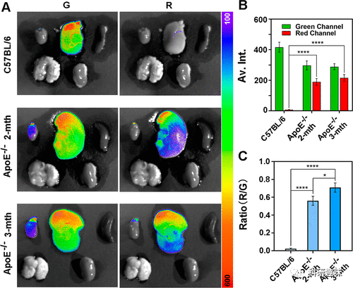

 

#  【JACS】“血管中的巡洋舰”，新型荧光探针揭示动脉硬化的内在机制！ 
 

Grenemal

读完需要

8

全文字数 2500 字

**Abstract**

## **摘要**

动脉粥样硬化（AS）是血管中斑块的形成，会导致严重的心血管疾病。目前的研究表明，动脉粥样硬化斑块的形成与巨噬细胞有很大关系。然而，目前还缺乏详细的分子生物学机制。作者提出了一种 "活体传感器"，通过新陈代谢和生物正交标记，在巨噬细胞内嫁接一种基于四嗪的氮氧化物比率探针。事实证明，这种 "活体传感器 "能特异性地靶向直径仅为数十微米的动脉粥样硬化斑块，并能在动脉粥样硬化小鼠模型的两个病变阶段观察到内源性 NO。探针发出的比率信号证实了在动脉粥样硬化过程中 NO 的参与，并表明随着病变的发展，内源性 NO 的生成显著增加。作者提出的这种 "活体传感器 "可在体内水平将小分子探针靶向递送至动脉粥样硬化斑块，并可将其用作检测动脉粥样硬化中反应分子或微环境因素的通用平台。

**Introduction**

**引言**

动脉粥样硬化（AS）是导致血管斑块形成的疾病，常引发致命的心血管疾病。研究显示，氧化低密度脂蛋白（ox-LDL）的摄取与AS的起源紧密相关，而巨噬细胞在AS斑块的发展中起关键作用。研究者提出了一种“活性传感器”，该传感器结合了巨噬细胞的定位能力和NO探针的敏感性，可以智能地识别AS斑块并半定量地检测内源性NO，为AS的诊断和研究提供了新的工具。

**Results and Discussion**

**结果与讨论**

**Design of the NO Probe**

研究团队设计并合成了一种基于Förster共振能量转移（FRET）的比例式NO探针BOD-Tz-TMR，它包括一个稳定的BODIPY供体、一个NO敏感的罗丹明受体，以及一个四唑连接剂。通过优化的连接方法，该探针不仅能够高效地传递荧光能量，还能通过生物正交反应在活细胞上进行标记。

图例：（A）探针 BOD-Tz-TMR 与 NO 的生物正交反应和响应的分子机制；（B）活体传感器的工程设计和体内传感机制

**Preparation of the Live Sensor**

该活体传感器主要分为三个部分：氮氧化物探针的设计、通过Ac4ManN-BCN对RAW 264.7细胞进行的组织工程，以及使用氮氧化物探针标记这些细胞。这些经过改造的细胞预期能够将特定的探针带到目标斑块区域。在制造过程中，通过特定的生物化学反应使探针固定在细胞中，形成活体传感器。经过毒性测试后，结果表明，所用的化合物和探针在工作浓度下对细胞的影响非常小，生物应用上具有潜在价值。

**Spectroscopic Response**

研究围绕BOD-TZ-TMR探针的光谱特性和其对氮氧化物(NO)的响应进行了深入探讨。首先，研究者验证了BOD-TZ-TMR与BCN和NO的反应性，显示出四嗪基团与BCN的迅速反应和对NO的高度敏感性。其次，研究证实了四嗪基团可以有效地淬灭BOD-TZ-TMR的荧光，并在与NO的反应后成功恢复荧光，进一步开启了供体到受体的FRET过程。这一系列的实验结果揭示了四嗪基团在减少探针背景信号和实现免洗效果方面的潜在优势。进一步研究表明，BOD-TZ-TMR对NO的检测具有高灵敏度和选择性，适用于检测低浓度的内源性NO。最后，通过详细研究BOD-TZ-TMR的两个荧光团的淬灭机制和能量传递效率，研究者展示了四嗪基团对供体和受体的强烈淬灭效应，这为淬灭游离探针的背景信号提供了理论基础。

图 1.BOD-TZ-TMR 与 BCN 和/或 NO 反应前后的荧光光谱。(A) BOD-TZ-TMR、与 BCN 反应后的 BOD-TZ-TMR 以及先后与 BCN 和 NO 反应后的 BOD-TZ-TMR 的荧光光谱。(B) BOD-TZ-TMR、与 NO 反应后的 BOD-TZ-TMR 以及先后与 NO 和 BCN 反应后的 BOD-TZ-TMR 的荧光光谱。(C) BOD-TZ-TMR 在 0-80 μM NO 存在下的荧光光谱。插入：不同浓度 NO 处理 BOD-TZ-TMR 的荧光强度比（F592/F512）以及荧光强度比与 NO 的线性关系。(D) 四嗪基团分别向供体和受体的荧光淬灭机制。(E) BOD-Tz 与 BCN 反应前后的荧光光谱。(F) TMR-Tz 与 NO 和 BCN 反应前后的荧光光谱。(G）探针 BOD-TZ-TMR 与 NO 和 BCN 反应前后的荧光光谱。

**Preparation of the Live Sensors**

研究者使用生物正交技术对活细胞进行探针的标记，证实这种技术在活细胞上具有高效性和特异性，并且干扰非常小。具体实验中，他们首先将Ac4ManN-BCN通过生物合成方法标记到活体HeLa细胞上，接着使用BOD-TZ-TMR进行生物正交标记，最终形成活体传感器。通过荧光成像和固定实验，研究者发现两步生物正交标记策略能够确保探针的稳定性和强度，尤其适用于较大分子的标记，与单步染色相比，其效果更为明显。

图 2：（A）固定和未固定 HeLa 细胞在绿色通道中的荧光成像比较；（B）一步染色和两步染色条件下固定 HeLa 细胞的荧光图像。(C) 在没有或有 100 μM NO 的情况下，用 5 μM BOD-Tz-TMR 处理 HeLa 细胞的比率图像。绿色通道，λex = 488 nm，λem = 500-550 nm；红色通道，λem = 570-620 nm。标尺 = 20 μm。(D) 加入 NO 前后的平均荧光强度。(E) 绿色通道和红色通道荧光强度的比率由（C）部分得出。(F) 用 5 μM BOD-TZ-TMR 染色 RAW 264.7 细胞，随后在无 20 μg/mL LPS、50 μg/mL l-Arg、150 U/mL IFN-γ 和 2.67 × 106 CFU/mL 金黄色葡萄球菌刺激 24 小时后，细胞中内源性 NO 的比率图像。绿色通道，λex = 488 nm，λem = 500-550 nm；红色通道，λem = 570-620 nm。标尺 = 20 μm。(G）不同刺激条件下的平均荧光强度。(H）根据（F）得出的红色通道和绿色通道的荧光强度比。误差条代表标准偏差（±SD）。

**05**

**Detection of Exogenous and Endogenous NO**

研究者制备了两种活体传感器，分别源自HeLa和RAW 264.7细胞系，用于检测外源和内源的一氧化氮(NO)。在加入NO后，共聚焦显微镜显示TMR通道的荧光增强，而BOD通道的荧光下降，反映了NO的存在。使用RAW 264.7细胞模拟状态后，观察到类似的荧光变化，进一步证实了这些活体传感器对NO的高稳定性和灵敏度。

**06**

**Monitoring of NO in the Formation of AS**

作者进一步探究了动脉粥样硬化（AS）斑块形成与一氧化氮（NO）生成的关系。研究发现，使用活体传感器BOD-TZ-TMR可以有效地检测动脉粥样硬化斑块形成过程中的内源性NO。通过实验观察，动脉粥样硬化早期和晚期小鼠模型中，与斑块相关的活体传感器荧光强度显著增强，而健康对照组则较弱。此外，活体传感器还展示了对斑块的定位准确性和能够量化检测NO的能力。研究还发现，动脉粥样硬化的形成与肝脏中的反应性氮种（RNS）应激高度同步，表明脂肪肝形成过程中的脂质过氧化损伤会导致NO的大量产生。

图 3. (A) RAW 264.7 细胞衍生活体传感器在使用或不使用 20 μg/mL ox-LDL 刺激 24 小时后的荧光图像。绿色通道，λex = 488 纳米，λem = 500-550 纳米；红色通道，λem = 570-620 纳米。标尺：20 μm。(B) 绿色通道和红色通道的荧光强度比与（A）相对应。误差条代表标准偏差（±SD）。

图 4：（A）活体传感器的生产过程。(绿色通道，λex = 488 nm，λem = 500-550 nm；红色通道，λem = 570-620 nm；尼罗河红，λex = 530 nm，λem = 620-660 nm；比例尺 = 200 μm。(C) (B) 中胸主动脉切片的平均强度。(D) (B) 中斑块的比值（R/G）。(E) 同一动脉不同位置切片的共聚焦成像。(F) (E) 中胸主动脉切片的平均强度。(G）不同位置切片的比率（R/G）值。误差条代表标准偏差（±SD）。

图 5：(A) C57BL/6J 和载脂蛋白E-/-小鼠在注射探针 BOD-TZ-TMR-loaded RAW 264.7 细胞 36 小时后主要器官的体内外成像。(C) (A) 中肝脏的 R/G 比率值。误差条代表标准偏差（±SD）。

**Conclusions**

**结论**

该研究介绍了一种新型的活体传感器，其功能相似于血管中的“精英巡洋舰”，专门用于检测动脉粥样硬化斑块中的内源性一氧化氮(NO)。该传感器是通过特定设计的NO探针和生物工程技术制备的，具有高度的灵敏度和选择性。在实验中，这些传感器成功地在小鼠动脉粥样硬化(AS)模型中检测到AS斑块，并观察到斑块中NO的浓度与其大小呈正相关。这些研究结果揭示了NO在动脉粥样硬化形成过程中的重要作用，尤其是在疾病的晚期阶段。这些新型活体传感器为探测动脉粥样硬化中的活性分子或微环境因素提供了有力的工具。

Zhou, L.; Wang, Z.; Wang, L.; Zhang, X.; Xiao, Y. Tetrazine-Based Ratiometric Nitric Oxide Sensor Identifies Endogenous Nitric Oxide in Atherosclerosis Plaques by Riding Macrophages as a Smart Vehicle. *J. Am. Chem. Soc.* **2023**, jacs.3c12181. https://doi.org/10.1021/jacs.3c12181.

**关注并回复文章DOI获取全文：**

10.1021/jacs.3c12181

**点击蓝字 关注我们**

预览时标签不可点

素材来源官方媒体/网络新闻

  继续滑动看下一个 

 轻触阅读原文 

    

