 

#  【JACS】不会调节荧光材料的吸收？看看别人5种合成方法，100多个化合物的系统研究 
 
 原创

Grenemal

读完需要

13

全文字数：3913

**Introduction**

引言

荧光显微技术在细胞成像中广泛使用荧光团来标记细胞成分。从20世纪40年代的库恩斯（Coons）异氰酸荧光素（FIC）开发，到50年代的梅特卡夫（Metcalf）可保存的异硫氰酸荧光素（FITC）类似物，小分子荧光团成为抗体和亲和试剂的常见标签。此外，化学染料被用于自标记标签系统（如SNAP标签和HaloTag标签），以及与内源性生物分子结合的含氟配体，扩展了小分子荧光团在细胞和动物体内标记蛋白质的用途，弥补了绿色荧光蛋白（GFP）等基因编码标签的不足。在众多荧光团中，罗丹明染料因其卓越的光物理特性、可调结构和生物利用度而被广泛应用于生物分子标签、自标记标签配体和荧光染色剂。通过深入研究罗丹明的结构-活性关系和采用新的合成方法，可以制备性能更佳的试剂。

罗丹明染料在苯环上带有羧基取代基，存在于亲脂性内酯（L）和荧光两性离子（Z）之间的平衡状态。KL-Z（内酯-两性离子平衡常数）是用来理解罗丹明染料在生物系统中性能的关键参数。根据KL-Z，可以将罗丹明染料分为四类：KL-Z极低的无色染料，KL-Z稍高的可制造发色性化合物，KL-Z稍高的适用于改善膜渗透性的染料，以及KL-Z高的明亮且不敏感于环境的标签。了解不同染料支架的KL-Z趋势，以及通过结构调整调整这一特性，有助于优化用于生物成像实验的荧光标签的性能。
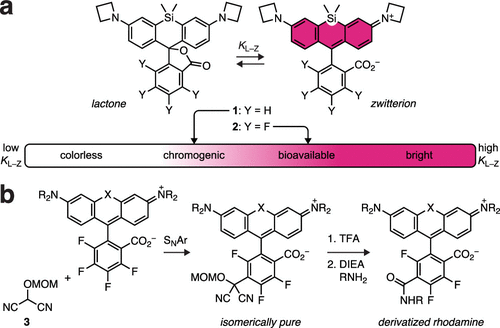
图 1.氟化作用调节KL-Z及罗丹明染料衍生化

**Results and Discussion**

结果与讨论

**氟化荧光团的合成**

作者首先讨论了构建罗丹明染料的方法，这些方法大体上分为5种，分别是在之前的工作中已经报道的a）一种金属/溴交换和b）四氟邻苯二甲酸酐加成的方法。除了这些已知方法外，作者还介绍了几种新的方法包括c）钯催化交叉耦合和d）邻苯二甲酸与不同化合物的氧化缩合，此外，作者还探索了一种新的方法，通过石化反应和加成反应制备含氟染料。作者评估了这些合成方法在制备不同类型的罗丹明染料以及相关染料方面的实用性。
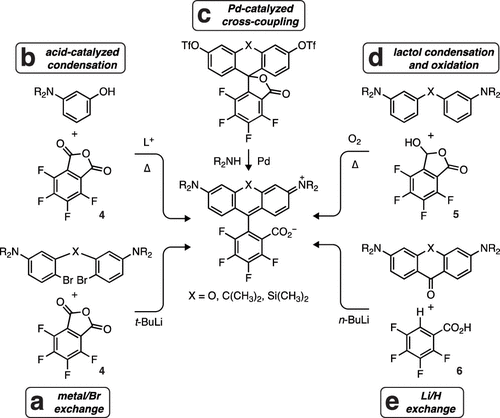
图2. 罗丹明衍生物的合成方法

**光谱特性**

研究从分析这荧光素的光谱特性开始，测量了它们的吸收波长（λabs）、发射波长（λem）、消光系数（ε）和荧光量子产率（Φf）。特别关注了染料的pH敏感性，测定了它们的pKa值，并研究了pH值对光谱变化的影响，通过计算希尔系数（ηH）来描述pH值介导的光谱变化的协同性。某些含氟苯基的染料显示出显著的红移，pKa值较低，而非含氟环的染料在pH值降低时表现出协同性转变。另外，硅荧光素染料也保持了pH值协同性。
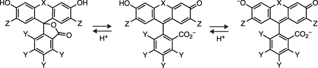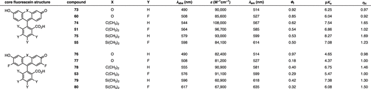
图3. 荧光素衍生物的光谱特性

接着，作者对罗丹明染料进行了研究，测量了它们的标准光谱特性（如吸收波长λabs、摩尔吸光系数ε、发射波长λem和荧光量子产率Φf），以及内酯-两性离子平衡常数KL-Z。结果显示，氟化苯基取代会导致λabs和λem分别增加15-25 nm，而斯托克斯偏移减小了5 nm。这一修饰也略微增加了ε，但降低了Φf，这可能是由于能隙定律或光诱导电子转移导致的。

具体举例，碳十二胺 86 (JF608) 的光物理特性为λabs/λem = 608 nm/631 nm，ε = 99,000 M-1cm-1 和Φf = 0.67。相比之下，含氟类似物 JF632表现出红移光谱（λabs/λem = 632 nm/649 nm）、较高的吸收率（ε = 139,000 M-1cm-1）和较低的Φf = 0.54。这些趋势也在类似的氘代 JFX 染料 88 和 40 中得到反映。Si-Q罗丹明 95也呈现出类似的趋势，显示λabs/λem = 637 nm/654 nm，ε = 77,000 M-1cm-1和Φf = 0.38，而含氟类似物 29 表现出光谱红移，λabs/λem = 659 nm/675 nm，ε = 124,000 M-1cm-1 和Φf = 0.25。非荧光N-芳基罗丹明的λabs和ε也显示相似的趋势。例如，罗丹明 90 的最大吸收波长在549 nm，而加入氟原子后的 64 显示出吸收最大值和消光系数的增加，λabs = 570 nm；ε = 81,700 M-1cm-1。
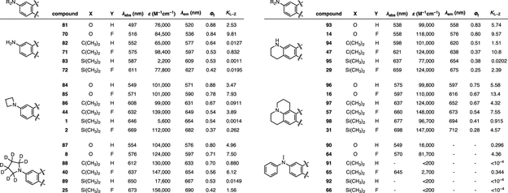
图4. 罗丹明衍生物的光谱图特性

**取代基影响**

之后，作者对不同染料系列的内酯-两性离子平衡进行了详细研究，使用了1:1（体积比）的二氧六环-水混合物测定KL-Z，这为理解结构-活性关系提供了广泛数值范围。主要观察到两个趋势：首先，氟化苯基取代普遍提高KL-Z，这种变化的程度根据染料结构的不同而有所不同。其次，KL-Z与桥接取代基和生色团有显著关系。桥接取代基对KL-Z的影响已被广泛认可，但对生色团（特别是高电子供能基团）的依赖性并未经过严格的研究。

生色团的电子供能特性与KL-Z之间存在相关性，电子供能能力排序为NH2 &lt; 氮杂环丁烷 &lt; 吡咯烷 &lt; 四氢喹啉 &lt; 久洛尼定。KL-Z值也遵循了这一趋势。

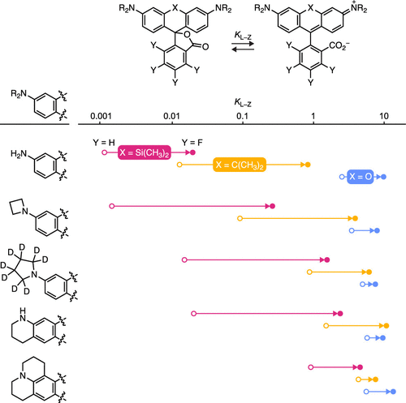
图5. 取代基对KL-Z的影响

最后，我们比较了具有更复杂生色团取代基的含氧和含硅的罗丹明，综合而言，氟修饰对荧光染料结构产生广泛影响，导致光谱红移、提高吸收率和内酯-两性离子平衡常数（KL-Z），但降低荧光量子产率。复杂生色团取代基的罗丹明系列也呈现相似趋势，但扩展共轭体系加速了非辐射衰变途径，降低染料作为荧光标签的吸引力。
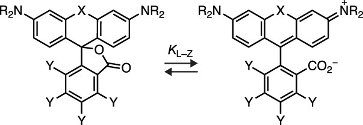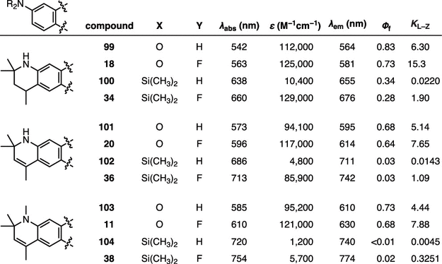
图6. 复杂取代基对KL-Z的影响

**细胞成像**

作者选择了三种新的含氟染料来研究其在生物成像方面的应用，首先关注的是碳基罗丹明59，它是ATTO 647N的含氟类似物。ATTO 647N虽然广泛应用与体外单分子成像应用种，但是由于结构的限制，ATTO 647N尚未用于活细胞实验。许多ATTO染料的一个关键设计原则是通过将环上的邻羧酸基酰胺化，这种策略有三个作用：（i）引起光谱特性的红移，使λabs&gt;640 nm，比未修改的母体染料更长（λabs=632 nm）；（ii）通过阻止内酯化来强化可见吸收；（iii）为生物共轭提供一个羧酸基团，从而避免异构混合物的问题。然而，这种策略也有一个显著的缺点，它移除了邻羧酸的负电荷，导致衍生后形成阳离子物质。当将ATTO 647N-HaloTag配体（105HTL）应用活细胞时，观察到核中没有明显标记，而是对线粒体进行了染色（图3b）。为了解决这一问题，作者利用MAC方法，既保留了罗丹明光谱和结构上的优势，同时避免了产生阳离子化合物。与其他远红染料配体相比，JF657-HaloTag配体在单分子跟踪实验中表现出更高的亮度和更稳定的性能，为SPT标签的新标准奠定了基础。
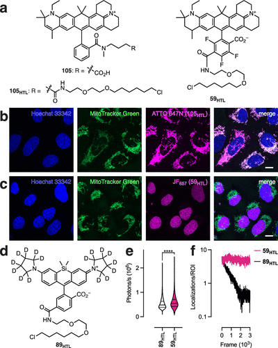
图7. JF657 的性能。(a）ATTO 647N（105）、ATTO 647N-HaloTag 配体（105HTL）和 JF657-HaloTag 配体（59HTL）的化学结构。(b，c） U2OS 细胞的荧光图像，细胞核用 Hoechst 33342 标记，线粒体用 MitoTracker Green 标记，105HTL（b）或 59HTL（c）；(d）JFX650-HaloTag 配体（89HTL）的化学结构。(e）SPT 实验中配体 89HTL 和 59HTL 的强度（光子/秒）的 Violin 图；(f）SPT 实验中配体 89HTL 和 59HTL 的定位与帧的关系图。

**近红外成像**

近红外区域具有自发荧光低、散射少和相对较深的组织穿透性等特点，是生物成像的一个极具吸引力的窗口。作者制备了几种染料的Halo衍生物并在活细胞中进行了测试了，它们都成功标记了表达HaloTag融合的组蛋白H2B的活细胞。这些衍生物在细胞内的动力学相似，但强度各有不同。与其他衍生物相比，31HTL的核荧光强度要高出3倍以上，与其在体外的卓越亮度相一致。SiRF712化合物（108HTL）的细胞强度排名第二。相反，二氢喹啉Si-卤代胺（36HTL、38HTL和104HTL）在细胞中表现出相对较低的强度，这与它们的较低Φf值相关。另外，JF698-HaloTag配体（31HTL）相较于JF711和JF722等含氧化膦的配体，展现出更高的亮度和光稳定性，使其能够与其他可见光激发的标签一起用于多色成像实验。
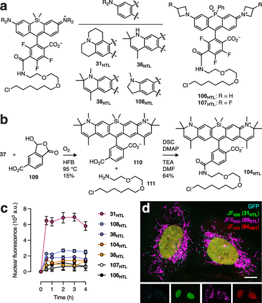
图8. 近红外激发荧光团的评估。(a) 基于 Si- 罗丹明的 HaloTag 配体 31HTL、36HTL、38HTL 和 108HTL 以及基于氧化磷罗丹明的 106HTL 和 107HTL 的化学结构。(b) 104HTL 的合成。(c) 细胞核荧光与时间的关系。(d）表达融合蛋白的 U2OS 细胞的四色图像.

**FRET成像**

最后，作者考察了非荧光的N,N′-二芳基-硼杂罗丹明91及其氟化类似物65。由于TICT效应，N-芳基的引入通常会降低罗丹明染料的荧光量子产率，这使得N-芳基罗丹明和N-芳基-Si-罗丹明成为非荧光受体染料，适用于佛斯特共振能量转移(FRET)等应用。然而，这些非荧光罗丹明系统尚未在细胞内标记中得到应用，同时N-芳基罗丹明淬灭剂也未经充分测试。在罗丹明染料中引入N-芳基通常会导致内酯-两性离子平衡转向无色内酯形式，但将氟原子引入苯基取代系统，如化合物65，能够改变这一平衡，产生一种具有可测吸收率和远红外吸收的染料。这种染料在与HaloTag蛋白结合后表现出显著的荧光，被命名为Janelia Quencher 645(JQ645)。JQ645显示出比非氟化配体更快的标记速度，因此在细胞内标记应用中具有巨大潜力。在研究中，作者采用这种新型远红荧光淬灭染料用于环磷酸腺苷（cAMP）半合成传感器，在细胞中，作者使用JFX612-SNAP-tag衍生物作为供体和新型JQ645-HaloTag衍生物作为受体，通过荧光寿命成像（FLIM），作者成功测量到细胞内cAMP的浓度变化，证明JQ645-HaloTag衍生物是有效的FRET淬灭剂。
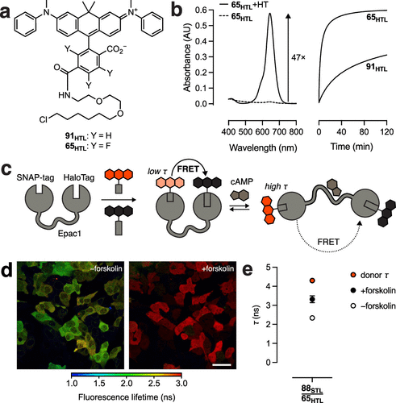
图 9. cAMP 的半合成传感器。(a) N,N′-二芳基硼二胺配体 91HTL 和氟化类似物 65HTL 的结构。(b）65HTL（5 μM）在 HaloTag 蛋白（10 μM）存在（实线）或不存在（虚线）时的吸光度光谱，以及 91HTL 和 65HTL（5 μM）加入 HaloTag 蛋白（10 μM）后的吸光度与时间的关系。(c) 半合成 cAMP 指示剂（ScAMPI）示意图。(d) 表达 ScAMPI 并用 88STL/65HTL ± forskolin 标记的活 U2OS 细胞的荧光寿命图像。(e）ScAMPI 在含有 88STL/65HTL 和福斯克林的细胞中的表现量化。

**Conclusions**

结论

这项研究通过开发新的合成策略，如扩大氧化邻苯二甲酸缩合的范围、直接Li/H交换等，制备了多种含氟和不含氟的罗丹明染料，基于这些荧光染料，作者揭示了内酯-两性离子平衡与结构之间的关系，此外，作者创造了一系列新的罗丹明染料，如JF657、JF698、JQ645等，这些染料在活细胞成像中表现出色彩亮丽、高亮度和多功能性。特别是，JF657在单粒子追踪实验中表现卓越，JQ645则可以作为FRET淬灭剂用于细胞内cAMP浓度测量。

Grimm, J. B.; Tkachuk, A. N.; Patel, R.; Hennigan, S. T.; Gutu, A.; Dong, P.; Gandin, V.; Osowski, A. M.; Holland, K. L.; Liu, Z. J.; Brown, T. A.; Lavis, L. D. Optimized Red-Absorbing Dyes for Imaging and Sensing. J. Am. Chem. Soc. 2023. https://doi.org/10.1021/jacs.3c05273.

**关注并回复文章DOI获取全文：**

10.1021/jacs.3c05273

[【JACS】荧光探针容易光漂白？这篇两张图的顶刊教你提高光稳定性](http://mp.weixin.qq.com/s?__biz=MzkzOTI1OTMwNg==&amp;mid=2247484125&amp;idx=1&amp;sn=8bf9c01a22d0f49adedea18944bd8772&amp;chksm=c2f2e618f5856f0ea0672f190bcc2c23148d07cef50c856ea61095f4cebdbe795ee75919fc1d&amp;scene=21#wechat_redirect)

[【Chem. Soc. Rev】超全的方法总结教你怎么把可见光荧光材料转换成近红外](http://mp.weixin.qq.com/s?__biz=MzkzOTI1OTMwNg==&amp;mid=2247484264&amp;idx=1&amp;sn=5e856045fbd75648a389d7e7258b58fb&amp;chksm=c2f2e7adf5856ebb91e48cd529d688af4b90dd3e9f8928f171dd883801ec9a8b08b5deb8c333&amp;scene=21#wechat_redirect)

[【Nat. Rev. Bioeng.】重磅综述，基于微针的生物传感器](http://mp.weixin.qq.com/s?__biz=MzkzOTI1OTMwNg==&amp;mid=2247484419&amp;idx=2&amp;sn=68c5b32fa5eca06317cc0ee3203a81d2&amp;chksm=c2f2e0c6f58569d02ae3b3a6b441866ca851843216bd9f56956cd045dc8ba21a87a71ef8e7ed&amp;scene=21#wechat_redirect)

预览时标签不可点

素材来源官方媒体/网络新闻

  继续滑动看下一个 

 轻触阅读原文 

   

