 

#  【JACS】不要光，不要氧，无副作用，新型ROS治疗试剂实现更智能的癌症治疗 
 

Grenemal

读完需要

22

全文字数 7000 字

## **摘要**

肿瘤内部的缺氧微环境以及光在生物组织中的有限穿透深度，极大地限制了光动力疗法（PDT）的治疗效率。单线态氧电池（SOB）作为一种新兴策略，其独特之处在于能够独立于氧气和光照条件释放1O2。然而，传统的SOB系统常面临“常开”式1O2释放的问题，可能导致在治疗周期中出现非预期的1O2泄漏，这不仅影响治疗效果，还可能引发严重的生物安全性顾虑。

针对这一挑战，作者提出了一种程序化的单线态氧电池系统，旨在实现精准控制1O2的释放。具体而言，作者通过开发一种名为PyAce的肿瘤微环境响应型吡啶酮-吡啶开关来验证这一策略。PyAce具有两种同系物形式：PyAce-o（吡啶）和PyAce（吡啶酮），它们在1O2的储存半衰期上表现出显著差异。在常态下，PyAce以吡啶酮形式存在，能有效储存1O2（t1/2 = 18.5 小时）。当PyAce进入肿瘤微环境后，会经历化学转换变为吡啶形式，此时能迅速且完全地释放1O2（t1/2 = 16 分钟），并在治疗结束后有效抑制1O2的进一步释放。

这种“OFF-ON-OFF”的1O2释放机制，确保了在治疗期间内1O2的高效、选择性释放，从而最大化PDT的治疗效果，同时显著降低对正常组织的潜在损害。此外，这种策略还摆脱了传统PDT对氧气供应和光照条件的依赖，具有高度的时空选择性和实用性。
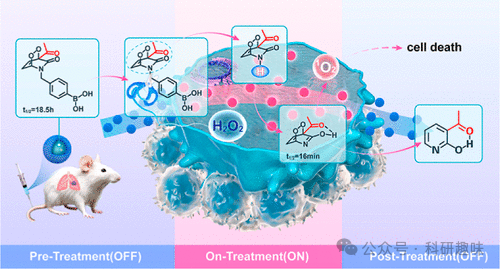

**引言**

光动力疗法（PDT）作为一种无创、高效的癌症治疗手段，通过光敏剂（PSs）在光照下产生活性氧（ROS），特别是单线态氧（1O2），来诱导癌细胞凋亡。尤为重要的是，PDT能够有效克服传统化疗药物引发的多药耐药性难题。然而，传统的光敏过程高度依赖于氧气的参与，因此，肿瘤内部的缺氧环境成为限制PDT疗效的关键因素。

此外，PDT的另一挑战在于光线的穿透深度有限。传统PDT所使用的可见光或近红外（NIR）光在皮肤或肿瘤组织中的穿透深度仅为0.5-2毫米。尽管具有双光子吸收功能的PSs可实现NIR-II光PDT，将穿透深度提升至2-10毫米，但这仍不足以应对深层或大型肿瘤的治疗需求，后者往往需要数厘米的穿透深度。

为克服上述挑战，研究者们开始探索不依赖氧气和光线的ROS产生途径，如声动力疗法（SDT）和X射线诱导光动力疗法（X-PDT），这些技术能实现数厘米的组织穿透深度。然而，SDT和X-PDT通常依赖间接激发途径，ROS生成效率受到一定影响，因此需特定的PSs以支持其成功应用。

为应对缺氧环境和有限光穿透的挑战，单线态氧电池（SOB）系统应运而生。该系统利用吡啶酮或蒽衍生物等分子储存PS在体外产生的ROS，随后在体内释放，实现不依赖氧气和光线的ROS治疗。例如，Zou等人报道了一种基于2-吡啶酮的二嵌段聚合物（PEG-Py），实现了基于1O2的余辉疗法；Xie等人则开发了一种基于金属有机框架的聚吡啶酮系统（poly mPYR），用于递送1O2；Zhu等人介绍了一种靶向SOB（CARG-1O2），利用吡啶酮结构治疗深层组织细菌感染。

然而，目前报道的ROS电池系统多基于吡啶酮结构，其ROS释放行为呈现“常开”状态，释放速率完全取决于吡啶酮内过氧化物（EPO）的半衰期，如PEG-Py的半衰期约为1.8分钟，而poly mPYR的半衰期则长达8小时。这种持续释放ROS的特性在体内给药后可能导致不必要的副作用。

理想的ROS电池系统应具备“OFF-ON-OFF”的ROS释放模式：（1）储存阶段（OFF）：在血液循环过程中长期储存ROS，减少副作用并防止ROS过早泄漏；（2）释放阶段（ON）：一旦进入肿瘤微环境（TME），迅速且全面释放ROS，以提高治疗效果；（3）排除阶段（OFF）：治疗结束后，在排出体外前耗尽ROS，避免治疗后副作用。

在本文中，作者提出了程序化的单线态氧电池（PSOB）的新概念，旨在实现1O2的封装及在肿瘤微环境（TME）触发下的可控释放。这一策略有效应对了肿瘤缺氧和光穿透深度受限的挑战。作者的设计独特之处在于利用具有不同EPO（过氧化物）半衰期的吡啶同系物作为分子开关。通过构建一种含有EPO寿命较长（t1/2 = 18.5小时）的吡啶酮同系物和EPO寿命较短（t1/2 = 16分钟）的吡啶同系物的PSOB，作者实现了ROS（活性氧）的程序化释放。

具体而言，在储存和递送阶段，PSOB中的吡啶酮结构通过其酮基α-H的乙酰化和TME反应基团的阻断，保持了较长的EPO寿命，确保了其在到达肿瘤细胞前的稳定性。一旦PSOB暴露于TME，反应基团将被移除，触发同分异构过程，使吡啶结构占据主导地位，并通过一个6元分子内氢键得到稳定。这种结构转变显著缩短了EPO的寿命，从而促进了ROS的快速释放。

为实现这一设计，作者采用DSPE-PEG-2000作为载体，将II型光敏剂PS-1和吡啶酮形式的PyAce封装在PSOB纳米粒子中。通过在小鼠皮下HeLa肿瘤模型和肺转移模型中进行体内实验，作者评估了该系统的疗效。实验结果表明，PSOB展现出了高度的时空选择性抗肿瘤效果，并具备光和无氧光动力疗法的潜力，为未来的癌症治疗提供了新的可能性。

**结果与讨论**

**PyAce 和 PS-1 的设计与合成**

在PyAce（化合物2，如图 1 所示）的设计中，作者特别选取了4-甲基苯硼酸基团和乙酰基团作为α-H的封闭基团。此外，为了响应H₂O₂，作者引入了N-取代苯基硼酸基团作为反应基团。PyAce（2）的合成始于3-乙酰基吡啶酮，通过一步反应与4-（溴甲基）苯硼酸结合，最终得到目标化合物PyAce（2）。
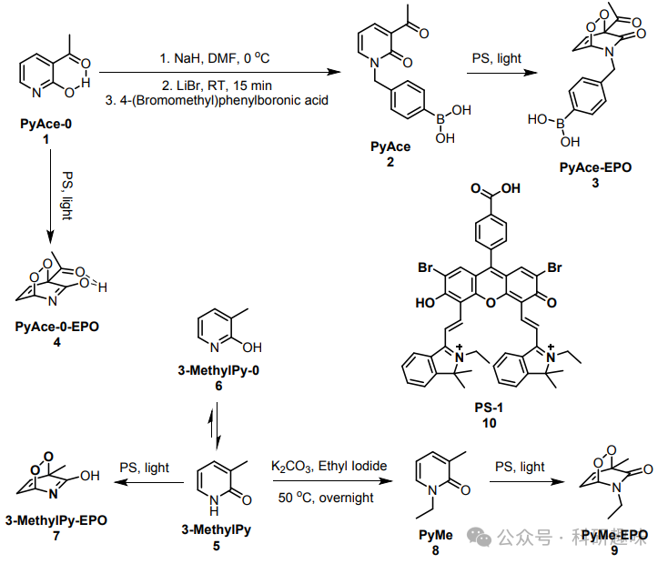
图 1. PyAce 及其衍生物的合成路径

PS-1（10）作为一种荧光素衍生物，归类于II型光敏剂（PS）。其合成依据先前文献所述步骤进行，首先制备中间化合物14，随后通过醛醇反应得到最终产物PS-1，合成收率为67%。
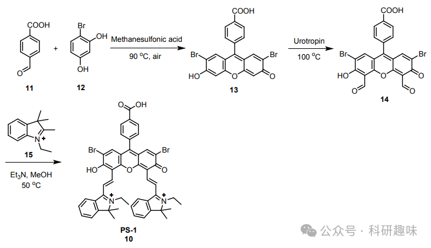
图 2. PS-1 的合成路径

**PyAce-o 和 PyAce 的单线态氧储存行为**

为了深入探究PyAce-o (1)（吡啶形式）和PyAce (2)（吡啶酮形式）在1O2储存能力上的差异，作者进行了详尽的实验分析。首先，通过ESI-MS图谱的定性分析，作者揭示了两种化合物的储存能力。如图 3A-C所示，PyAce (2)（吡啶酮形式）在原始状态下显示出一个特征性的m/z=272.1090 峰，与PS-1 (10) 孵育并暴露于白光照射（40 mW/cm²，30分钟）后，m/z=304.0997处出现的新峰，该峰对应于PyAce-EPO (3)（PyAce的内过氧化物形式），这标志着溶液中成功形成了EPO（注释：光照会促使 PS-1 产生单线态氧，单线态氧会与吡啶酮底物反应，生成过氧化物）。值得注意的是，黑暗储存1小时后，PyAce-EPO (3)峰仍保持稳定，表明其具有良好的储存能力和稳定性。
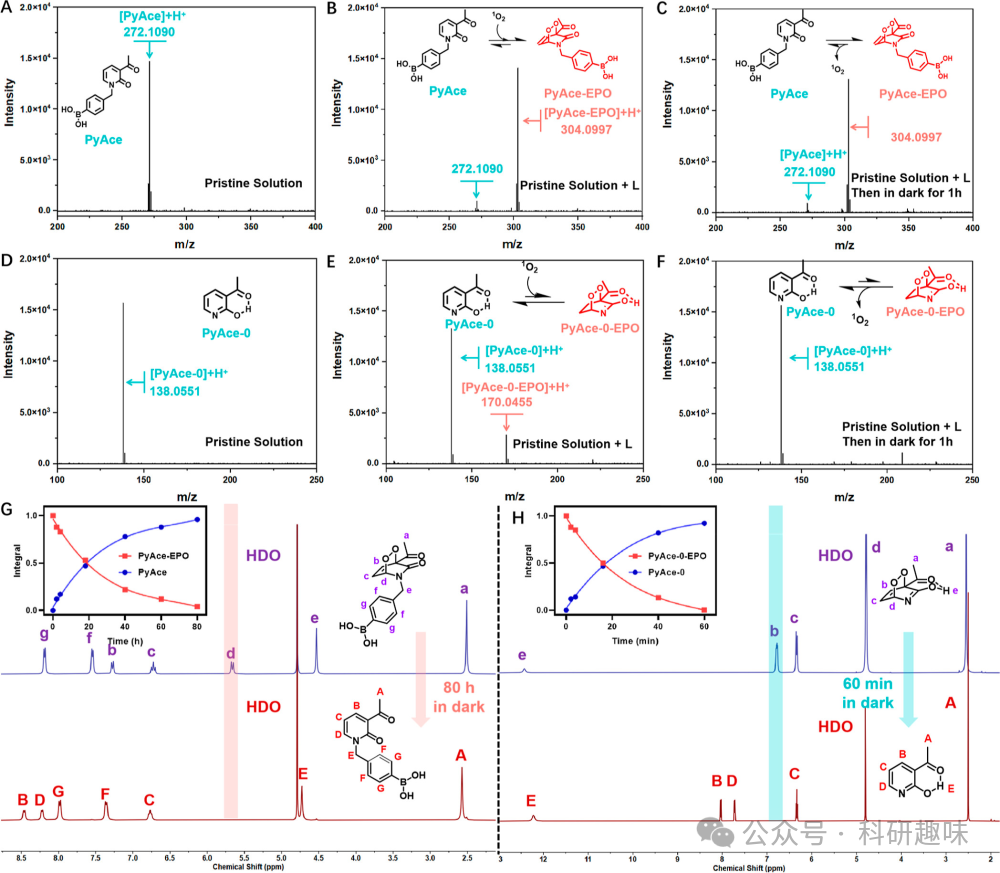
图 3. 不同PyAce 及其衍生物的单线态氧存储能力

对于PyAce-o (1)（吡啶形式），如图 3D-F所示，白光照射后ESI-MS图谱中出现m/z=70.0455的新峰，这是PyAce-o-EPO (4)的形成标志。然而，黑暗培养一小时后，该峰值消失，反映了逆狄尔斯-阿尔德反应的快速进行和PyAce-o-EPO (4)的清除。此外，如图 4 所示，PyAce-EPO (3)和PyAce-o-EPO (4)在缺氧环境下均表现出相似的1O2储存行为，进一步验证了两者在肿瘤微环境中的储存能力。
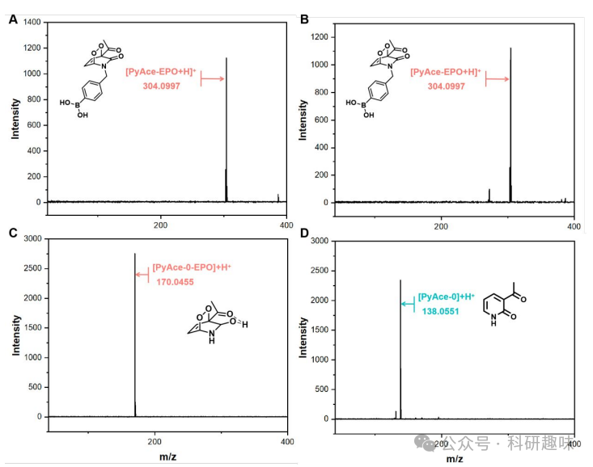
图 4. PyAce-EPO and PyAce-0-EPO 在缺氧条件下的存储 能力

为了定量评估两种化合物中EPO的半衰期，作者进行了1H NMR实验。如图 3G、H所示，通过监测Hb的化学位移，作者构建了EPO分解曲线。结果表明，PyAce-EPO (3)的半衰期为16分钟，而PyAce-o-EPO (4)的半衰期较短，这凸显了两者在1O2储存和释放特性上的差异。（注释：这里可能有误，原文中提到 Hb 的化学位移随着 EPO 的分解会从 5.4 到 8.2 ppm，但不论是从图 G 还是 H 都观察不到对应的变化，另外，原文的图注对 PyAce-EPO 的标注是 5.8 to 6.0 ppm， PyAce-0-EPO 的标注是 6.5 to 7.0 ppm，不过从图中的标注可以看出，正文中说明了该氢的变化是从 sp3 到 sp2，所以推测可能是根据 Hd 这个峰进行的计算，而对于 PyAce-0-EPO 而言，Hd 和水峰重叠了，所以只能用 Hb 进行计算）

原文：The 1H NMR spectra, as presented in G,H, revealed time-dependent changes during the dark incubation. A notable shift of the resonance peak of Hb was observed, which shifted from an sp3 to an sp2 carbon, resulting in a significant chemical shift from 5.4 to 8.2 ppm. This shift provided a clear marker for monitoring the EPO decomposition process. For quantification, the initial integral value of Hb was set to “1”. The subsequent decrease in this value over an 80 h period under dark conditions was used to construct the EPO decomposition curve (G). Based on this curve, the half-life of PyAce-EPO (3) was calculated to be 18.5 h. In addition, as shown in H, from 1H NMR characterization of PyAce-0-EPO (4), the half-life of PyAce-EPO (3) was calculated to be 16 min

为了进一步研究3-乙酰基取代在调节同分异构体平衡和1O2释放中的作用，作者采用3-甲基取代的吡啶酮（化合物5，3-MethylPy）作为对照。如图 5 所示，3-甲基吡啶酮内过氧化物3-MethylPy-EPO (7)的半衰期长达9.6小时，与3-乙酰基取代的PyAce-o-EPO (4)形成鲜明对比。这一发现强调了3-乙酰取代在促进1O2受控快速释放中的关键作用。
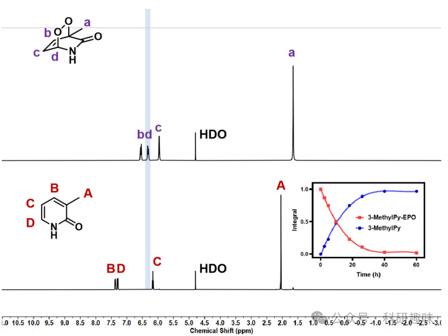
图 5. 3-MethylPy-EPO 的半衰期

最后，作者通过1H NMR实验评估了PyAce-EPO (3)在溶液中的稳定性。如图 6 所示，PyAce-EPO在血浆中储存4小时后，其NMR图谱几乎保持不变，这证明了PyAce-EPO (3)在血浆中具有良好的稳定性。此外，如图 7 所示，PyAce-EPO (3)在TME中对H₂O₂表现出快速响应性，黑暗和缺氧条件下加入100 μM H₂O₂后，其特征峰从ESI-MS图谱中消失，并出现与3-acetylpyridone对应的新质量峰，这进一步验证了PyAce-EPO (3)在TME中对H₂O₂的高效选择性反应能力。这些结果为癌症靶向治疗的PSOB系统的开发和优化提供了宝贵的实验依据。
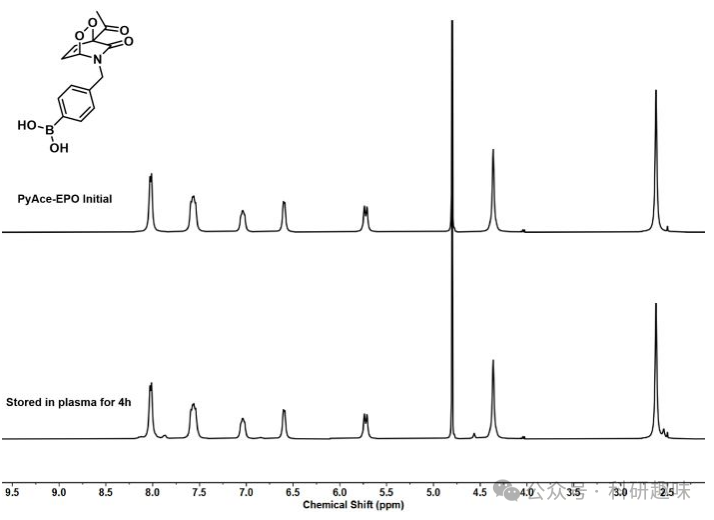
图 6. PyAce-EPO (3)在溶液中的稳定性
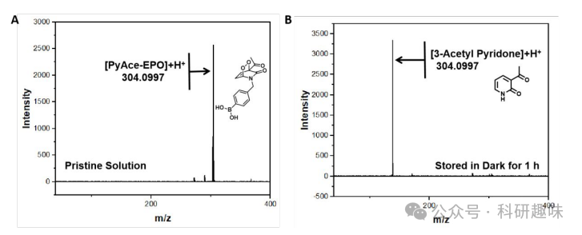图 7. PyAce-EPO (3)对双氧水的响应
**程序化的单氧原子电池的机理研究**

先前的实验已明确指出了PyAce-o (1) 和 PyAce (2) 在1O2储存能力上的显著差异。为了深入探究其机理，作者首先利用1H NMR技术来鉴定水性体系中主要的同分异构体。如图 8 所示，PyAce-o (1)在10.5至14 ppm区间内显示出一个独特的分子内氢键共振峰，积分值为0.85，这强烈表明在水溶液条件下，吡啶同系物占据主导地位。相比之下，3-甲基吡啶酮（3-MethylPy，化合物5）在相同区间内未显示1H NMR信号，这凸显了水环境中吡啶酮结构的优势地位。值得注意的是，PyAce结构中缺乏可用的α-H，这为其吡啶酮同系物形式的稳定性提供了保障。
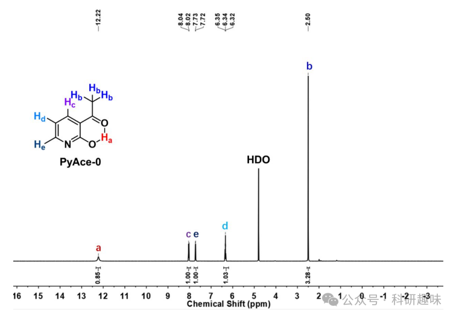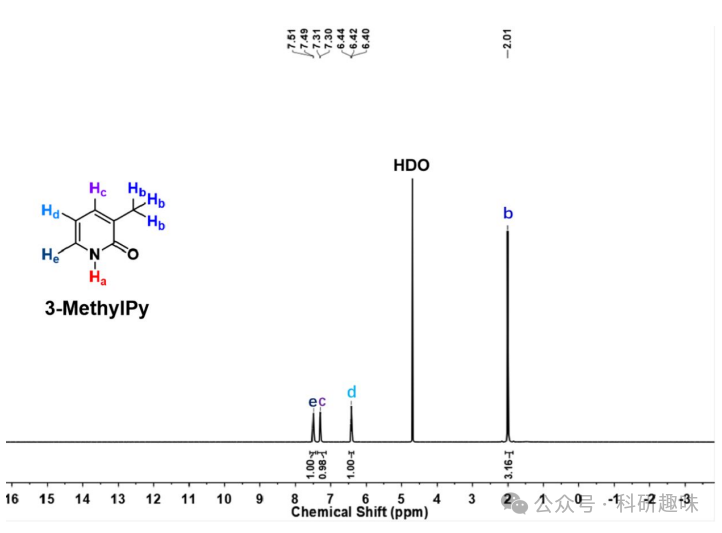
图 8. PyAce-0 和 3-MethylPy 的核磁图谱

通过1H NMR分析，作者证实3-乙酰基的引入促进了一个六元分子内氢键的形成，从而稳定了PyAce中的吡啶同系物。为了定量评估这一效应，作者进行了密度泛函理论（DFT）计算，比较了3-甲基和3-乙酰基取代的吡啶酮中吡啶与吡啶酮同系物的相对稳定性。如图 9 所示，对于未经3位取代的传统吡啶酮，吡啶酮同系物的能量比吡啶同系物低9.1 kcal/mol，倾向于吡啶酮主导的平衡。然而，引入3-乙酰基后，这种平衡被打破。在这种情况下，吡啶酮同系物的能量比吡啶同系物高6.9 kcal/mol，导致吡啶同系物占据优势。这一发现进一步验证了3-乙酰基通过形成六元分子内氢键，颠覆了吡啶与吡啶酮同系物的相对稳定性。
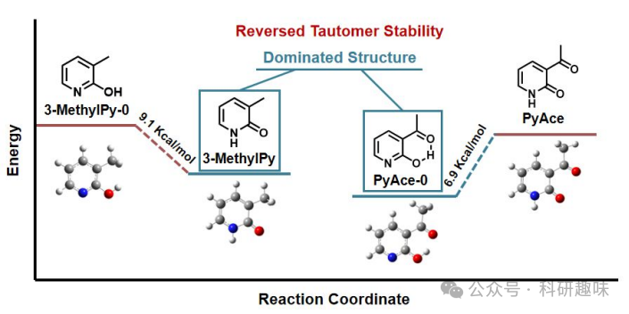
图 9. 不同 PyAce 分子的能量计算

为了进一步阐明吡啶与吡啶酮结构在1O2储存能力上的差异，作者进行了详细的DFT分析。如图所示，作者的模型重点关注逆-Diels-Alder反应，在该反应中，EPO经历一个过渡态，随后1O2解离并生成PyAce (2)。PyAce-o-EPO（4，吡啶形式）进入过渡态（TS-2）的能垒为11.1 kcal/mol。相反，PyAce-EPO（3，吡啶酮形式）进入过渡态（TS-1）的能垒明显更高，达到21.5 kcal/mol。这一结果表明，在逆狄尔斯-阿尔德反应中，吡啶形式的1O2比吡啶酮形式的1O2更易解离，与实验数据相吻合。此外，PyAce吸收1O2并生成PyAce-o-EPO (4)的能垒为16.8 kcal/mol，而从吡啶酮形式生成PyAce-EPO (3)的能垒仅为3.7 kcal/mol。这些发现揭示了吡啶酮形式在形成EPO方面具有更高的效率，但其释放1O2的速率低于吡啶形式。因此，作者可以得出结论：吡啶酮形式更适合储存1O2，而吡啶形式在释放1O2方面更具优势。
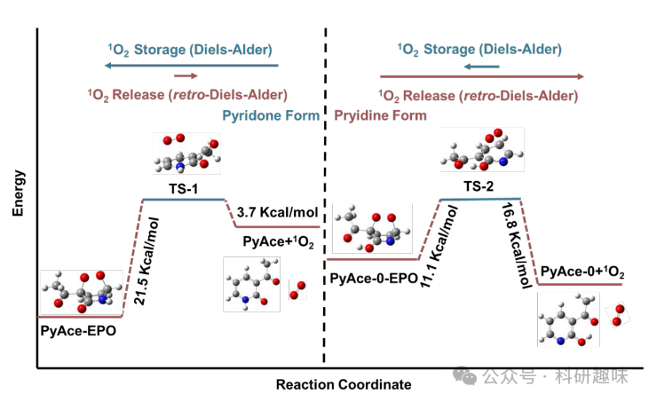
图 10. PyAce 存储和释放1O2中的能级变化

**PS-1 的特性和 PSOB 的单线态氧储存能力**

成功构建PSOB的关键在于两个核心组件：PyAce (2) 作为1O2的受体和储存基质，以及II型光敏剂作为1O2的生成源。在此系统中，PS-1（10）被精心设计为一种高效的1O2产生体。如图2A所示，PS-1（10）在520纳米波长处展现宽吸收，并在680纳米波长处具有荧光发射峰。图2B进一步表明，与典型的II型光敏剂Ce6和RB相比，PS-1（10）在生成II型ROS方面展现出更强的能力。通过将PS-1 (10) 和 PyAce (2) 封装在DSPE-PEG-2000中，作者成功构建了程序化的的1O2电池纳米粒子PSOB。如图 12 所示，粒度分布和透射电子显微镜图像揭示PSOB为直径约95.4 nm的球形纳米粒子。图 13A 的扫描电子显微镜成像进一步确认了其纳米球形结构。此外，通过EDX分析（图 13B），作者观察到硼原子在PSOB基体中的均匀分布，证明了硼在PSOB中的成功整合。
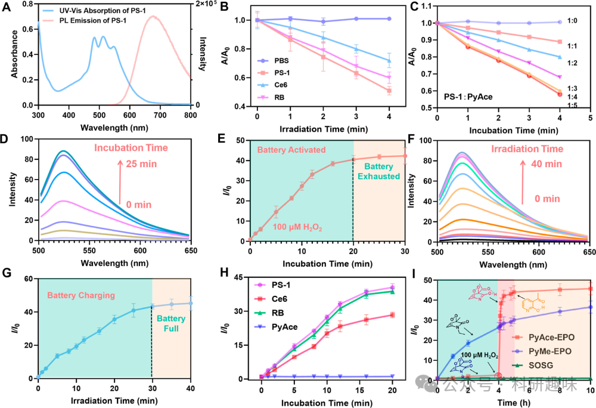
图 11. PSOB 的存储和释放能力
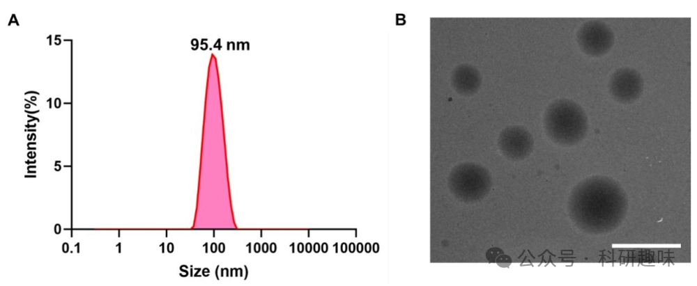
图 12. PSOB 的粒径
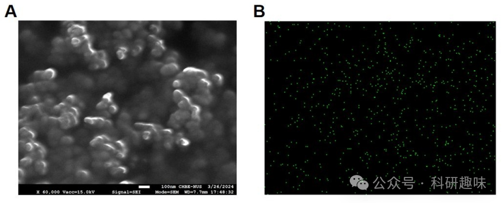
图 13. PSOB 的电镜图及 EDX 图

为了优化PS-1（10）与PyAce（2）的配比，作者采用9,10-蒽二基双（亚甲基）二丙二酸（ABDA）作为1O2指示剂，并合成了不同PS-1/PyAce比率的PSOB配方，随后在白光照射下评估其II型ROS产生能力。如图2C所示，PSOB产生的1O2随PS-1与PyAce的比例变化而增加，并在PS-1/PyAce = 1:4时达到峰值。为了确定电池充电阶段的最佳辐照时间，作者采用SOSG作为指示剂，分别使用双氧水及光照时间来为电池充能，结果表明，随着培育时间的增加或者照射时间的增加，SOSG 在 525 nm 处的荧光也在增加，并分别在 20 分钟和 30 分钟达到峰值。

如图2H所示，含有PS-1、Ce6或RB的PSOB均具备产生1O2的能力，且PSOB产生的1O2量与光敏剂本身的1O2生成能力相一致（PS-1 &gt; RB &gt; Ce6，如图2B,H所示）。作者还比较了"OFF-ON-OFF"型PSOB-EPO（PSOB的内过氧化物形式）与传统的"始终开启"型SOB-EPO（3-甲基取代的吡啶酮内过氧化物，PyAce-EPO，3）在治疗前、治疗中和治疗后产生的1O2量。通过模拟预处理阶段（在PBS中孵育0-4 h），随后模拟肿瘤微环境（加入100 μM H2O2）并持续监测SOSG的强度直至10 h，作者探究了治疗后1O2的产生情况。如图2I所示，"始终开启"的SOB在整个监测过程中持续释放1O2，而PSOB则表现出对H2O2响应的"关闭-开启-关闭"的1O2释放行为。具体来说，PSOB在储存阶段（0-4小时）不释放ROS，与100 μM H2O2反应后迅速、彻底地释放1O2（释放阶段，ON），并在40分钟后耗尽并停止释放1O2（耗尽阶段，OFF）。这一结果表明，与传统的SOB相比，PSOB在减少副作用方面具有显著优势。

此外，为了证明PyAce (2) 在PSOB中作为1O2受体的普适性，作者还监测了由PyAce (2) 与不同II型光敏剂组成的PSOB产生1O2的能力。进一步的研究表明，当PSOB-EPO与各种离子或不同pH值（从3到10）的溶液培养30分钟时，检测到的1O2生成量微乎其微（图 14），这证明了PSOB-EPO释放1O2的反应行为对TME中的H2O2具有高度的特异性。
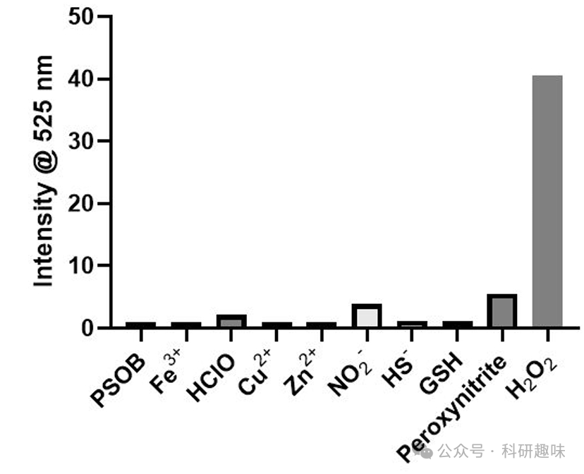
图 14. PSOB 在不同环境下单线态氧的产生能力

**细胞内 ROS 生成与细胞活力**

为了准确评估PSOB-EPO在癌细胞（A549细胞）与正常细胞（3T3细胞）中的治疗效果，作者对其产生的1O2进行了量化分析。采用二氯二氢荧光素二乙酸酯（DCFH-DA）作为探针来监测PSOB-EPO诱导的1O2产生情况。如图 14A 所示，通过共聚焦成像观察到，在仅与PyAce和PBS溶液共培养的A549细胞（肿瘤细胞）中，DCFH-DA的荧光发射几乎可忽略不计。然而，当A549细胞与PSOB-EPO共培养并在黑暗中保存时，DCFH-DA的荧光强度从0.5小时至2小时逐渐增强，这明确指示了ROS的有效产生。此外，作者还验证了PSOB-EPO在细胞内展现出"OFF-ON-OFF"的1O2释放模式。图 15 描绘了PSOB-EPO在3T3细胞中的1O2产生情况，显示在0-4小时的孵育期间，荧光强度的增加几乎可忽略，这表明在正常细胞中1O2的生成被有效抑制，即实现了治疗前的"OFF"状态。
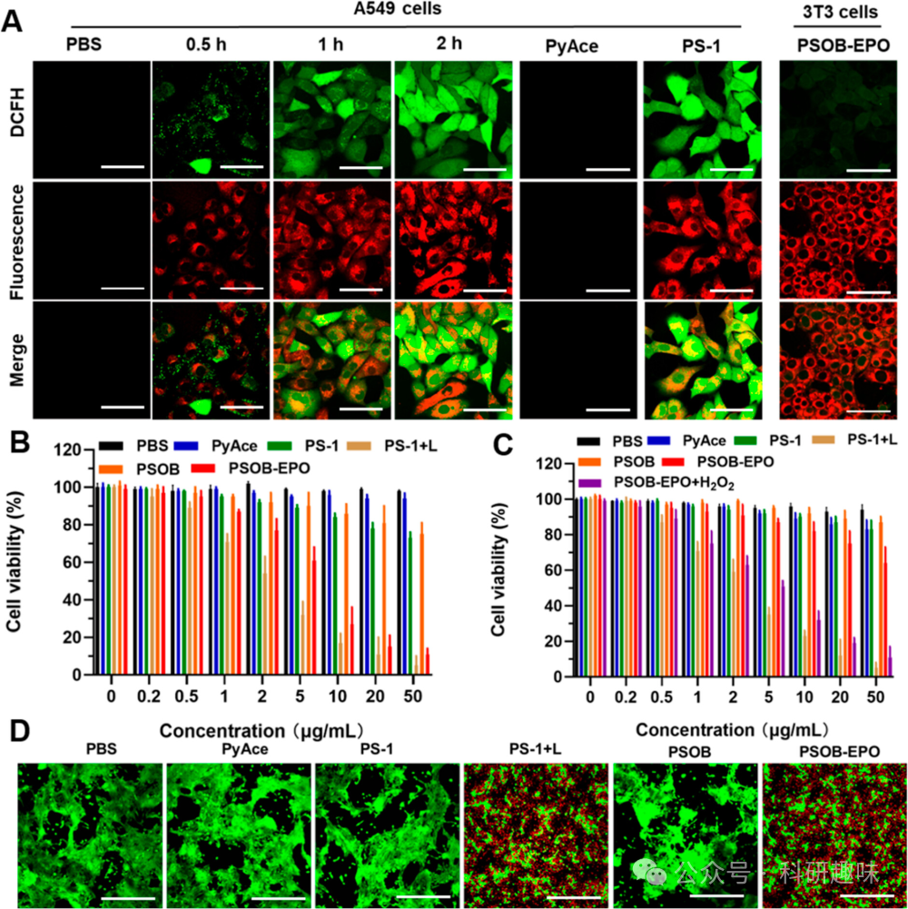
图 14. 细胞内 ROS 产生能力及细胞毒性
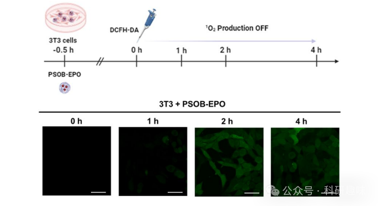
图 15. PSOB-EPO的ROS产生能力

为深入探究癌症治疗期间及治疗后的1O2释放行为，作者进一步将PSOB-EPO与A549细胞共培养。如图 16 所示，在第1组中，DCFH-DA在0小时时加入，随后观察到DCFH-DA的荧光强度在最初1小时内显著增强，这证实了A549细胞中1O2的生成处于"开启"状态。而在第2组中，DCFH-DA在1小时后加入，随后监测到的荧光强度在1和4小时时几乎可忽略，这表明在1-4小时内1O2的释放已停止，即PSOB-EPO在治疗后的1O2生成行为呈现"关闭"状态。PSOB的这种可切换1O2释放行为确保了其在正常细胞与肿瘤细胞之间的高度空间选择性，以及在治疗前、中、后阶段的时间选择性，从而极大减少了PSOB-EPO的潜在副作用。
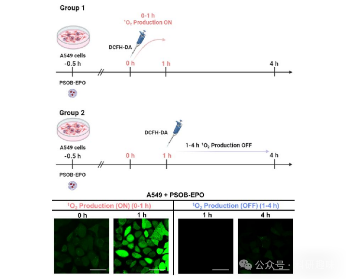
图 16. PSOB 在 A549 细胞系中的 ROS 产生能力

为评估PSOB-EPO在癌细胞消融方面的功效，作者对A549和3T3细胞进行了CCK-8细胞活力测试。如图 14B和C所示，无论是在黑暗条件下还是与PyAce (2)、PS-1 (10) 或 PSOB本身共培养，两种细胞类型的细胞活力均未受到显著影响，显示出良好的生物相容性。然而，在光照条件下，PSOB-EPO对A549癌细胞展现出了明显的细胞毒性，且在A549细胞的细胞活力（活/死）检测中也观察到了相似的细胞毒性现象（图 14E）。而其对3T3细胞的影响依旧微乎其微。这一结果强调了PSOB-EPO对肿瘤细胞的高度选择性。进一步地，当3T3细胞与PSOB-EPO和100 μM H2O2共同作用时，其细胞毒性水平与A549细胞中观察到的相当，这揭示了肿瘤微环境中存在的H2O2是激活PSOB-EPO的关键因素。
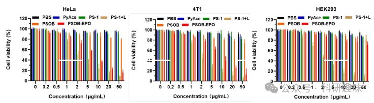
图 17. PSOB 在不同细胞系中的细胞毒性

此外，如图S27所示，作者在其他癌细胞系（HeLa细胞和4T1细胞）和正常细胞系（HEK293细胞）中进一步评估了PSOB-EPO的细胞毒性。结果表明，PSOB-EPO对多种癌细胞株均表现出强烈的细胞毒性，而对正常细胞的毒性微乎其微。这些发现突出了PSOB-EPO作为一种靶向性光动力疗法制剂的巨大潜力，它能够精准区分癌细胞与正常细胞，并选择性地发挥治疗效果。

**体内 PDT 疗效和副作用评估**

先前的实验已经验证了PSOB在体外展现出程序化的的"OFF-ON-OFF"活性氧物种（ROS）生成能力。接下来，作者深入探究了H₂O₂激活的光动力疗法（PDT）在携带皮下肿瘤小鼠模型中的治疗效果及其潜在的副作用。在本研究中，作者采用携带HeLa肿瘤的小鼠作为体内实验的模型（图 18A）。为了直观展现活体光导疗法的抗肿瘤效应，作者持续监测了治疗后21天内小鼠的肿瘤体积、重量和体重变化。实验设置了五组（G1-G5）小鼠，分别通过静脉注射接受不同的治疗方案：G1为生理盐水、G2为PS-1、G3为PSOB、G4为PS-1 + 光照、G5为PSOB-EPO。

首先，当肿瘤生长至大约80立方毫米时，作者对小鼠进行了相应的治疗。如图 18B-D和 18G、18I所示，G1、G2和G3组小鼠的肿瘤大小和重量在21天的观察期内呈现出相似的增长趋势，这表明PS-1和PSOB在缺乏光照的条件下，细胞毒性较低。
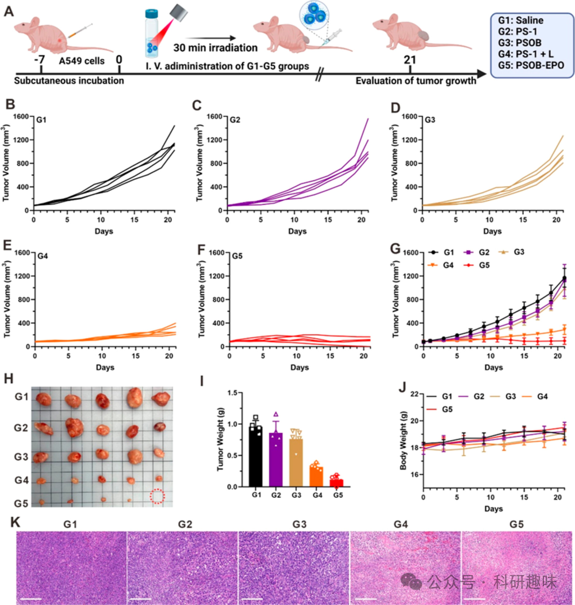
图 18. PSOB 对皮下瘤的治疗效果

与此相反，G4和G5组小鼠在接受治疗后，其肿瘤大小和重量均出现了显著的下降（图 18E, F, I）。这一结果表明，PSOB在缺氧的肿瘤细胞环境中被有效激活，并展现出了优异的光介导疗法效果。通过对G1-G5组小鼠的肿瘤组织进行H&E染色分析，作者进一步验证了这一观察结果（图 18K）。尽管PSOB在皮下肿瘤模型中表现出了显著的光导放疗效果，但肿瘤转移仍然是影响患者生存率的关键因素。鉴于转移性肿瘤通常具有位置深、缺氧等特点，给传统的光动力疗法带来了极大的挑战。为了全面评估PSOB在更复杂情况下的疗效，作者进一步采用了肺转移小鼠模型。如图 19A所示，作者通过尾静脉注射的方式向小鼠施用了各种配方（G1-G5：生理盐水、PS-1、PSOB、PS-1 + 光照和PSOB-EPO），并持续监测了肿瘤的生长情况。
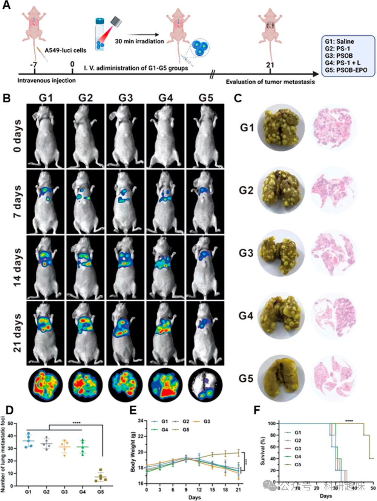
图 19. PSOB 对转移瘤的治疗效果

如图 19B, C所示，G1-G3组小鼠的肿瘤生长迅速，这可能是由于这些治疗方案未能有效产生ROS。此外，传统的II型光敏剂PS-1在光照射下（G4组）由于光的穿透深度和缺氧环境的影响，其治疗效果也受到了限制。相比之下，PSOB-EPO能够显著抑制肿瘤转移，在21天的观察期内，未观察到明显的肺转移结节。这种卓越的治疗效果归因于PSOB-EPO在不依赖氧气和光照的条件下产生1O2的能力。图 19D-F中的定量数据进一步证实了G5组小鼠在肿瘤抑制能力方面的显著优势，与G1-G4组相比，其肺转移灶的数量和存活率均有显著提高。同时，体重曲线表明PSOB-EPO的副作用较小。

为了进一步评估PSOB-EPO的生物安全性，作者采用天门冬氨酸氨基转移酶（AST）、丙氨酸氨基转移酶（ALT）和碱性磷酸酶（ALP）试剂盒对注射了不同配方的小鼠进行了肝功能检查。如图 20 所示，与对照组（注射PBS的小鼠，第1组）相比，注射SOB和PSOB的小鼠（第2组、第3组）的AST、ALT和ALP水平几乎没有变化，这表明SOB和PSOB在不携带1O2的情况下对肝脏的毒性较低。然而，注射"始终开启"的SOB-EPO的小鼠（第4组）的AST、ALT和ALP浓度出现了异常升高，这可能是由于治疗后持续的1O2泄漏造成的肝损伤。相比之下，注射PSOB-EPO的小鼠（第5组）在治疗后的AST、ALT和ALP水平变化微乎其微，这充分证明了PSOB-EPO的"OFF-ON-OFF"1O2控制释放行为在提高生物安全性方面的优势。
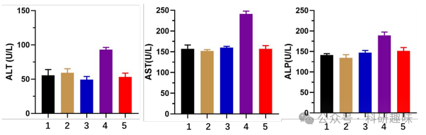
图 20. 小鼠的肝功能检查

**结论**

总之，PyAce作为一种基于吡啶酮的光敏氧化剂（PSOB），能够在无氧和无光条件下实现光导治疗，且治疗前后副作用微乎其微。通过精确调控长半衰期吡啶酮与短半衰期吡啶结构之间的TME响应切换，实现了单线态氧（1O2）的可控释放。以PyAce为1O2受体的PSOB在皮下肿瘤模型中展现出了优异的肿瘤消融性能。尤为重要的是，PSOB在维持产生活性氧（ROS）能力的同时，在深部肺转移瘤等复杂环境中也展现了卓越的治疗效果。

相较于传统光敏剂（SOB），PSOB的显著进步在于其独特的“OFF-ON-OFF”型1O2生成能力，这与传统SOB系统持续释放的“始终开启”模式形成鲜明对比。这种选择性控制确保了PSOB在治疗前、中、后均不会在正常组织中失活，仅在肿瘤细胞内迅速激活，从而实现了治疗效果与生物安全性的双重优化。因此，PSOB为克服传统SOB系统的局限性提供了新的策略，显著提高了光动力疗法的生物安全性，并拓宽了其治疗范围，不受氧气供应和光照射条件的限制，成为深部肿瘤治疗的理想选择。

然而，基于PyAce的PSOB系统仍面临一些挑战，如治疗前EPO半衰期较短和对过氧化氢（H2O2）释放反应较慢等。在未来的工作中，作者将致力于解决这些局限，以进一步优化PSOB系统的性能。

Tian, J.; Li, B.; Wu, C.; Li, Z.; Tang, H.; Song, W.; Qi, G.-B.; Tang, Y.; Ping, Y.; Liu, B. Programmable Singlet Oxygen Battery for Automated Photodynamic Therapy Enabled by Pyridone–Pyridine Tautomer Engineering. J. Am. Chem. Soc. 2024, jacs.4c02500. https://doi.org/10.1021/jacs.4c02500.

**关注并回复文章DOI获取全文：**

10.1021/jacs.4c02500

**点击蓝字 关注我们**

预览时标签不可点

素材来源官方媒体/网络新闻

 [阅读原文](javascript:;) 

  继续滑动看下一个 

 轻触阅读原文 

    

