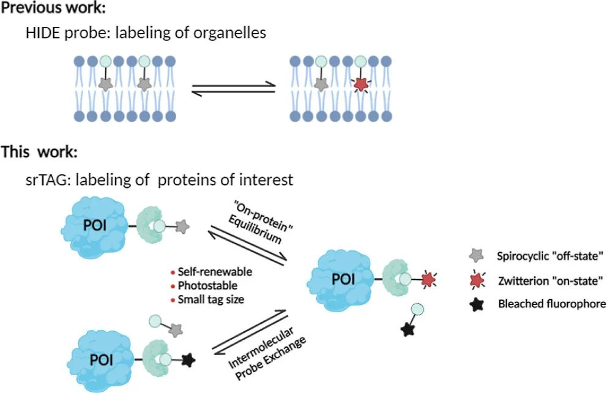
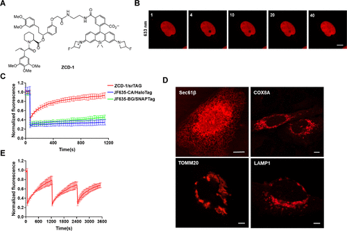
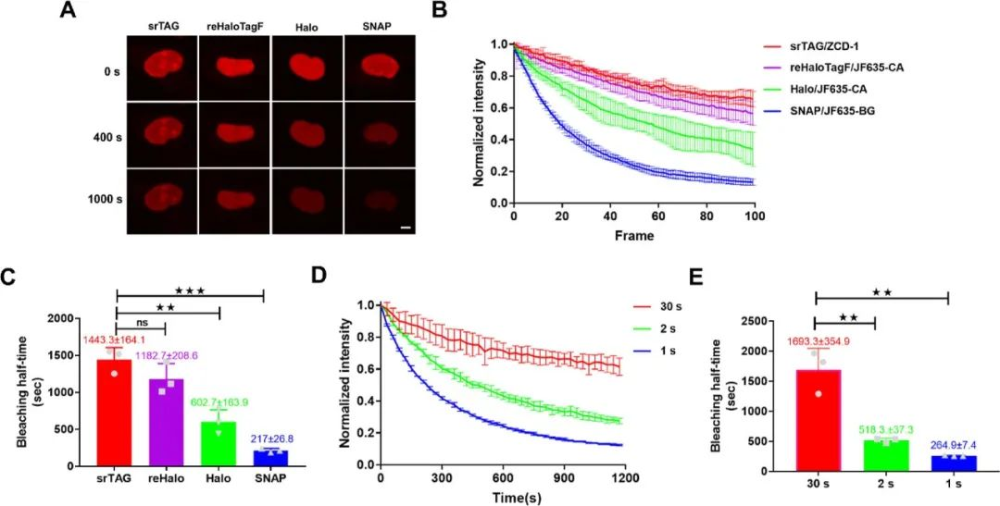
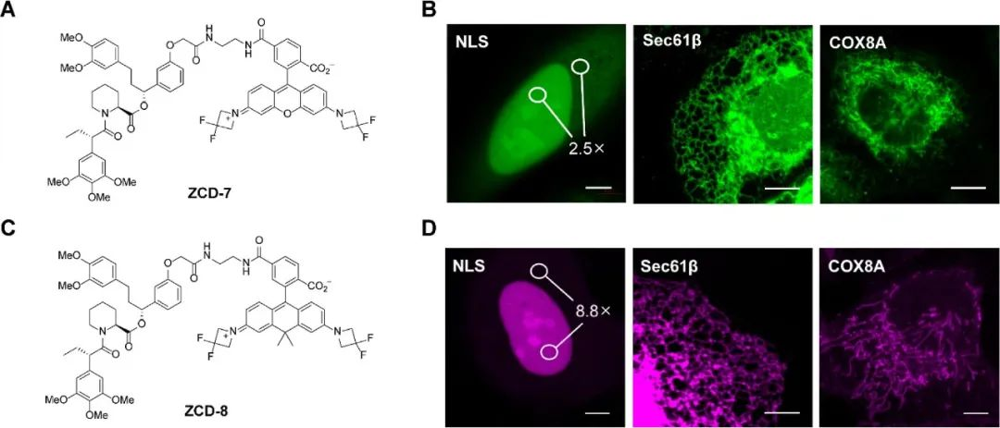
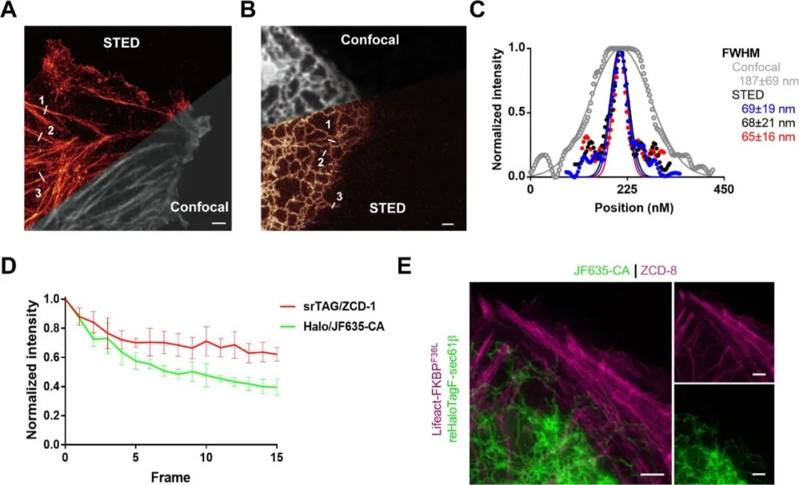
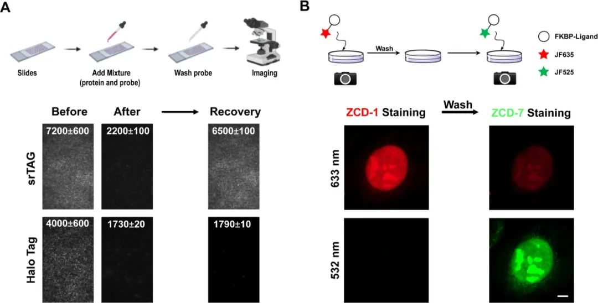

 

#  【JACS】[清华大学储凌课题组]荧光成像新选择，自恢复蛋白标签 
 

Protein Tag

蛋白标签

这篇文章介绍了一种新型的自我更新标签（srTAG），用于蛋白质的荧光成像。这种标签具有自我修复的能力，可以在光漂白后自我恢复荧光，从而实现更长时间的成像。此外，这种标签还具有与不同光谱特性兼容的优点，可以用于不同细胞环境或生物体中的蛋白质成像。该研究为生物成像领域的发展提供了新的思路和方法。

①

【初探】

首先，作者探讨了 HIDE 探针的概念是否可以扩展到蛋白质标签。他们推测，如果硅基罗丹明的“开/关”平衡在荧光探针与蛋白质标签结合时仍然存在，那么光漂白将使“开/关”平衡向氨基酸离子“开启”方向转移。为了验证这一假设，作者将携带Halo-mEmerald-NLS或SNAP-mEmerald-NLS的质粒转染到U2OS细胞中，固定后，与JF635-CA或JF635-BG一同孵育,结果，作者没有观察到这两种标记的荧光信号恢复，作者推测，具有不同表面性质的蛋白质可能会影响染料 "开/关 "平衡的动力学，从而改变 "蛋白质 "荧光团的 "开/关 "切换。于是，作者考虑使用分子量相对较小的小分子，于是选取了AP1867 分子作为研究对象，因为AP1867能优先地与FK506 结合蛋白（FKBP）F36V 突变体结合，而不是野生型 FKBP12。首先，作者将荧光剂 JF635 与 AP1867 偶联合成了 ZCD-1（图 1A），并用U2OS细胞进行了 FRAP 实验。令人欣慰的是，用 ZCD-1 孵育并对细胞核中的 ROI 进行光漂白后，荧光信号恢复到初始荧光强度的 65%，恢复半衰期为 175.8 ± 34.7 s。当ZCD-1与表达FKBPF36L突变体标记的U2OS细胞一起孵育时，最大恢复比提高到85%，恢复半衰期为199.3 ± 23.5秒（图2B、C），这些结果表明，将染料与Ariad配体结合不会显著影响它们与FKBP突变体的结合亲和力。为了进一步证明srTAG自我恢复荧光的能力，作者进行了三重光漂白实验。而即使在第三次光漂白后，被漂白的荧光信号仍然可以恢复到初始荧光强度的63%（图2E）。而这种新标签可以广泛应用于标记细胞内的蛋白（图2D）。

图1.srTAG 在光漂白后会自发恢复荧光信号。(A) ZCD-1 的化学结构。(B) 在 U2OS 细胞中，光漂白后的荧光恢复（30 秒/帧，共 40 帧）。(C）用 JF635-CA/Halo、JF635-BG/SNAP 和 ZCD-1/FKBPF36V 标记的 U2OS 细胞的归一化荧光强度随时间变化图 。(D) U2OS 细胞中ER 定位的 Sec61β、线粒体内膜定位的 COX8A、线粒体外膜定位的 TOMM20 和溶酶体定位的 LAMP1 的共聚焦图像。(E）三重漂白实验中 srTAG 随时间变化的归一化荧光强度曲线图。

②

【验证】

为评估探针的光稳定性，作者以每帧10秒的速度进行延时共聚焦成像，并测量100帧细胞核的荧光强度。令人满意的是，与reHaloTagF相比，srTAG 表现出相似的光稳定性，但与HaloTag相比，srTAG的漂白半衰期改善了约2.4倍，与SNAP标签相比改善了约6.7倍（图2A–C）。ER标记物Sec61β的成像进一步证明了srTAG优越的光稳定性，与Sec61β-Halo相比，在共聚焦显微镜下成像时，使用Sec61β-srTAG标记的ER显示出约2.7倍的延长漂白半衰期。此外，对ZCD-1的光稳定性在不同的成像频率下进行了评估，正如基于平衡的荧光恢复机制所预期的那样，在较高的采集频率下进行共聚焦成像会缩短 srTAG 的漂白半衰期（图 2D, E）。

图2.srTAG 可实现长延时荧光成像。(A) U2OS 细胞核的时程图像。(B) 不同活细胞核成像的归一化荧光强度随时间变化图。(C) 根据（B）中光漂白曲线的单指数拟合计算的漂白半衰期。(D）不同成像频率下 srTAG 的归一化荧光强度随时间变化图。(E）根据（D）中光漂白曲线的单指数拟合计算的漂白半衰期。

为了测试ZCD-1的“蛋白内”平衡是否是普遍现象，作者合成了ZCD-7和ZCD-8并进行了相同的FRAP实验（图3A,C）。令人满意的是，无论ZCD-7还是ZCD-8都能在光漂白后恢复荧光，ZCD-7具有较快的恢复速率，半衰期为26.5 ± 1.0秒，而ZCD-8的恢复速率与ZCD-1相当，半衰期为141.9 ± 14.1秒。作者还在共聚焦成像条件下对表达FKBPF36L融合核、内质网和线粒体的U2OS细胞进行了活细胞成像（图3B、D）。

图3. 使用带有不同光谱特性荧光团的 srTAG 进行活细胞成像。(A) ZCD-7 的化学结构。(B) U2OS 细胞中细胞核定位的 NLS、ER 定位的 Sec61β 和线粒体定位的 COX8A 的共聚焦图像。(C) ZCD-8 的化学结构。(D) U2OS 细胞中细胞核定位的 NLS、ER 定位的 Sec61β 和线粒体定位的 COX8A 的共聚焦图像。

③

【超分辨荧光成像与机理】

为了展示srTAG在超分辨率显微镜下的应用价值，作者在U2OS细胞中进行了活细胞STED成像（图4A、B）。作者获得了具有半峰全宽（FWHM）分别为67 ± 16、73 ± 20和72 ± 18纳米的F-actin和具有FWHM为69 ± 19、68 ± 21和65 ± 16纳米的ER管的STED图像（图4A–C），证明了srTAG与超分辨率成像实验的兼容性。活细胞STED ER的时间序列成像展示了srTAG的卓越光稳定性（图4D）。通过JF635-CA和ZCD-8标记的reHaloTagF-Sec61β和Lifeact-FKBPF36L的双色STED成像示例，显示了srTAG与其他可交换标签的兼容性，可用于进行多色成像实验（图4E）。

图4. srTAG 在活细胞蛋白质特异性成像中的应用。(A) 表达 Lifeact-FKBPF36L 的 U2OS 活细胞中 ZCD-1 的共焦和 STED 成像。(B) U2OS 细胞中ER定位的 Sec61β 的共焦和 STED 图像。(C）STED 和共聚焦图像中的荧光信号与（B）中线段位置的函数关系图。(D）带有不同自标记标签的ER活细胞STED成像的归一化荧光强度随时间变化图

荧光信号的恢复可能是由于荧光分子在蛋白质上的“开启/关闭”平衡或非共价探针的可交换性质。为了阐明这一机制，作者纯化了重组FKBPF36L蛋白并将FKBPF36L/ZCD-1复合物固定在玻片上。通过全内反射荧光显微镜（TIRF）监测FRAP实验。结果作者一直观察到在无游离扩散的ZCD-1的情况下荧光恢复，证实了荧光分子在蛋白质上的“开启/关闭”平衡有助于荧光恢复。作为对照，纯化的Halo/JF635-CA复合物在光漂白后没有恢复荧光信号（图5A）。另一方面，为了调查探针交换是否也有助于FRAP现象，作者首先将表达NLS-FKBPF36L的U2OS细胞与ZCD-1一起孵育，然后用含有ZCD-7的培养基替换培养基。如图5B所示，ZCD-1探针被ZCD-7替换，532 nm通道中出现荧光信号，633 nm通道中信号减弱。此外，我们在无洗涤或洗去探针的条件下比较了srTAG的光稳定性。与用不含探针的PBS替换培养基的“洗去”组相比，“无洗涤”组表现出更高的光稳定性。这些实验表明，探针交换也有助于观察到的FRAP现象和改善的光稳定性。

图5. srTAG 的 "开-蛋白""开/关 "平衡和可交换性的机理研究。(A) 生物素化的 FKBPF36L 或 HaloTag7 蛋白分别与 ZCD-1（1 μM）或 JF635-CA（500 nM）孵育，并固定在涂有链霉亲和素的盖玻片上。用 PBS 缓冲液（25 °C）广泛清洗固定的蛋白质-染料混合物，以去除未固定的蛋白质和染料分子。将盖玻片安装到 TIRF 显微镜上进行 FRAP 成像，在光漂白 3 分钟前后和恢复 10 分钟后拍摄荧光图像。共进行了三次重复，所有重复都表现出类似的行为。此处显示的是一组典型图像。(B) srTAG 在固定的 U2OS 细胞中的颜色转换。用 4% PFA 溶液固定表达 NLS-FKBPF36L 的细胞，并用 0.5% Triton X-100 进行渗透。首先用 10 μM ZCD-1（Ex:633 nm）标记，然后用 PBS 冲洗三次，再用 10 μM ZCD-7（Ex:532 nm）标记。图片为两个独立实验的代表。标尺：5 μm：5 μm。

④

【结论】

作者报告了一种开发用于蛋白质成像的光稳定性 srTAG 的新策略。与常用的共价自标记相比，srTAG 具有更优越的光稳定性。srTAG 适用于标记不同的蛋白质，并适合具有不同光谱特性的荧光团。此外，与其他自标记标签或荧光蛋白相比，srTAG 的尺寸较小（12 kDa），在活细胞成像实验中不易干扰蛋白质的运输和分布。

Du, Z.; Wang, W.; Luo, S.; Zhang, L.; Yuan, S.; Hei, Y.; Bao, Z.; Chen, C.; Lin, Y.; Chu, L. Self-Renewable Tag for Photostable Fluorescence Imaging of Proteins. J. Am. Chem. Soc. 2023, jacs.3c06102. https://doi.org/10.1021/jacs.3c06102.

**关注公众号并回复**

**10.1021/jacs.3c06102**

**可获得原文下载链接**

[科技资讯0816](http://mp.weixin.qq.com/s?__biz=MzkzOTI1OTMwNg==&amp;mid=2247484007&amp;idx=1&amp;sn=d2453d87f7b3a44246e22666be6e9a3c&amp;chksm=c2f2e6a2f5856fb4e87f9d21aecfbbd1664c2d855513c99feea65756102ef92294e5dd91b570&amp;scene=21#wechat_redirect)

[【Adv. Mater. 】绕过分子设计，通过聚集实现光热转化效率的调控](http://mp.weixin.qq.com/s?__biz=MzkzOTI1OTMwNg==&amp;mid=2247483961&amp;idx=1&amp;sn=682fd9f68483e96a522dea5745440a58&amp;chksm=c2f2e6fcf5856feaa588b1e56bc6afc7c84a4f4290a9d24ebc1d8e592f6db955eb5f49ad4d65&amp;scene=21#wechat_redirect)

[Nature Chemistry:聚集增强的亲金属作用的纳米光敏药物](http://mp.weixin.qq.com/s?__biz=MzkzOTI1OTMwNg==&amp;mid=2247483910&amp;idx=1&amp;sn=994ab76a56b8b8e2cb2ec77a9ac878c8&amp;chksm=c2f2e6c3f5856fd5775acc3e6fac5912dfc75de533bbdfe072ca265df7dfa63f5ebc2988dcb3&amp;scene=21#wechat_redirect)

预览时标签不可点

  继续滑动看下一个 

 轻触阅读原文 

    

