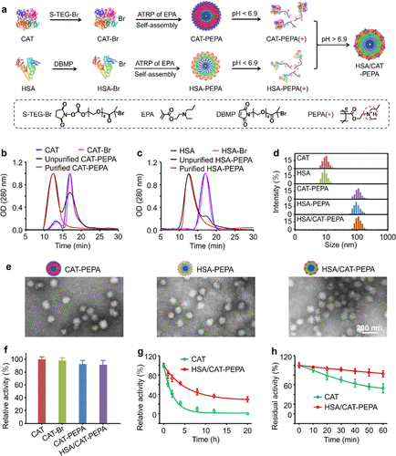
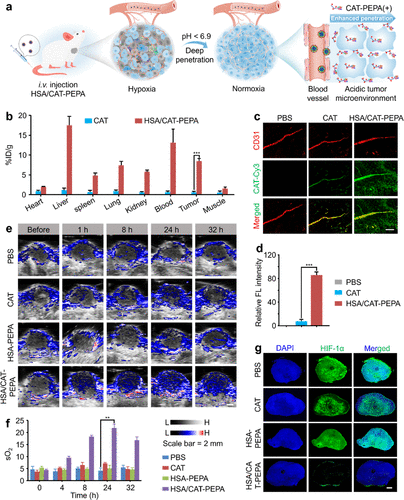
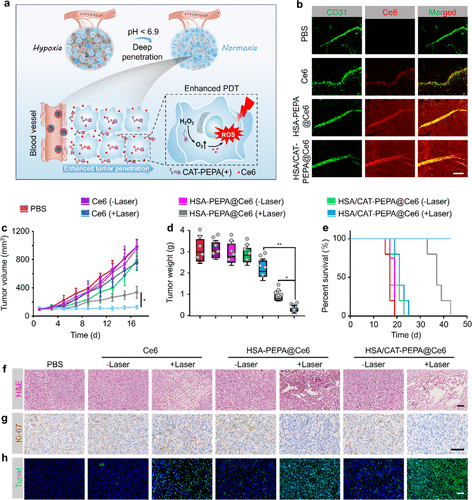

 

#  【JACS】肿瘤缺氧与治疗耐药的突破性进展 ——基于超酸敏感蛋白纳米药物的研究 
 

Grenemal

读完需要

3

全文字数 900 字

**引言**

肿瘤缺氧是指肿瘤组织内存在低氧区域,是导致肿瘤对放疗、光动力疗法、化疗和免疫疗法产生耐药性的关键因素之一。长期以来,如何有效逆转肿瘤缺氧状态成为肿瘤治疗领域的一大难题。最新研究为克服这一瓶颈提供了一条新思路——开发超酸敏感蛋白纳米药物,精准靶向肿瘤酸性微环境,在肿瘤细胞内释放催化还原剂,产生足够的氧气来缓解缺氧。

图 1. 超酸敏感蛋白纳米药物的制备及表征

**新型纳米药物HSA/CAT-PEPA及其作用机理**

该项研究提出了一种通用的自组装策略,构建名为HSA/CAT-PEPA的纳米药物。其中:

1)过氧化氢酶(CAT)是关键的催化剂,能高效将肿瘤细胞内过量H2O2转化为O2,产生足够的氧气缓解缺氧。

2)人血清白蛋白(HSA)能降低纳米颗粒的免疫原性,延长体内循环时间。

3)聚合物PEPA赋予纳米颗粒超强的酸敏感性,使其在中性环境稳定,但能在肿瘤酸性环境下快速解离成带正电荷的单体。

工作机理为:HSA/CAT-PEPA纳米药物在血液中循环稳定。一旦抵达肿瘤酸性区域,就会迅速解离,带正电荷的单体借助静电吸引力深入渗透至肿瘤细胞内。在细胞内部,CAT催化剂得以释放,高效产生O2,从而有效逆转缺氧状态。

图 2. HSA/CAT-PEPA 纳米微胞可有效积聚并穿透肿瘤组织，逆转肿瘤缺氧

**提高光动力疗法的抗肿瘤疗效**

基于上述优异的缺氧逆转能力,研究人员进一步将光敏剂Ce6装载到HSA/CAT-PEPA纳米粒子中,构建HSA/CAT-PEPA@Ce6复合纳米药物。这一策略令其在肿瘤组织内不仅能产生足够的氧气,还能在光照条件下利用光敏剂产生更多的活性氧,协同杀伤肿瘤细胞。

动物实验结果显示,相比单独使用Ce6,HSA/CAT-PEPA@Ce6纳米药物明显提高了光动力疗法的抗肿瘤疗效。给予光照后,小鼠肿瘤生长受到显著抑制,存活期延长,且未发现明显的系统毒性。这一发现为克服光动力疗法面临的低氧耐药问题提供了有力解决方案。
HSA/CAT-PEPA@Ce6 的肿瘤蓄积、穿透和抗肿瘤疗效的改善

**研究展望与意义**

该项研究不仅为逆转肿瘤缺氧提供了行之有效的纳米医疗手段,更为蛋白质纳米药物的设计开辟了新路径。研究人员指出,该自组装策略有望适用于其他蛋白质,促进更多超酸敏蛋白纳米药物的问世,用于增强肿瘤多模态治疗等领域。

总的来说,这一突破为克服肿瘤缺氧障碍、提高光动力、放射线及化疗敏感性提供了全新途径,也为肿瘤纳米医疗带来了前景可期的新思路。我们有理由相信,在不久的将来,缺氧状态将不再是阻碍肿瘤治疗的绊脚石,患者的治疗前景将因此而越来越光明。

J. Am. Chem. Soc. 2024, 146, 11, 7543–7554

**关注并回复文章DOI获取全文：**

10.1021/jacs.3c13501

**点击蓝字 关注我们**

预览时标签不可点

素材来源官方媒体/网络新闻

 [阅读原文](javascript:;) 

  继续滑动看下一个 

 轻触阅读原文 

   

