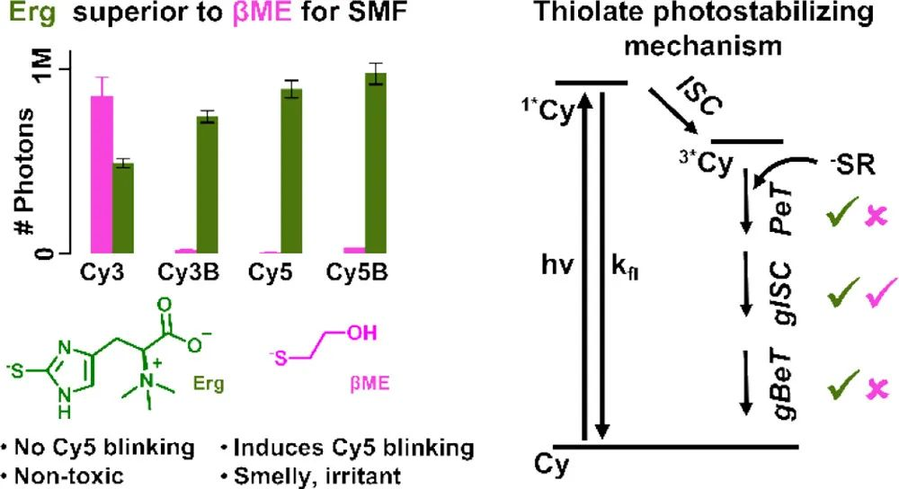
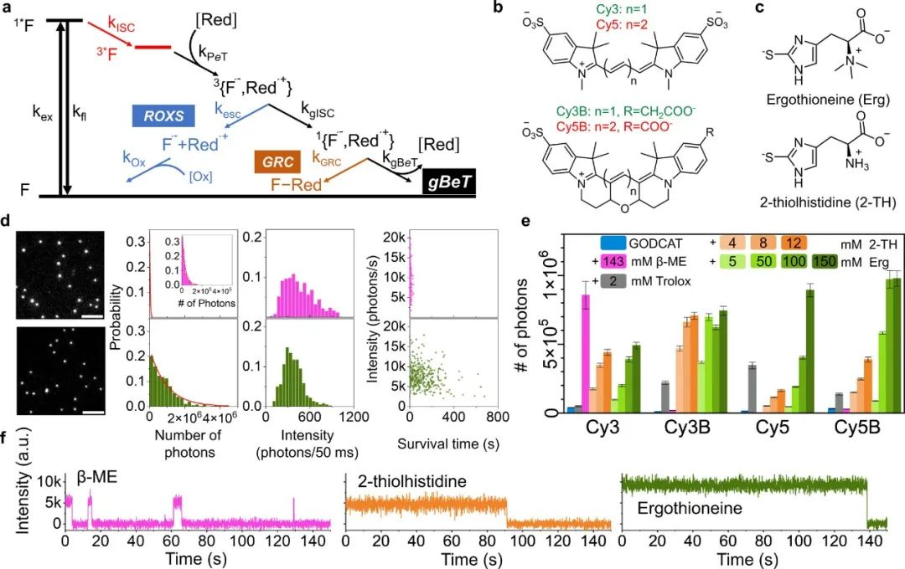
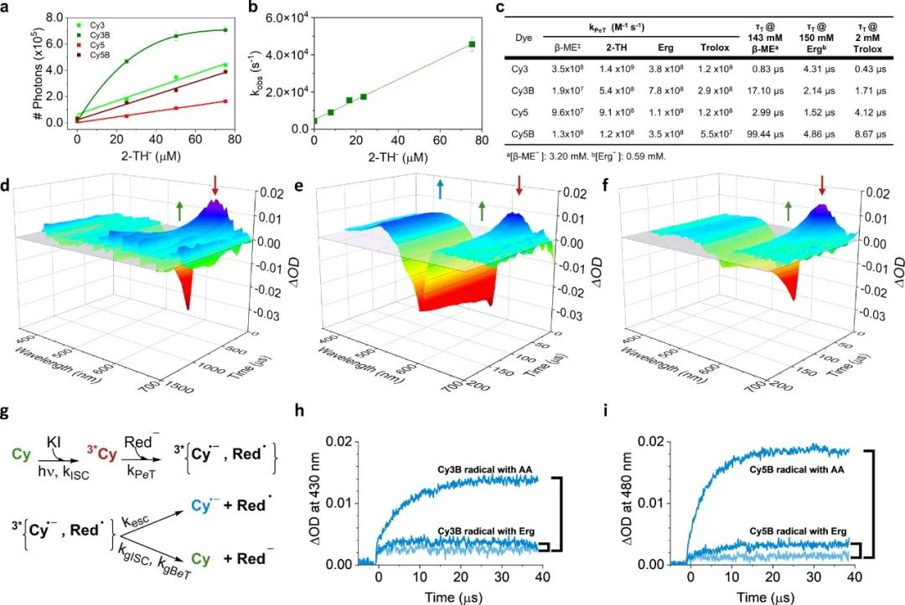

 

#  【JACS】荧光探针容易光漂白？这篇两张图的顶刊教你提高光稳定性 
 
 原创

Photobleaching

光漂白

本研究的单分子荧光成像结果显示,天然氨基酸麦角硫因可显著提高Cy3、Cy3B、Cy5和Cy5B的光稳定性,相比常用的烷基硫醇β-ME,其荧光光子产量提高了1-2个数量级。与Trolox相比,麦角硫因对所有四种荧光染料的效果也有改善。大量的激光诱导光解实验研究了机制,证明硫代咪唑抗氧化剂麦角硫因是一种生物相容的解决方案,可光稳定最常用的氰基荧光染料,满足荧光成像的要求。

**初筛**

作者利用单分子荧光技术测试了抗氧化剂硫代咪唑氨基酸对常用氰基荧光染料Cy3、Cy3B、Cy5和Cy5B的光稳定性。通过生物素-肽链亲和力,将标记不同染料的单链DNA固定在钝化玻璃表面,在全反射荧光显微镜下记录单分子荧光轨迹。所有实验在缺氧条件下进行,使用葡萄糖氧化酶系统除氧,以不同浓度的硫代咪唑氨基酸作为光稳定剂。

单分子荧光结果表明,随2-TH和麦角硫因浓度升高,四种荧光染料的检测荧光光子数均增加。与β-ME相比,Cy5B、Cy3B和Cy5的光稳定效果最明显,在150mM麦角硫因条件下,平均荧光光子数分别提高了约35、40和300倍。麦角硫因可使Cy5和Cy5B轻松达到平均100万光子,较β-ME有很大改进。重要的是,在2-TH和麦角硫因条件下,信号稳定,没有快速闪烁或暗期,不同于Cy5和β-ME的组合。考虑到首次快速闪烁前的荧光光子数,报道的Cy5提高了300倍,若计算全部β-ME条件下的Cy5荧光,估计总体改进仍达12倍。

图 1.评估抗氧化剂硫代咪唑氨基酸的光稳定性和信号稳定性 (a) 与荧光团性能相关的光物理和光化学途径。黑色为荧光团光稳定性的理想结果。ISC（红色）是不希望出现的结果，PeT 可将荧光团从激发的三重态中解救出来，在三重态流形中产生一个宝石自由基对，在此 ISC 到单重态流形（希望出现的结果，黑色）与自由基逃逸（需要反氧化剂 ROXS，蓝色）发生竞争。接下来，宝石自由基对进行反向电子转移 gBeT（所需，黑色），再生出基态荧光体，与宝石自由基结合（GRC）途径（与超分辨率中的闪烁有关，棕色）竞争。(b) 本研究中探讨的氰基染料的化学结构。(c) 光稳定剂麦角硫因和 2-硫醇组氨酸的化学结构。(d) 用 143 mM β-ME（顶部，紫红色）和 150 mM 麦角硫因（底部，绿色）对 ssDNA-Cy5B 进行单分子荧光团评估。第一列：4 倍放大的 TIRF 图像（82 μm × 82 μm），记录了数百个附着在生物素化 DNA 上的青色染料分子，比例尺为 5 μm。第二列：相应的光子总数直方图（光稳定性的标志）。第三列：每帧强度（信号稳定性的标志）。第四栏：每秒发射的光子数与存活时间的相关性。(e) 光稳定剂浓度增加时四种荧光团检测到的平均光子数。光子数和误差条是通过各自的直方图和单指数衰减拟合得到的，见参考文献。图中还显示了 β-ME（紫红色）、Trolox（灰色）和不含还原剂的 GODCAT（蓝色）的结果。(f) Cy5 的单分子轨迹：β-ME（143 mM，左图）可观察到闪烁，但 2-硫醇组氨酸（12 mM，中图）或麦角硫因（150 mM，右图）则观察不到。

**溶液测试**

光稳定效应对红色染料Cy5和Cy5B影响最明显。根据2-TH和麦角硫因的pKa,它们作为抗氧化剂检测到的平均荧光光子数与相应硫酸盐浓度呈线性相关。这两种化合物的性能相似,与其类似的结构一致。相比之下,对于Cy3B,平均荧光光子数随硫酸盐浓度快速趋于稳定。对于Cy3,虽然平均荧光光子数仍与硫醇酸盐浓度相关,但2-TH的效果更明显。对这两种抗氧化剂,Cy3的平均荧光光子数只达到β-ME的50%。

为深入理解2-TH和麦角硫因明显提高Cy5、Cy5B和Cy3B性能的机制,并进一步解析Cy3的行为,我们进行了纳秒瞬态吸收研究。实验在与单分子实验相同的缓冲液和除氧条件下,使用游离染料的羧酸或NHS酯形式进行。随硫代咪唑抗氧化剂浓度升高,四种染料激发态三重态的衰减速率线性增加,结果显示,2-TH和麦角硫因的kPeT值明显高于β-ME,与其在单分子水平上的光稳定性相关。对Cy5B、Cy5和Cy3B,麦角硫因的kPeT值也比Trolox高2-10倍。随抗氧化剂浓度增加,三重态寿命缩短,单分子水平荧光光子数线性增加,两者相关。未添加抗氧化剂时三重态寿命约200微秒,添加150mM麦角硫因降至2-4微秒。随抗氧化剂浓度继续提高,三重态寿命进一步缩短,光子数继续增加。但是只有Cy3B的光子数随抗氧化剂浓度升高趋于稳定,表明其光降解不完全依赖激发态三重态。

最后,为监测自旋禁阻跃迁与自由基逸出之间的竞争情况,我们估算了自由基逸出的百分数。在AA条件下出现新的长寿命氰基吸收带表示自由基逸出,同时基态恢复缓慢。而在2-TH条件下四种染料均未见此吸收,自由基逸出可忽略。此外,AA条件下基态漂白呈双指数衰减,其中短寿命部分对应自旋轨道耦合后自由基再结合,长寿命部分对应自由基转化为阴离子。因此,2-TH可有效抑制自由基逸出,促进自旋禁阻跃迁。

图 2.通过纳秒 LFP 进行的集合机理研究。(a) 通过单分子分析得出的青色染料的平均光子数与 2-TH 浓度（硫醇形式）的关系。除 Cy3B 外，其他所有染料的线性拟合均以直线表示。(b) Cy3B 受激三重态衰变速率常数（kobs）与 2-TH 硫代硫酸盐浓度的关系。(c) β-ME（‡ 报告于参考文献 (23)）、2-TH、麦角硫因或 Trolox 对四种氰基染料研究得出的 kPeT 值，以及在任一淬灭剂的最大实验浓度下的估计三重态寿命。硫醇基淬灭剂的活性形式（硫酸盐）是通过计算得到的。(d-f）Cy3B 的瞬时吸收（ΔOD）光谱，从左到右依次为无三重猝灭剂、AA [0.19 mM] 和 2-TH [12 mM]。蓝色（430 nm）、绿色（550 nm）和酒红色（630 nm）箭头分别表示氰基吸收、基态漂白和激发的三重态吸收区域。无三重态淬灭剂的 Cy3B 的三重态吸收在 ∼1 毫秒和初始衰减后明显增加（e 面板），这是在本实验中长时间探查监测光束不稳定性的结果。(g) PeT 与氰基染料激发的三重态、自由基逸出（伴随吸收）与二价 ISC 和 BeT（无吸收）的反应方案。(h) AA [1.71 mM] 或麦角硫因 [100 mM] PeT 到 Cy3B 激发三重态时形成的 Cy3B 自由基增长的瞬态吸收时间轨迹。图中还显示了没有淬灭剂时的瞬态吸收带（浅蓝色），说明直接激发时存在残余吸收。(i) 在 AA [11.74 mM]、麦角硫因[100 mM]和无三重淬灭剂（浅蓝色）的情况下，显示了 Cy5B 的相应瞬态吸收时间轨迹。

**结论**

作者证明硫代咪唑抗氧化氨基酸是单分子光谱研究中理想的光稳定剂。与常用的β-ME相比,2-TH和麦角硫因向氰基染料激发态三重态的光诱导电子转移速率常数更大,这是其优势。因此,β-ME只能淬灭Cy3的三重态,而2-TH和麦角硫因可有效淬灭所有四种氰基染料的三重态。这些改进还源自对发生的高效自旋禁阻跃迁和反向电子转移。

Gidi, Y.; Ramos-Sanchez, J.; Lovell, T. C.; Glembockyte, V.; Cheah, I. K.; Schnermann, M. J.; Halliwell, B.; Cosa, G. Superior Photoprotection of Cyanine Dyes with Thio-Imidazole Amino Acids. J. Am. Chem. Soc. 2023, jacs.3c03058. https://doi.org/10.1021/jacs.3c03058.

**关注公众号并回复**

**10.1021/jacs.3c03058**

**可获得原文下载链接**

[9月04日-聚焦聚集诱导发光](http://mp.weixin.qq.com/s?__biz=MzkzOTI1OTMwNg==&amp;mid=2247484118&amp;idx=1&amp;sn=0cd07c46f45b55ed0cafca9c03f2e960&amp;chksm=c2f2e613f5856f05834ce1926b8cb1e0edabad0468ae750fcce230250483b71f9cd0ff8ff905&amp;scene=21#wechat_redirect)

[8月31日-聚焦聚集诱导发光](http://mp.weixin.qq.com/s?__biz=MzkzOTI1OTMwNg==&amp;mid=2247484109&amp;idx=1&amp;sn=064370484579c9779ba32a9eabffddcb&amp;chksm=c2f2e608f5856f1efe79747aeb2037d137ae9032b258dedd02afea3608acb712bb381f009db1&amp;scene=21#wechat_redirect)

[8月28日-聚焦聚集诱导发光](http://mp.weixin.qq.com/s?__biz=MzkzOTI1OTMwNg==&amp;mid=2247484076&amp;idx=1&amp;sn=7274a167f553fcdbbf0fec601b2c144c&amp;chksm=c2f2e669f5856f7ff543e0996cffcd4aa87d992e881c37f0562993dc8bc75bceee6a77d61b83&amp;scene=21#wechat_redirect)

预览时标签不可点

  继续滑动看下一个 

 轻触阅读原文 

    

