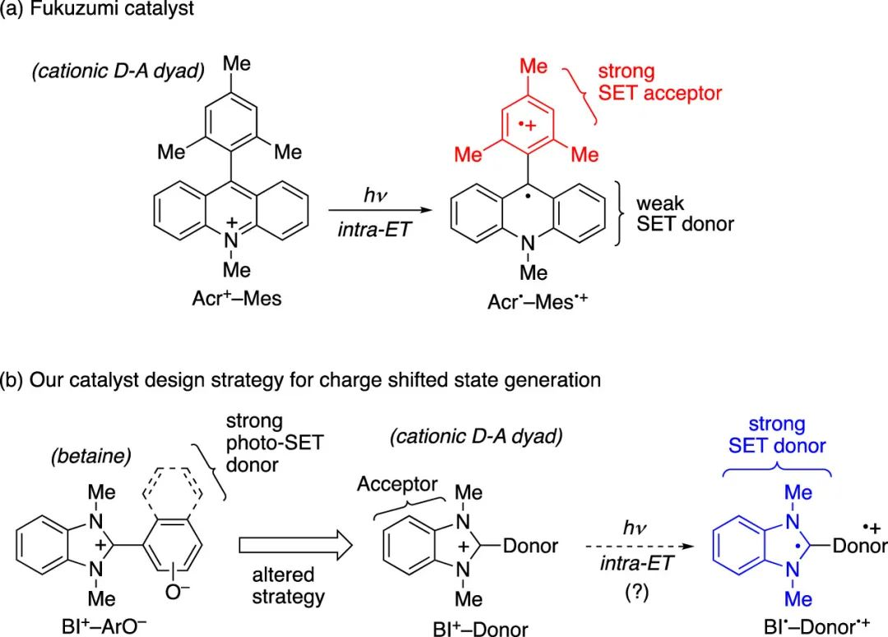
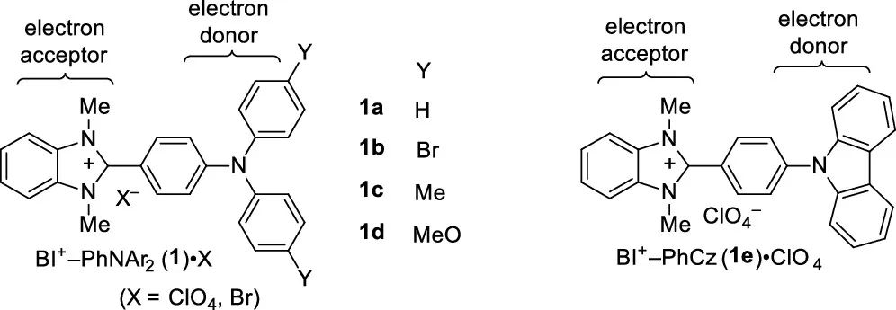
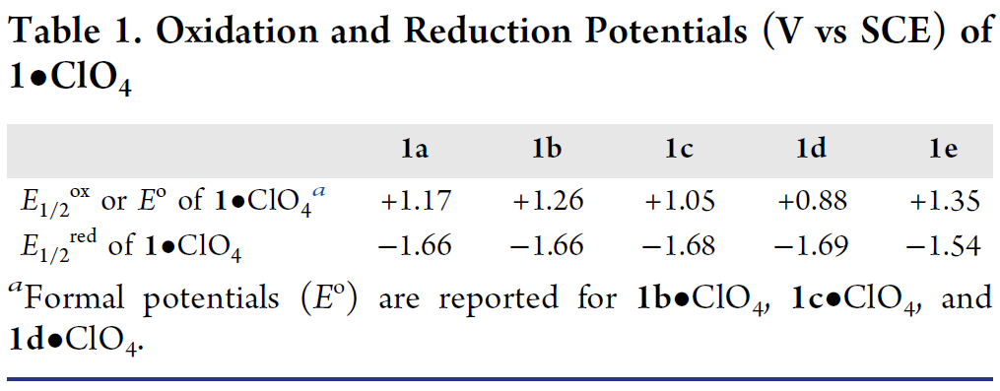
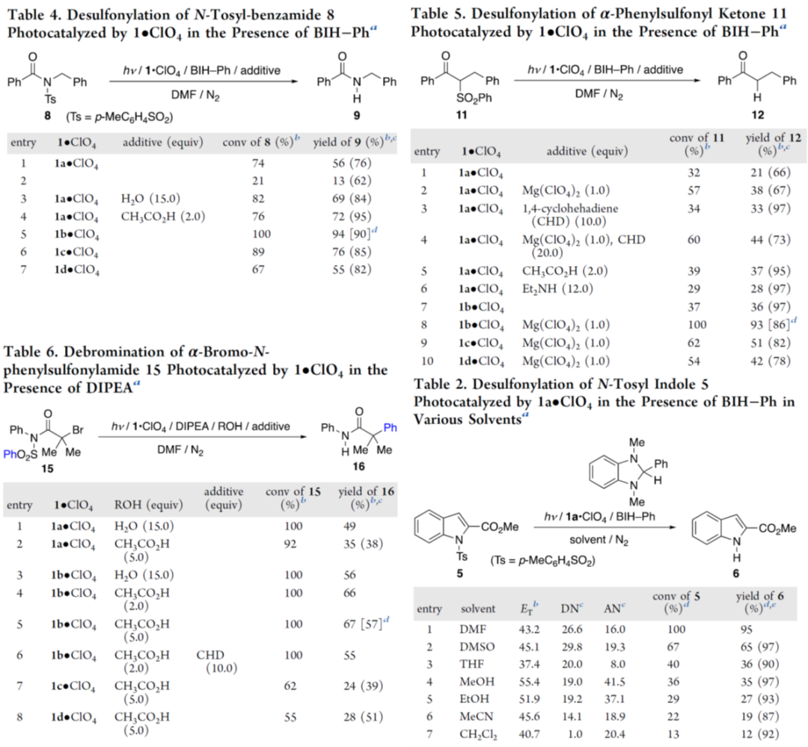
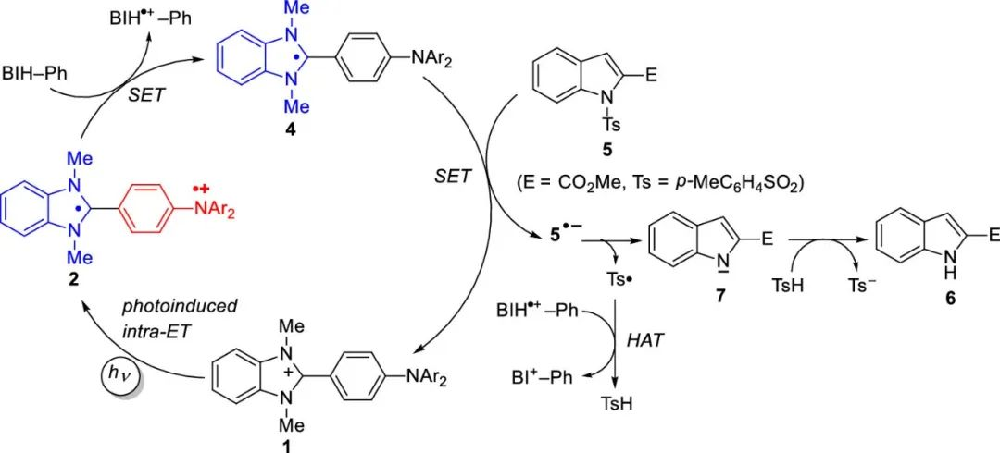

 

#  JACS:荧光材料何必只做成像 
 

Photocatalysts

光催化剂

电子供体和受体之间的单电子转移（SET）是化学和生物系统中的最基本过程之一，而如果诱发这一过程的刺激源是光，那么这个过程便被称为光诱导电子转移（PET）。过去十多年的研究证实了PET过程可以用于有机合成，也发展许多有机电子受体光催化剂，如氰基芳烃、芳香族酮类、醌类和阳离子盐类，如吡啉、硫吡啉、喹啉和吖啶盐，但电子供体光催化剂的开发却很少受到关注。

①

【分子设计】

作者课题组一直致力于开发电子供体光催化剂，如甜菜碱光催化剂，其拥有苯并咪唑的芳烃结构，并且能有效催化脱碘、脱磺和脱乙酰氧基等还原反应，但是作者课题组一直未能证实这一过程的分子内电子转移过程，因此作者计划更换合适的电子供体来创造更加合适的PET分子。基于大量的研究基础，作者选取了三芳基胺，并以此设计和合成了5种光催化剂（1a-1e）

图1.三芳胺取代的苯并咪唑鎓（BI+-PhNAr2（1a-d））和N-苯基咔唑取代的苯并咪唑鎓（BI+-PhCz（1e））的结构。

②

【基本性质】

在制备好5种分子后，作者通过使用吸收、荧光和瞬时吸收光谱、电化学方法和密度泛函理论（DFT）计算进行研究以阐明化合物的光物理特性和氧化还原特性。除了表现出常见的光物理特性以外，作者结合理论计算和实验数据对化合物的氧化还原能力进行了测定，结果表明苯并咪唑和三芳胺基团的完全共轭受到抑制，因此二芳胺对位基团对苯并咪唑基团的还原特性的影响应该是最小的，另一方面，1e的氧化还原电位与三芳胺类似物1a-d的氧化还原电位有着明显不同的区别，而产生这种区别的根本原因是它们轨道能级的差异相。

表1. 化合物1的氧化还原电势

③

【催化特性】

在了解了这5种化合物的光物理特性和氧化还原特性后，作者选取了多种底物的还原反应为研究对象，对这些化合物的催化性能进行了评估，结果显示，这些光催化剂在催化这些底物的还原过程中表现得非常有效，其产量与其他光催化剂获得的产量相当或更好，而通过对反应机理的探究，作者表明这些优异的催化性能均是来自这些化合物的PET性质。

图1. 化合物1对几类反应的催化效果

④

【 结论 】

作者最后讨论了这些结果的意义。对苯并咪唑类（BIH-R）的氧化还原化学的研究始于三十多年前，这些物质在各个化学领域的应用已经得到了详细的探索。相比之下，对其氧化形式--苯并咪唑类（BI+-R）的氧化还原化学的研究极为有限。这项研究表明，三芳胺取代的苯并咪唑是一类有前途的新型光催化剂，而未来研究的主要方向包括更多地探索-PhNAr2分子的对位基团的影响，以及溶剂对1的催化机制的影响。

图2.化合物1催化还原的机理示意图

Miyajima, R.; Ooe, Y.; Miura, T.; Ikoma, T.; Iwamoto, H.; Takizawa, S.; Hasegawa, E. Triarylamine-Substituted Benzimidazoliums as Electron Donor–Acceptor Dyad-Type Photocatalysts for Reductive Organic Transformations. J. Am. Chem. Soc. 2023, 145 (18), 10236–10248. https://doi.org/10.1021/jacs.3c01264.

**关注公众号并回复doi，可获得原文下载链接**

[JACS:还在用叠氮-炔？快来试试新型的生物正交反应](http://mp.weixin.qq.com/s?__biz=MzkzOTI1OTMwNg==&amp;mid=2247483883&amp;idx=1&amp;sn=6efed231961a5b2f378ab44c1fe718ee&amp;chksm=c2f2e52ef5856c38a8f02ae4314f4a7fe7165c0f077be7b6352af23746c9d7f6fe8c16d4c7bc&amp;scene=21#wechat_redirect)

[JACS:是时候抛弃偶氮苯了，新型的可见光开关](http://mp.weixin.qq.com/s?__biz=MzkzOTI1OTMwNg==&amp;mid=2247483849&amp;idx=1&amp;sn=3f65047f764eada0b4ba27c1ebb811cb&amp;chksm=c2f2e50cf5856c1ae10eac3962c18edd925aecea291fd5fc68464a70610783e309f018f95a59&amp;scene=21#wechat_redirect)

[细菌纤维素的可视化和耐药菌的消除](http://mp.weixin.qq.com/s?__biz=MzkzOTI1OTMwNg==&amp;mid=2247483811&amp;idx=1&amp;sn=497b8c4b0ff461323fb2e1c24e03312e&amp;chksm=c2f2e566f5856c702e030d1f5c01ae034d7ddc9705f2b363e6eca0c9e6e8e7f9a07fb30b0e09&amp;scene=21#wechat_redirect)

预览时标签不可点

  继续滑动看下一个 

 轻触阅读原文 

   

