 

#  【JACS】近红外二区刺激响应，多重ROS，精准靶向，无视血脑屏障，外泌体助力纳米催化剂治疗胶质母细胞瘤 
 

Grenemal

读完需要

24

全文字数

7800

## **摘要**

胶质母细胞瘤（GBM）因其高度侵袭性而难以治疗，同时药物通过血脑屏障（BBB）的能力受限，这进一步加大了治疗的难度。为了解决这一难题，作者提出了一种创新的生物仿生策略，即开发一种名为Mn@Bi2Se3@RGE-Exos的基因工程外泌体纳米催化剂。这种纳米催化剂能够显著提高药物穿透BBB的能力，并通过其类酶催化活性，实现对GBM的高效治疗。值得注意的是，该纳米系统展现出可光热激活的多种类酶反应活性。在NIR-II光的照射下，Mn@Bi2Se3@RGE-Exos能催化过氧化氢转化为羟自由基、氧及超氧自由基，形成过氧化物酶(POD)、氧化酶(OXD)和过氧化氢酶(CAT)型的纳米催化级联反应。这种反应能引发强烈的氧化应激，进而对GBM细胞造成损伤。通过体外、体内实验以及蛋白质组学的深入分析，作者发现Mn@Bi2Se3@RGE-Exos不仅能破坏细胞稳态，还能增强免疫反应并诱导癌细胞发生铁死亡，在保持良好生物安全性的同时对GBM具有显著的抗癌效果。总体而言，本研究的成功为刺激响应型纳米催化药物的设计和临床研究提供了有效的策略，为治疗GBM等难治性脑癌开辟了新的途径。
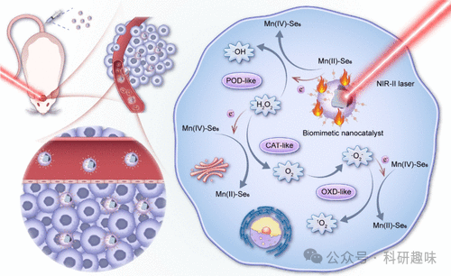

**引言**

胶质母细胞瘤（GBM）是脑肿瘤中侵袭性最强的一种，其高致死率和不良预后一直是医学界的难题。由于血脑屏障（BBB）的存在，传统治疗药物难以渗透到脑肿瘤部位，从而限制了GBM的治疗效果。因此，开发一种能够有效穿越BBB并特异性靶向GBM细胞的新型纳米治疗平台，对于提升GBM的治疗效果具有重要意义。在化学领域，“高效率”和“高选择性”一直是追求的目标。而在纳米催化医学中，这两个目标则转化为对疾病治疗的“高效性”和对患者的“低毒副作用”。通过精心设计纳米催化剂并调节化学反应的基本要素，我们可以有效控制反应速率、平衡和途径。这一策略不仅具有将不良反应降至最低的潜力，还能为患者带来更好的治疗前景，推动医学创新。近年来，纳米催化药物在科学界引发了浓厚的研究兴趣。这类药物利用无毒且具有催化活性的无机纳米催化剂在肿瘤内产生过量的活性氧（ROS）。此外，具有天然酶模拟催化活性的纳米催化剂也因其稳定性高、制备简便和催化性能良好等优势，成为天然酶的有前途的替代品。

然而，纳米催化剂在穿越BBB方面的能力有限，这对其在脑癌治疗中的应用构成了挑战。为了解决这一难题并提高脑癌治疗的疗效，我们需要关注三个关键问题：提高纳米催化剂穿越BBB的能力、提高其对脑癌细胞的特异性靶向效率以及提高其在脑肿瘤微环境中的酶催化性能。   针对这些问题，作者开发了一种新型的基因工程外泌体单原子纳米催化剂来治疗GBM。外泌体作为细胞间通信的重要媒介，具有将各种分子运输到邻近或远处细胞的能力。利用外泌体的天然载体特性，材料可以模拟外泌体本身，从而提高免疫逃逸能力和同型结合能力，同时保持良好的生物相容性和安全性。通过生物仿生策略，作者延长了纳米系统在体内的循环时间并使其在特定部位有效积聚。重要的是，外泌体还具有穿越生物屏障的固有能力且其表面易于修饰。与传统的化学修饰不同，作者采用基因工程技术来修饰外泌体表面，将编码指导蛋白或多肽的基因序列与指定外泌体膜蛋白的基因序列融合，从而确保多肽和蛋白质在外泌体膜上的有效展示并增强功能。在此基础上，作者设计了一种新型仿生纳米催化剂（Mn@Bi2Se3@RGE-Exos），该催化剂将锰单原子锚定到Bi2Se3纳米片上，并用RGERPPR（一种NRP-1靶向肽）-基因工程外泌体进行表面装饰。这种设计旨在实现对GBM的高效治疗。通过锰单原子的共价结合，该仿生纳米催化剂比单一的Bi2Se3具有更高的光诱导电子-空穴分离效率。在近红外-II光的照射下，它可以提供有利的环境促进过氧化氢的催化转化，从而起到多重酶模拟催化过程的作用。此外，基因工程外泌体通过NRP-1介导有助于穿过BBB并特异性靶向胶质瘤细胞。
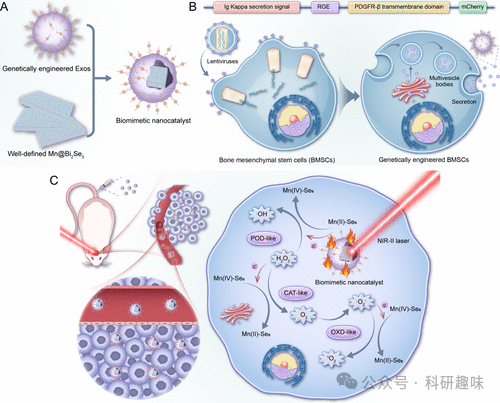

**结果与讨论**

单原子催化剂 Mn@Bi2Se3 的制备与表征

单原子催化剂凭借其独特优势，在纳米催化药物领域崭露头角。与传统纳米催化剂相比，单原子纳米催化剂以其定义明确、配位简单的同质化活性位点，为精确识别和工程设计提供了可能。然而，传统的基于单原子催化剂的纳米系统（如纳米酶）在生物环境中常展现出催化活性不稳定性，因此，作者探索了刺激响应激活纳米催化剂的策略，期望在复杂的生物系统中实现催化活性的时空可控性。
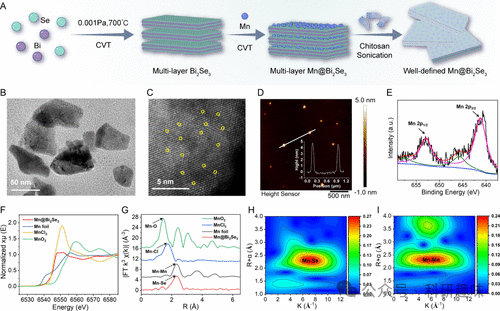
图 1. Mn@Bi2Se3纳米系统的制备和表征

Mn@Bi2Se3纳米系统的合成采用了化学气相传输（CVT）技术（图1A）。首先，作者制备了多层Mn@Bi2Se3结构，随后经超声处理获得超薄纳米片。扫描电子显微镜（SEM）结果证实了其多层结构（图 2）。为了全面评估其形态和尺寸分布，作者结合扫描透射电子显微镜（STEM）和动态光散射（DLS）技术，结果表明该纳米系统呈片状结构，尺寸分布均匀，约80纳米（图1B和图 2）。EDX元素图谱则证实了锰、铋和硒的存在（图 2）。晶格边缘间距测量值为0.21 nm（图 2），与Bi2Se3纳米复合材料的（110）面相匹配，与X射线衍射（XRD）结果一致（图 2）。
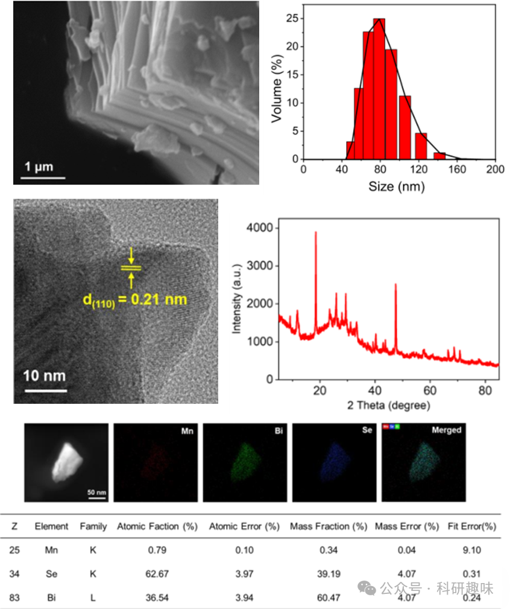
图 2. 多层Mn@Bi2Se3 的扫描电镜图、粒径分布、高分辨率投射电镜图、XRD 图及 STEM-DF 元素分析

通过原子分辨率的像差校正高角度环形暗场扫描透射电子显微镜（AC HAADF-STEM）观察，作者进一步确认了Mn@Bi2Se3纳米系统的原子结构，展现了单个锰原子在Bi2Se3上的稳定锚定（图1C）（作者解释，图中用圆圈圈出来的地方为 Mn 原子，但是图像中加圆圈的处理反而是的图像更难以分辨）。原子力显微镜（AFM）分析验证了纳米系统的超薄特性，厚度约为4-5纳米（图1D）。电感耦合等离子体质谱法（ICP-MS）测量结果显示锰的重量负荷为2.69 wt%。此外，X射线光电子能谱（XPS）分析揭示了Mn@Bi2Se3中Mn的混合价态，以+2为主要低氧化态（图1E），而Bi和Se的价态分别为+3和-2（图 3）。
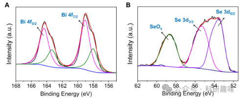
图 3. Bi 和 Se 的高分辨 XPS 图

为了深入了解Mn@Bi2Se3纳米体系中锰的氧化态，作者进行了X射线吸收近边缘结构（XANES）光谱分析，并与不同氧化态的锰参考化合物（如MnCl2和MnO2）进行了对比（图1F）。结果显示，Mn@Bi2Se3纳米系统中Mn的主要氧化态为+2，与XPS结果相符。此外，通过X射线延展边吸收精细结构（EXAFS）方法，作者全面分析了Mn的局部配位环境。Mn@Bi2Se3纳米系统在R空间的傅立叶变换EXAFS曲线显示出与Mn-Se键相对应的显著峰值（图1G及图 4），且未观察到与Mn-Mn键相关的特征峰。Mn-Se键长度测定为2.66 Å，与先前关于Mn-Se键的研究结果一致。(36) 小波变换（WT）分析进一步证实，Mn@Bi2Se3的最大值归因于Mn-Se配位（图1H），与锰箔和其他样品显著不同（图1I和S10）。这些发现强有力地证明了Mn@Bi2Se3纳米系统中不存在Mn-Mn键，进一步确认了锰原子的原子级分散状态。
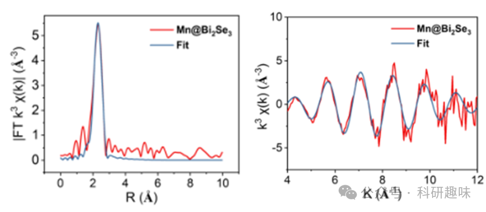
图 4. Mn@Bi2Se3 的 EXAFS 表征

近红外-II 光刺激下的多种酶模拟催化活性

作者利用电子自旋共振（ESR）光谱技术，深入研究了Mn@Bi2Se3的酶模拟催化活性。与先前报道的纳米催化剂（如纳米酶）直接产生ROS的特性不同，Mn@Bi2Se3在常态下表现出极低的酶模拟催化活性，这一惰性特性与纯Bi2Se3 一样（图 5A-D）。然而，令人惊奇的是，当置于近红外-II光（1064 nm，1.0 W/cm²，5分钟）照射下时，Mn@Bi2Se3展现出相较于Bi2Se3更为显著的H2O2消耗能力（图 5A），并伴以大量的羟基自由基（图2B）。在相同条件下，Mn@Bi2Se3亦展现出类OXD活性，有效产生-O2-（图2C）。尤为值得关注的是，Mn@Bi2Se3的-O2-生成量远高于Bi2Se3，这归因于其在类CAT反应中通过催化H2O2产生了更多的O2，这一点通过溶液中形成的气泡得到了直观验证（图 6）。此外，作者还观察到Mn@Bi2Se3和Bi2Se3在多酶模拟催化条件下均能生成单线态氧（1O2）（图 5D）。
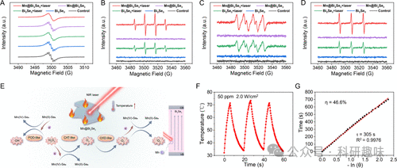
图 5. Mn@Bi2Se3 的性能表征
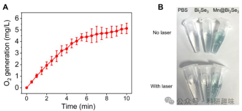
图 6. 材料产生氧气的效率

鉴于光敏化反应（即光动力过程）亦能产生ROS，作者利用一系列ROS探针（包括TMB、DHR123和DPBF等）进行了深入研究，以探究ROS形成的确切机制。如图 7 所示，即使在近红外-II光照射下，若不添加H2O2启动多重酶模拟级联反应，ROS的产生亦微不足道。这一发现排除了Mn@Bi2Se3和Bi2Se3通过光动力过程产生ROS的可能性，并暗示近红外-II光在激活上述酶模拟活性中扮演了关键角色。
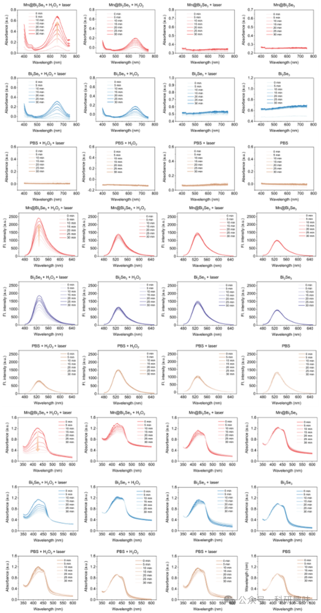
图 7. 不同指示剂下，材料产生单线态氧的效率

鉴于Mn@Bi2Se3水溶液在可见光至近红外-II区显示出宽吸收带（图 8），且近红外-II区具有光热转换潜力，作者推测近红外-II光可能是激活纳米催化剂的热触发器。为验证此假设，作者评估了Mn@Bi2Se3在1064 nm光照下的光热转化能力。如图S16A所示，光热加热曲线显示Mn@Bi2Se3溶液在激光照射下温度以浓度依赖方式升高，而纯水对照组温度变化可忽略不计，表明Mn@Bi2Se3有效促进了近红外-II光子向热能的转化。Mn@Bi2Se3的光热性能亦受功率密度影响。多次循环温度变化测试表明Mn@Bi2Se3具有良好的光热稳定性（图2F）。经计算，Mn@Bi2Se3的光热转换效率高达46.6%（图2G），与其他光热剂相当。这些发现突出了Mn@Bi2Se3将光子能量高效转化为热能的能力，为提升纳米催化活性提供了理想的热力学环境。水浴实验进一步证实了这一点，即在45°C水浴条件下，Mn@Bi2Se3在H2O2存在下产生随时间变化的ROS，包括-O2-和1O2，而在无H2O2条件下ROS信号微弱。这些结果共同支持了近红外-II光作为激活纳米催化的热触发器，从而实现对复杂生物系统中仿酶催化活性的时空可控操纵。
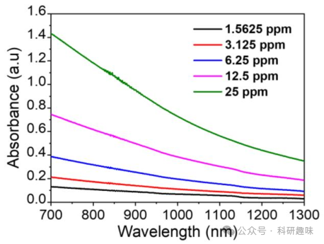
图 8. 材料在近红外区域的吸收光谱

此外，作者利用电化学阻抗光谱（EIS）对Mn@Bi2Se3纳米系统的电子传输机制进行了探索。EIS的奈奎斯特图显示，与纯Bi2Se3相比，Mn@Bi2Se3的电化学阻抗有所降低（图 9）。在光电流响应测量中，Mn@Bi2Se3在多个周期内展现出稳定的光电流密度，约为1.38 μA/cm²（图 9），远高于纯Bi2Se3，进一步证明了Mn单原子负载后Bi2Se3光催化活性的显著提升。
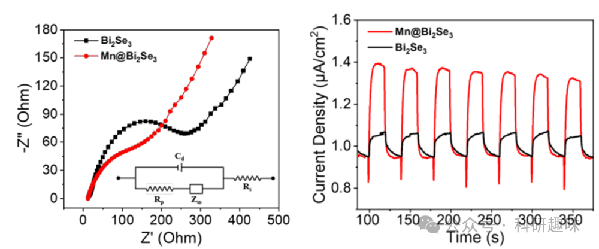
图 9. Bi2Se3 and Mn@Bi2Se3 的 EIS 图谱和光电流响应图谱

理论研究

作者对材料体系进行了密度泛函理论（DFT）计算，以深入探讨 ROS 生成的过程，并了解金属-底物相互作用如何赋予锰单原子相对于 Bi2Se3 的催化优势。根据 EXAFS 分析拟合的配位结果，首先通过将 Mn2+ 阳离子锚定在 Bi2Se3 纳米片的（110）平面上优化了 Mn-Se6 配位位点。如图 10A 和图 11 所示，Mn 阳离子的加入极大地改变了 Bi2Se3 的电子特性和稳定性，Se 空位能从 3.59 eV 猛增到 5.30 eV 就证明了这一点。这表明，由于锰的修饰作用，成功地制备出了具有潜在抗氧化性和耐水腐蚀性的稳定纳米平台，支持了基于该 Mn@Bi2Se3(110) 模型计算的可靠性。
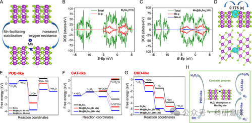
图 10. 材料体系的理论计算
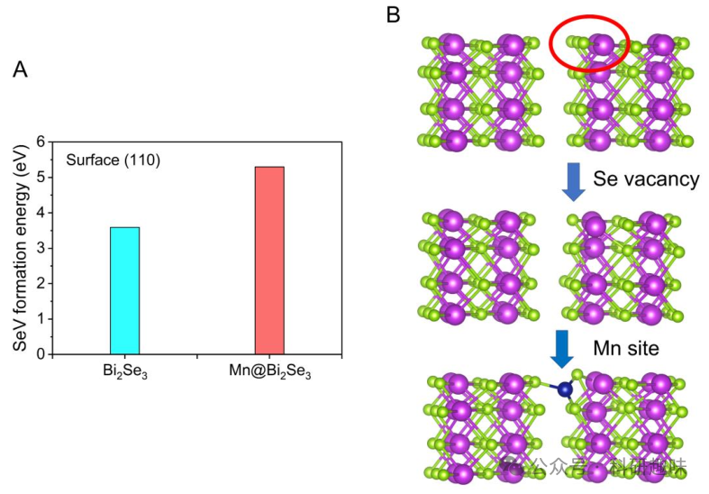
图 11. Bi2Se3 and Mn@Bi2Se3 的 Se 计算及其配位模型

模拟的 Bi2Se3(110) 和 Mn@Bi2Se3(110) 的投影态密度（PDOS）曲线显示，Mn 修饰后 Bi 6p 电子的 DOS 态减少，这表明 Bi 和 Mn 通过 Se 桥间接建立了电子相互关系（图 10B 和 C）。然后利用电荷密度差确定了 Mn@Bi2Se3 体系的 Bader 电荷曲线（图 10D）。与 XANES 和 XPS 的结果一致，Mn@Bi2Se3 中 Mn 的化合价与 Mn 前体相比有所增加，Mn 的 0.775 值表明有 0.775 个电子从 Mn 物种转移到配位的 Se 原子上。因此，Mn@Bi2Se3 与 Bi2Se3 之间催化性能的显著差异应归因于反应中间体与活性位点之间的电子相互作用。根据这些计算结果，作者模拟了在 Bi 位点和 Mn 位点上涉及 ESR 实验中检测到的所有 ROS（参见图 5B-D）的三种拟议的酶模拟途径。在 Bi2Se3 支持物的 Bi 位点和 Mn@Bi2Se3(110) 的金属位点（Bi 和 Mn）上计算了类 POD、类 CAT 和类 OXD 过程中关键中间产物的吸附能。掺入锰后，Bi2Se3 对 H2O2（整个酶模拟过程的起始物质）的亲和力几乎相同。这三种模型都需要借助升高的温度来克服 ∼0.5 eV 的障碍，以吸收 H2O2 分子。Mn@Bi2Se3(110)（锰位点）将 H2O2 分解成两个羟基的效率最高，能量下降最大，为 5.26 eV。在所有模型中，-OH 的形成都必须克服 ∼2.80 eV 的势垒，这证实了插入 Mn 后催化活性的增强（图 10E）。

值得注意的是，在作者的实验中，没有激光照射就检测不到 ROS（参见图 7）；这与 Mn@Bi2Se3 在吸收 H2O2 时所面临的障碍一致。然而，Bi2Se3 的在近红外-II 激光照射后产生高温，有助于克服这一障碍，在肿瘤微环境（TME）中产生大量 ROS，从而杀死肿瘤细胞。与此同时，利用 H2O2 作为起始材料的级联催化过程也得到了证实。对三个位点的 CAT 类过程的模拟表明，锰的加入在断开吸收的 H2O2 分子的 H-O 键方面发挥了关键作用（图 10F）。铋位点需要克服 0.16 eV 的能量势垒，而这一过程是自发发生的，锰位点的能量急剧下降（0.61 eV）。此外，Bi2Se3(110) 和 Mn@Bi2Se3(110)的 Mn 位点（0.70 eV）产生 O2 的能垒（1.53 eV）比 Bi 位点（1.58 eV）低得多，这与没有检测到 O2 分子的实验数据一致。Bi2Se3 的光热效应提供的额外能量有助于克服这一较低的障碍，在近红外-II 激光照射下有效地产生 O2，为 OXD 过程提供能量。图 10G 展示了上述三种模型的类 OXD 过程的路径，它将分子 O2 转化为 -O2-，从而破坏肿瘤细胞内的大生物分子。Mn@Bi2Se3(110)（Mn 位点）表现出对 O2 的强烈吸收，最低吸收能为 -2.01 eV，而 Bi2Se3(110) 和 Mn@Bi2Se3(110)（Bi 位点）的吸收能分别为 -0.48 和 -1.04 eV。这说明锰物种在这一类似 OXD 的过程中起了作用，锰与 O2 的配位产生了较长的 O-O 键长度，使其更容易断裂以进一步转化。图 S22 列出了三种模型吸收的关键中间产物的构型。
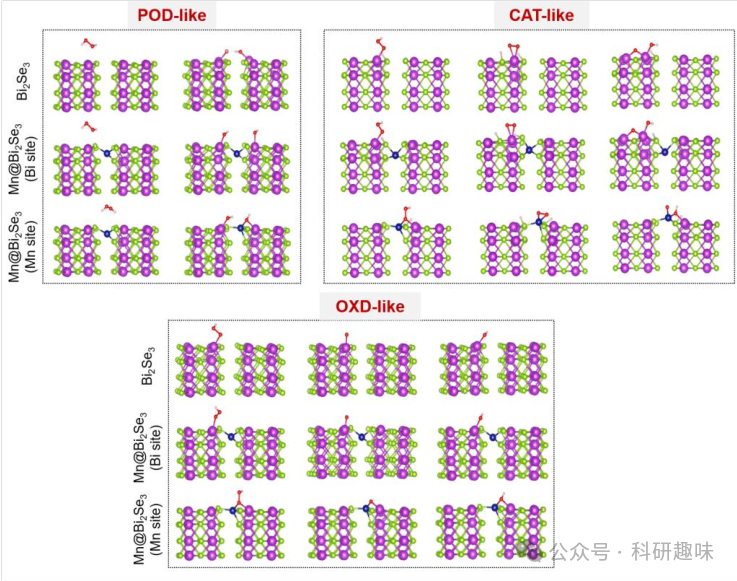
图 12. 三种模型吸收的关键中间产物的构型

总之，得益于稳定的抗氧化结构，产生 ROS 的酶促机制可归纳如下：从吸收 H2O2 开始，类 POD 和 Fenton 过程协同产生剧毒的-OH，从而杀死癌细胞。同时，类 CAT 和类 OXD 级联过程将吸收的 H2O2 分子转化为 O2，再转化为 -O2。这一过程中产生的-O2是另一种用于对付肿瘤的剧毒 ROS。生成 ROS 的整个级联循环需要额外的能量来克服限速步骤中的障碍，而 NIR-II 照射可作为智能开关，通过光热转换诱导更高的温度。

穿越 BBB 并高效靶向胶质瘤的仿生策略

鉴于Mn@Bi2Se3纳米系统在NIR-II光照下展现出类似酶的催化活性，但其穿越血脑屏障（BBB）的能力受限且靶向特异性不足，作者实施了一种生物仿生策略，通过RGE肽修饰基因工程外泌体，并成功将其与纳米催化剂表面结合，显著提升了Mn@Bi2Se3穿越BBB及特异性靶向脑癌细胞的能力。
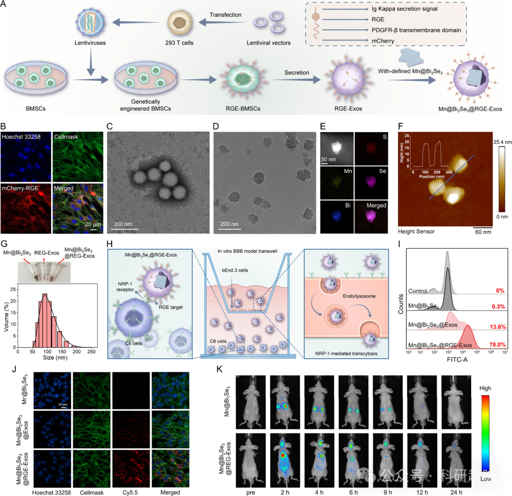
图 13. Mn@Bi2Se3@REG-Exos 的制备流程及性能表征

如图 13A所示，作者从骨间充质干细胞（BMSCs）中成功获取了经RGE肽修饰的基因工程外泌体，并通过荧光成像分析得到 RGE肽在细胞上的定位为细胞膜 (图 13B)，。透射电镜（TEM）分析进一步揭示了RGE肽修饰外泌体的典型球形结构和约100 nm的直径（图 13C）。为了优化Mn@Bi2Se3@RGE-Exos的性能，作者精细调整了超声条件、浓度以及Mn@Bi2Se3与RGE-Exos的比例。经过优化的Mn@Bi2Se3@RGE-Exos展现出不规则圆形和相对均匀的尺寸分布（图 13D），并通过EDX元素图谱证实了Mn、Bi、Se和S的存在（图 13E）。WB 验证了外泌体生物标记物TSG101、HSP70、CD63和CD9的存在（图 14），进一步证实了外泌体的成功修饰。原子力显微镜测量显示，Mn@Bi2Se3@RGE-Exos的厚度约为20纳米，相较于单独的Mn@Bi2Se3有所增加（图 13F）。尺寸分布分析（图 13G）确认了该纳米系统分布均匀，尺寸稳定在约100纳米。
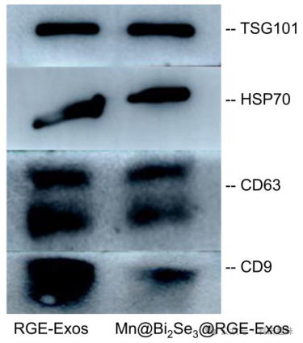
图 14. GE-Exos or Mn@Bi2Se3@RGE-Exos 的 WB 试验

利用Transwell系统模拟BBB模型，作者评估了Mn@Bi2Se3@RGE-Exos穿越BBB并特异性靶向GBM细胞的能力。在bEnd.3细胞（上腔）与C6细胞（下腔）共培养的模型中（图 13H），共聚焦激光扫描显微镜（CLSM）图像显示，Mn@Bi2Se3@RGE-Exos处理的C6细胞红色荧光强度显著高于对照组（图 13J），表明RGE-Exos有效促进了Mn@Bi2Se3穿越BBB并进入C6细胞。流式细胞术分析进一步证实了Mn@Bi2Se3@RGE-Exos增强的细胞吸收效率（图 13I）。体内实验中，通过尾静脉注射Cy7标记的Mn@Bi2Se3@RGE-Exos至裸体BALB/c小鼠（正位植入C6细胞），结果显示Mn@Bi2Se3@RGE-Exos在脑肿瘤中的蓄积显著增加，并持续12小时（图 13K）。这些结果凸显了外泌体作为纳米载体穿越BBB的天然优势，以及RGE肽增强外泌体渗透和靶向能力的有效性。这些发现为Mn@Bi2Se3@RGE-Exos在脑胶质瘤治疗中的应用提供了坚实的实验基础。

Mn@Bi2Se3@RGE-Exos 的体外治疗效果

作者采用细胞计数试剂盒-8（CCK-8）方法对Mn@Bi2Se3@RGE-Exos的细胞毒性进行了详尽评估（图 15）。实验结果显示，在1064纳米激光照射下，Mn@Bi2Se3@RGE-Exos对C6胶质瘤细胞展现出显著增强的细胞毒性。这种毒性增强归因于Mn@Bi2Se3@RGE-Exos在近红外-II（NIR-II）光照下通过多酶催化途径高效生成活性氧物种（ROS）的能力。
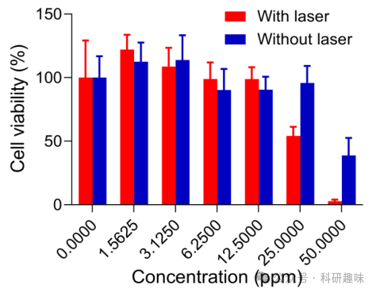
图 15. Mn@Bi2Se3@RGE-Exos 的暗毒性和光毒性

为了验证这一机制，作者利用特定的荧光探针——二氢乙锭（DHE）和2′,7′-二氯二氢荧光素二乙酸酯（DCFH-DA）——对Mn@Bi2Se3@RGE-Exos在近红外-II光照射下产生的ROS进行了量化分析。正如预期，Mn@Bi2Se3@RGE-Exos处理的C6细胞在NIR-II光照射（1064纳米，1.0瓦/平方厘米，5分钟）下，其ROS的产生呈现剂量依赖性增加，明确证实了Mn@Bi2Se3@RGE-Exos在细胞内部诱导ROS生成的能力（图 16）。
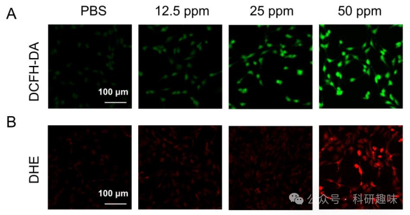
图 16. 不同浓度Mn@Bi2Se3@RGE-Exos 处理的细胞荧光图片

此外，为了全面评估Mn@Bi2Se3@RGE-Exos结合激光照射的治疗效果，作者进一步进行了细胞凋亡实验（图 17A）。与PBS对照组相比，接受激光照射的Mn@Bi2Se3@RGE-Exos处理组在诱导肿瘤细胞凋亡方面表现出显著效果，凋亡率高达53.1%，进一步支持了其在抗肿瘤治疗中的潜在应用价值。

蛋白质组分析

为了深入理解Mn@Bi2Se3@RGE-Exos与激光联合治疗对C6细胞的作用机制，研究团队运用串联质量标记（TMT）技术，对处理与未处理的C6细胞进行了蛋白质组学的详尽定量分析。图 17B揭示了7633个鉴定蛋白质中，共有307个差异表达蛋白（p &lt; 0.05），其中256个上调，51个下调。图 17D展示了组内与组间的高度一致性。根据基因本体论（GO）分类，这些差异蛋白被划分为生物过程（BP）、分子功能（MF）和细胞成分（CC）三类（图 17C），并对每类中前20个进行了深入研究。
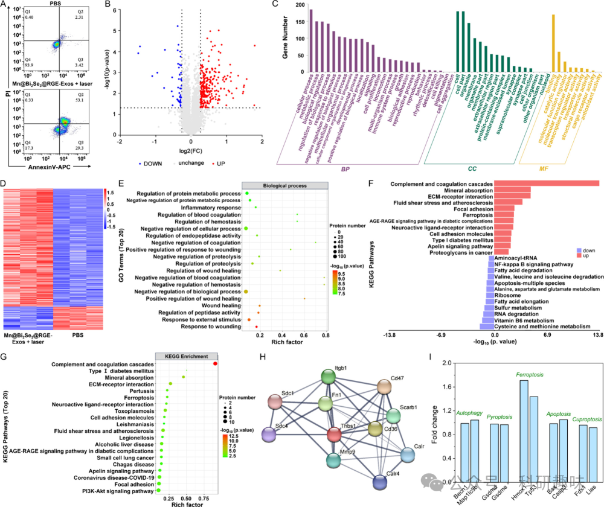
图 17. 细胞组学分析

在BP富集分析中，差异蛋白显著富集于伤口愈合反应、肽酶活性调节等生物过程中，暗示细胞生命系统的平衡状态受到了显著干扰（图 17E）。在CC类别中，尤其是与细胞外基质相关的蛋白质，显示出了显著的变化（图 18）。而在MF类别中，差异蛋白的活性受到硫化合物结合、肝素结合和糖胺聚糖结合等多种因素的调控，揭示了这些效应背后的特定分子相互作用（图 18）。
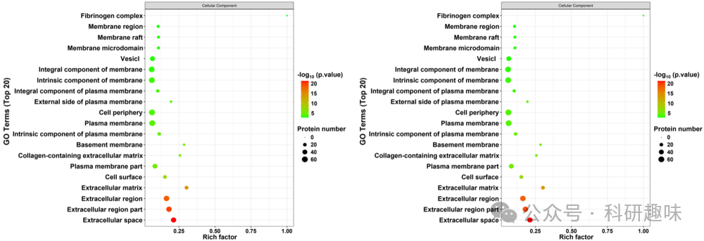
图 18. CC（左）及 MF（右）中不同蛋白的分类

进一步，通过KEGG数据库中的差异蛋白注释，作者探讨了Mn@Bi2Se3@RGE-Exos与激光联合治疗后潜在的信号通路。补体和凝血级联、矿物质吸收以及ECM-受体相互作用通路位列前三（图 17F和G）。此外，蛋白质-蛋白质相互作用（PPI）网络分析揭示，有18种蛋白质的相关性得分超过11（图 19），凸显了它们在治疗过程中的核心作用。特别地，纤连蛋白1的PPI评估（图 17H）强调了其在免疫应答和细胞粘附中的关键作用，进一步支持了Mn@Bi2Se3@RGE-Exos治疗对补体和凝血级联、矿物质吸收以及ECM受体相互作用的显著影响，从而促进肿瘤治疗。
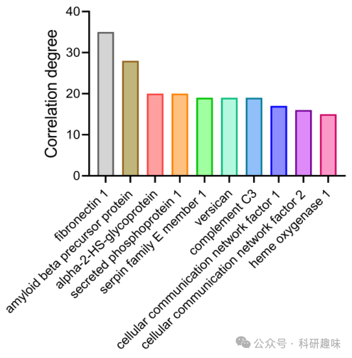
图 19. 蛋白质相关性

最后，对自噬、凋亡、热死亡、铁死亡等的特征蛋白分析显示，铁死亡相关蛋白显著上调，表明Mn@Bi2Se3@RGE-Exos与激光的联合治疗激活了铁死亡通路（图 17I）。综上所述，体外实验结果表明，Mn@Bi2Se3@RGE-Exos与激光治疗不仅能影响细胞稳态，激活铁死亡通路，还能增强免疫反应，从而提高对肿瘤的治疗效果。这些发现为理解Mn@Bi2Se3@RGE-Exos与激光治疗诱导的复杂分子变化提供了深刻的见解，为治疗机制的研究提供了新的方向。

Mn@Bi2Se3@RGE-Exos 的体内抗肿瘤效果和生物安全性评估

受到生物仿生纳米催化剂在体外展现出的显著抗癌活性的鼓舞，作者进一步利用携带C6胶质瘤细胞的裸鼠模型评估了其体内的抗肿瘤效果（图 21A）。实验动物被随机分为三组：对照组G1（PBS处理）、实验组G2（Mn@Bi2Se3@RGE-Exos处理）和联合治疗组G3（Mn@Bi2Se3@RGE-Exos + 近红外-II激光照射）。
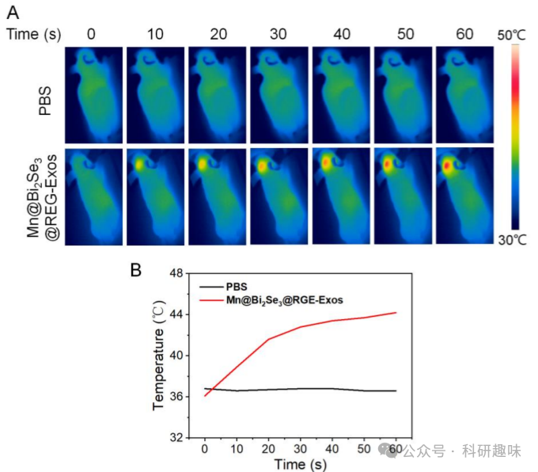
图 20. 材料的光热效果

在监测肿瘤生长之前，作者首先探究了纳米催化剂在体内的光热性能。正如预期，Mn@Bi2Se3@RGE-Exos处理的肿瘤区域在1064纳米波长照射下温度显著升高，证明了即使在原位脑肿瘤中也具有强大的光热效应（图 20），这对于创造有利于多酶模拟催化的热力学环境至关重要。
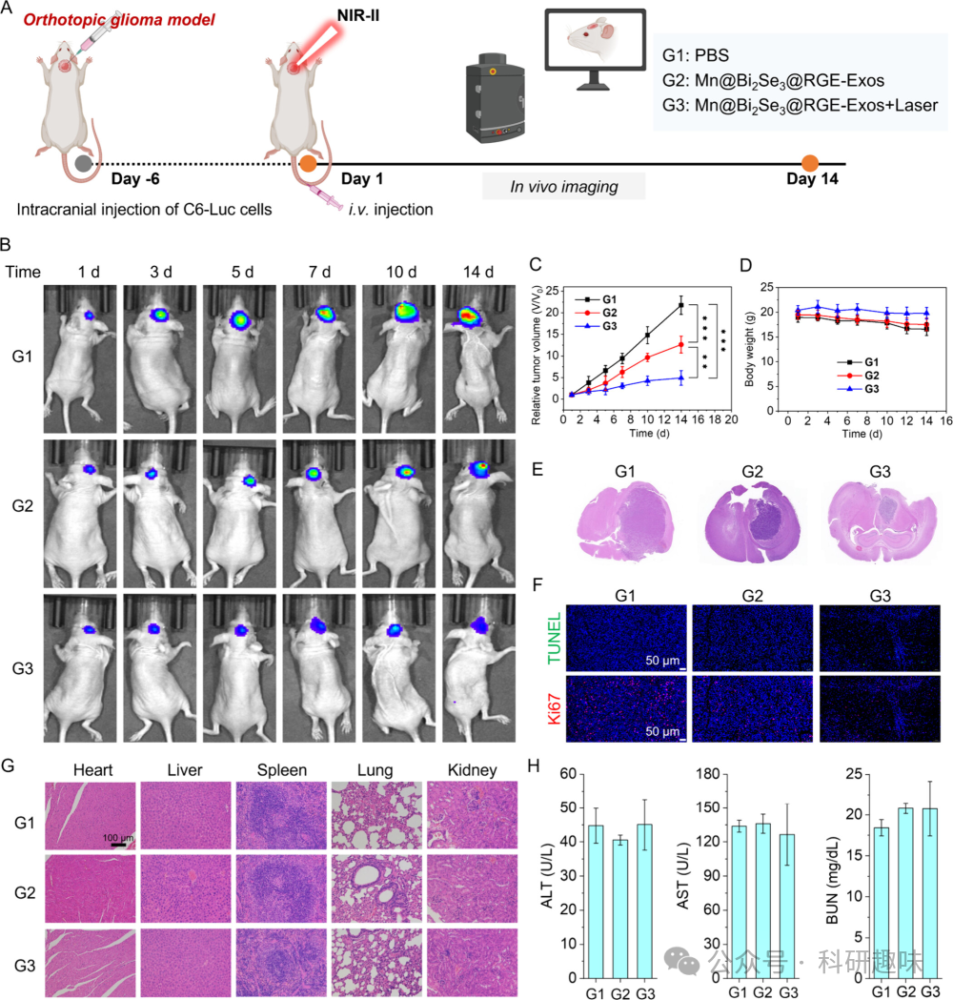
图 21. Mn@Bi2Se3@RGE-Exos 的体内治疗效果

随后，通过IVIS成像系统，作者监测并记录了14天内肿瘤的生长情况（图 21B）。结果显示，对照组G1的肿瘤体积随时间显著增大，而实验组G2中的Mn@Bi2Se3@RGE-Exos能适度抑制肿瘤生长。联合治疗组G3（Mn@Bi2Se3@RGE-Exos + 近红外-II激光照射）则显示出显著的肿瘤生长抑制效果（图 21C），表明Mn@Bi2Se3@RGE-Exos在近红外-II激光的辅助下具有卓越的抗肿瘤潜力。

值得注意的是，联合治疗组G3的小鼠体重下降可忽略不计，这反映了短期内良好的生物安全性（图 21D）。生存曲线进一步显示，与其他组相比，Mn@Bi2Se3@RGE-Exos与近红外-II激光照射联合治疗组显著延长了小鼠的生存期（图 22）。脑组织H&E染色证实了联合治疗的显著抗肿瘤效果，表现为肿瘤面积的显著缩小（图 21E），这与治疗过程中荧光素生物发光的定量分析结果相一致。
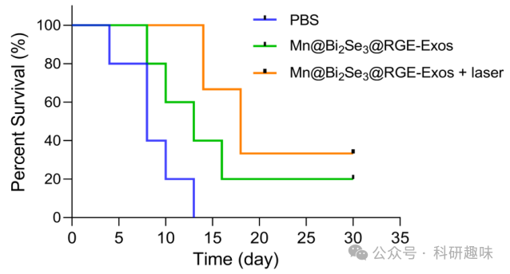
图 22. 小鼠的生存曲线

为了评估不同治疗组对肿瘤部位细胞凋亡和增殖的影响，作者进行了TUNEL和Ki67染色。如图 21F所示，对照组和Mn@Bi2Se3@RGE-Exos处理组中观察到大量Ki67阳性细胞（增殖细胞）和少量TUNEL阳性细胞（凋亡细胞）。然而，联合治疗组中则呈现出相反的趋势，即TUNEL阳性细胞增多而Ki67阳性细胞减少，这充分证明了Mn@Bi2Se3@RGE-Exos与近红外-II激光照射在原位C6胶质瘤模型中的强大协同抗肿瘤效应。
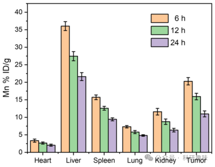
图 23. 不同时间点各脏器的材料分布

此外，通过ICP-MS分析，作者评估了静脉注射Mn@Bi2Se3@RGE-Exos后锰在肿瘤小鼠主要器官和肿瘤中的生物分布。结果显示，注射后6小时肿瘤中锰的相对分布量达到20.30%，高于12小时和24小时的时间点（分别为15.94%和10.99%）（图 23），这表明Mn@Bi2Se3@RGE-Exos具有良好的肿瘤蓄积能力，这归因于基因工程外泌体促进的血脑屏障（BBB）穿越和对胶质瘤细胞的特异性靶向。主要器官的组织学分析（H&E染色）显示，各种治疗干预后均未出现显著的病理变化（图 21G）。同时，血液生化指标（ALT、AST和BUN）也未观察到明显异常（图 21H），进一步证实了该纳米平台在脑癌治疗中的生物安全性和对正常组织的低毒性。

**结论**

总而言之，作者提出了一种创新的生物仿生策略，其核心在于基因工程外泌体伪装的纳米催化剂（Mn@Bi2Se3@RGE-Exos）的开发。该策略旨在通过增强血脑屏障（BBB）的穿透性、实现对胶质瘤细胞的特异性靶向，以及最大化纳米催化剂的酶模拟催化活性，从而提高胶质母细胞瘤（GBM）的治疗效果。Mn@Bi2Se3@RGE-Exos由单个锰原子锚定，并被RGE基因工程外泌体所伪装。经过RGE肽修饰的外泌体不仅有助于穿越BBB，还通过NRP-1介导的转胞吞作用展现出对胶质瘤细胞的独特亲和力。

尤为重要的是，在近红外-II 1064纳米激光的照射下，这种生物仿生纳米催化剂展现出热力学上的优势，显著促进了H2O2向-OH、-O2-和O2的催化转化，展现出多重酶模拟催化活性。此外，这种光子刺激下的纳米酶催化级联反应不仅破坏了细胞的稳态，还增强了免疫反应，并激活了铁死亡途径，从而促进了癌细胞的凋亡。

因此，在保持高度生物安全性的前提下，Mn@Bi2Se3@RGE-Exos有望成为一种高效的GBM抗癌疗法。作者坚信，这一策略为近红外-II光驱动的生物纳米催化治疗GBM提供了一个引人注目的范例，具有巨大的潜力和应用前景。

Fang, X.; Gong, R.; Yang, D.; Li, C.; Zhang, Y.; Wang, Y.; Nie, G.; Li, M.; Peng, X.; Zhang, B. NIR-II Light-Driven Genetically Engineered Exosome Nanocatalysts for Efficient Phototherapy against Glioblastoma. J. Am. Chem. Soc. 2024, jacs.4c02530. https://doi.org/10.1021/jacs.4c02530.

**关注并回复文章DOI获取全文：**

10.1021/jacs.4c02530

**点击蓝字 关注我们**

预览时标签不可点

素材来源官方媒体/网络新闻

 [阅读原文](javascript:;) 

  继续滑动看下一个 

 轻触阅读原文 

   

