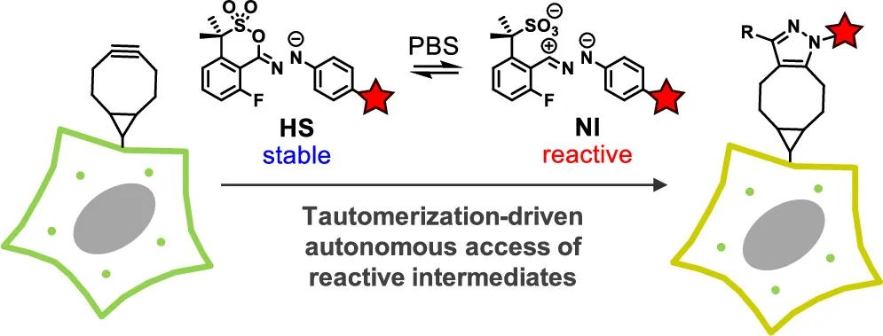
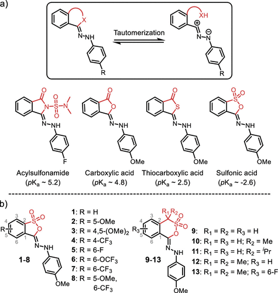
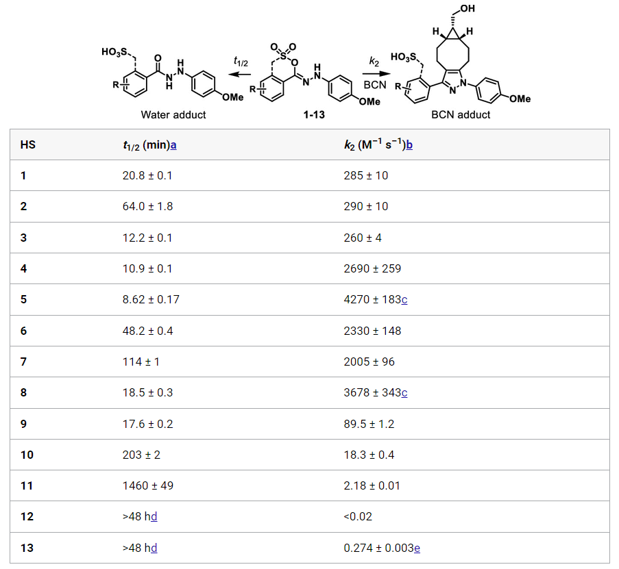
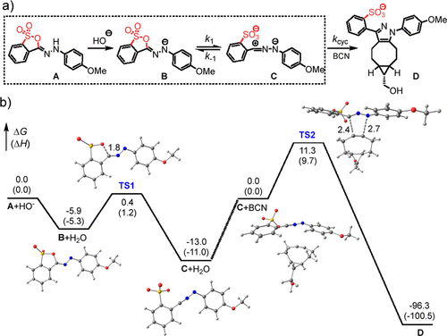
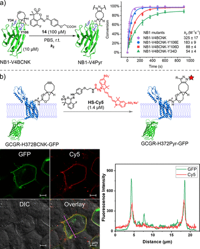

 

#  JACS:还在用叠氮-炔？快来试试新型的生物正交反应 
 

Bioorthogonal

生物正交

生物正交反应提供了一套强大的基于化学的精确工具，用于观察生物分子在原生细胞环境中的动态分布，并定向的递送一些特殊物质。生物正交反应的发展得益于生物相容性的反应中间体，它们可以在复杂的系统中进行快速、高选择性的化学反应。

①

【 同构体及其合成 】

同构体是一个用于描述同分异构体结构之间动态平衡的术语，它描述了在质子和双键位置不同的同分异构体之间的平衡状态。近期，研究人员将具有高反应性但不太稳定的次要同系物应用到了协同环加成反应中，而作者团队设计和合成了高活性腈亚胺（NI）的稳定同系物肼基磺酸盐（图1a），并对它们在溶液和活细胞中对蛋白质进行生物正交改性的效用进行了研究。为了确定腈基亚胺的稳定同分异构体形式，作者制备了一小部分携带离去基团的NI环状物（图1a），因为作者设想，离去基团共轭酸较低的pKa值可能会促进环的断裂，而结果也同作者预期的一样，磺酸环似乎释放了NI同分异构体，并产生了一个具有荧光特性的环加成产物。由于这个化合物是由两个基本官能团的结合而产生的，作者这种同构体结构称为腙基磺酸（HS），在这一结果的鼓舞下，作者合成了另外12个具备不同大小环状结构的HS（图1b）。

图1.(a) 根据共轭酸的pKa值选择合适的离去基团(红色标示)，以促进环链的同构化。(b) 五元肼基磺酸盐（1-8）和六元肼基磺酸盐（9-13）的结构。

②

【稳定性及反应性】

为了研究同构体是否提供稳定的NI前体，作者测量了HS在磷酸盐缓冲盐水（PBS）-乙腈中的稳定性（表1）。这些HS由于结构的不同而具备不同的半衰期，其中，较高的磺酸pKa值或OCF3和CF3基团的存在会增加HS的稳定性，而氟的存在则会降低HS的稳定性。整体来看，六元的HS显示出更高的稳定性（表1），这可能是由于它们的环形尺寸比较合适，同时二甲基基团的扭转效应也在一定程度上增加了整个分子的稳定性。

接下来，作者探究了稳定的HS同构体是否仍然具备环加成反应活性，结果表明这些HS都能够与BCN反应（表1），其中最稳定的HS-13的表观二阶速率常数为0.274±0.003 M-1 s-1，最不稳定的HS-5为4270±183 M-1 s-1。然而，HS的稳定性和环加成反应性之间并不是线性关系。事实上，HS-9与HS-8的稳定性相差不大，但反应动力学却慢了40多倍，这表明其他的一些因素如NI的HOMO能也会对环加成反应产生较大的影响。此外，HS与BCN的反应具备较高的选择性（92-100%），在等摩尔BCN/谷胱甘肽混合物存在时，HS与GSH的反应产物、HS水解产物或二聚体的数量可以忽略不计。

表1. 肼基磺酸盐1-13的稳定性及其与BCN的环加成反应的反应性

③

【结构解析与计算】

为了深入的了解HS稳定性与反应性的关系，作者对HS-1、HS-9和HS-12的晶体结构进行了分析，HS-1、HS-9和HS-12中的C1-S1-O1的夹角分别为94.8°、99.7°和101.2°，表明角应变逐渐减少。此外，偕二甲基将SO2基团扭曲出磺酸环平面，HS-12中较大的C7-C8-O1-S1二面角为46.5°，而HS-9中为41.3°。事实上，偕二甲基基团已经被证实了会增加苏尔酮环的闭合率，因此HS-12的高稳定性也可以被理解。而作者通过SMD溶剂模型对HS-1的反应进行了计算（图2）。HS同构化途径可能有两种：一种是中性途径，涉及从N到O的直接质子转移，然后是磺酸环断裂；另一种是阴离子途径，涉及A的去质子化，产生阴离子中间体B，然后电离生成同构体C（图2a）。而计算结果表明后者是比较符合反应热力学的（图2b），同时该结果也表明HS的同构化过程是pH依赖的。

图2. (a) HS到NI同构化（方框）和1,3-环化的反应步骤图。(b) 反应图涉的自由能曲线。A，中性的磺酸钠形式；B，A的阴离子形式；TS1，磺酸钠环破裂的过渡状态；C，腈亚胺形式；C+BCN，C和BCN之间的反应物复合物；TS2，环装化的过渡状态；D，环装产物。

④

【 体内抗菌效果 】

在以上结果的基础上，作者对HS在蛋白质系统中的反应性和正交性进行了探究，他们在PBS中将HS-14与NB1突变体（含有BCN-赖氨酸，BCNK）共同孵育了一段时间（图3），并通过QTOF-LC/MS监测了两者的反应。有趣的是，含有两个近端Tyr残基的NB1-V4BCNK突变体在溶液中的反应速度是BCN-HS-14的8倍（k2 = 325 ± 17 M-1 s-1 vs 40.1 M-1 s-1）（图3a），而当Tyr被Asp/Glu取代时，反应速度会减慢，这表明BCN微环境中Tyr残基对反应速率有着极大的影响。另外一点值得注意的是，在整个反应过程中都没有检测到双重修饰的产物。进一步，作者研究了HS在活细胞中进行生物正交标记的可行性（图3b），结果表明HS-BCN的正交反应在细胞这种复杂环境中也可以高效进行。

图3.(a) 通过HS-BCN反应对BCNK编码的纳米抗体进行生物正交修饰。。(b) 通过HS-BCN反应对活细胞中的GCGR进行生物正交荧光标记。上图：标记方案。左下图：在含有1.4μM HS-Cy5的DMEM培养基中培养1小时后，表达GCGR-H372BCNK-GFP的HEK 293T细胞的共聚焦显微照片。右下图：左边的重叠图像的线型分析。

⑤

【 总结 】

综上所述，作者开发了一类新的生物正交试剂，并将之称为肼基磺酸盐（HS），HS在1,3-环加成反应中显示出较高水稳定性和可调控的反应性。作者通过DFT计算解释了HS的稳定性及其到NI的同构体的转变途径，并成功将其应用到了溶液及生物环境中的正交反应中，此外，作者表示，基于现有的策略，科研人员可以快速的设计出高活性的基于纳米抗体的反应物模块。

Fang, M.; Kumar, G. S.; Racioppi, S.; Zhang, H.; Rabb, J. D.; Zurek, E.; Lin, Q. Hydrazonyl Sultones as Stable Tautomers of Highly Reactive Nitrile Imines for Fast Bioorthogonal Ligation Reaction. J. Am. Chem. Soc. 2023, jacs.2c12325. https://doi.org/10.1021/jacs.2c12325.

[JACS:是时候抛弃偶氮苯了，新型的可见光开关](http://mp.weixin.qq.com/s?__biz=MzkzOTI1OTMwNg==&amp;mid=2247483849&amp;idx=1&amp;sn=3f65047f764eada0b4ba27c1ebb811cb&amp;chksm=c2f2e50cf5856c1ae10eac3962c18edd925aecea291fd5fc68464a70610783e309f018f95a59&amp;scene=21#wechat_redirect)

[细菌纤维素的可视化和耐药菌的消除](http://mp.weixin.qq.com/s?__biz=MzkzOTI1OTMwNg==&amp;mid=2247483811&amp;idx=1&amp;sn=497b8c4b0ff461323fb2e1c24e03312e&amp;chksm=c2f2e566f5856c702e030d1f5c01ae034d7ddc9705f2b363e6eca0c9e6e8e7f9a07fb30b0e09&amp;scene=21#wechat_redirect)

[阿兹海默症早期标志物检测](http://mp.weixin.qq.com/s?__biz=MzkzOTI1OTMwNg==&amp;mid=2247483762&amp;idx=1&amp;sn=440a62325ac837766d790470b2feb1ad&amp;chksm=c2f2e5b7f5856ca11307adc886208ba8631f4e6d1aff91f790f0ebce02f346d7467e9532211e&amp;scene=21#wechat_redirect)

预览时标签不可点

  继续滑动看下一个 

 轻触阅读原文 

   

