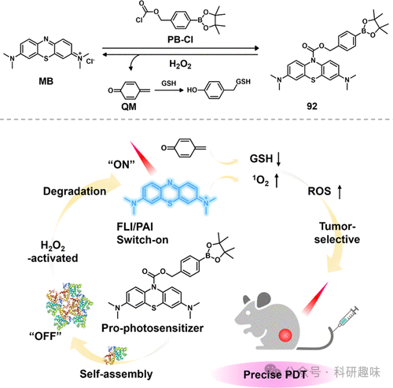
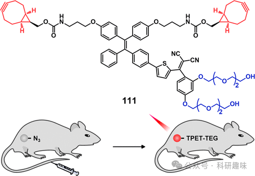

 

#  【PDT诊疗探针】ROS/RNS/H₂S可激活治疗诊断探针 
 

‍
‍

**诊疗一体化荧光探针**

Theranostic Fluorescent Probes

**PDT中的ROS/RNS/H₂S可激活治疗诊断探针**

活性氧/氮物种（ROS/RNS），作为生物新陈代谢的必然副产物，在细胞信号传递和维持细胞内氧化还原稳态中占据核心地位。鉴于癌细胞与正常细胞之间在代谢活性上的显著差异，已观察到癌细胞内部ROS/RNS的浓度显著高于正常细胞，这一发现强烈指向了内源性ROS/RNS水平与癌症发生及其进展之间的密切关联。进一步的研究表明，癌细胞过量产生的ROS/RNS能够触发多种细胞凋亡途径。因此，开发能够特异性响应ROS/RNS的光敏剂（PSs）成为了推动创新性癌症靶向光热治疗策略发展的关键步骤。
**H₂O₂-PDT中可激活的治疗诊断探针**
近年来，科研人员对基于氧化激活机制的刺激响应型光敏剂（PS）的研究兴趣日益浓厚，特别是在材料学和化学治疗领域。特别引人关注的是，肿瘤微环境中的过氧化氢（H₂O₂）水平相较于正常细胞具有更高的稳定性和浓度范围（5μM至1.0mM），这为精准医疗提供了新的机遇。这一特性促使研究者们成功设计出多种H₂O₂响应性光诊疗系统，这些系统不仅搭载了多样化的PS分子，还采用了多种响应机制。一个显著例子是由Takahashi和Toshima等学者所探索的，他们基于天然色素hypocrellin B衍生物的前体PS，通过引入芳基硼酸酯基团（90，见图39），实现了对H₂O₂过剩的癌细胞的特异性光摧毁。通过精心设计的策略，两个能降解H₂O₂的苯硼酸酯被用于修饰次花叶苷B的双羟基，构建了一个笼形结构。该结构在紫外-可见光谱区展现吸收，同时显著抑制了其光敏特性。然而，当H₂O₂特异性地移除苯硼酸酯保护壳后，PS在光治疗的理想波段（600-900nm）展现出红移的吸收峰，恢复了其产生活性氧（¹O₂）的能力。进一步的光引发的蛋白质损伤实验表明，当牛血清白蛋白（BSA）暴露于去笼后的次花叶苷B而非其笼形硼酸酯形式时，其降解更为显著，这直接证明了该PS光敏活性的调控潜力。尤为重要的是，光细胞毒性测试结果显示，在660nm光照下，该笼型PS对过表达H₂O₂的癌细胞株（如B16F10）展现出高度特异性和增强的光毒性，其效果远超过对正常WI-38细胞的效应，这凸显了其作为癌症靶向治疗策略的潜力与选择性。图39.H₂O₂激活90为提升肿瘤靶向性能，Ding和Zhang等科研人员巧妙设计了一种双功能纳米级光诊疗体系。该系统融合了苯基硼酸酯改性的亚甲基蓝衍生光敏剂（91，见图40）与可生物降解的牛血清白蛋白(BSA)，旨在实现精准的肿瘤成像与光动力治疗(PDT)应用。在携带HepG2肿瘤细胞的小鼠模型中，通过静脉注射引入该纳米诊疗试剂后，其凭借显著的增强渗透与滞留(EPR)效应，在肿瘤部位表现出高度富集。值得一提的是，肿瘤微环境中升高的H₂O₂浓度触发了特异性的脱硼反应，这一机制不仅激活了亚甲基蓝的荧光信号，还恢复了其光敏活性。此过程中产生的醌甲醚副产物能够迅速且不可逆地消耗肿瘤内的谷胱甘肽(GSH)，加剧氧化应激状态，与PDT效应形成强大的协同效应，显著增强了治疗效果。尤为重要的是，由于亚甲基蓝已被批准作为临床光敏剂，并且该纳米药物能够迅速降解为体内相容性良好的小分子物质，便于代谢排出，这一特性赋予了该纳米光诊疗平台极高的临床应用潜力和转化价值。图40.91的合成，用于H₂O₂-激活生物成像并通过GSH消耗放大PDT。线粒体作为细胞能量代谢活动的核心场所，其功能状态对生物能学和代谢活性的评估至关重要。因此，开发能够高效诱导线粒体功能紊乱的创新型光敏化疗药物，对于推动癌症治疗领域的发展具有重要意义。在此背景下，Feng与Wang等人的研究引起了广泛关注。他们发现，碘化吲哚鎓，作为合成氰基染料的常用前体，在与活性氧物种（ROS）如H₂O₂和·OH等发生特定反应后，能够转化为碘化三甲基氰基衍生物（93，图41）。鉴于肿瘤微环境（TME）内ROS水平的异常增高，且化合物93因其阳离子特性而易于在带负电荷的线粒体中积累，这一发现为利用细胞内ROS在活体癌细胞环境中原位合成新型氰基标记探针及光敏剂（PS）提供了新策略。更重要的是，93分子中的重原子效应显著增强了其产生单线态氧（¹O₂）的能力，从而在光照条件下导致HeLa细胞遭受严重的光毒性损伤。这一基于细胞内ROS响应机制的光热抑制剂原位合成策略，为利用氰化物敏感性和局部光疗敏感性进行肿瘤治疗开辟了新的激动人心的途径。图41.通过与线粒体ROS反应进行PDT，原位生成93。发光过渡金属配合物，以其卓越的光物理特性和高度光敏性，正在有机光诊疗领域崭露头角，成为有力的竞争者和理想的候选材料。特别是在光动力治疗（PDT）研究中，基于过渡金属的光敏剂（PS）的应用日益受到重视，其中一些PS甚至已进入临床试验阶段。针对这些独特性质，Chao及其团队巧妙设计了一种苯基硼酸酯修饰的环金属化铱(III)前体化合物（94a，见图42），并将其封装于硒纳米粒子和癌细胞膜内。这种策略旨在优化癌症靶向性、增强膜穿透力，并改善药物在体内的行为。硒纳米粒子作为理想的载体，不仅因其出色的药物装载能力和生物兼容性，还能在癌细胞内部降解，干预线粒体功能，进而触发细胞凋亡过程。该纳米诊疗试剂的设计精妙之处在于，当其在细胞内遇到H₂O₂时，能够迅速解体，释放出游离的铱(III)PS（94b）、谷胱甘肽（GSH）消耗剂（甲脒醌）以及化疗药物（源自纳米硒粒子）。通过730nm波长的双光子激发，诱导产生的¹O₂与降低的GSH水平及纳米硒粒子的化疗效应形成协同作用，在小鼠黑色素瘤模型中展现出显著的治疗效果。这一策略融合了局部光疗与化疗的优势，为智能型光热治疗在抗癌应用中的设计提供了新的、高效的视角。图42.治疗诊断探针94a和94b的化学结构。随着分子逻辑概念的蓬勃发展，对能与两种或多种不同目标底物交互响应的多模式荧光探针的研究与开发日益深入。特别是在癌症治疗领域，双激活诊疗试剂因其对癌细胞的高度特异性识别与作用而备受关注。Feng和Wang等人创新性地介绍了一种协同激活的光热疗法探针（95，图43），该探针的独特之处在于其能够同时响应H₂O₂与GSH，实现对线粒体的精准靶向，并进而实施肿瘤特异性的光动力治疗。值得注意的是，尽管线粒体内GSH浓度较高，但探针95并不会单独与GSH发生反应。其独特的激活机制要求肿瘤微环境中的H₂O₂与GSH协同作用，以确保光敏剂(PS)的激活过程具有高度专一性，从而有效避免被其他氧化还原活性生物分子非特异性激活的风险。一旦激活，该PS能够同时生成¹O₂和超氧自由基(-O2-)，不仅适用于局部光疗，还能有效缓解实体瘤内部普遍存在的乏氧微环境。这一优势得益于I型PS对氧气相对较低的依赖性。此外，通过808nm波长的双光子激发，该PS突破了短波长光线穿透深度受限的难题，进一步提升了其在癌症治疗中的应用潜力。这一研究成果不仅突显了利用肿瘤微环境自身特性作为双重控制开关，激活高级光热疗法策略的重要性，同时也为癌症治疗领域带来了新的思路和策略。图43.95的化学结构及其激活机制说明。光导治疗在深层组织应用的关键挑战之一在于光敏剂（PS）激活所需光源穿透深层组织的局限性。尽管近红外光（NIR）因其相对较强的穿透能力而受到关注，但其作用范围仍受限于数厘米内，难以满足深层组织的治疗需求。为了克服这一难题，Xu与An设计了一类创新的自发光单分子纳米粒子。这些纳米粒子通过精细的分子设计，将发光酚基团修饰与聚乙二醇（PEG）链连接的Ce6光敏剂（96，见图44）相结合，实现了对体内炎症与肿瘤区域的光动力治疗（PDT）和发光成像的双重功能。这些光敏剂单元通过两亲性聚合物的自组装过程，成功整合成具有理想纳米尺寸的颗粒。在肿瘤微环境（TME）中，升高的H₂O₂水平及激活酶的作用下，纳米粒子表面的发光酚单元被激发，产生生物发光现象。随后，通过高效的化学发光能量转移机制，这一生物发光能量被Ce6分子捕获，并转化为单线态氧（¹O₂）的生成，实现了体内精准成像与深部组织的定点光疗的同步推进。由于该体系利用化学发光能量转移原理，无需外加光源介入，相比传统的局部光疗技术，它展现出更为优越的治疗潜力和应用前景。这一创新设计为解决光导治疗在深层组织应用中的难题提供了新的思路和方法。图44.96的化学结构及其激活机制说明。
**ClO⁻/HClO-PDT中可激活的治疗诊断探针**
次氯酸盐/次氯酸（ClO⁻/HClO）作为髓过氧化物酶（MPO）在细胞内催化产生的活性氧物种（ROS），在生物体内具有至关重要的生理作用，并与多种疾病过程紧密相连，包括但不限于细菌感染、心血管病变、神经退行性变、关节炎症以及癌症等。特别地，高水平的ROS，包括ClO⁻/HClO，已被证实能够促进致癌转化并加速癌细胞的增殖。据估算，癌细胞内部ClO⁻/HClO的基础浓度约为10纳摩尔(nM)，这一发现为开发能激活ClO⁻/HClO的光诊疗试剂提供了重要契机，以实现癌症的精准治疗。针对这一策略，Wang与Zhang等人提出了一种创新的单组分纳米粒子，这些纳米粒子具有靶向溶酶体的特性，专用于宫颈肿瘤的精准成像与光动力治疗(PDT)。特别值得关注的是，这些纳米点利用了聚集诱导发光（AIE）效应显著的吩噻嗪衍生物（97，图45）封装于Pluronic F127中，展现出对肿瘤微环境中升高的ClO⁻/HClO水平的高度敏感性。这种敏感性能显著提升单线态氧（¹O₂）的生成效率（相较于市售的玫瑰红染料高出近两倍），进而引发强烈的光诱导细胞毒性作用（IC50值低于7.6微摩尔/升）。此外，生物影像学研究进一步证实，这些纳米粒子能够有效监测人体宫颈组织中ClO⁻/HClO的动态变化。这一研究工作为ClO⁻/HClO响应型纳米药物在光诊疗领域的应用开辟了新道路，尤其在针对炎症相关肿瘤的治疗中，展现出高度的靶向性和安全性，有效避免了严重副作用的产生。图45.HClO和H+协同双刺激调节97的示意图以及分别用TPE-PTZ-Py和TPE-PTZO-Py预处理的宫颈癌组织和癌旁组织的荧光成像。红色通道：λex=425nm，λem=635–675nm；黄色通道：λex=425nm，λem=505–545nm（激光功率=2mW）。迄今为止，众多对ClO⁻/HClO响应的荧光探针已被研制并广泛应用于生物体系的在体和离体成像分析中。然而，将I型和II型光敏机制整合于一体的ClO⁻/HClO反应性光敏剂（PS）的研究尚处于相对稀缺状态。近期，Tang和Han等人取得了一项突破性的研究成果，他们成功设计了一种线粒体靶向的生物成像兼容PDT诊疗试剂——基于聚集诱导发光（AIE）原理的PS（98，见图46）。这种独特的诊疗试剂能够特异性地被肿瘤内环境中的次氯酸盐（ClO⁻）激活。引人注目的是，PS98在ClO⁻反应前展现出典型的II型光敏行为，即在光照条件下主要产生活性氧¹O₂。然而，当其转变为氧化形态时，PS98则展示出I型自由基的生成，并伴随增强的荧光发射。进一步的研究揭示了PS98能够有效区分肿瘤细胞与正常细胞的能力，这一独特性质使得该化合物在光热调控领域展现出巨大的潜力，有望在肿瘤靶向的光动力治疗（PDT）中发挥关键作用，进而推动精准医疗的发展。图46.98的化学结构和ClO⁻的活化。在抗菌研究领域，盐酸过氧化物激活的光疗策略展现出了非凡的应用潜力。Liu与Tang等研究者成功设计并合成了一种创新的纳米药物（99），该药物融合了AIE效应光敏剂（DTF，标记为99a）与对HClO具有高敏感性的荧光探针（FFP，标记为99b，如图47所示），以实现针对病原菌诱导炎症疾病的精确检测和高效治疗。通过先进的包埋技术，99a与99b被巧妙地封装在Pluronic F127聚合物中，形成了一个功能集成的纳米载药系统。值得注意的是，在纳米载体内，99a与99b之间通过Forster共振能量转移（FRET）机制实现了光敏特性的动态调控。然而，当环境中的内源性HClO氧化破坏FFP（99b）的分子结构时，其吸收与发射信号显著衰减，而DTF（99a）的荧光发射则保持稳定。这一变化有效地阻断了FRET过程，进而恢复了¹O₂的高效生成。经过物理化学性质的详细评估，该纳米粒子（99）对HClO表现出了极高的选择性，其性能远优于其他生物活性氧物种（ROS）。这种纳米药物在体内实验中成功实现了对感染病灶的精准定位，为抗菌光动力治疗（PDT）的临床应用开辟了新的道路。尤为引人瞩目的是，其对金黄色葡萄球菌的抑制作用长达一周，显著超越了传统抗生素如万古霉素的72小时疗效。综上所述，这种基于HClO激活的多功能纳米诊疗试剂，凭借其独特的可调控发光与光敏特性，为精确靶向感染病灶的纳米治疗策略树立了新的里程碑。图47.99的制备及其在细菌炎症部位被HClO激活的荧光和光敏作用，以有效成像和消除侵入的吞噬细胞内的细菌。
**PDT中的NO可激活治疗诊断探针**
在癌症微环境中，一氧化氮(NO)水平的升高通常归因于细胞内鸟苷酸类似物与内源性iNOS（诱导型一氧化氮合酶）的特异性酶促反应。作为关键的信号分子，NO在多种炎症相关病理过程中发挥着核心作用，其生物学意义深远。基于这一重要现象，Fan等人开创性地设计了一种新型双光子可激活的NO荧光前体-光敏剂(100，图48)，旨在推动生物成像与光治疗技术的革新。当化合物100与癌细胞内环境中的NO发生反应后，其性能得到了显著提升：荧光量子产率激增超过50倍，¹O₂生成量子产率高达82%，且双光子吸收截面显著增长，最高值达到2800 GM。这些显著的性能提升为NO介导的双光子荧光成像和光动力治疗(PDT)在脂多糖(LPS)与干扰素-γ(IFN-γ)共刺激下激活的巨噬细胞中的应用提供了有力的概念验证。鉴于炎症与癌症发展之间复杂的相互作用，特别是炎症对肿瘤进展的促进作用，目前对NO响应型光热疗法(PPTT)在癌症治疗中的潜力探索尚处于初级阶段。因此，未来研究有望聚焦于开发更多结构复杂、功能精细的NO激活型光敏剂(PSs)，以实现针对炎症相关癌症更加精准有效的治疗干预。图48.NO对100的分子结构和活化以及在活化的巨噬细胞中用于TP成像和TP-PDT的NO可活化100的示意图（其中NO被上调）。
**PDT中的过氧亚硝酸盐可激活治疗诊断探针**
过亚硝酸根离子(OONO⁻)，作为一种高反应性的氮氧化物种(RNS)，通过超氧阴离子(-O₂⁻)与一氧化氮(NO)的反应生成，在细胞信号传导中占据重要地位，并被视为多种癌症的关键生物标志物。基于这一认识，Li等人探索了一种创新策略，旨在通过光敏过程的调控机制，设计出一种新型的原-光敏剂(pro-PS)。这种原-PS在遇到特定生物标志物OONO⁻后，能够实现其光敏特性从抑制到激活的转变。我们成功合成了一种针对线粒体定位优化的长波长可激活原-PS（101，如图49所示），其在经历OONO⁻触发的转换后，展现出高效生成单线态氧(¹O₂)的光敏特性。通过引入一个能被OONO⁻特异性切割的功能基团，我们巧妙地屏蔽了苯酚羟基，为构建这种智能型PS提供了一种创新的化学途径。实验结果表明，在活体癌细胞环境中，随着OONO⁻浓度的增加，101的光敏活性得到了显著增强。为进一步优化PS的水溶性和生物相容性，我们巧妙地引入了聚乙二醇(PEG)链，并缀以线粒体靶向基团，显著提高了其在细胞内的分布和滞留能力。在与肿瘤微环境紧密相关的RAW264.7细胞模型中，101不仅展现出了卓越的生物成像效果，还在光动力治疗(PDT)中取得了显著的治疗成效，这凸显了其在癌症诊疗一体化应用中的巨大潜力。图49.101的化学结构和所提出的PS激活策略的示意图。优化聚苯乙烯的分子填充模式，是增强其光敏性能的一种直接而有效的方法。基于此，Li等人提出了一种创新策略，即通过结合双亲性聚合物胶束与一种对OONO⁻具有响应性的激活型碘化BODIPY染料（标记为102，如图50所示），制备出具有良好生物兼容性的J型聚合物纳米颗粒。特别地，染料102倾向于在PEG-PCL基聚合物胶束内部自组装形成稳定的板状核壳结构。值得注意的是，这些纳米结构由于苯硼酸酯功能化的间羧酸基团而展现出对OONO-的敏感响应性。当遇到内源性OONO⁻时，它们能迅速解离，通过暴露负电荷，促进J型聚集体重组为无定形纳米球体。这一转变进一步触发了纳米粒子中¹O₂的光引发生成，从而有效地实现了对LPS和INF-γ诱导下高表达OONO⁻的肿瘤相关巨噬细胞的选择性光灭活。鉴于该方法原料易得且激活机制明确，该研究不仅为设计满足临床标准的刺激响应型光疗诊断试剂提供了新的思路，还为高级精准医疗技术的发展开辟了新的道路。图50. OONO⁻激活102。在生物成像与光治疗领域，长效发光材料凭借其独特性能——在外来光源撤离后持续释放光子或通过特定化学反应诱发化学发光，展现出了巨大的应用潜力。这种特性能够显著减少组织自体荧光的干扰，提高信号与噪声比，使其成为生物医学领域的理想工具。然而，长效发光材料在临床应用上仍面临细胞毒性、合成复杂性以及激发/发射光谱特性不佳等挑战。为了克服这些局限，Ding等人创新性地设计了一种光热调控的药物递送纳米平台（103，如图51所示）。该平台不仅具备自我监控药物释放动态的能力，还能在近红外光激发下产生持久发光，并显著增强免疫原性细胞凋亡过程。该纳米复合物是通过将OONO⁻激活型余辉特性的前药103与具有近红外辐射特性的聚集诱导发光（AIE）聚苯乙烯封装于DSPE-PEG 2000 nm粒子中制备而成。为提升光诱导的细胞毒性，该纳米系统首先通过光照诱导产生一定量的¹O₂，这些¹O₂与前药反应生成具有余辉活性的1,2-二氧环丁烷中间体。随后，在内源性OONO⁻的作用下，该中间体被激活，进而驱动抗癌药物羟基喜树碱的释放和余辉发光。此外，通过共振能量转移机制，激活的余辉发光能够进一步刺激AIE型光敏剂产生近红外辐射和大量¹O₂，从而增强抗癌效果。释放的羟基喜树碱还能使“冷”肿瘤对光动力治疗变得敏感。深入研究表明，这种纳米系统不仅能够彻底清除肿瘤，还能有效阻止肿瘤的再生，为生物医学领域的发展提供了新的方向。图51.103的化学结构和示意图，显示AIE/B-AGL-HCPTNP的制造和OONO⁻介导的预照射AIE/B-AGL-HCPTNP内药物释放的激活和NIR余辉发光。
**PDT中的H₂S-可激活治疗诊断探针**
硫化氢（H₂S），作为一种备受瞩目的亲核及还原试剂，因其在多种生物学进程中的气体信号传导作用而广受关注。近年来，特别是在结肠癌细胞中，研究揭示出H₂S浓度异常增高的现象（范围约为0.3至3.4毫摩尔）。然而，由于肿瘤微环境（TME）的复杂性及细胞内谷胱甘肽（GSH，浓度范围约为0.5至10毫摩尔）的竞争性相互作用，开发仅对H₂S响应的选择性光诊疗剂仍面临巨大挑战。杨等人报道了一项重要突破，他们设计了一种选择性光诊疗剂，通过采用具有密集分子填充的自组装纳米聚合物，实现了仅允许小型分子如H₂S渗透，同时有效屏蔽了大分子GSH的干扰，从而确保了对H₂S的高度特异性激活。在此基础上，我们设计了一种硝基苯醚桥接的BODIPY衍生物（标号104，如图52所示），并将其集成于PF127胶束中，构建出尺寸约为120nm的有序J-聚集体结构。实验结果显示，经H₂S处理后，该化合物在623nm的吸收峰强度明显减退，并伴随荧光发射波长的红移。这一现象归因于H₂S对硝基苯醚的亲核进攻，导致双硫醇取代的BODIPY结构形成。后续的生物成像与光毒性分析进一步证实了该纳米复合体系对内源性H₂S的高度响应性。特别是在光照条件下，与暗处对照组相比，该纳米复合体对HeLa细胞展现出更强的细胞毒性，且IC50值显著降低，这标志着首次利用J-聚集体光敏剂实现了对H₂S的超特异性检测，其性能在检测生物硫醇类物质中脱颖而出。图52.游离104的H₂S选择性不足和自组装增强104模板化自组装的H₂S选择性的示意图。Shi及其团队对硫化氢（H₂S）响应机制的创新研究，揭示了硝基苯基羧酸酯功能化的π-扩展七氨基氰基化合物（编号为105，如图53所示）的独特性质。当遭遇H₂S的亲核加成时，该化合物展现出了从近红外-II区域（F1070）至近红外-I区域（F720）的显著荧光跃迁，以及光声信号从PA680至PA900的显著变化。这一特性为实时监测包括活体小鼠肿瘤模型在内的多种疾病状态下的H₂S水平提供了新的可能性。为了进一步推动105在生物医学领域的应用，我们精心选择mPEG5000-PCL3000作为纳米载体的稳定剂，并通过引入叶酸（FA）修饰的mPEG5000-PCL3000作为肿瘤靶向模块，成功自组装出智能型聚合物纳米粒子。这些纳米构造不仅保持了原有的H₂S敏感性，而且在H₂S作用下表现出增强的单线态氧（¹O₂）产生活性，为光动力治疗提供了强有力的支持。动物实验研究表明，针对结直肠HCT116癌细胞及皮下肿瘤模型，这些纳米复合材料在H₂S激活下展现出显著的光诱导细胞毒性。这一发现预示着这些纳米复合材料在治疗H₂S浓度升高的肿瘤疾病中具有巨大的应用潜力。图53.ZNNPs@FA的制作和H₂S的定量可视化原理由105表示。硫化氢（H₂S）作为一种强还原剂，其特性在特异性H₂S探针设计中具有关键作用。在众多已研究的H₂S响应性传感分子中，含叠氮基的芳烃化合物占据了显著地位。Gunbas等人基于此，以叠氮苯基醚化的吩嗪染料结构为基础，设计了一种新颖的H₂S激活型间苯二酚原-光敏剂（PS）分子106（图54），旨在应用于神经母细胞瘤源性癌细胞的光动力疗法中。这种原-PS 106分子展现出了卓越的双功能特性，既可作为生物标记物，又可作为光疗药物。它能在606nm的特定波段触发红色荧光发射，并且在与内源性H₂S反应时，展现出高效的单线态氧（¹O₂）生成能力（量子产率ΦΔ=0.42）。尤为引人注目的是，分子106对表达H₂S的人神经母细胞瘤细胞（SH-SY5Y）表现出显著的光毒性作用（IC50≈3.29μM），而在不具备H₂S的正常成纤维细胞（L929）上则几乎无光毒性效应（IC50&gt;3.29μM），从而展现了其优异的选择性。然而，该研究的局限在于所使用的激发波长相对较短（&lt;650nm），这限制了其在深层组织中的穿透能力。为了克服这一局限，当前的研究趋势倾向于开发能够吸收近红外光谱区域的新型树脂素衍生物，以提升光疗在生物组织中的深层穿透效率和治疗效果。图54.H₂S激活治疗诊断探针106。
**PDT中的生物正交激活治疗诊断探针**
近年来，生物正交化学在生物成像及生物医学应用领域的研究热度持续攀升，这一趋势已持续二十余年并仍在不断增长中。与传统生物标记试剂相比，生物正交技术引入了独特的双阶段标记策略：第一阶段利用具有高生物正交反应活性的特殊标记底物，通过代谢过程将目标细胞或组织进行精确标记；第二阶段，这些预定位的底物与互补的生物正交荧光探针发生特异性配对反应，实现共价耦合。这种策略不仅赋予了前所未有的空间和时间分辨率，还极大地促进了复杂亚细胞结构的可视化，超越了传统染色方法的限制。生物正交方法的引入，据报道能显著提升光动力治疗(PDT)的癌症靶向精确性，并降低光敏剂(Ps)的非光照毒性和副作用。例如，Vázquez等人探索了将生物正交激活机制融入PDT，实现了细胞器水平上的精准调控和光毒性效应的精细管理。他们精心设计的碘代BODIPY分子107，携带四嗪基团作为有效的淬灭单元(见图55)，在与乙烯基修饰的底物相遇时表现出优异的激活效果。尤为重要的是，这种生物正交激活途径不仅提高了单线态氧(¹O₂)产生的量子效率，还通过预嵌入5-乙烯基-2′-脱氧尿苷至细胞核DNA，特异性地增强了对核内亚细胞结构的光毒性作用，展示了该策略在治疗上的巨大潜力。尽管分子107的工作波长偏短，但在临床前研究中，此类短波长探针仍展现出了其独特的价值和应用前景，为精准治疗提供了有力的支持。图55.107的化学结构和用于激活光毒性的DNA靶向生物正交策略的轮廓。Lo及其团队在生物医学应用的新领域探索中，摒弃了传统的有机染料作为荧光探针或光敏剂（PS），而是精心设计了一组创新的双四嗪基修饰的铱(III)配合物（标号108，如图56所示）。这些配合物旨在实现高灵敏度的生物发光成像与精确控制的光动力治疗(PDT)。在此体系中，四嗪基团发挥了关键作用，不仅展示了出色的生物正交反应性能，还显著抑制了铱(III)配合物的自发荧光（荧光量子产率Φem低于0.09%）。当这些配合物与受限炔烃发生反应时，其荧光发射强度呈现惊人的增强，最高可达2305倍，且荧光寿命显著延长（τ约为1.39微秒）。更为引人注目的是，即使在过量双炔的存在下，这些配合物仍能持续增强荧光发射强度，相较于未反应的四嗪-铱(III)配合物，其亮度增幅高达3885倍，并伴随更长的激发态寿命。这一增强归因于环化铱(III)配合物的形成，这一过程得到了电喷雾电离质谱(ESI-MS)与反相高效液相色谱(RP-HPLC)分析的有力支持。环化产物结构刚性的增强被认为是促进更强荧光发射与延长荧光寿命的关键因素，有效抑制了非辐射性衰减过程，从而优化了发光性能。共染色实验进一步表明，这些配合物在受控炔烃衍生物的作用下，能有效激活溶酶体内的强荧光发射。值得注意的是，所有配合物在激活前表现出极低的光毒性，表明其本征光细胞毒性极低。然而，一旦与受限炔烃反应以恢复其光敏性（光敏效率ΦΔ范围为0.62至0.77），所观察到的半数抑制浓度(IC50)显著降低（介于0.45至1.6微摩尔之间），标志着光毒性显著增强。除了四嗪基铱(III)衍生物外，Lo的研究团队还成功研发了一种腈基铱(III)配合物（标号109，如图56所示），该配合物同样能与炔烃标记的蛋白质相互作用，激活PDT过程，进一步拓宽了生物正交激活策略的应用领域。图56.治疗诊断探针108和109的化学结构。在临床实践中，由于多数现有光疗试剂缺乏足够的肿瘤靶向专一性，导致对周边正常组织产生不可避免的附带光诱导损伤。为了提升肿瘤识别的精确度，研究者尝试将多种癌症靶向生物大分子，如抗体、肽段、适配体或小分子配体，融入光动力疗法(PDT)试剂中，以特异性结合肿瘤环境中过度表达的生物标志物。然而，健康细胞对这类光敏剂-配体缀合物的非特异性摄取仍是挑战之一。针对此问题，Ng等人提出了一种创新策略，即采用双受体介导的生物正交激活途径，以优化光化学疗法制剂的肿瘤靶向性能。该策略的核心在于双重生物识别：将携带生物素受体和表皮生长因子受体(EGFR)结合位点的生物素化四嗪前体PS（编号为110，见图57）以及针对EGFR的特异性炔烃探针，共同递送至同时高表达这两种受体的实体瘤细胞内。当这两种互补的生物正交模块在双受体富集的细胞内部相遇时，会迅速触发串联的生物正交反应，从而激活光敏功能。经过一系列跨细胞系的光毒性评估实验，化合物110仅对同时高表达生物素受体和EGFR的A549肺癌细胞显示出显著的光毒性效应，而对未表达任一受体或仅表达单一受体的细胞类型则表现出极低的细胞毒性。这一结果表明，该策略在实现精准肿瘤靶向治疗方面具有巨大的潜力。图57.两个生物正交伴侣（110及其反应伴侣）双受体介导的内吞作用进入靶细胞，然后通过IEDDA耦合进行生物正交激活的示意图。相较于其他靶向策略，基于生物正交可激活的肿瘤靶向策略在治疗递送方面展现出显著的高效性。这主要归因于其共价偶联能够与肿瘤位点形成更为稳固的结合，从而有效规避了体内的清除过程。Liu等人首次报道了一种创新的双环炔烃修饰的聚集诱导发光（AIEgen）“Turn-On”探针（111，如图58所示），该探针被设计为用于生物正交肿瘤标记及成像指导下的局部光疗。在游离状态下，探针111的背景荧光极低，然而，当其与1,3,5-三（叠氮甲基）苯发生点击化学反应后，其荧光发射强度显著增强。值得注意的是，这种增强的荧光发射几乎不受各种表面活性剂和生物大分子的干扰，这表明探针与潜在杂质的非特异性结合可以忽略不计，进一步提升了其在复杂生物环境中的准确性和可靠性。图58.治疗诊断探针111的化学结构。细胞实验证实，探针111能够精准靶向经过叠氮化硅烷糖代谢前体AzAcSA预处理的恶性4T1细胞。一旦与细胞膜上的叠氮化聚糖发生交联，探针111能迅速激活荧光，不仅实现了对细胞膜的特异性标记，还促进了光敏反应。这一过程展现出剂量依赖性的光细胞毒性，其IC50值为10.4μg/mL。为了进一步提升癌症靶向性能，Liu等人进一步拓展了光诊疗剂的生物正交激活策略。他们引入了一种新型的阴离子AIEgen（112，如图59所示）和一种特殊的前体RGD-S-Ac3ManNAz。特别地，RGD-S-Ac3ManNAz在肿瘤内环境中，通过谷胱甘肽(GSH)介导的二硫键断裂在细胞膜上代谢。鉴于肿瘤细胞内GSH水平的升高，这一策略显著增强了肿瘤靶向的特异性。通过MTT细胞存活率实验，我们观察到当癌性MDA-MB-231细胞和正常293T细胞先与非靶向性Ac3ManNAz预孵育，随后在112的生物正交激活下，两者均表现出相似的光细胞毒性。然而，当采用cRGD-S-Ac3ManNAz时，MDA-MB-231癌细胞的光细胞毒性显著增强（IC50=9.5μM），而正常细胞系的IC50值则大于9.5μM。这一结果有力证明了该策略对癌细胞的靶向效率。综上所述，结合特定的生物正交激活机制与含氟AIEgen及癌症靶向代谢前体，为光热疗法的创新开发提供了新的策略方向，极大地拓宽了精准治疗的可能性。图59.治疗诊断探针112的化学结构以及112个(10μM)标记肿瘤细胞（MDA-MB-231和MCF-7）以及经cRGD-S-Ac预处理的正常293T细胞的共焦图像3ManNAz2小时，然后用1×PBS洗涤并在新鲜DMEM培养基中孵育2天。细胞核用Hoechst33342染色，λex=405nm，λem=430–470nm；112，λex=405nm，λem=&gt;650nm。除了生物正交偶联技术外，近期兴起的生物正交裂解反应也引发了研究界的浓厚兴趣。Ng和Lo等人通过引入一种基于可裂解硝基苄基异腈连接的BODIPY光敏剂（PS）设计（编号为113，如图60所示），巧妙利用断裂型生物正交反应原理，旨在实现肿瘤靶向激活PS，从而服务于精准的光动力治疗(PDT)应用。在此体系中，113产生的单线态氧（¹O₂）的生成并未受到异腈基团的抑制，而是被硝基苄基淬灭模块所调控。尤为关键的是，这一策略通过异腈与四嗪间的环加成反应，实现了硝基苄基淬灭单元的可控移除，进而激活光敏剂。通过将四嗪基团功能化为半乳糖分子或GE11肽，113在活体癌细胞内的特异性反应不仅显著增强了荧光信号，还有效促进了¹O₂的生成。此外，体内实验进一步验证了该生物正交裂解激活途径在光细胞毒性效应上的可行性和有效性，展现出了令人满意的治疗效果，为PDT的精准治疗提供了新的策略和方向。图60.113的化学结构及其生物正交活化反应。最终，Staudinger反应凭借其通过亚氨基磷烷中间体迅速且高效地将叠氮化物转化为伯胺的能力，以及卓越的生物兼容性和高产率特性，在生物医学领域获得了广泛关注。基于这些显著优势，Liu等人成功合成了一种π-扩展结构的长波长吸收型叠氮化物，该化合物与硒代罗丹明衍生物结合，形成了原始光敏剂（PS）114（见图61），并展示了通过三苯基膦介导的Staudinger反应实现生物正交激活的能力。值得注意的是，这种叠氮化罗丹明结构促进了螺环结构的封闭，从而完全抑制了硒代罗丹明的近红外荧光发射，其吸收峰显著蓝移，从616nm迁移至405nm。此外，原始光敏剂114在未经三苯基膦活化处理时，对HeLa细胞的光毒性作用微乎其微（IC50=15.9μM）；然而，一旦经历Staudinger反应驱动的活化，其对同一细胞系的光毒性效应便急剧提升（IC50=0.218μM），充分凸显了这种策略在精准光疗激活中的巨大潜力。图61.TPP激活114。参考文献：Sharma, A.; Verwilst, P.; Li, M.; Ma, D.; Singh, N.; Yoo, J.; Kim, Y.; Yang, Y.; Zhu, J.-H.; Huang, H.; Hu, X.-L.; He, X.-P.; Zeng, L.; James, T. D.; Peng, X.; Sessler, J. L.; Kim, J. S. Theranostic Fluorescent Probes. Chem. Rev. 2024, 124 (5), 2699–2804. https://doi.org/10.1021/acs.chemrev.3c00778.