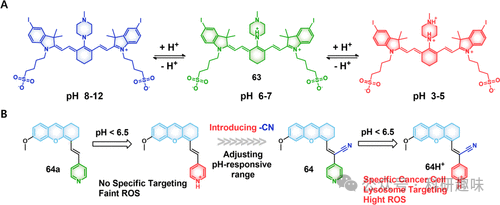

 

#  【PDT诊疗探针】pH可激活治疗诊断探针 
 

‍
‍

**诊疗一体化荧光探针**

Theranostic Fluorescent Probes

**PDT中的pH可激活治疗诊断探针**

酸性化的肿瘤微环境（TME），作为癌症的重要特征之一，为开发响应型光敏剂（PSs）提供了新途径。典型的pH响应型PS设计集成了对氢离子（H+）敏感的官能团，如吡啶、苯胺、哌嗪、吗啉和各种叔胺基团，这些基团在酸性条件下能够抑制荧光并阻碍PS产生光激发的单线态氧（¹O₂）。这类智能PS在正常生理pH下保持休眠状态，而在酸性TME中则展现出增强的荧光发射和高效的活性氧物种（ROS）生成能力，为肿瘤的精确诊断和光动力治疗（PDT）带来了革命性的策略。例如，Siegwart等人设计了一系列水溶性、近红外（NIR）吸收的BODIPY类PS（53和54），旨在实现癌症的影像导向局部光疗（图23），展示了该领域的最新进展。在酸性介质中，这些化合物展现出显著增强的NIR吸收与发射特性，其中53和54分别在660nm和690nm处达到吸收峰值，发射峰则位于692nm和742nm，为深层肿瘤组织的非侵入成像提供了理想的光学窗口。尤为关键的是，随着TME中pH值的降低，53和54的¹O₂产生量子效率及荧光强度大幅提升，这归因于二乙胺苯基团的质子化过程有效抑制了荧光共振能量转移（PET）导致的荧光猝灭。此外，这些BODIPY衍生物具备出色的肿瘤自发靶向能力，无需额外的靶向配体即可在肿瘤部位积累，进一步凸显了它们在低pH环境下通过近红外光照实现高效肿瘤消融的潜力。图23.(A)pH可激活的基于BODIPY的53和54的结构。(B)pH介导的55解聚用于激活PDT和PTT的机制图。(C)56–58的结构，具有pH可逆的ISC和PDT作用。Tang及其团队基于BODIPY染料的核心结构，创新性地开发了一种pH响应性聚集的BODIPY增敏剂（55）。他们巧妙地引入溴元素作为重原子，实现了pH调控下的光动力/光热耦合治疗策略，特别在肿瘤治疗领域显示出巨大潜力（图23）。在中性pH值（7.4）下，由于双机制淬灭（PET效应与聚集诱导淬灭）的影响，该增敏剂展现较低的背景毒性和较弱的荧光与¹O₂生成性能。然而，在酸性条件（pH 4.0）下，二甲氨基苯环发生质子化，随后因疏水性和静电斥力的增强，分子有效离解，从而激活了PDT与PTT的双重治疗效果。溶酶体，作为一种pH范围约为4.5至5.5的关键细胞器，对生物大分子的降解和体内稳态维持至关重要。其损伤能触发多种细胞死亡途径，特别是溶酶体介导的细胞死亡（LCD），它避开了传统的caspase依赖性凋亡路径，因此成为抗肿瘤治疗的重要靶点。基于此，Ulrich等人报道了一系列苯胺及碘代BODIPY衍生物，这些衍生物作为针对溶酶体、pH响应性的光疗药物，展现出了显著的体外细胞毒性作用（图24）。针对乏氧肿瘤环境中的PDT优化，Mou及其团队研发了一种质子诱发转换的¹O₂捕获纳米体系。该体系整合了pH敏感的二甲基苯胺与聚合物封装的蒽基BODIPY（59），构建了一种先进的智能PDT诊疗试剂（图24）。在暗处及乏氧状态下，该纳米系统能有效释放¹O₂。在酸性内体环境下，该系统利用“质子海绵”效应成功逃脱内体，并经历形态变化，从长94.1nm的立方体¹O₂捕捉体转变为直径12.3nm的纳米球。值得注意的是，59在质子化状态（二乙胺苯基团双质子化为ANBDPH）下，相较于非质子化态，显示出增强的荧光发射、更长的荧光寿命及提升的¹O₂生成效率。通过与内过氧化物生成的蒽单元共轭，59延长了¹O₂在特定条件下的存活时间。实验结果显示，与不含蒽的BODIPY衍生物相比，59nm颗粒对肿瘤生长的抑制率高达96.7%，明显优于NBDPNPs和BDPNPs。这一研究为乏氧性癌症的光动力疗法提供了新的视角和策略。图24.质子驱动的可转化¹O₂-纳米陷阱的制备及其缺氧癌症PDT的机制。偶氮-BODIPY骨架，以其合成简便、功能化灵活、出色的光稳定性以及高摩尔吸收系数，成为构建高性能光敏剂（PS）的理想平台。鉴于这些显著优势，科研人员对基于偶氮-BODIPY的pH响应性光敏剂进行了广泛研究。这些光敏剂通过将苯胺或吗啉基团作为质子接纳体与BODIPY核心结合，实现了在酸性环境下自发增强BODIPY荧光发射的功能。例如，Ju等人成功设计了一种独特的pH激活型纳米探针（60），其核心组分为溴代苯偶氮-BODIPY。该探针通过封装在cRGD修饰的纳米载体中，能够精准靶向整合素高表达的肿瘤细胞，并在近红外（NIR）区域实现光动力治疗应用（图25）。此外，Dong等人则提出了两种创新的aza-BODIPY纳米颗粒（61与62）。这些纳米颗粒分别通过二甲氨基苯基（NAB）和吗啉（MAB）官能团进行改性，旨在pH刺激下实现光声（PA）与光热成像导向的协同光热治疗（PTT）与光动力治疗（PDT）（图25）。这两种纳米颗粒（61与62）不仅拓宽了光诊疗一体化的应用范围，还展示了在精准医疗领域中的巨大潜力。图25.治疗诊断探针的化学结构(60–62)。氰基染料，因其卓越的光学性能，在生物传感、生物成像及光疗法等领域中备受青睐。特别是，那些携带pH响应基团的氰基染料衍生物，作为光敏剂（PS），在癌细胞特异性识别与高效消除方面展现出巨大潜力。Kamkaew等人的一项研究就是一个典型例证，他们报道了一种基于七甲氧基氰基结构的新型pH响应型光动力治疗（PDT）试剂63，该试剂专为HepG2肝癌细胞的治疗而设计（图26）。该PDT试剂63具备出色的光产生活性氧效率（ΦΔ值），并通过N-甲基哌嗪基团实现了在酸性微环境下的特异性响应。在酸性pH条件下，该试剂不仅能进行近红外成像引导的光动力治疗，而且其吸收光谱出现了红移现象，这归因于低pH环境中分子内电荷转移（ICT）过程的有效抑制。此外，PDT试剂63展现出对癌细胞的特异性靶向能力，特别是在酸性pH值下，经过850nm LED光源30分钟的光照处理，对HepG2细胞的光毒性作用显著增强，从而凸显了其作为精准光疗工具的巨大应用价值。图26.(A)63.的化学结构和pH激活机制(B)低pH响应PS64.的设计概念示意图近期，Wang和Zhou等科研人员巧妙地引入吡啶基团作为pH响应元件，成功设计并合成了一种高效的聚苯乙烯前体（64），为化学与材料科学领域带来了新的突破。如图26所示，相较于对照分子ZWZ（64a），64因其独特的氰基单元，展现出了与众不同的电子吸收特性，使其在较低的酸性条件（pH&lt;5.0）下呈现出更为灵敏的pH响应行为。探针64不仅优化了细胞摄取效能，还在¹O₂生成上表现出显著优势，这得益于其能在细胞内酸性环境（如溶酶体，常见于HepG2、HeLa及4T1细胞株）中通过H+激活机制，增强分子内电荷转移（ICT），从而高效促进光介导的治疗过程。另一方面，Tang和Wang等研究团队创新性地开发出一种具备聚集诱导发光（AIE）特性的pH调控型光诊疗剂（65），该诊疗剂在结直肠癌模型中展现出卓越的性能，结合了NIR-II荧光成像（FLI）引导的I型光动力治疗与光热治疗（PDT/PTT）（图27）。值得注意的是，65在808nm波段的吸收强度显著超越了参考分子，且在二甲基亚砜介质中的最大发射峰位于1114nm的近红外-II窗口，为FLI引导的治疗提供了理想的光谱条件。65能够高效产生超氧阴离子，并通过I型过程，在808nm激光激发下展现出卓越的光热转换性能，这归因于其内部的强烈电荷转移作用、高效的系间跨越以及分子内运动的充分性。尤为关键的是，65nm粒子通过C=N双键作为pH响应基团，在pH6.5环境下相较于pH7.4时，显著提升了¹O₂生成和热产生的能力。这些具有良好生物相容性的65nm粒子在肿瘤部位展现出增强的I型PDT/PTT效应，不仅在体外实验中取得了显著的抗癌效果，还在来源于患者的结肠癌异种移植模型中验证了其卓越的治疗潜力。图27.65作为肿瘤可逆pH响应治疗诊断平台的示意图。Huang及其研究团队在化学和材料科学领域取得了创新性的突破，他们巧妙运用对苯乙炔作为构筑基石，精心合成了一系列标号为68至72的纯有机材料（POM）。这些POM在智能光导光疗应用中展现出对ISC（系间窜越）过程的pH响应性可逆调控特性，其详细成果如图28所示。这些有机构造通过飞秒瞬态吸收光谱(fs-TA)分析和先进的量子化学计算，验证了其卓越的ISC效率。研究发现，随着分子内旋转角度的增大，ISC转化效率实现了从1%的微弱水平到高达90%的显著飞跃，凸显了结构设计对功能性的决定性影响。计算模拟进一步揭示了编号为72的化合物在酸性pH 6.0环境下的¹O₂生成量子产率高达约0.48，而在生理pH 7.4条件下则显著降低至约0.05，这直接证明了酸性条件对ISC增强的积极作用。此外，在体外实验中，相较于市场标准光敏剂TMPyP4，化合物72在靶向肿瘤细胞时展现出了更为优异的选择性。这一研究成果不仅开创性地提出了一种基于pH值动态调整ISC机制的策略，而且极大地增强了光导治疗的精准度和效率。这一创新方法为智能诊疗材料的设计开辟了新的道路，为未来的医学治疗领域带来了广阔的应用前景。图28.68-71的化学结构以及72在不同pH值下的可逆ISC和PDT效应示意图。参考文献：Sharma, A.; Verwilst, P.; Li, M.; Ma, D.; Singh, N.; Yoo, J.; Kim, Y.; Yang, Y.; Zhu, J.-H.; Huang, H.; Hu, X.-L.; He, X.-P.; Zeng, L.; James, T. D.; Peng, X.; Sessler, J. L.; Kim, J. S. Theranostic Fluorescent Probes. Chem. Rev. 2024, 124 (5), 2699–2804. https://doi.org/10.1021/acs.chemrev.3c00778.