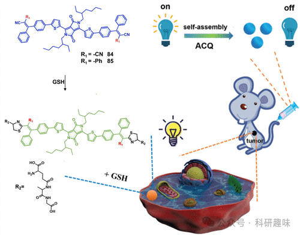

 

#  【PDT诊疗探针】生物硫醇可激活的治疗诊断探针 
 

‍
‍

**疗一体化荧光探针**

Theranostic Fluorescent Probes

**PDT中生物硫醇可激活的治疗诊断探针**

在生物体系中，生物硫醇分子如谷胱甘肽（GSH）、半胱氨酸（Cys）和同型半胱氨酸（Hcy）占据着核心地位，特别是在维持细胞内氧化还原稳态方面发挥着不可或缺的作用。面对持续的氧化应激挑战，癌细胞倾向于提高生物硫醇水平，作为一种适应性补偿机制。文献记载，癌细胞内部GSH的浓度可显著升高至1至10毫摩尔，远超正常细胞水平，增幅高达五倍以上。因此，生物硫醇含量的异常变化成为鉴别癌细胞与正常细胞的重要生物标志物，并为开发能够特异性激活生物硫醇的智能光敏剂（PS）提供了契机。这类光敏剂旨在提高光动力疗法对恶性肿瘤的治疗效果，同时最大限度地减少对周边健康组织的潜在损害。半胱氨酸中的巯基（-SH）基团赋予了GSH和Cys高度的还原力和亲核活性，使它们能够广泛参与各种化学及生物学反应。基于巯基的反应特性，生物硫醇介导的活化策略或途径可细分为多个类别，包括磺酸酯的断裂、二硫键交换、亲核取代、与醛类或氰基的环合反应、GSH介导的还原作用，以及迈克尔加成反应等。这些机制进一步扩展了生物硫醇在生物医学领域的应用前景。
**2.2.2.1.磺酸酯的裂解**
先前的研究已充分证明，2,4-二硝基苯磺酰基(-DNBS)因其显著的电子捕获能力和对硫醇的高反应性，成为开发谷胱甘肽(GSH)响应型光敏剂(PS)的理想选择。近期，Sun等人(73-OH)通过精心将碘代半氰胺与2,4-二硝基苯磺酸盐结合，成功设计了一种GSH触发的近红外(NIR)光敏剂73（如图29所示），该设计旨在实现光动力治疗(PDT)与二氧化硫(SO2)的联合作用新策略。尽管SO2常被视为大气污染物，但最新研究揭示了其在医疗领域，特别是在肿瘤耐药性协同治疗中尚未被充分认识的潜力。在这项研究中，SO2的生成机制独特而精妙。GSH的亲核性促使DNBS笼结构发生裂解，同时激活态光敏剂73-OH得以释放。在红光照射下，73-OH有效产生活性氧物种(¹O₂)，对癌细胞展现出高度毒性。化合物73的设计独具匠心，其中DNBS部分不仅作为GSH的识别模块，还兼具激发态猝灭剂及SO2供体的功能；而富含重碘的半氰胺结构，作为PS的核心，在光照条件下促进ROS的生成。值得注意的是，在非病理环境下，分子内部电荷转移(ICT)受限，使73保持在“非激活”状态，主要经历非辐射衰减过程以释放能量。然而，一旦被肿瘤细胞摄取，细胞内丰富的GSH通过特定的亲核取代反应移除DNBS笼，不仅促进SO2的生成，还释放了PS 73-OH。在荧光成像的引导下，PS 73-OH产生活性¹O₂并呈现红色荧光，实现了精准的局部光疗。图29.73联合PDT和SO2气体治疗的示意图。为了实现光动力疗法(PDT)的精准度并最小化非目标性激活，Lo及其团队精心设计和合成了一组具有双重刺激响应（依赖于组织蛋白酶B与谷胱甘肽GSH）的光敏剂（PS）74及其变体。他们利用点击化学方法，将两至三个DNBS笼型锌酞菁(ZnPc)单体与一至两条组织蛋白酶B敏感的肽链（Gly-Phe-Leu-Gly）巧妙地共价接合（如图30所示）。这种设计通过DNBS单元引发的强烈光诱导电子转移(PET)效应以及ZnPc单元间的自猝灭特性，显著降低了复合物74（包括二聚体ZnPc基PMB1和三聚体ZnPc基PMB2）的荧光发射和¹O₂产量（ΦF=0.001-0.005, ΦΔ=0.03-0.07），相比之下，纯ZnPc则展示出较高的荧光量子产率(ΦF=0.28, ΦΔ=0.56)。化合物74的激活需要GSH与组织蛋白酶B的双重作用，或者在A549与HepG2癌细胞内化后，通过肽链的断裂和随后DNBS分子的去除，释放出自由态的酞菁。这一过程实现了荧光强度高达80%-87%的恢复以及高效的活性氧(ROS)生成，这归因于光敏结构的解体以及PET效应的消除。在预处理癌细胞后施以光照射（λ&gt;610nm, 功率密度23mWcm-2, 总剂量28Jcm-2），观察到A549与HepG2细胞的生存率显著降低，显示出极低的半数抑制浓度(IC50)值，介于0.21至0.39μM之间。图30.双重刺激激活（组织蛋白酶B和GSH）PDT的74示意图。
**2.2.2.2.二硫键交换**
二硫键，作为一种硫醇反应活性基团，在构建“智能”诊疗前药和设计还原敏感型药物递送系统中，因其独特的连接作用而备受青睐。（参考文献308-310）鉴于线粒体对细胞毒性¹O₂的高度敏感性超过其他细胞器，它成为了强化光疗效果的理想靶点。基于这一发现，Zhang等人巧妙地利用二硫键共价偶联两个脒基取代的氰基，成功开发了一种能够响应谷胱甘肽(GSH)激活并特异性靶向线粒体的前体光敏剂（75），其结构如图31所示。进一步地，该前体光敏剂75被封装于一种超敏感pH响应聚合物中，制备成载有D75的纳米颗粒（76）。当纳米颗粒76被癌细胞吞噬后，在内吞体的酸性环境中解离，释放出被封装的D75。得益于二异丙基叔胺结构所赋予的“质子海绵”效应，D75能够有效逃逸内体环境的限制。在细胞质中，游离的D75受到细胞内丰富的GSH的作用而发生裂解，转化为含有硫醇基团的新型氰基衍生物。这种衍生物展现出对肿瘤细胞线粒体的特异性积聚能力，并在808nm激光的激发下高效产生活性氧¹O₂。通过MTT实验数据的验证，相较于正常细胞，纳米颗粒76对肿瘤细胞展现出显著的选择性光毒性，并通过耗竭细胞内GSH显著增强了PDT的治疗效率。综上所述，本研究通过设计一种基于共价偶联氰基染料、GSH激活且靶向线粒体的纳米光敏剂，为精准肿瘤光热治疗提供了新的策略。图31.D75的GSH可激活光活性示意图。传统聚苯乙烯（PS）材料常受限于不利的聚集淬灭（ACQ）效应，而唐团队所研发的聚集诱导发光分子（AIEgens）以其显著的斯托克斯位移、高强度荧光和优异的光稳定性等卓越性能，为构建高性能荧光PS材料提供了创新思路。鉴于此，Kim等人巧妙地引入了AIE原理，设计了一种谷胱甘肽（GSH）响应性的光敏剂。他们通过二硫键将二茂铁基团与乙烯基吡啶鎓修饰的四苯基乙烯（TPE）（77）巧妙连接，实现了一种独特的结构。如图32所示，在分子77内部，光诱导电荷转移（PET）效应在染料与二茂铁单元之间发生，这一过程有效地抑制了荧光发射和活性氧（¹O₂）的生成，导致较低的量子产率ΦΔ（仅为2.4%）。然而，当遭遇GSH时，二硫键发生断裂，释放出具有PDT活性的物质78。这一转变不仅显著增强了荧光信号（ΦΔ提升至21.3%），还激活了¹O₂的高效产生。此外，物质78凭借其对癌细胞的特异性识别和成像能力，在光照干预下能够促进癌细胞的凋亡。这一效应直接归因于癌细胞内GSH水平的相对富集，为实现精准的影像导航光动力治疗提供了可能。因此，本研究展示了一种融合GSH响应激活与AIE特性的创新智能光敏剂设计，为癌症治疗领域带来了新的希望。图32.77的结构和PDT的GSH激活机制。广泛的研究证据已明确指出，将化学治疗与光疗结合的双模态治疗策略在肿瘤治疗中表现出优于单一治疗模式的显著疗效，有时甚至能产生协同效应。（文献316-320）然而，传统化疗药物与非选择性“常启”型光敏剂（PSs）的直接联用，由于缺乏足够的靶向性，常对健康组织造成不必要的副作用。针对这一挑战，Sun等人提出了一种创新性的“药物-PS”偶联体（79），通过巧妙利用谷胱甘肽（GSH）响应性的二硫键来暂时抑制喜树碱（CPT）的细胞毒性和亚甲蓝（MB）的光动力活性（设计如图33所示）。（文献321）当该复合物被癌细胞摄取后，细胞内高浓度的GSH能够特异性触发二硫键的断裂，从而释放活性CPT和MB，同时激活化学治疗与光动力治疗机制。值得注意的是，在极为温和的激光条件（660nm，功率密度仅为1毫瓦每平方厘米）下，化合物79即可有效诱导肿瘤细胞凋亡，其综合细胞毒性远超单项治疗，这明确验证了化学-光动力的协同杀伤机理。此外，在4T1肿瘤小鼠模型中的应用中，79展现出了卓越的肿瘤抑制效能，并伴随极低的系统毒性。这一研究成果为提升靶向光动力治疗的精准性与安全性提供了一种智慧策略，为未来的肿瘤治疗开辟了新的方向。图33.GSH可激活79的MB和CPT释放机制。
**2.2.2.3.亲核取代反应**
鉴于谷胱甘肽(GSH)的显著还原能力，理论上推测其对电子匮乏的吡啶基团具有高度的敏感性，这为其作为构建GSH响应性光敏剂(PS)的识别模块提供了理论基础。基于这一认识，Zhao等人创新性地设计了一系列GSH激活型磷光铱(III)配合物，这些配合物融合了多样化的苄基吡啶盐结构（如图34所示）。通过精心调整吡啶盐骨架的电子供给能力，成功实现了一种由铱(III)核心至缺电子吡啶盐的内转换过程，即光诱导电子转移(PET)。这一过程有效抑制了从铱配合物激发态到单线态氧(¹O₂)的能量传递，并促进了GSH介导的亲核置换反应。以化合物80为例，GSH的电子转移至吡啶盐的正电氮原子，显著增强了其对亲核氢氧化物进攻的敏感性，从而加速了80向81的转化。这一转变导致了化合物光谱属性、荧光寿命及PDT效应的永久性改变。具体而言，当加入20微摩尔的GSH水溶液后，80的磷光光谱出现了蓝移现象（从627nm移至586nm），同时其发光强度激增12.5倍，荧光寿命也显著延长（由84.7纳秒增至690.5纳秒）。尤为关键的是，在富含GSH的肿瘤细胞环境中，80内部的PET过程受到抑制，确保了GSH依赖性的光毒性激活。因此，这类基于铱的创新性PS不仅能够通过荧光或寿命成像技术特异性地标记癌细胞，还显著增强了其对癌细胞的PDT效应，为智能、响应性治疗体系的设计开辟了新的方向。此研究工作不仅为高效设计GSH响应性智能PS提供了策略，也为未来开发具有GSH特异响应性的近红外光PS提供了方向性的指导。图34.80和81的化学结构，以及GSH可激活的PDT过程。相较于仅由单一刺激激活的光敏剂（PS），其常面临非特异性激活及复杂生物环境中的误报风险，多因素协同激活的智能PS则展现出更高的激活特异性和治疗精准度。在这一背景下，Yang等人采取了“双重保险”策略，将一种对谷胱甘肽（GSH）敏感的PS（82）封装于pH响应性的二嵌段共聚物——聚乙二醇-聚β-氨基酯（PEG-PAE）中，成功构建了一种需pH与GSH共同作用才能激活的超分子PS系统（82-PAENPs）（如图35所示）。在健康组织环境中，PS 82在聚合物胶束内的聚集效应导致其激发态能量被有效猝灭。然而，当进入肿瘤微环境（TME）特有的酸性条件时，PEG-PAE发生降解，释放PS 82。随后，PS 82与丰富的GSH发生亲核取代反应，生成水溶性的荧光敏化剂（83）。新生的83分子避免了传统BODIPY染料的聚集诱导猝灭（ACQ）效应，同时其荧光光谱因GSH介导的取代反应而红移70nm，与光敏染料BI的吸收光谱实现优异的光谱重叠，促进了高效的荧光共振能量转移（FRET）。这一设计不仅增强了体系的光捕获能力和单线态氧（¹O₂）的生成效率，而且83在产生活性氧方面甚至优于市售的光敏剂Ce6。动物实验结果表明，82-PAENPs能够迅速在癌细胞中积累，特异性地“点亮”肿瘤区域，并引发肿瘤细胞不可逆的损伤，而对正常组织无副作用。此项研究是首例基于芳环亲核取代机理的GSH响应性PS的成功应用，为智能光疗领域提供了创新的思路。图35.BIBCl-PAENP的制造示意图，以及在肿瘤微环境中实现激活和增强生成¹O₂
**2.2.2.4.氰基环化**
CN基团因其独特的反应性，能够识别GSH的硫醇基团，并通过迈克尔加成反应形成噻唑环。基于这一化学原理，Dong等人精心设计并合成了两种具有不同CN基团区域异构体的GSH响应性吡咯并吡咯烷酮（DPP）衍生物，即84（4-CN基团）和85（2-CN基团）。这些衍生物进一步通过纳米沉淀法组装成相应的纳米颗粒84NPs和85NPs（如图36所示）。这两种纳米颗粒均能与GSH发生迈克尔加成反应，形成噻唑，从而实现比色GSH检测，这一过程无需依赖聚集诱导的荧光猝灭，同时增强了光动力治疗（PDT）和光热治疗（PTT）的功效。值得注意的是，84NPs在实验中展现出了比85NPs更高的单线态氧（¹O₂）量子产率（22.3%对比12.5%）和光热转换效率（45.2%对比34.5%）。因此，即使在低剂量（0.2mg/kg）下，84也表现出优于85NPs的治疗效果，且未观察到明显的副作用。这一发现不仅揭示了CN基团区域异构体在GSH响应性纳米材料设计中的重要性，也为未来开发高效、低副作用的光疗药物提供了新的思路。图36.用于成像引导光疗的GSH响应DPP衍生物(84,85)的图示。
**2.2.2.5.GSH介导的还原**
为了实现肿瘤的高效富集与细胞的有效摄入，急需开发一种能够在非活性的疏水状态与活性的亲水状态之间实现极化转变的光敏剂（PS）。针对这一挑战，Kim及其团队介绍了一种创新的谷胱甘肽（GSH）激活型光动力疗法（PDT）诊疗试剂——86。该试剂通过酯键将GSH响应性分子（一种泛醌类似物）与近红外区域的光敏剂（间酯-2,6-碘代BODIPY）共价结合（如图37所示）。由于化合物86的高度疏水性，它在水溶液中倾向于自组装成纳米颗粒。这一特性不仅降低了其光敏性，减少了全身毒副作用，还通过增强渗透与滞留（EPR）效应，促进了肿瘤部位的特异性积累。当86被癌细胞内吞后，泛醌单元迅速响应细胞内的GSH进行还原，转化为泛醌醇，并经历自我消除过程，释放出阴离子形式的87。这一过程触发了86纳米颗粒的解聚，使得原本聚集态的疏水性前体86转变为具备光活性的亲水性产物87。随着87的释放，其荧光发射与单线态氧（¹O₂）产生的能力被“解锁”。87的单线态氧量子产率高达0.79，确保了对癌细胞选择性的光动力杀伤作用。在此机制下，结合荧光成像引导，实现了肿瘤的精准光热消融治疗，为肿瘤治疗领域带来了新的突破。图37.86缀合物的化学结构以及在还原条件下转化为87。
**2.2.2.6.迈克尔加成**
半胱氨酸（Cys），作为关键生物硫醇之一，在维持氧化还原平衡和抗氧化机制中发挥着核心作用。Cys浓度的异常升高与多种疾病状态，特别是癌症和神经退行性疾病密切相关。因此，开发特异性的荧光探针来实时监测细胞内Cys的动态变化已成为科研领域的热点。然而，基于Cys激活的光敏剂（PSs）的研究仍处于起步阶段，目前报道的实例寥寥无几。Kolemen等人通过巧妙地在二氰基亚甲基-4H-色烯（DCM）骨架上引入重碘原子，并调整其位置，合成了两种PS分子88a和88b（如图38所示），并进行了深入研究（参考326）。他们发现，碘原子的位置对PSs产生单线态氧（¹O₂）的能力具有显著影响。具体来说，当碘位于苯酚环上的PS 88a表现出较高的¹O₂量子产率（ΦΔ=5.2%），远超过碘位于DCC核心的吡啶酮环上的PS 88b（ΦΔ=0.6%）。基于这一发现，Kolemen等人设计了一种Cys响应性PS 88c，该探针利用Cys敏感的丙烯酸酯基团暂时封闭PS 88a的苯酚功能团。这种探针88c能在内源性Cys的作用下被特异性激活，从而在Cys水平较高的HeLa细胞中表现出显著的光毒性和“Turn-On”荧光效果，与Cys水平较低的L920细胞形成鲜明对比。同年，该团队还开发了一种基于氯化半氰胺染料的Cys响应型PS 89（参考327）。这种治疗探针在Cys激活后，不仅表现出增强的“Turn-On”近红外荧光，而且其¹O₂生成效率（ΦΔ=1.8%）和光热转换效率（η=69%）均有所提高，能够有效诱导癌细胞凋亡，同时对正常细胞无明显影响。综上所述，Kolemen等人的研究为Cys介导的癌症靶向治疗领域提供了两种重要的光敏剂，并开创了利用Cys触发的新型治疗策略，为未来的研究开辟了新的方向。图38.治疗诊断探针88a、88b、88c和89的结构。参考文献：Sharma, A.; Verwilst, P.; Li, M.; Ma, D.; Singh, N.; Yoo, J.; Kim, Y.; Yang, Y.; Zhu, J.-H.; Huang, H.; Hu, X.-L.; He, X.-P.; Zeng, L.; James, T. D.; Peng, X.; Sessler, J. L.; Kim, J. S. Theranostic Fluorescent Probes. Chem. Rev. 2024, 124 (5), 2699–2804. https://doi.org/10.1021/acs.chemrev.3c00778.