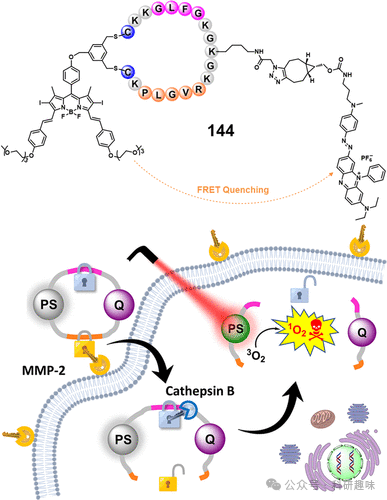

 

#  【PDT诊疗探针】酶激活治疗诊断荧光探针 
 

‍
‍

**诊疗一体化荧光探针**

Theranostic Fluorescent Probes

**PDT中的酶激活治疗诊断荧光探针**

酶，作为生命体中新陈代谢不可或缺的催化核心，其活性的异常升高与多种复杂的病理过程紧密交织，包括肿瘤新生血管的形成、细胞侵袭以及转移等。迄今为止，科研人员已在多样的肿瘤模型中鉴别出众多过表达的酶类，并在生物学专家的协助下，深入揭示了这些酶所作用的特定生物分子底物。这些独特的底物为设计“智能化”光疗药物提供了宝贵的契机。这类药物的光响应特性由特定的酶激活，实现了对病变细胞的精准打击，同时有效避免了皮肤及周边正常细胞的非特异性伤害，显著降低了副作用的风险。相较于其他肿瘤标志物，如酸性pH环境、增强的氧化还原条件及ROS水平升高等，基于酶催化的底物转化过程通常表现出反应速率适中、条件温和及高度靶向性等显著优势。这些特点赋予了酶触发式光敏剂（PS）卓越的检测灵敏度和较低的误报率。因此，借助与癌症代谢密切相关的酶系统来开发可控激活的PS，已成为该领域内一个极具吸引力的研究方向。本章节将深入探讨若干典型的酶激活型“智能”PS实例，这些光疗制剂的激活分别受到硝基还原酶（NTR）、偶氮还原酶、木瓜蛋白酶、β-半乳糖苷酶、碱性磷酸酶、酪氨酸酶、γ-谷氨酰转肽酶以及氨肽酶等多种酶的介导。
**PDT中硝基还原酶激活的治疗诊断探针**
硝基还原酶，作为一种高度特异性的酶类，在乏氧环境下，特别是在缺氧性实体肿瘤中展现出了异常的活跃性，这是由于肿瘤微环境中的氧气水平较低所致。该酶在还原型烟酰胺腺嘌呤二核苷酸（NADH）作为电子供体的作用下，能有效催化硝基芳烃化合物转变为对应的氨基芳烃化合物。基于这一独特的生化还原特性，科研人员巧妙地在染料分子骨架中引入了硝基芳族基团，成功开发了一系列创新的、针对缺氧条件响应的诊疗性探针。这些探针的设计旨在精准医疗干预中发挥关键作用，为疾病诊断和治疗提供了新的策略。
1

**对硝基苯甲酸酯基**

鉴于对硝基苯甲酸酯结构与硝基硫醇还原酶（NTR）之间所展现的强烈氢键相互作用和优异的空间契合度，该基团被视作理想的NTR底物候选。其特性包括反应迅速、高度灵敏及卓越的选择性。彭志刚研究团队在多种光敏聚合物（PS）骨架中嵌入此功能团，成功开发出了一系列NTR激活型光电诊疗试剂。这些试剂主要依赖于光电转换（PET）与电荷转移（ICT）机制实现其功能。例如，该团队介绍了一种基于4-硝基苄基修饰的碘代半氰胺型近红外光敏染料（115-N）的缺氧响应性D-π-A型光敏剂。其设计精妙地结合了对硝基苯甲酸酯基团与苯酚羟基。如图62所示，在此设计中，该基团的引入有效抑制了ICT过程，导致荧光减弱及单线态氧（¹O₂）产量降低。然而，在缺氧的肿瘤细胞环境中，由于内源性NTR的过表达，115-N被还原为115-OH。由于限制结构的去除，115-OH恢复了ICT过程，显著增强了其光敏性能。值得注意的是，115-N在正常组织中保持荧光淬灭状态，展现出极低的光毒性。但在660nm激光照射下，该光敏剂在缺氧肿瘤部位能诱发细胞凋亡并抑制肿瘤增殖。这一特性充分展示了该光敏剂在肿瘤缺氧成像及光动力治疗上的高选择性潜力。图62.NTR对115-N的识别机制。此外，为了应对轻度缺氧的肿瘤环境，研究团队精心设计了两款基于时间分辨荧光（TADF）技术的荧光素衍生物——116与117（如图63所示），旨在实现精准的局部光疗应用。经过系统的筛选和评估，化合物117在NTR（硝基硫醇还原酶）的选择性识别和反应速率上均展现出优于116的性能。特别值得注意的是，即便在10%的氧气浓度下，肿瘤内源性NTR仍能有效催化117转化为其活性形式118，确保在乏氧条件下依然能够维持高效的光动力治疗效果。这一设计不仅提升了光疗的精准性和效率，同时也为肿瘤治疗领域带来了新的可能性。图63.116–118的分子结构。
2

**硝基咪唑基**

Li及其研究团队独具匠心地合成了一种新型的硝基硫醇还原酶（NTR）响应性近红外光敏剂（PS）119。该光敏剂不仅具备内源性内质网（ER）靶向能力，还展现出乏氧耗损的I型光敏特性，确保了在常氧及乏氧环境下对癌细胞的强大光毒性作用。（参考文献388）如图64所示，通过巧妙地将核心结构的羟基与2-硝基咪唑基团接合，119-Im被设计为特异性地识别NTR的模块。为了改善水溶性并促进肿瘤部位的积累，119-Im经过聚合物自组装封装成稳定的球形纳米颗粒（119-Im-NP），这些纳米粒子展现出卓越的胶体稳定性。正如预期，在纳米粒子内部，由于酚羟基的包埋，119-Im的荧光及光敏活性受到抑制，这是由于内部电荷转移（ICT）过程受到了限制。然而，一旦119-Im-NP被癌细胞摄取，其中封装的119-Im在细胞内的高表达NTR和缺氧环境的特异性激活下，转变为活性形式119。激活后的119展现出对ER的高度定位能力，皮尔逊相关系数高达0.97，证实了其在ER中的高度富集。在光照下，119能够高效地生成超氧阴离子（O2--）和羟基自由基（-OH），这些活性物质能够引发ER应激及蛋白质折叠错误，导致ER功能严重紊乱。综上所述，119-Im-NP凭借其独特的缺氧激活性、精准的ER靶向能力以及乏氧耗损的I型光敏特性，在乏氧肿瘤细胞中展现出卓越的选择性和高效的光动力治疗（PDT）效果，有效抑制了实体瘤的生长。这一研究为克服肿瘤治疗中常见的非特异性毒性和缺氧耐药性难题提供了新的光敏剂模型。图64.NTR可激活的PS119-Im的示意图。该图经参考文献许可转载。英国皇家化学学会版权所有。
**PDT中偶氮还原酶激活的治疗诊断探针**
偶氮还原酶，作为缺氧条件下的关键酶类之一，已证实其在乏氧细胞，特别是实体肿瘤中显著过表达。该酶通过催化偶氮基团至氨基衍生物的还原反应，成为评估肿瘤缺氧状态的重要生物学标志。基于此，偶氮化合物被巧妙设计用于构建光敏剂（PSs）的保护性笼状结构，实现光敏性的人工调控，进而开发出针对缺氧肿瘤环境的“开关式”光动力治疗（PDT）探针。传统光敏剂面临光穿透深度有限、缺氧响应不足及肿瘤靶向性不佳等挑战，限制了PDT治疗效果。为克服这些障碍，Kim等人创新性地设计了一种既对缺氧敏感又适用于双光子激发的I型光敏剂，并通过引入特定的靶向基团提升其性能。鉴于双光子激发技术在增强组织穿透力和精准定位方面的优势，研究团队选择了与I型机制兼容的光敏剂作为基础，合成了一系列环化氰基衍生物（120）。如图65所示，这些化合物展现出极高的荧光发射效率（量子产率高达60%）和优异的双光子吸收截面（最高达103 GM）。与常见的I型PDT前体药物5-ALA相比，这些无重金属设计的小分子展现出更强大的ROS生成潜力，且双光子激发方式更为高效。通过在染料分子骨架上引入偶氮基团，成功合成了两款缺氧敏感的笼形光敏剂120a和120b。这些化合物在被富含偶氮还原酶的癌细胞摄取后，能迅速响应并高效清除癌细胞，同时几乎不产生暗毒性。最近，研究团队更进一步，通过将光敏剂与生物素等靶向基团结合，成功开发出针对结肠癌的高度时空选择性的双光子光导疗法制剂121（见图65），这标志着在精准治疗领域取得了重大进展。图65.治疗诊断探针120和121的结构。在乏氧微环境的肿瘤组织，特别是实体瘤的深层区域，氧气供应的不足极大地限制了光动力疗法（PDT）的实施效果，从而影响了治疗成效。为了克服这一挑战，Liu和Kim等科研团队创造性地设计了一种名为122-偶氮的复合治疗分子，旨在实现乏氧环境下实体瘤的化疗与光疗协同作用（如图66所示）。该分子122-偶氮巧妙地通过一个偶氮桥（-N=N-）将罗丹明类近红外荧光团（122）与氮芥连接起来，构建了一个新颖的治疗载体。在122-偶氮中，其内部的π-π堆积作用以及受抑的内部转换（ICT）过程有效地抑制了荧光发射。与先前报道的激活型光敏剂相比，122-偶氮展现出了卓越的活性氧（ROS）生成效率（ΦΔ=0.14），而其母体化合物122则不具备此性质。这一独特特性赋予了122-偶氮一种双模式的抗癌机制，使其在常氧和乏氧环境中均能发挥治疗潜力。具体而言，在肿瘤的表面区域，122-偶氮在光照下表现出明显的褪色效应，并借助较低水平的偶氮还原酶表达，有效地清除了常氧状态下的癌细胞。这可能是由于酶在较低水平下未能有效断裂偶氮键所致。而在肿瘤的深层区域，乏氧诱导的偶氮键还原促使122荧光团与活性氮芥的释放，通过化学疗法对缺氧肿瘤细胞实施精准打击。这一动态过程不仅增强了治疗效果，还便于实时监控药物释放的剂量与速率，实现了治疗过程的可视化管理。综上所述，这种通过同步作用于常氧和缺氧环境中的肿瘤细胞的策略，显著提升了实体瘤治疗的综合疗效，展示了高度的治疗策略创新性与应用潜力。图66.治疗诊断构建体122-Azo的设计和化学结构。
**PDT中的组织蛋白酶B激活治疗诊断探针**
Cathepsin B (CTSB)，作为一种定位于溶酶体的半胱氨酸蛋白酶，在多种肿瘤类型中呈现高表达状态。其外泌后能催化降解细胞外基质成分，如胶原、层粘连蛋白和纤连蛋白，进而在癌症的演进过程中促进肿瘤侵袭与转移能力的增强。CTSB的异常表达及其活性状态已成为重要的病理标志物，为癌症特异性成像及治疗药物的设计提供了关键指导。在此背景下，Lo等人精心构建了一种对Cathepsin B响应的荧光探针兼光敏剂复合体123。该复合体融合了锌(II)酞菁基光敏剂、新型二茂铁BODIPY型暗态淬灭基团，以及可特异性被Cathepsin B裂解的肽底物序列(Gly-Phe-Leu-Gly-Lys)。如图67所示，在缺乏Cathepsin B的环境下，复合体123仅表现出微弱的近红外荧光和有限的单线态氧(¹O₂)产生效率。这是由于锌(II)酞菁与BODIPY单元间存在的能量共振转移(FRET)以及后续电子给体-受体对（二茂铁）的电子转移(PET)过程。然而，一旦Cathepsin B介入并裂解肽底物，酞菁与二茂铁BODIPY单元分离，有效抑制了FRET-PET效应，从而恢复了锌(II)酞菁的光敏特性。在610 nm光照射条件下，复合体123对富含CTSB的HepG2细胞展现出了极高的光毒性，其半数抑制浓度(IC50)仅为0.32 μM。这一结果明确证明了复合体123作为一类高效的Cathepsin B激活型光敏剂的巨大潜力，为癌症治疗领域带来了新的希望。图67.示意图显示基于FRET-PET工艺的组织蛋白酶B可激活PS123的工作原理。Chen等人独具匠心，设计出一种基于BODIPY的Cathepsin B激活型光敏剂PS125。其核心机制巧妙地利用了分子内电荷转移（ICT）效应。在PS125的结构中，通过氨基苄氧羰基桥梁，正交排列的BODIPY单元（即PS124）与炔基功能化的Cathepsin B特异性肽底物（炔基-Gly-Phe-Leu-Gly）被共价连接，其结构布局如图68所示。该肽底物的引入有效抑制了PS124中氨基的电子供体功能，进而阻碍了ICT进程，显著降低了单线态氧(¹O₂)的生成。为了提升肿瘤靶向性和抗肿瘤效果，PS125进一步与环肽cRGD修饰的PEG链（126）结合，形成复合物127，作为一种智能纳米载体，用于封装并递送疏水性化疗药物10-羟基喜树碱(HCPT)。凭借cRGD肽段对肿瘤细胞的靶向性，封装了HCPT的复合物128在αvβ3整合素高表达的4T1细胞中展现出极强的特异性细胞摄入能力，并在4T1三维肿瘤球模型中显著增强了穿透深度。相比之下，在αvβ3低表达的HeLa细胞中，其作用则相对有限。特别值得一提的是，一旦进入细胞内，Cathepsin B特异性裂解肽序列，释放了对氨基的限制，这不仅激活了PS124的光动力治疗(PDT)活性，还同步释放了HCPT。两者的协同作用高效诱导了4T1细胞凋亡，显著减小了三维肿瘤球的尺寸。这一研究为Cathepsin B响应型光敏剂的开发及构建高效抗肿瘤治疗体系提供了新的策略思路。图68.125、126和127的合成、128nm颗粒的形成以及可激活PS的机制的示意图。
**PDT中的β-半乳糖苷酶可激活治疗诊断荧光探针**
β-半乳糖苷酶（β-galactosidase，简称β-gal）是一种定位于细胞溶酶体的关键碳水化合物裂解酶，它通过催化糖苷键的断裂，促进乳糖向半乳糖的转化，从而发挥其生物学功能。（399,400）尽管β-gal在原发性卵巢癌和胶质母细胞瘤等癌症中表现出过表达的特性，但通常并未被视为癌症的经典生物标志物。然而，最新的研究揭示了β-gal作为细胞衰老关键标志物的重要性，这推动了针对衰老细胞选择性清除策略的研发。具体而言，Urano等人创新性地设计了一种针对lacZ阳性细胞的激活型光敏剂129，旨在实现这些细胞的精确剔除（如图69所示）。该光敏剂129基于硒代罗丹明衍生物构建，通过在4位引入氟甲基作为活性亲电中心，实现了特定的生物活性。实验测定显示，129具有5.4的环化常数pKcycl，这意味着在生理pH 7.4条件下，该分子主要呈现为闭环、无色且非光毒性的状态。相比之下，参照物130的pKcycl为10.3，pKa为4.8，表明在相同pH环境下，参照物更倾向于以开环和光毒性形态存在（光产生活性量子产率ΦΔ=0.36）。光敏剂129在水解过程中能够生成醌甲酰胺中间体，这一过程不仅激活了其光敏特性，还增强了其对亲核试剂的反应性，确保该光敏剂能够特异性地滞留在表达β-gal的细胞内部。此外，这种机制实现了对β-gal表达细胞的单细胞水平选择性杀伤。在果蝇模型中的成功验证预示着129在体内应用的巨大潜力，标志着在利用生物标志物指导的光动力疗法领域取得了重要进展。图69.靶向β-半乳糖苷酶的可激活PS以及HEK293和HEK-lacZ(+)细胞共培养物的延时荧光成像。HEK-lacZ(+)细胞和HEK293细胞分别用CellTrackerBlue和CellTrackerGreen预染色。基于相似的化学反应原理，Li及其团队独具匠心地合成了一种光响应型衰老诱导前体化合物131，该化合物在衰老相关β-半乳糖苷酶(SA-β-gal)存在下能够特异性激活，展现了卓越的分子设计（如图70所示）。为了提升体系间的协同作用并确保光治疗的高效性，研究者精心地将二氰亚甲基-4H-吡喃骨架中的氧原子替换为硒原子，这一策略性修饰显著增强了化合物的生物相容性和反应性。实验数据揭示，在含有大肠杆菌来源的β-galactosidase和牛血清白蛋白(BSA)的环境中，化合物131的光物理性质得到优化，其光产生活性量子产率(ΦΔ)从0.07显著提升至0.20，而荧光量子产率相应降低至0.08，表明光敏剂的光能转换效率大幅提高，同时减少了背景荧光干扰。这一结构改性策略不仅使131对衰老细胞展现出高度的靶向性和广谱的杀伤能力，还显著降低了对非目标区域的潜在光毒性影响。在实际应用中，无论是阿霉素诱导的衰老小鼠模型还是自然衰老的小鼠模型，131介导的光动力治疗均能精准地清除生物体组织中的衰老细胞群体，充分展现了其在精准抗衰领域的巨大潜力。此项研究不仅为衰老细胞的识别与干预提供了新的策略，也为通过调控衰老过程来延缓与衰老相关的疾病发展开辟了新的研究道路。图70.用于设计治疗探针131的综合策略。
**PDT中的碱性磷酸酶激活治疗诊断探针**
碱性磷酸酶（ALP），作为一种膜结合的水解酶，广泛涉及细胞内外的去磷酸化过程，对于蛋白质磷酸化、细胞增殖、凋亡及迁移等生物学关键事件起着重要的调控作用。其活性异常升高与乳腺癌、前列腺癌、肾肿瘤及骨肉瘤等多种疾病密切相关，因此在临床诊断中被视为关键生物标志物。尽管针对ALP阳性细胞的荧光探针已有多种报道，但具备ALP特异性激活机制的光敏剂（PS）的文献尚属稀缺。在这一背景下，Li及其研究团队创新性地采用硒代二氰亚甲基-4H-色烯作为电子受体，并以2,6-二碘苯酚作为电子供体，精心构建了一种新型D-π-A型光敏剂骨架，命名为132Se-I（如图71所示）。通过引入重硒原子，132Se-I不仅实现了光谱红移，还显著提升了单线态氧(¹O₂)的生成效率，这对于深层肿瘤组织的光动力治疗具有显著优势。同时，两个垂直碘原子的引入不仅增强了光敏性，还通过降低酚羟基的pKa值，优化了其在生理pH 7.4条件下的光动力响应。通过将磷酸基团（作为保护基团及ALP识别位点）与132Se-I的酚羟基进行共价连接，研究团队成功制备出了一种特异性ALP可激活的光敏剂（ALP132）。在ALP132中，由于磷酸化作用导致酚羟基的电子供体能力减弱，从而抑制了分子内电荷转移（ICT）过程，使光敏性暂时失活。然而，当暴露于ALP或在高表达ALP的活性HeLa细胞培养环境中时，ALP132迅速转化为132Se-I，恢复了原本被抑制的荧光与光敏性。活/死细胞染色与MTT实验均证实，ALP132能显著减少HeLa细胞的存活率。综上所述，本研究成功展示了一种通过酚羟基的保护与去保护策略，实现ALP触发的光敏性开关控制的有效设计方法，为未来的生物医学研究和临床应用提供了新的思路。图71.ALP可激活PS的设计示意图(ALP132)。传统的发光材料因其平面结构，常常因分子间强烈的π-π堆积作用而遭遇聚集淬灭效应（ACQ），这极大地限制了它们在生物体系中的应用浓度。然而，近年来，聚集诱导发光分子（AIEgens）作为一种新兴的荧光材料，展现出了独特的优势。这类材料在聚集状态下不仅不会减弱荧光发射，反而能显著增强荧光强度，并具备出色的抗光漂白性能和高效产生活性氧物种（ROS）的能力。这些特性为提升生物成像的信噪比和光疗效果提供了巨大的潜力。目前，基于AIEgens的可激活荧光探针已在多个生物医学领域得到了广泛的研究和应用。近期，Tang和He等研究人员成功设计了一种针对碱性磷酸酶（ALP）激活的AIE荧光光敏剂——133P。该分子以三苯胺衍生物为核心，巧妙结合了磷酸酯基团作为ALP的识别标签（如图72所示），实现了对ALP高表达癌细胞的特异性识别和清除。在水溶液中，探针133P保持非荧光状态，然而，当与ALP接触后，其磷酸酯基团经过酶促水解作用，转化为133，进而引发分子聚集并发出明亮的黄色荧光（λem=540nm）。这种由ALP介导的特异性荧光响应使得133P能够有效区分癌细胞与正常细胞，并基于荧光强度的差异，量化细胞内ALP的活性水平。值得注意的是，尽管133P及其前体133在光照条件下不能直接产生¹O₂，但它们却能高效地诱导羟基自由基和超氧阴离子自由基的生成。其中，133的ROS生成效率略高于133P，且两者均展现出优于市售光敏剂（如Ce6）的性能。鉴于癌细胞与正常细胞在ALP表达和激活特性上的差异，133P在癌细胞内的聚集诱导ROS产生效率显著高于正常细胞，从而实现了对癌细胞的选择性杀伤。这一研究成果为开发癌症特异性生物标志物响应型AIE光敏剂提供了新的策略。图72.癌细胞中细胞内ALP水解133P的示意图。
**PDT中酪氨酸酶激活的治疗诊断探针**
黑色素瘤是一种具有极高侵袭性的皮肤癌，其特征为快速的肿瘤增长和早期的转移。在这一癌症的发展过程中，酪氨酸酶（TYR），一种含铜的氧化酶，在黑色素生物合成途径中发挥着核心作用。它催化单酚或儿茶酚转变为邻位醌结构，是调控从酪氨酸到黑色素转化速率的关键酶。在黑色素瘤细胞中，TYR的过度表达尤为显著，因此，它成为诊断和治疗这一恶性疾病的重要生物标志物。在此背景下，Sundus Erbas-Cakmak及其团队突破性地设计并合成了首个基于BODIPY结构的酪氨酸酶响应性光动力治疗（PDT）制剂（如图73所示）。他们精心选择了碘代BODIPY作为光敏剂（PS）的核心结构，并巧妙地引入了3-羟基苄基单元作为TYR的底物。此外，通过乙酰基修饰，不仅增强了化合物的细胞摄取能力，还提高了TYR催化的氧化反应效率。由于与吸电子吡啶基团的电子供体-受体能量转移（PET）效应，核心BODIPY的光敏特性被有效抑制。当该化合物进入癌细胞后，会经历酯酶的快速水解，形成中间体1（134a）。随后，在TYR的催化下，134a氧化转变成中间体2（134b）。当分子转变为3,4-二羟基苄基结构时，会自发地通过1,6-去烷基化过程释放出135。这一转变消除了PET效应，使得135的光敏特性显著增强，特别是其产生活性氧物种（¹O₂）的能力。实验测定显示，相比于134的量子产率0.02，135的量子产率大幅提升至0.64，这充分证明了该设计策略的高度有效性和创新性。图73.酶响应型PS134的结构和拟议的作用机制。非活性134通过酯酶和酪氨酸酶催化的反应转化为活性135。为实现早期黑色素瘤的精准荧光成像与光诱导治疗，Yoon等人创造性地合成了一种内源性酪氨酸酶激活的环金属化铂(II)配位化合物，命名为136-tyro。此化合物巧妙地将3-羟基苄氧基基团（作为酪氨酸酶的特异性识别模块）与环金属铂(II)配合物的C∧N配位基团的苯环臂（作为光敏剂的核心结构）相结合。如图74所示，在酪氨酸酶的作用下，136-tyro迅速经历结构重排与消除过程，转化为其衍生物136-OH。这一转化在530nm波长下导致显著的荧光信号衰减现象。尤为引人注目的是，与原始形态136-tyro相比，136-OH展现出显著增强的光敏特性，这归因于其延长的三重态寿命。这种特性不仅使136-tyro能够特异性靶向并显像A375细胞（源于人类的黑色素瘤细胞系）内的内源性酪氨酸酶活动，而且还能够在体外和体内实验中有效抑制A375细胞的增殖，并显著抑制Balb/c小鼠模型中肿瘤的生长。这一创新性的设计为黑色素瘤的诊疗提供了新的视角和有力的工具。图74.用于酪氨酸酶成像和PDT的136-tyro方案。
**PDT中的GGT可激活治疗诊断探针**
γ-谷氨酰转肽酶（GGT），作为一种关键的膜结合酶，其主要功能在于催化谷胱甘肽（GSH）的γ-谷氨酰键断裂，生成半胱氨酰-甘氨酸（Cys-Gly），对维持细胞内GSH与半胱氨酸的稳态起到重要作用。GGT在多种恶性肿瘤细胞膜上如胶质瘤、肝癌、肺癌及卵巢癌等呈现高表达状态，其活性升高与肿瘤发展、侵袭性增强及耐药机制紧密相关，因此，GGT不仅是肿瘤诊断的重要生物标志物，也是治疗干预的潜在靶标。特别地，l-谷氨酸通过侧链修饰被证实为GGT的特异性激活剂，能够启动荧光团的遮蔽与GGT活性的感应过程。为了克服传统光动力疗法（PDT）中光敏剂（PS）非特异性分布的局限性，并实现肿瘤部位的特异性荧光成像，Han与Li等科研人员设计并合成了一种多功能小分子探针137。该探针融合了I型光敏剂（ENBS）、硫醇连接的荧光报告基团（罗丹明，Rd）以及GGT响应的l-谷氨酸单元（见图75）。在复合物137中，ENBS的荧光发射与ROS生成性能未受罗丹明荧光的干扰，而罗丹明的荧光则因ENBS-Rd间的荧光共振能量转移（FRET）效应而保持静默状态。当遇到肿瘤环境中的GGT催化时，137能够释放罗丹明与ENBS，从而激活罗丹明的荧光信号。释放的组分随后在溶酶体内积聚，溶酶体作为触发细胞凋亡的关键细胞器。在光照条件下，137在U87细胞（GGT阳性）中诱导的细胞死亡率是LO2细胞（GGT阴性）的两倍，显示出其高效的肿瘤杀伤潜力。在携带皮下U87肿瘤的BALB/c裸鼠模型中，137展现出仅针对肿瘤组织而非健康组织的强烈罗丹明荧光，凸显了其利用肿瘤激活的荧光“点亮”策略来区分肿瘤与正常组织的能力，为光疗提供了精确的导向。综上所述，本研究成功开发了一种荧光淬灭的PS-染料系统，该系统能在肿瘤特异性激活下产生独立于PS的荧光信号，进而指导局部光疗的精确实施。图75.GGT介导的治疗诊断探针138和139从137的释放。
**PDT中的氨肽酶N可激活治疗诊断探针**
氨基肽酶N（APN/CD13），作为一种典型的Ⅱ型锌离子依赖型膜整合金属蛋白酶，专门负责从蛋白质或多肽的N端切除亮氨酸残基。在恶性肿瘤的增殖、分化、转移及新生血管形成等关键过程中，APN发挥着至关重要的作用。大量的实验数据表明，APN在多种肿瘤类型的细胞膜上显著过度表达，其表达水平可高达正常组织的十倍，特别是在结肠癌、卵巢癌、乳腺癌及肝癌等恶性肿瘤中表现尤为突出。因此，APN已成为癌症研究中的一个独特生物标志物，并且因其高度的肿瘤特异性而成为设计选择性激活型荧光探针及治疗药物的热门靶标。Peng及其团队创新性地研发了一种名为APN-140的APN激活型近红外光敏剂。该分子巧妙地将碘代半氰基团与l-丙氨酸通过4-氨基苄醇桥接（如图76所示）。在非肿瘤性细胞环境中，APN-140保持“非激活”或“关闭”状态，其荧光信号受到抑制且光毒性较低，这主要归因于分子内部电子转移（ICT）过程的有效阻断。然而，在APN过表达的肿瘤细胞中，该酶特异性地识别并切断l-丙氨酸与4-氨基苄醇之间的酰胺键，随后自发经历1,6-消除反应，生成产物140-OH。相较于前体APN-140，140-OH展现出显著增强的近红外荧光强度和单线态氧（¹O₂）产率，并且优先积累于对活性氧簇（ROS）敏感性高的线粒体中。当受到660nm激光照射时，APN-140通过损伤线粒体结构高效地诱导癌细胞凋亡。这一机制的关键在于其能够有效区分癌细胞与正常细胞，从而实现对癌细胞的特异性清除，展现出卓越的抗肿瘤潜力。图76.APN-140与APN的响应机制。
**其他激活方法**
在光敏剂（PS）的研究领域，除了已提及的激活策略，科研人员亦在探索其他创新可激活光敏剂方面取得了显著成果。这些前沿研究主要聚焦于利用特定生物标志物作为激活钥匙，旨在为特定疾病量身定制高效的光敏剂。此类创新致力于通过精准的分子识别机制，优化光动力疗法在复杂生物环境中的治疗针对性和效率，进而确保治疗的安全性和有效性。
1

**F–激活**

氟作为一种公认的龋病预防剂，在口腔健康领域具有不可或缺的地位。其防护机制主要基于氟离子被口腔内的牙菌斑生物膜摄取，进而形成局部氟化物储备库。基于这一生物学原理，Yi及其团队精心研发了一系列氟敏感型光敏剂（PSs）141，以实现牙菌斑的精准可视化与干预（如图77所示）。这些创新的141PSs通过将无色的MB前体与带有不同硅基保护基（如TBDPS、TIPS和TBDMS）的分子巧妙偶联，利用了氟离子能够特异性且迅速断裂硅基醚键的特性。实验数据表明，变体141c在氟激活性能方面表现卓越，具有高效的脱硅速率、出色的选择性以及极低的检测阈值。尤为值得关注的是，141c不仅通过MB在近红外区域的荧光特性，实现了对人体牙菌斑生物膜在自然状态下的精确定位与成像，还成功展示了氟激活下控制的光动力抗菌治疗潜力，为氟化物介导的靶向口腔疾病治疗策略开辟了新的研究道路。图77.本工作中141种和三种候选治疗诊断探针的氟化物激活MB释放平台。
1

**光活化**

光响应性分子在荧光探针技术和超分辨率影像学等领域展现出的独特潜力，已成为激活手段的焦点，推动科研人员对基于染料核心结构衍生的光开关机制进行深入研究。最近，Tang等科研团队成功合成了一种新型紫外光调控的光敏剂（PS）142，其分子设计精妙，将四苯基乙烯（TPE）与二芳基噻吩（DAE）单元巧妙地融入苯并噻吩环的6位置（如图78所示），体现了分子设计艺术的精湛之处。在初始开放构象（OF）下，分子142展现出短波长的吸收与发射特性，并伴随有聚集诱导发光（AIE）现象。然而，一旦受到365nm紫外光的照射，该分子将迅速转变为封闭构象（CF），这一过程伴随着显著的光谱红移，使其发射波长移至可见光区域（λem=660nm），同时荧光强度显著增强，光敏活性亦大幅提升。为了增强其在水溶液中的溶解性和促进细胞内吞，研究人员进一步将142包裹于F-127聚合物中，形成142nm的纳米颗粒（142-NP）。在HeLa细胞模型中进行的实验验证了142-NP的光激活放疗效果，揭示了光诱导的细胞毒性与细胞凋亡或坏死过程之间的紧密联系。这一研究不仅为光开关技术在精准时空控制的光激活治疗策略中的应用提供了有力支持，也为未来相关领域的研究开辟了新的方向。图78.治疗诊断探针142（闭合形式）在光照射下化学转变为143（开放形式）。
1

**酶响应双锁分子信标**

光动力分子信标（PMB）作为一种内源性光敏剂（PS），其功能特性源于分子内部能量或电子转移触发的自我淬灭机制。PMB分子的设计通常整合了三个核心组成部分：一是光敏单元（PS），二是能量淬灭组件，三是针对特定刺激因子（如特异性酶）敏感的键。在PMB的设计中，一种常见的策略是采用光敏剂（PS）与淬灭剂之间的共振能量转移（RET）机制，通过这一机制，PS激发态的能量被传递到淬灭剂，从而有效抑制活性氧物种（ROS）的生成。然而，当键在目标环境（如肿瘤细胞）中遭遇特定酶（如金属蛋白酶-2或组织蛋白酶B）的切割作用而断裂时，PS与淬灭剂的空间隔离会中断RET过程，进而释放ROS并触发光动力效应。Ng和Lo等人报道了一种精心设计的PMB分子144（图79），该分子基于经典的碘化BODIPY平台，结合了高效的黑洞淬灭剂BHQ-3，并嵌入了对金属蛋白酶-2（MMP-2）和组织蛋白酶B敏感的PLGVR和GFLG环肽序列。在此体系中，BODIPY的激发态能量被BHQ-3完全淬灭，使144分子保持“非活性”状态（荧光量子产率ΦF=0.01，单线态氧量子产率ΦΔ=0.02），从而显著降低了对健康组织的潜在损伤。当被富含MMP-2的癌细胞（如A549细胞系）摄取后，经过特定酶的级联作用，能够释放出具有高效光动力活性的DSBDP片段，从而重新激活光动力性能。值得注意的是，释放的染料倾向于在癌细胞的溶酶体内累积，并在波长大于610nm的光照（条件为23mWcm^-2，28Jcm^-2）下被激发，显著促进了肿瘤细胞的凋亡（A549细胞的半数抑制浓度IC50为0.78±0.04μM）。动物实验进一步验证了144在A549肿瘤小鼠模型中能有效抑制肿瘤生长，且未观察到显著的副作用，特别是避免了传统常开型PS常见的皮肤光敏反应问题，展现了其作为精准光动力治疗策略的巨大潜力和安全性。图79.双锁治疗诊断探针144的分子结构。经参考文献许可转载。版权所有2023美国化学会。参考文献：Sharma, A.; Verwilst, P.; Li, M.; Ma, D.; Singh, N.; Yoo, J.; Kim, Y.; Yang, Y.; Zhu, J.-H.; Huang, H.; Hu, X.-L.; He, X.-P.; Zeng, L.; James, T. D.; Peng, X.; Sessler, J. L.; Kim, J. S. Theranostic Fluorescent Probes. Chem. Rev. 2024, 124 (5), 2699–2804. https://doi.org/10.1021/acs.chemrev.3c00778.