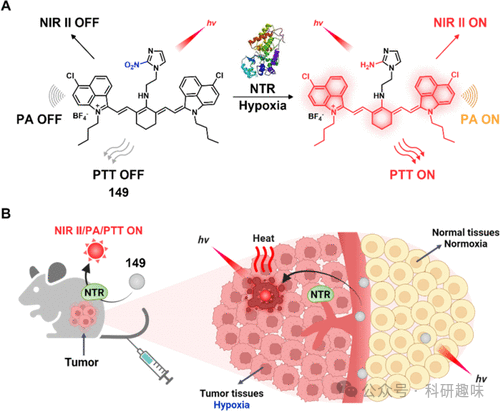
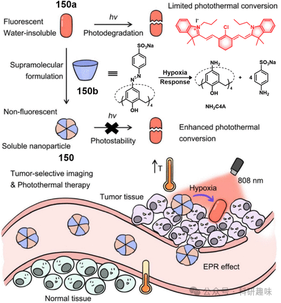
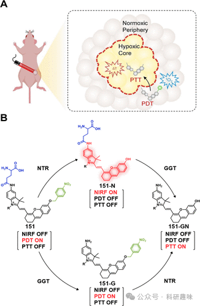
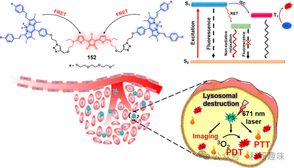
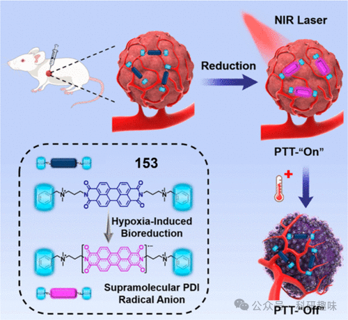
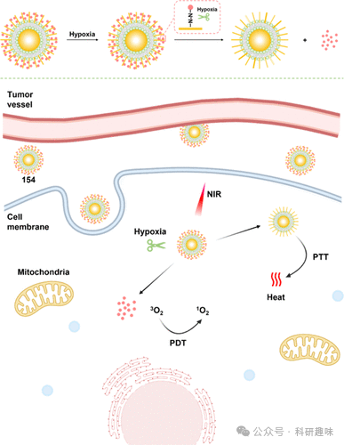

 

#  【PTT诊疗探针】缺氧激活治疗诊断荧光探针 
 

‍
‍

**诊疗一体化荧光探针**

Theranostic Fluorescent Probes

**PTT中的缺氧激活治疗诊断荧光探针**

缺氧，作为多数实体肿瘤及其微环境（TME）的显著特征，源于肿瘤细胞失控性增殖、血管生成异常及氧气供应受限，而这种现象在健康组织中较为罕见，因此被视为癌症治疗中极具针对性的生物标志。尽管肿瘤细胞已发展出多种机制来适应这种缺氧环境，从而增强其耐药性和生存能力，但光热疗法（PTT）作为一种无需氧气参与且能精准控制治疗区域和时机的方法，在治疗缺氧性肿瘤中展现出巨大潜力，能有效诱导肿瘤细胞不可逆的热消融。为实现PTT的缺氧响应性，研究者们设计了缺氧靶向的递送载体携带光热剂，或是整合缺氧敏感基团以激活光热效应，这些策略对精准操控光热行为至关重要，并推动了新型缺氧响应性光热剂的发展。基于光热转换效应的PTT技术，在癌症治疗中显示出高效且低副作用的潜力，尤其是在提供高度肿瘤消融效率的同时，对周围正常组织影响甚微。在此背景下，Cai等人创新性地开发了编号为149的单分子探针，该探针巧妙地融合了缺氧响应性和硝基还原酶（NTR）酶促反应激活机制。通过共轭硝基咪唑基团（一种特异性的缺氧激活单元）与近红外-II/光声（PA）信号发射染料IR-1048的结合，探针149不仅支持近红外-II荧光成像，还能利用三维PA成像技术在深部组织中实现肿瘤的高对比度可视化。在缺氧肿瘤微环境的触发下，149探针被激活，展现出显著的光热转换效应及增强的近红外-II荧光，为肿瘤的精确定位和深度组织成像提供了强大工具，从而确保彻底且无残留的肿瘤消融效果。因此，这种多功能的149探针代表了一种快速且灵敏的缺氧响应型近红外-II荧光/光声成像探针，同时也是一种高效的小分子光热剂，为PTT治疗提供了新途径（图84）。图84.用于使肿瘤可视化并诱导NTR触发的PTT效应的NTR响应性NIR-II荧光/PA探针149的示意图。针对传统光热剂在疏水性和光稳定性上的不足，Guo及其研究团队通过巧妙的策略，将磺化偶氮羰基炔（SAC4A）与有机小分子光热材料IR780复合，成功构建了编号为150的先进超分子光热治疗（PTT）体系。这一创新设计显著提升了光热剂的水溶性、光稳定性以及光热转换效率。SAC4A及其细胞内还原产物NH2C4A，不仅为IR780提供了有效的光降解保护，还显著增强了其光热转换性能，从而大幅提升了PTT的治疗效果。该体系150还展现了独特的双模式成像引导功能。在缺氧的肿瘤微环境中，SAC4A发生结构变化并释放游离的IR780，实现从“荧光熄灭”（150状态）到“荧光激活”（IR780状态）的转变。这一智能响应不仅实现了细胞和活体水平上的肿瘤特异性成像，还同步触发了高效的超分子PTT过程（见图85）。这一设计策略不仅优化了光热治疗的靶向性和可视化程度，也为基于化学与材料科学的肿瘤诊疗一体化方案提供了新的方向。图85.使用150a和150b构建的超分子光热剂150的示意图。以及超分子纳米诊疗试剂150的肿瘤选择性成像和PTT应用。在精准癌症治疗的探索中，可激活的光热疗法（PTT）因其巨大的潜力而备受瞩目。然而，当前多数探针受限于单一的光动力疗法（PDT）或光热作用，面对细胞缺氧及复杂的肿瘤微环境（TME）时，其治疗效果往往受限。为了克服这一挑战，Pu等人巧妙地设计了一种双锁定机制的可激活光热探针151。该探针能在肿瘤部位产生近红外荧光（NIRF）信号，并根据肿瘤边缘与核心不同的生物标记物反馈，智能地在PDT与PTT之间切换：在肿瘤周边，通过生物标记物触发PDT；而一旦探及肿瘤核心的缺氧标记，则迅速转为PTT模式。这种PDT-PTT自适应探针仅需单一激光激发，即可在肿瘤周边产生细胞毒性的单线态氧（¹O₂），同时于肿瘤中心产生热疗效应，以追求肿瘤的全面根除。因此，该双锁定探针为精准光热治疗提供了新的分子设计策略（图86）。此外，Peng等人借助单分子荧光共振能量转移（smFRET）的原理，将二碘二苯乙烯二吡啶（BDP）与氯柯纳因（CR）整合，开发出光敏剂BDP-CR（152）。这种PS在肿瘤中展现了PDT与PTT协同作用下的“1+1&gt;2”效应，拓宽了600-850nm近红外区域的光吸收谱带，提高了光捕获效率。面对不同的缺氧条件，BDP-CR展现出灵活的适应性：在轻度缺氧时，PDT通过光子能量激活氧气生成ROS；而在重度缺氧时，则主要依赖不依赖氧气的PTT途径来消灭癌细胞（图87）。针对PDT在缺氧环境下效率低下的问题，Liu等人研发了一种新型的硝基还原酶调控的硼二吡咯并二酮（BODIPY）基光敏剂Ion-BDP。Ion-BDP在近红外光照下既消耗氧气又产生ROS以支持放疗，而在无氧环境下，硝基还原酶能特异性切割Ion-BDP中的4-硝基苄基，释放出具有PTT功能的BDP。值得注意的是，Ion-BDP本身具有荧光特性，但在激活BDP的PeT（光致电子转移）效应下荧光减弱，这种“开关”式PS为采用单一光源同时激活PDT和PTT提供了一种模型，简化了多模式光疗的实施。此外，还有一系列展现PDT/PTT协同效应的双功能探针，如2TPAVDPP、TPATPEVDP、2TPEVDPP、AzoCyS-NNPs、LCT-CyI-TPZ等，这些探针进一步丰富了光治疗策略的多样性与效能。图86.(A)肿瘤中自动调节的PDT-PTT的示意图。(B)描述151在GGT和NTR存在下实时肿瘤成像和自动调节PDT-PTT的分子机制的方案。图87.基于smFRET的组合光疗机制和光触发的癌细胞死亡的示意图。为了增强超分子体系在肿瘤乏氧微环境中的光热转换性能，Zhang及其研究团队巧妙地结合了苝酰亚胺（PDI）衍生物与葫芦脲（CB），成功构筑了一种新颖的超分子复合物153。实验结果表明，该复合物153在乏氧条件下能够生成超分子过烯酰亚胺自由基阴离子，且其生成与消除过程可通过调节肿瘤区域的氧气水平实现精准控制。特别值得注意的是，通过有效淬灭这种超分子PDI自由基阴离子，实现了体系的“关闭-开启”切换机制，这一机制不仅显著提升了光热转换效率，而且有效抑制了乏氧诱导因子-1（HIF-1）的表达，为改善肿瘤治疗效果提供了新的策略（图88）。这一设计策略不仅拓展了光热疗法在复杂肿瘤环境中的应用前景，也展现了通过精细调控超分子相互作用来优化治疗响应的潜力。图88.肿瘤中原位缺氧诱导的超分子PDI自由基阴离子的示意图，用于具有受控“开-关”状态的特定PTT。除了结合光动力疗法（PDT）与光热疗法（PTT）的探针外，科研人员还深入探索了多种针对厌氧条件响应的多功能治疗体系，这些体系涵盖了从光热/生物影像到药物递送/气体治疗的协同策略。Chen等人特别设计了一种集肿瘤诊疗于一体的双模态纳米平台——Cy-C-S-NPs（标记为154-NPs）。该平台基于表面修饰有磷脂层的金纳米颗粒（C-S-NPs），通过表面涂层技术固定了近红外荧光染料Cy-DM。在正常的氧气充足环境中，C-S-NPs能有效抑制Cy-DM的荧光。然而，一旦进入肿瘤特异性的乏氧微环境，设计的偶氮键将断裂，从而释放Cy-DM分子并激活荧光信号。这一独特机制赋予了154-NPs利用荧光分子成像及拉曼成像技术，对肿瘤进行双重精准定位的能力。更重要的是，在近红外激光的激发下，这些纳米粒子能够同时执行PDT与PTT，对肿瘤实施高强度的联合治疗，展现出了卓越的治疗效果。安全性评估表明，154-NPs对心脏、肝脏、脾脏、肺和肾脏等主要健康器官几乎无副作用，这为其作为癌症治疗候选方案提供了广阔的前景（图89）。图89.154-NP检测肿瘤缺氧和PDT/PTT的机制。经参考文献（446）许可转载。版权所有2013英国皇家化学学会。在药物传输与光热/光动力特性的融合方面，研究者们展现出了创新性的策略。Lin及其团队精心设计了复合型前药BAC，通过缺氧敏感的偶氮苯链接分子，将化疗药物喜树碱(CPT)与荧光光热材料BODIPY巧妙地结合。随后，这一前药被封装于人血清白蛋白(HSA)内部，形成纳米载体(HSA@BAC)，以增强药物的溶解性和实现肿瘤靶向累积。在乏氧的肿瘤细胞环境中，由于偶氮还原酶的高表达，BAC结构会发生裂解，释放出游离的CPT，从而最大化化疗效果。此外，当受到730nm激光刺激时，HSA@BAC纳米粒子通过无需氧气参与的PTT机制产生热量，导致肿瘤细胞发生不可逆的凋亡。另一方面，Zhao等人则成功合成了复合纳米粒子NP1，该粒子由缺氧响应性共轭聚合物(P1)、多金属氢硫化物(H₂S)供体(P2)以及具有近红外吸收特性的aza-BODIPY染料(B1)组成。这一设计旨在实现H₂S的递送，并协同H₂S气体疗法与PTT。NP1的结构设计使其在乏氧条件下能够降解，激活P2的水解过程，从而持续释放H₂S。同时，B1组分在近红外光照下展现出卓越的光热转换效率，不仅能高效产热，还能显著抑制细胞色素c氧化酶(COXIV)的活性，阻断ATP合成途径，干扰线粒体呼吸链。这种设计策略显著增强了H₂S气体疗法与PTT在乏氧肿瘤微环境中的治疗协同作用，从而进一步提升了抗肿瘤疗效。参考文献：Sharma, A.; Verwilst, P.; Li, M.; Ma, D.; Singh, N.; Yoo, J.; Kim, Y.; Yang, Y.; Zhu, J.-H.; Huang, H.; Hu, X.-L.; He, X.-P.; Zeng, L.; James, T. D.; Peng, X.; Sessler, J. L.; Kim, J. S. Theranostic Fluorescent Probes. Chem. Rev. 2024, 124 (5), 2699–2804. https://doi.org/10.1021/acs.chemrev.3c00778.
**点击蓝字 关注我们**
‍
‍

预览时标签不可点

素材来源官方媒体/网络新闻

  继续滑动看下一个 

 轻触阅读原文 

    

