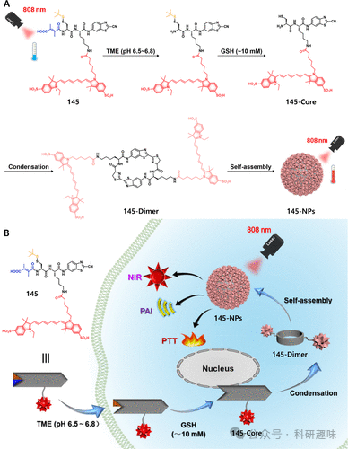
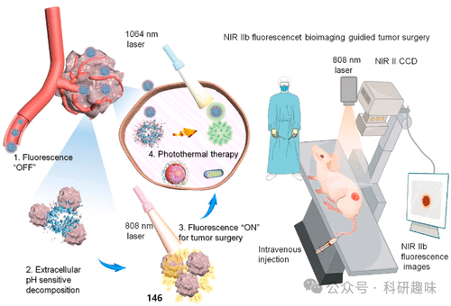
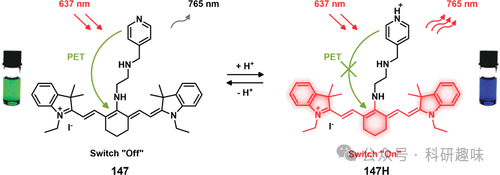
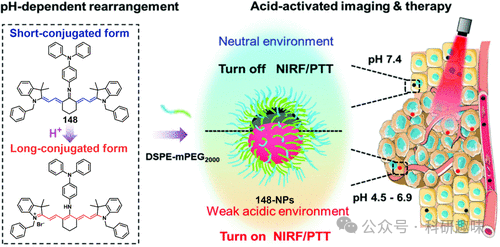

 

#  【PTT诊疗探针】肿瘤微环境(TME)激活的治疗诊断探针 
 

‍
‍

**诊疗一体化荧光探针**

Theranostic Fluorescent Probes

**PTT中肿瘤微环境(TME)激活的治疗诊断探针**

光热疗法（PTT）是一种利用温和且深透的红外光，在光敏剂（PS）的介导下，高效地将外部光能转化为热能，从而显著提升局部温度的方法。当这一光激活过程发生在肿瘤部位时，产生的热效应可直接用于杀灭癌细胞，无需依赖细胞毒性药物，展现了PTT技术的非侵入性和优异的生物相容性。其精准调控热疗区域及有效规避治疗耐药性的能力，使其备受科研人员关注。肿瘤微环境（TME）作为调控肿瘤生存、增殖及转移的关键因素，已成为开发新型激活型肿瘤成像与治疗策略的重要靶点。鉴于传统光热制剂（PTAs）在临床应用中的局限性，科研界近年来致力于探索能够响应TME特性的激活型PTAs，以实现癌症治疗的精准靶向。TME的一个显著特征是糖酵解异常导致的酸性pH环境，这为癌症的靶向诊断与治疗提供了新思路。基于此，Shi等人设计了一款创新的近红外（NIR）响应型光敏探针Cy-1（编号145）。该探针在酸性pH值和谷胱甘肽（GSH）的共同作用下被激活，并在癌细胞内部自发组装成纳米颗粒（145-NPs），如图80所示（参考文献419）。Cy-1探针通过细胞内吞进入肿瘤细胞后，在特有的弱酸环境下经历柠檬酸裂解和GSH介导的二硫键断裂，释放出游离的145-Core。这些富集的145-Core在癌细胞内进一步自组装成两性环状二聚体（145-Dimer）。这种分子间的π-π堆积作用促进了Cy-NPs的形成，不仅增强了其在肿瘤组织内的滞留性，还激活了高效的近红外/光声（PA）双模成像与体内光热治疗效果。图80.(A)低pH值和GSH介导的145-二聚体形成示意图，原位生成具有恢复光热转化的145-NP。(B)使用145-NP进行癌细胞激活双模成像和PTT的示意图。为提升光热剂（PTA）对特定肿瘤微环境（TME）的响应灵敏度，Liu及其团队针对生物标志物表达的个体差异，创新性地开发了一种基于pH敏感性的纳米探针系统（如图81所示）。该系统以近红外-IIb区（NIR-IIb）量子点PbS@CDS为核心，通过共轭连接至中空二氧化锰（MnO2）纳米壳表面，并进一步搭载分子探针IR1061，构建了复合纳米结构HvMnO2@Qds-IR1061（编号146）。此纳米探针系统巧妙地利用了吸收竞争诱导发射（ACIE）效应，确保在中性pH的正常组织环境中几乎不产生荧光信号。然而，一旦进入肿瘤组织特有的弱酸性TME，HvMnO2纳米壳将发生选择性降解，释放封装的IR1061，从而实现对肿瘤的特异性近红外成像。随后，通过1064nm波长激光对肿瘤区域进行5分钟的精准照射，局部温度迅速从21℃提升至72℃，成功实施了光热治疗（PTT），有效灭活了癌细胞。这种成像引导下的PTT策略不仅实现了诊断与治疗的高效整合，还为外科手术等临床应用提供了广阔的前景，展现出了巨大的应用潜力。图81.治疗诊断探针146的NIR荧光被低pH激活，以实现NIR-IIb荧光成像引导的实体瘤PTT。基于相似的设计原理，Park等人成功研发了一种新型的pH响应型纳米探针，名为FNP-I。该探针由碳化交联聚（乙二醇-聚（甲基丙烯酸磺基甜菜碱））与近红外光热染料IR825相结合而成。与此同时，Cai等人则选取了IR-822作为光热剂的基础，并通过在其结构中嵌入质子接受体——N1-(吡啶-4-甲基)乙烷-1,2-二胺（简称PY），构建了一种创新的荧光团-间隔基-受体型分子探针147。在初始状态下，探针147的荧光被有效淬灭（如图82所示）。当探针147被置于酸性肿瘤微环境（TME）中时，经历质子化过程后，其荧光特性被激活，展现出近红外荧光（NIRF）和光声（PA）双模成像能力。这一特性使得探针147能够精确地指导光热治疗的应用，展现出在精准医疗领域的巨大潜力和价值。图82.147作为NIRF/PA双模式成像引导PTT治疗的pH响应性治疗诊断探针的化学结构和示意图。据研究报道，病毒表面的粗糙特征归因于其密集的刺突结构，这些结构在病毒感染细胞过程中起到与细胞膜紧密互动的重要作用。受到这一生物特性的启发，Liu等人在2019年设计了一种具有生物模拟靶向治疗能力的纳米探针。通过生物启发的策略，该探针集成了红外荧光染料IR825、化疗药物PEM以及稀土金属Nd3+/Nd2+离子，构建了一种自导向的NIR-II纳米片。其中，Nd3+离子作为转换媒介，促进了类病毒纳米粒子的形成。探针表面覆盖了对肿瘤酸性环境敏感的PEG，从而构建了在生理条件下稳定的核壳分层结构，模拟了病毒的形态。当进入弱酸性肿瘤微环境（TME）时，该“球-病毒”结构发生逆转变，不仅提高了光热转换效率，还通过模拟病毒的粗糙表面增强了细胞粘附性，并激活了叶酸受体介导的自靶向机制，实现了对肿瘤的精准生物模拟靶向治疗。另一方面，Yan等人开发了一种创新的纳米平台，该平台在酸性激活与外部光照的双重作用下，能够协同执行光热疗法（PTT）和光动力疗法（PDT），并适用于精准的肿瘤靶向NIR成像引导治疗。该平台以pH响应性不对称溴化氰基团（BAC）作为激活型NIR PTT/PDT一体化试剂，与持久发光纳米颗粒（PLNPs）结合，并通过引入生物素化聚乙二醇（PEGBT）进行功能化，形成了高效的PTT/PDT纳米平台（PLNP-BAC-PEGBT），展现了出色的肿瘤靶向成像与治疗效果。在2022年，Yin等人利用酸激活的庚胺氰基酸（Cy-TPA，即148）开发了一种新型有机纳米探针（图83）。该探针在弱酸性肿瘤环境中能够“开启”PTT效应，同时恢复近红外荧光信号。148nm颗粒在肿瘤部位的累积和延长滞留时间显著增强了PTT效果，而其酸性激活的荧光信号为PTT治疗提供了直观的指示。此外，Liu等人进一步合成了一系列基于罗丹明染料与PEG共价结合的酸触发近红外上转换纳米颗粒（NRhD-PEG-XNPs）。这些纳米颗粒在酸性微环境中展现出卓越的上转换发光性能，并显著增强了光热效应，从而实现了对肿瘤的精准靶向与高效的光热疗法（PTT）治疗。在治疗过程中，NRhD-PEG-XNPs表现出较低的副作用，为开发可激活的治疗纳米平台提供了新的设计思路与策略。图83.148个NP在弱酸性环境中重排以“开启”NIRF成像引导PTT的示意图。通过将具有出色生物相容性的人血清白蛋白（HSA）与对pH敏感的荧光染料相结合，我们成功构建了一种自组装的纳米复合物体系。在肿瘤特有的弱酸性微环境刺激下，该体系能够自聚集成纳米颗粒，从而在肿瘤组织中高效实施光动力与光热联合疗法。以Liu等人设计的白蛋白-染料纳米粒子（HSA-Croc）为例，其通过巴豆碱（Croc）染料与人血清白蛋白（HSA）的自组装策略制备而成。在酸性环境下，Croc染料在790nm波长下表现出增强的吸收特性，使得HSA-Croc纳米粒子能够用于精准的肿瘤靶向光声成像及光热治疗（PTT）。同样，Yi等人也利用了生物大分子的天然优势，采用类似策略。他们结合pH敏感的不对称青色染料（pH-PTT）与牛血清白蛋白（BSA），构建了BSA-pH-PTT纳米粒子。在酸性条件下，pH-PTT染料转变为具有更大共轭结构的形态，显著提升了在808nm波长的吸收能力。这种自组装形成的纳米颗粒在肿瘤区域有效富集，确保了光热治疗效果的最大化。参考文献：Sharma, A.; Verwilst, P.; Li, M.; Ma, D.; Singh, N.; Yoo, J.; Kim, Y.; Yang, Y.; Zhu, J.-H.; Huang, H.; Hu, X.-L.; He, X.-P.; Zeng, L.; James, T. D.; Peng, X.; Sessler, J. L.; Kim, J. S. Theranostic Fluorescent Probes. Chem. Rev. 2024, 124 (5), 2699–2804. https://doi.org/10.1021/acs.chemrev.3c00778.