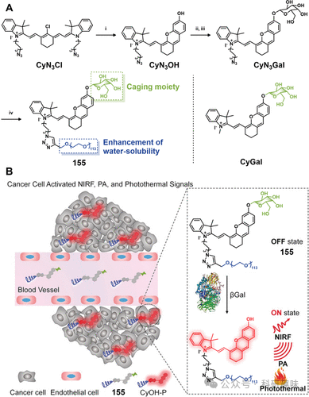
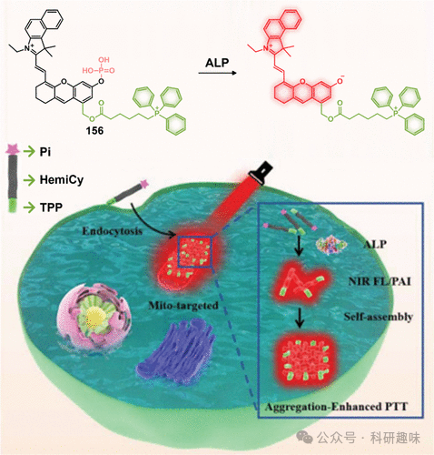
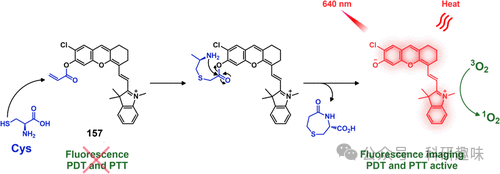
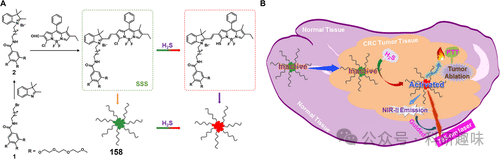
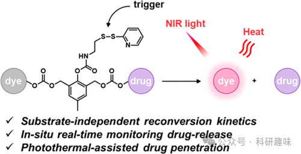

 

#  【PTT诊疗探针】肿瘤特异性酶和其他生物分子激活的治疗诊断探针 
 

‍
‍

**诊疗一体化荧光探针**

Theranostic Fluorescent Probes

**PTT中肿瘤特异性酶和其他生物分子激活的治疗诊断探针**

酶作为生物标志物的重要组成部分，在肿瘤的诊断与治疗技术开发中扮演着关键角色。特别地，γ-谷氨酰转肽酶（GGT）作为肿瘤组织中显著升高的生物标志物，引起了广泛关注。Liu等人报道了一种GGT敏感型近红外纳米探针（NRH-G-NPs），该探针通过巧妙设计，利用酰胺键将γ-谷氨酸（γ-Glu）与氰基荧光素（NRH-NH2）桥接构建而成。当该纳米探针遭遇GGT特异性酶切时，能够精准转化为荧光增强的NRH-NH2-NPs，其荧光强度激增180倍，并展现出显著的光热治疗效果，极大提升了诊疗的精准度。此外，针对卵巢癌中β-半乳糖苷酶（β-gal）的异常高表达现象，Pu等人在2018年提出了一种创新的可激活多功能诊疗探针CyGal-P（155）。该探针的核心结构由d-半乳糖笼状结构包裹的近红外半氰胺染料（CyOH）与长链聚乙二醇（PEG）链接构成。在β-gal的作用下，CyGal-P能够激活并释放出强烈的近红外荧光（NIRF）、光声（PA）信号及光热效应。这一设计不仅实现了酶促激活的成像指导下的光热治疗（PTT），还为基于β-gal激活机制的诊疗试剂研发开辟了新的路径。这一系列的进展无疑加深了我们利用酶学特性进行肿瘤精确诊疗的能力，为未来的肿瘤治疗提供了新的思路和策略（图90）。图90.(A)155的合成步骤。(B)155在肿瘤中的激活机制示意图。深入的科学研究揭示，碱性磷酸酶（ALP）在转移性前列腺癌的病理进程中呈现出显著的过表达现象。基于这一发现，Yang等科研团队巧妙地设计了一种新型线粒体靶向探针156。该探针独特地具有ALP酶特异性激活机制，不仅能够产生增强的近红外荧光（NIRFL）及光声（PA）信号，从而精确描绘ALP的活性分布图，还能在特定位置自发形成高级别的超分子组装体，极大提升了针对前列腺癌细胞的光热治疗效果。这种创新的策略融合了酶促累积、荧光/光声双模态成像与光热疗技术，显著拓宽了诊断与治疗一体化探针在医学领域的应用前景，为临床实践提供了更为全面和精确的治疗方案（如图91所示）。图91.肿瘤中探针156的化学结构和分子机制。除了酶类之外，多种生物大分子，如半胱氨酸（Cys）、硫化氢（H₂S）和谷胱甘肽（GSH），同样在构建高精度诊断工具中扮演着关键角色。特别引人关注的是，临床数据强调了肿瘤微环境中半胱氨酸（Cys）的高丰度，以及其在维持氧化还原稳态中的核心地位。基于此，Kolemen等人研发了一种创新的氯化半氰胺基荧光探针157，该探针专门针对半胱氨酸（Cys）响应设计。该探针以氯化半氰胺作为荧光发射中心，并通过共轭的丙烯酸酯基团实现了对Cys的高度选择性识别。当Cys触发时，探针Cl-Cys不仅释放出强烈的近红外荧光信号，还激活了产生单线态氧（¹O₂）和进行光热转换的功能。这标志着首个融合光热效应与光动力治疗双重功能的Cys激活型有机小分子探针的诞生。这一开创性的研究不仅丰富了生物传感领域的研究内容，还为开发具备诊断与治疗双重功能、特定响应生物大分子的肿瘤探针设计提供了新的方向（如图92所示）。图92.157和Cys之间相互作用的分子机制，导致NIRF和“开启”PPT/PDT。硫化氢（H₂S）作为结直肠癌（CRC）成像导向治疗中的潜力巨大的药理靶标，其重要性日益凸显。为此，Zhao团队独辟蹊径，开发出一种创新的H₂S响应型纳米光热剂（158）。这款诊疗试剂的核心部分由单氯BODIPY构成，该物质以其高效的光热转换效率而著称。在结构设计上，纳米光热剂外围巧妙地融合了三条聚乙二醇（PEG）链，并通过半氰基官能团与一个亲水性头部相连，从而显著提升了其生物相容性和稳定性。在生理条件下，这款纳米光热剂（158NPs）能自发组装成具有理想亲疏水平衡的纳米颗粒，展现了卓越的自组装特性。尤为引人注目的是，在H₂S富集的肿瘤微环境中，158NPs在790nm近红外激光的激发下，展现出了显著增强的光热转换效能。借助这一高效的光热效应，并结合先进的影像导航技术，实验成功实现了对CRC组织的精确光热消融治疗（如图93所示）。此项研究为基于H₂S介导的智能诊疗一体化策略开辟了新的视角。图93.(A)H₂S响应SSS的合成和158的自组装过程。(B)NIR荧光引导PTT肿瘤中158NP激活的示意图。谷胱甘肽（GSH），作为一种在肿瘤细胞中显著累积的生物大分子，为“激活型”治疗体系的设计提供了灵感。2018年，Jiang等人创新性地构建了一种基于GSH响应的自惰性药物-染料共轭前体（DDC）系统。该系统以2-羟基-5-甲基-1,3-苯二甲醇为核心构建块，并通过碳酸酯键巧妙地将荧光染料分子与诊疗性药物基团精准偶联。在特定的肿瘤微环境中，由于GSH浓度的异常升高，DDC系统中的二硫键被特异性地还原断裂，进而触发药物有效成分与荧光染料的同步释放。值得注意的是，释放出的荧光染料不仅作为生物标志物使用，还兼具光热效应，有效增强了药物在肿瘤组织中的渗透能力，从而显著提升了治疗干预的效果（参见图94）。这一研究展示了通过精准调控化学反应来响应肿瘤微环境中特有生物标志物GSH的潜力，为肿瘤靶向治疗领域提供了新颖的材料学和化学解决方案。图94.响应GSH的药物释放、荧光激活和PTT激活策略的分子机制示意图。为了优化治疗药物在肿瘤区域的滞留效能，Lan等人提出了一种基于原位自组装技术的创新策略，旨在增强胶质母细胞瘤的光热疗法(PTT)效果。他们精心设计了核心探针ICG-PEP-c(RGD)fk，该探针采用谷胱甘肽(GSH)敏感的自组装多肽作为支撑框架，搭载了高效的光热试剂吲哚菁绿(ICG)，并融合了环状Arg-Gly-Asp肽[c(RGD)fk]以实现肿瘤靶向。在胶质母细胞瘤特异的微环境刺激下，GSH会触发二硫键的断裂，从而促使GSH响应性自组装肽结构发生变化，显著延长了诊疗体系在肿瘤部位的驻留时间，进而增强了光热治疗的疗效。此外，基于GSH响应机制的复合成像与治疗系统亦展现出广阔的应用前景。Yang等人报道了一种新型GSH响应型纳米粒子，该纳米平台集成了双模态成像与PTT功能。该平台由二硫键桥接的羟乙基淀粉紫杉醇(PTX)缀合物(HES-SS-PTX)与近红外(NIR)青色荧光探针DiR构建而成。在肿瘤微环境高浓度GSH的作用下，二硫键断裂促使PTX与DiR精准释放。释放的PTX参与光热转换过程，与PTT协同作用，显著增强了治疗效果。这一设计不仅实现了诊疗一体化，还凸显了GSH响应性纳米载体在精准医疗领域的巨大潜力与优势。参考文献：Sharma, A.; Verwilst, P.; Li, M.; Ma, D.; Singh, N.; Yoo, J.; Kim, Y.; Yang, Y.; Zhu, J.-H.; Huang, H.; Hu, X.-L.; He, X.-P.; Zeng, L.; James, T. D.; Peng, X.; Sessler, J. L.; Kim, J. S. Theranostic Fluorescent Probes. Chem. Rev. 2024, 124 (5), 2699–2804. https://doi.org/10.1021/acs.chemrev.3c00778.
**点击蓝字 关注我们**
‍
‍

预览时标签不可点

素材来源官方媒体/网络新闻

  继续滑动看下一个 

 轻触阅读原文 

    

