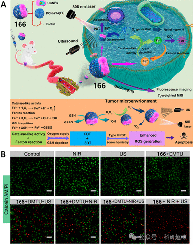
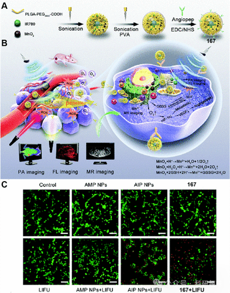

 

#  【SDT诊疗探针】H₂O₂多因素协同激活治疗诊断荧光探针 
 

‍
‍

**诊疗一体化荧光探针**

Theranostic Fluorescent Probes

**SDT中H₂O₂可激活的治疗诊断荧光探针**

活性氧物种（ROS）家族广泛包括过氧化氢（H₂O₂）、臭氧分子（O₃）、次氯酸/次氯酸盐（HOCl/ClO⁻）、羟基自由基（-OH）、一氧化氮（NO）以及过亚硝酸盐（ONOO⁻）等成员，其中，H₂O₂扮演着尤为关键的角色。H₂O₂主要由线粒体内的烟酰胺腺嘌呤二核苷酸磷酸氧化酶复合体（NADPH oxidase）激活产生，该复合体在细胞生长、增殖及分化过程中发挥着关键的信号调控作用，NADPH本身就是这些生物活动不可或缺的信号分子。在肿瘤微环境中，H₂O₂浓度的升高与肿瘤细胞的生命周期——包括增殖、发育及凋亡过程——紧密相关。更具体地说，肿瘤细胞内部H₂O₂水平的异常增高能够刺激转移相关生长因子的表达，进而增强细胞的侵袭性和迁移能力，这是癌症致死性的主要机制之一。因此，H₂O₂已成为研发新型抗癌策略中至关重要的干预靶标。然而，在H₂O₂介导的声动力疗法（SDT）激活过程中，关于诊疗性荧光探针的设计与应用尚属空白，这揭示了该领域内一个亟待填补的研究空白。
**SDT中的多因素协同激活治疗诊断荧光探针**

在肿瘤环境中，显著的乏氧状态、谷胱甘肽(GSH)的过度累积以及高浓度的过氧化氢(H₂O₂)，对光动力治疗(PDT)、化学动力治疗(CDT)及声动力治疗(SDT)中活性氧物种(ROS)的效能释放构成了重大挑战。为了应对这一挑战，Wang等人提出了一种集成策略，该策略融合了精准成像引导、GSH消耗机制、靶向传递以及过氧化氢酶模拟活性。他们成功研制出一种基于铁基锆卟啉金属有机框架[PN-224(Fe)]的双面Janus纳米复合材料，该材料在近红外(NIR)光照与超声(US)的联合介导下展现出高效性能（如图102所示）。在此纳米体系中，Fe³⁺离子作为类纳米酶，发挥了多重协同效应。首先，它催化H₂O₂转化为O₂，有效缓解了肿瘤微环境(TME)中的缺氧状态；其次，Fe³⁺减少了细胞内富余的GSH，从而促进了ROS产量的提升。此外，Fe²⁺通过与细胞内H₂O₂反应产生高反应性的·OH自由基，显著增强了CDT的治疗效果。在808nm激光的激发下，特别是在H₂O₂浓度较高的环境中，该纳米复合材料展现了PDT的治疗特性。同时，结合US的同步激活不仅增强了SDT效应，还放大了荧光信号强度，为治疗过程提供了更准确的监测手段。细胞存活率检测结果显示，采用该纳米复合材料联合NIR光照与US处理的组别，肿瘤细胞凋亡水平显著升高。综上所述，本研究通过整合肿瘤特异属性与成像导向技术，为增强SDT、PDT及CDT的治疗效率提供了一个综合且高效的策略。图102。（A）166的抗肿瘤机制示意图。（B）各种处理后活/死细胞的检测。活细胞和死细胞分别用钙黄绿素-AM（绿色）和PI（红色）染色。随后，Liu及其团队创新性地利用了肿瘤微环境（TME）的酸性特点，设计出一种集成了光声（PA）/荧光（FL）/磁共振（MR）三模态成像引导的多功能纳米酶系统AIMPNPs。该系统巧妙地将IR780染料与MnO₂封装于PLGA/Angiopep-2载体中，旨在增强声动力疗法（SDT）的效能（如图103所示）。由于Angiopep-2的生物导向性，探针167能够顺利穿越血脑屏障（BBB），并精准地定位至胶质瘤病灶。值得注意的是，MnO₂在系统中展现出类似酶的特性，与TME中的丰富质子、H₂O₂和GSH发生相互作用，不仅催化产氧以缓解局部乏氧状态，还促进了GSH的降解。此外，Mn²⁺离子作为MRI对比剂，结合IR780分子的光声/荧光双重成像能力，赋予了该系统FL/PA/MR多模式成像引导治疗的特性。实验结果显示，经静脉注射后，167中的Fe-TCPP在肿瘤部位显示出强烈的荧光信号，这表明生物素标记的167通过EPR效应成功富集于肿瘤区域。进一步的细胞存活率分析证实，在低强度聚焦超声（LIFU）的辅助下，SDT能够有效触发肿瘤细胞凋亡。因此，该研究通过多重机制的协同作用，显著提升了SDT在U87MG异种移植模型中的治疗效果，有效抑制了肿瘤的生长及远处转移。图103.(A)167种NP合成示意图。(B)167个NP的示意图，具有BBB和肿瘤靶向、线粒体靶向、深度渗透、增强SDT效果和实时PA/FL/MR成像监测。(C)各种处理后活/死细胞的CLSM图像。参考文献：Sharma, A.; Verwilst, P.; Li, M.; Ma, D.; Singh, N.; Yoo, J.; Kim, Y.; Yang, Y.; Zhu, J.-H.; Huang, H.; Hu, X.-L.; He, X.-P.; Zeng, L.; James, T. D.; Peng, X.; Sessler, J. L.; Kim, J. S. Theranostic Fluorescent Probes. Chem. Rev. 2024, 124 (5), 2699–2804. https://doi.org/10.1021/acs.chemrev.3c00778.
**点击蓝字 关注我们**
‍
‍

预览时标签不可点

素材来源官方媒体/网络新闻

  继续滑动看下一个 

 轻触阅读原文 

    

