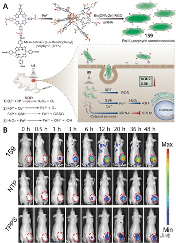
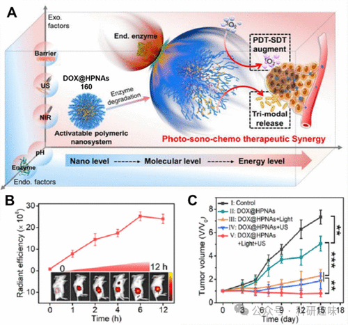
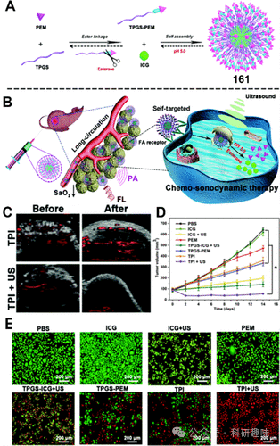
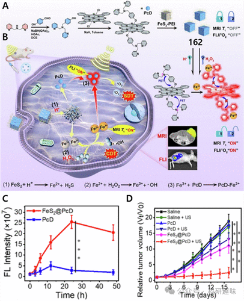

 

#  【SDT诊疗探针】TME可激活治疗诊断荧光探针 
 

‍
‍

**诊疗一体化荧光探针**

Theranostic Fluorescent Probes

**SDT中的治疗诊断荧光探针**

为了提升癌症治疗成效并降低副作用，无创治疗方式在恶性肿瘤治疗中展现出极大的吸引力。其中，声动力疗法(SDT)作为一种新兴的非侵入性治疗手段，由Umemura等人于1989年首次提出，为光动力疗法提供了潜在的替代方案。SDT通过高穿透性的超声波激活声敏剂，诱导产生能够杀灭癌细胞的活性氧物种(ROS)，从而实现治疗目的。该疗法机制结合了超声空化与热效应的双重作用，相较于传统治疗如化疗、放射治疗和光动力疗法，SDT展现出深度穿透性强、成本效益高、操作便捷及副作用较小等显著优势。然而，将诊断与声敏剂递送及效能实时监测高效结合，仍是当前面临的主要挑战之一。近年来，随着先进成像技术的快速发展，为解决这一难题提供了新的机遇，使精准医疗成为可能，确保了疾病诊断的精确性、药物递送、生物分布和治疗反馈的有效监控。为此，具备成像与SDT双重功能的治疗探针被封装于纳米载体中，这些探针在肿瘤微环境(TME)中激活后，能够释放出高强度、高分辨率的成像信号。为了强化SDT疗效，关键在于采用能产生明确影像学指示的诊疗性荧光探针，以辅助临床精准决策。通过纳米平台装载小分子药物，能够精准定位肿瘤位置，实现诊疗试剂与药物在肿瘤区域的按需释放与分解，这不仅提高了药物的体内利用效率，还显著降低了对健康细胞及组织的潜在伤害。因此，整合了SDT与成像技术的纳米平台在肿瘤的精确诊断与治疗中发挥着关键作用，为实现肿瘤彻底清除的目标提供了创新策略。相关研究可进一步聚焦于四大方向：基于TME激活、缺氧响应、H₂O₂响应及多模式协同激活的诊疗性荧光探针设计，以推动SDT在临床应用中的进一步发展。
**SDT中的TME可激活治疗诊断荧光探针**

肿瘤微环境（TME）为肿瘤的生长与转移提供了适宜的条件，并展现出独特的病理生理特性。这些特性包括丰富的抗氧化成分、特定的酶系统、缺氧环境和偏酸性的pH值，这些均为发展针对性的治疗策略提供了线索。在TME中，精心设计的纳米载体能够经历配体交换、结构解体或聚集等动态变化，促进其在肿瘤部位的蓄积，从而增强治疗干预的效果。值得注意的是，肿瘤细胞通过过表达谷胱甘肽(GSH)和锰依赖性超氧化物歧化酶(SOD2)来有效抵抗氧化应激损伤，这为治疗干预提供了重要的靶点。基于此，Zhu等人巧妙地利用铁(III)与中位四(4-磺酸基苯基)卟啉(TPPS)自组装构建了铁(III)-卟啉纳米敏化剂(NTP)，并进一步装载siRNA形成复合物R-S-NTP（见图95）。这一设计旨在降低SOD2的表达，削弱肿瘤的抗氧化防御机制。NTP中的卟啉核心与铁(III)不仅赋予其卓越的磁共振/荧光双模成像能力，还显著增强了活性氧物种(ROS)的生成，优化了声动力疗法(SDT)的治疗效率。尤为关键的是，铁(III)触发的肿瘤内生化连锁反应能有效降低GSH水平，促进细胞毒性的芬顿反应，加速癌细胞凋亡。相较于RNTP、NTP及游离TPPS，159体系能够产生更多的ROS，这直接与其削弱细胞抗氧化系统及激活芬顿效应的能力相关，从而极大地提升了SDT的疗效。实验结果显示，经静脉注射后，159在肿瘤部位展现出显著的荧光标记；而联合超声处理的159+US组肿瘤抑制率高达89.96%，证实了其显著的抗肿瘤生长效果。综上所述，这项研究不仅揭示了一种创新的SDT策略，通过精准调控肿瘤微环境和细胞内抗氧化机制，还为克服SDT临床转化中的障碍提供了一个高效且机制新颖的解决方案，预示着肿瘤治疗领域的一大进步。图95.(A)诊疗159作为多功能声敏剂。(B)体内FL图像。透明质酸酶（HAase）作为肿瘤环境中异常丰富的内源性酶，对于确保诊疗性分子的肿瘤靶向性和调节药物释放动力学具有关键作用。基于这一认识，Qiu等人巧妙设计并合成了负电性的透明质酸-原卟啉IX（HA-PpIX）纳米组装体，并通过负载正电性的阿霉素（DOX），成功构建了一种高效的三重模式治疗纳米体系（DOX@HPNAs，160），实现了高达24.6%的载药效率。在肿瘤微环境特有的酸性条件下，HAase能够迅速催化HPNAs的降解，进而触发纳米结构的解体并促进药物的按需释放。此外，在光照和/或超声波的共同作用下，该纳米体系在肿瘤部位累积并产生强烈的荧光信号（如图96所示）。值得注意的是，酶促降解过程所释放的单线态氧(¹O₂)量高达未降解HPNAs的2.5倍，显著增强了光声效应。实验结果表明，与未经治疗、肿瘤迅速增长的对照组相比，采用该纳米系统治疗的小鼠模型中，肿瘤生长受到了显著抑制。进一步的组织学分析显示，治疗组的肿瘤抑制率高达94.4%，充分展现了其卓越的治疗潜力。这一开创性工作通过结合酸性pH响应性、超声介导的物理刺激以及HAase敏感性三重机制，极大地提高了DOX的释放效率，并实现了光-化学-机械协同治疗的显著效果。这一成果不仅为未来设计智能型酶激活纳米递送系统提供了宝贵的策略和思路，还推动了肿瘤治疗技术的发展前沿。图96.(A)图示了内源性（pH、HAase）和外源性（NIR、超声波和组织屏障）因素对可激活聚合物纳米系统的动态影响。(B)静脉注射DOX@HPNA后肿瘤的时间依赖性荧光图像和强度。(C)不同治疗后肿瘤的相对生长率。在肿瘤微环境（TME）中，血氧饱和度（SaO2）是维持癌细胞持续稳定增殖的关键因素，因此，它成为了干预治疗的重要靶标。为降低肿瘤区域的SaO2从而限制其生长，Yang团队巧妙地运用了自组装技术，设计了一种名为TPGS-PEM-ICG（简称TPI，161）的自靶向多功能纳米平台。该平台旨在通过荧光/光声（FL/PA）成像引导，实现化疗与声动力学治疗的双重增强效果（如图97所示）。TPI纳米平台凭借其独特的特性，如特异性识别肿瘤细胞、对TME酸性、溶酶体酸性环境、酯酶活性以及外加超声波的多重响应性，实现了治疗药物的精确且按需释放，从而显著降低了对周围正常组织的潜在损害。特别地，该平台表面修饰的PEM配体，与HeLa细胞膜上过表达的叶酸（FA）受体具有高亲和力，这赋予了TPI出色的肿瘤靶向积累与细胞内吞能力，为癌症的早期诊断提供了强有力的荧光信号支持。在FA受体过表达的实体瘤模型中，显著的荧光信号进一步验证了其出色的诊断潜力。此外，光声成像数据显示，在超声（US）的作用下，TPI能够显著降低肿瘤区域的SaO2信号，这揭示了TPI+US通过“饥饿疗法”有效减少肿瘤氧供的机制。与对照组相比，TPI+US处理组在杀灭肿瘤细胞方面表现出了更显著的效果，彰显了其强大的抗肿瘤活性。动物实验进一步证实了TPI+US治疗策略几乎完全抑制了肿瘤生长，突显了其惊人的抗肿瘤疗效。总体而言，这种结合FL/PA成像的治疗策略不仅实现了对肿瘤治疗的实时监控与主动靶向，还为未来的声动力治疗设计提供了宝贵的参考范例，为癌症治疗领域带来了新的突破。图97.(A)TPGS-PEM前药和161自组装合成路线。(B)161双成像引导下的强化化疗和声动力治疗。(C)每组SaO2水平的变化。(D)14天内不同治疗后肿瘤体积的变化。(E)用钙黄绿素AM/PI染色的HeLa细胞与不同组和161(TPI)一起孵育24小时，有或没有US照射。肿瘤细胞为避免酸中毒，会大量排放乳酸，导致肿瘤微环境（TME）及其周围组织呈现低pH值，这为治疗干预提供了独特的生化靶点。基于此，Li等人创造性地设计了一种新型酞菁铁（FePc）复合物——162，该复合物不仅作为荧光/磁共振（F/MR）双模态成像引导的声动力疗法（SDT）/化学动力疗法（CDT）纳米平台。在酸性TME条件下，162能响应性地与质子作用，释放游离的酞菁（PcD）并促进Fe²⁺的生成，Fe²⁺在H₂O₂的作用下进一步氧化为Fe³⁺，这一系列反应最终恢复了PcD的荧光特性（如图98所示）。通过这一精心设计的化学程序，使用162处理的小鼠肿瘤区域荧光信号显著增强，相较于单独使用PcD处理，荧光信号强度提升了10.49倍，这充分证明了162在肿瘤内部能有效触发强烈的荧光成像信号（FLI）。值得注意的是，162不仅能在酸性和H₂O₂的调控下增强荧光信号，其磁共振成像（MRI）信号也实现了从“关闭”到“开启”的转变，凸显了其作为智能响应性成像剂的巨大潜力。更值得一提的是，结合超声（US）照射，162对小鼠肿瘤生长的抑制效率高达87.15%，展现了其在肿瘤治疗领域的显著疗效。综上所述，162成功融合了特异性的F/MR双模态成像与SDT/CDT治疗功能，为精准成像引导的肿瘤治疗策略提供了一个极具前景的平台。图98。(A)162的制备和可编程机制。(B)162在HepG2肝癌细胞中的作用。(C)静脉注射162和PcD后不同时间点HepG2荷瘤小鼠的平均荧光强度。(D)肿瘤生长曲线。参考文献：Sharma, A.; Verwilst, P.; Li, M.; Ma, D.; Singh, N.; Yoo, J.; Kim, Y.; Yang, Y.; Zhu, J.-H.; Huang, H.; Hu, X.-L.; He, X.-P.; Zeng, L.; James, T. D.; Peng, X.; Sessler, J. L.; Kim, J. S. Theranostic Fluorescent Probes. Chem. Rev. 2024, 124 (5), 2699–2804. https://doi.org/10.1021/acs.chemrev.3c00778.