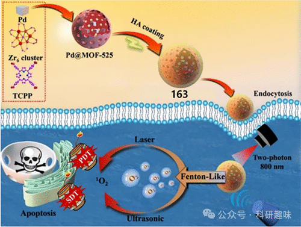
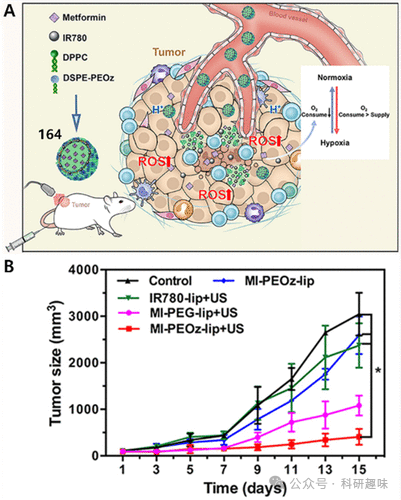
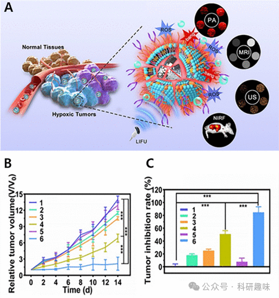

 

#  【SDT诊疗探针】缺氧激活治疗诊断荧光探针 
 

‍
‍

**诊疗一体化荧光探针**

Theranostic Fluorescent Probes

**用于SDT的缺氧激活治疗诊断荧光探针**

声动力疗法（SDT）通过活性氧物种（ROS）的生成来诱导癌细胞的氧化应激损伤，其中氧气作为ROS产生的核心原料，其重要性不言而喻。然而，实体肿瘤由于细胞过度增殖、血管结构异常及淋巴循环障碍等因素，常陷入慢性乏氧状态，这极大地限制了SDT的治疗效果。更为严峻的是，SDT实施过程中局部氧气的迅速消耗，进一步加剧了治疗区域的缺氧现象，通过负面反馈机制削弱了SDT的效果，导致治疗反应不佳和预后不良。此外，缺氧状态还促进了癌细胞对化疗和放疗的抵抗性，进一步降低了这些治疗手段的疗效。因此，如何减轻缺氧对SDT效率的负面影响，成为了当前研究的焦点。已有研究证实，通过肿瘤靶向输氧及原位产氧策略提升肿瘤内部氧浓度，是克服缺氧问题的有效途径。在此背景下，利用Fenton或类Fenton反应产氧的策略展现出了巨大的应用潜力。Duan等人设计了一种基于类Fenton反应的纳米平台163（见图99），通过巧妙的产氧策略有效改善了肿瘤缺氧状态，显著增强了SDT与光动力疗法（PDT）的协同治疗效果。该平台中的卟啉金属有机框架（MOF-525）不仅能够高效生成用于SDT和PDT的单线态氧（¹O₂），还具备作为近红外光激发的双光子响应单元的功能。钯纳米立方体则通过模拟Fenton反应释放羟基自由基（-OH）及氧气（O2），促进细胞凋亡，有效缓解了肿瘤缺氧。此外，平台表面修饰的透明质酸（HA）不仅增强了其生物相容性，还提高了对癌细胞的靶向能力。细胞存活率分析显示，正常细胞QSG7701经163处理后的存活率高于癌细胞HepG2，而在外源性添加H₂O₂后，HepG2细胞的存活率显著降低，这表明163对正常组织具有较好的安全性，但在富含H₂O₂的肿瘤环境中能诱发自由基生成，导致细胞毒性效应。进一步的细胞毒性测试验证了联合光照和超声处理后，HepG2细胞的存活率降至10%，凸显了该纳米平台在PDT与SDT联合治疗中的卓越效能。这一研究成果不仅为开发新型产氧纳米材料提供了科学依据，还有望显著提升依赖氧气的抗肿瘤治疗策略的效果。图99.治疗诊断探针163的制备，突出显示增强光动力和声动力治疗的过程。鉴于肿瘤内部缺氧问题难以通过即时氧气制造或输送获得长期缓解，且这些方法常受限于效率低下和氧气流失等技术难题，因此，探索降低肿瘤组织氧气消耗的新策略显得尤为重要。氧化磷酸化（OXPHOS）作为线粒体能量产生的核心过程，通过消耗氧气高效地生成细胞能量。基于此，Zhang等人设计了一种pH敏感型药物载体脂质体系统164，旨在最小化肿瘤区域的氧气消耗。该系统内的二甲双胍在肿瘤酸性微环境中特异性释放并积累，有效阻断线粒体呼吸链活动（如图100所示），进而减少氧气的消耗。同时，该脂质体还整合了声波增敏剂IR780，其在超声辐照下能够产生活性氧物种（ROS），进而诱导癌细胞凋亡。164凭借其优越的增强渗透与滞留（EPR）效应，确保了药物在肿瘤缺氧区的精准递送。此外，该纳米载体在体内外实验中均展现出卓越的光声/荧光成像（PA/FL）性能，为治疗效果的实时监测提供了可能。实验结果显示，结合超声治疗的164组显著抑制了肿瘤生长，尤其在酸性肿瘤微环境中药物的快速释放，使得治疗组肿瘤生长速率显著减缓。相比之下，未处理的对照组肿瘤则持续快速增长。此项研究成功构建了一种纳米治疗诊断平台，通过干预肿瘤的能量代谢途径减少氧气需求，为克服缺氧导致的癌症治疗抵抗性提供了新的思路和方法。图100.(A)自行合成的164(MI-PEOz-lip)及其拟议的抗肿瘤机制的示意图。(B)五组接受不同治疗后的肿瘤生长曲线。尽管已经发展了多种策略，如氧气输送和减轻实体肿瘤内部氧气消耗，以缓解缺氧状态，但在某些情况下，这些疗法的效果并不理想，甚至可能引发不良反应，如气压伤和高氧性惊厥等问题。值得注意的是，超声波激发时，声波液滴的气化作用可以促使全氟戊烷（PFP）这一液态物质迅速经历相变，从液相转变为气相。微胶囊技术的应用进一步提升了高强度聚焦超声（HIFU）的消融效率，减少了所需的声能输入，并增强了对肿瘤组织的破坏力。因此，相变材料作为一种具有相似治疗潜能的材料，为调控缺氧肿瘤的声学微环境提供了新的思路。特别是基于全氟戊烷（PFP）的空化效应，成为了一种吸引人的策略，能够在无氧条件下高效诱导缺氧肿瘤细胞凋亡。此外，CGNKRTR（tLyP-1）作为一种细胞穿透性肽，作为神经蛋白酶-1（np-1）受体的配体，通过CendR路径高效穿透肿瘤细胞，实现胞内递送。鉴于此，Luo及其团队设计了一种tLyP-1修饰的功能性脂质体，并成功将卟啉单甲醚钆（H(Gd)）作为声敏剂嵌入到磷脂双层中，构建了PFP@tLyP-1-LIP-H(Gd)。该脂质体利用tLyP-1的细胞穿透能力，特异性地粘附并靶向过度表达np-1受体的MDA-MB-231肿瘤细胞，有效穿透缺氧肿瘤区域，促进多模态成像（US/NIRF/PA/MR）的实施（如图101所示）。在低强度聚焦超声（LIFU）的照射下，PFP经历声学液滴的气化过程，实现“液-气”转变并迅速生成气泡，进而释放羟基自由基。这些自由基如同深穿透纳米爆弹（DPNB），在常氧和缺氧的微环境内均能引发细胞死亡。实验结果显示，经LIFU处理后，PFP@tLyP-1-LIP-H(Gd)展现出显著增强的细胞毒性效应，肿瘤生长抑制率明确证明了声波滴气化与声动力疗法（SDT）结合能有效抑制肿瘤进展。此项研究开创性地展示了基于超声空化及“液-气”转变机制，实现无需氧气参与的SDT策略。图101.(A)在多模态成像引导下针对实体缺氧肿瘤产生协同耐缺氧SDT的ROS和ADV机制。(B)各种治疗后小鼠的相对肿瘤体积变化。(C)多次治疗后小鼠的肿瘤抑制率。参考文献：Sharma, A.; Verwilst, P.; Li, M.; Ma, D.; Singh, N.; Yoo, J.; Kim, Y.; Yang, Y.; Zhu, J.-H.; Huang, H.; Hu, X.-L.; He, X.-P.; Zeng, L.; James, T. D.; Peng, X.; Sessler, J. L.; Kim, J. S. Theranostic Fluorescent Probes. Chem. Rev. 2024, 124 (5), 2699–2804. https://doi.org/10.1021/acs.chemrev.3c00778.