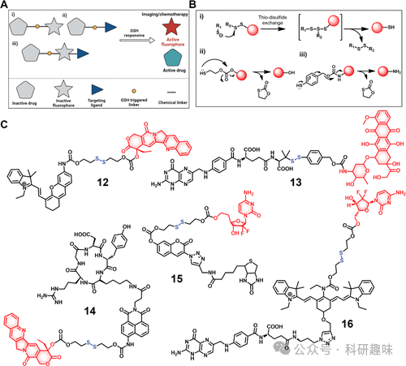
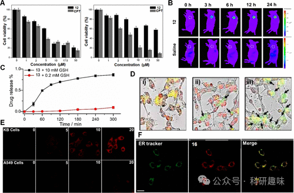
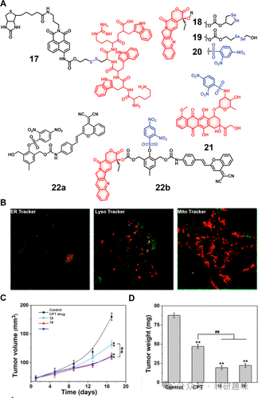

 

#  【化疗探针】GSH响应荧光探针 
 

‍
‍

**诊疗一体化荧光探针**

Theranostic Fluorescent Probes

**GSH响应荧光探针**

在复杂的生物环境中，多种氧化还原过程在细胞内外及不同组织中频繁上演，其中的典型代表包括NADP+/NADPH、O2/O2--、硫氧还蛋白（TrxSS/Trx(SH)2）和谷胱甘肽（GSH/GSSG）等氧化还原对。谷胱甘肽，因其细胞内高浓度（1-10mM）及其在维护细胞完整性、介导细胞功能、代谢和凋亡中的关键作用，成为治疗和递药领域关注的焦点。GSH作为关键的抗氧化剂，有效阻止ROS介导的损伤，保护细胞免受氧化应激。然而，GSH在细胞外基质、血液及细胞表面的浓度显著偏低（2-20μM），这与该区域富含能稳定二硫键的蛋白质有关。细胞内环境则通过NADPH和GSH还原酶系统维持还原状态，确保GSH主要以还原形式存在。特别值得注意的是，细胞内部存在显著的GSH浓度梯度。有趣的是，肿瘤组织中GSH水平较正常组织高出约4倍，这与癌细胞快速增殖有关，虽然高GSH水平可能削弱多种癌症（如卵巢癌、乳腺癌等）的治疗效果，但这也为设计基于氧化还原敏感的药物递送系统提供了契机，尤其是在肿瘤微环境中特异性释放活性药物或荧光探针。基于GSH的还原性，二硫（S-S）键是最常用的化学连接方式之一，能够在存在游离硫醇的情况下通过硫醇-二硫交换反应断裂。GSH因此成为激活含二硫键前药的理想生物催化剂。在前药设计中，采用抗体、肽段、小分子等多种载体，对基于二硫化物的策略进行了广泛探索。特别是在小分子诊疗学中，众多候选药物和荧光团，如Dox、喜树碱、紫杉醇、吉西他滨、萘啶酰亚胺、hemicyanine、dicyano-methylene-4H-pyran、荧光素等，已通过三种主要策略与GSH响应性二硫键相连：(i)利用可裂解的连接方式连接化疗药物与荧光团；(ii)连接具有固有荧光的化疗药物与靶向配体；(iii)通过多组分策略结合化疗药物、荧光团和靶向配体（图8）。图8.GSH响应可激活分子治疗诊断探针的示意图。以(i)类策略为例，诊疗试剂12通过S-S连接喜树碱（CPT）与半氰基荧光团，用于监测H22肿瘤小鼠模型中GSH介导的激活过程，其中CPT的初始荧光被抑制，但在GSH作用下，二硫键裂解，释放CPT并伴随着荧光信号的增强（图9），类似的策略被广泛用于监测不同肿瘤模型中的GSH激活情况。图9.GSH激活治疗诊断探针的效果。对于(ii)类策略，具有固有荧光的抗癌药物通过二硫键与癌症靶向配体相连，如叶酸-阿霉素诊疗试剂13，其设计中α,α-二甲基取代的对噻吩基脲烷二硫化物增强了稳定性，且在模拟癌细胞质的GSH浓度下表现出良好的药物释放动力学（图8,9）。(iii)类策略通过添加癌症靶向单元提升药物的特异性并降低全身毒性，如RGD肽修饰的萘二甲酰亚胺原喜树碱诊疗试剂14，通过RGD与U87癌细胞的avβ3受体结合，实现GSH触发的药物释放与荧光成像（图8,9）。此外，还有如诊疗试剂15和16等，分别用于吉西他滨的GSH选择性递送和Cy7-吉西他滨的叶酸靶向递送，均显示了通过GSH敏感连接方式在特定肿瘤细胞中激活的潜力和细胞内定位的可视化（图8,9）。这些策略也拓展到了肽类抗癌药物的靶向递送，如17，通过二硫键连接策略，实现了对HepG2细胞的选择性递送和荧光信号增强，证明了基于肽的诊疗试剂在改善递送、增强治疗靶向性和成像跟踪方面的潜力（图10）。综上，这些研究不仅加深了对GSH在氧化还原敏感性递送系统中作用的理解，也为开发更高效、更精准的癌症治疗策略提供了坚实的基础。图10.GSH响应治疗诊断探针17-22的化学结构和效果除二硫化合物外，研究者亦涉足其他化学键在GSH响应性递药领域的应用，其中硒元素因与硫同族且化学性质相近而备受瞩目。硒的氧化还原特性尤为突出，其Se-Se键的断裂能（172kJmol-1）远低于C-Se键（244kJmol-1）或S-S键（268kJmol-1），这使得硒-硒连接方式相较于含硫类似物展现出更高的GSH敏感性。例如，Fang等人设计的两种硒化喜树碱衍生物诊疗试剂18和19（图10），通过HPLC分析确认了它们在GSH存在下于430nm处（激发波长365nm）增强的荧光释放特性。实验揭示，在1m MGSH的Tris-EDTA缓冲液中，两者的药物释放几乎瞬时完成。释放出的硒酚中间体预期可通过消耗细胞内GSH并促进ROS生成，增强18和19的治疗效果。动物实验中，HepG2异种移植瘤模型在接受18或19治疗后，肿瘤重量减少约75%，超越了标准CPT治疗效果的53%。尽管成果显著，基于硒的连接方式因合成难度及对GSH与ROS的双重敏感性可能引起的非预期活化和药物泄露问题，目前使用并不普遍。此外，生物硫醇如半胱氨酸（Cys）和同型半胱氨酸（Hcy）在调控细胞氧化还原稳态中同样扮演关键角色。Cys的缺乏与多种疾病相关，涵盖心血管疾病至造血功能障碍等。鉴于某些GSH敏感连接方式对Cys亦有响应，这在Cys和GSH共存的生理环境下可能导致非目标区域的药物误激活。反之，专一针对Cys的递药系统则可实现治疗的精准性。近期，2,4-二硝基苯磺酰（DBS）作为Cys敏感连接方式在递药领域崭露头角，尤其适合与含有羟基或胺基的药物分子结合。Jo和Johansson等团队分别利用DBS直接修饰伊立替康活性代谢产物SN-38（诊疗试剂20）和阿霉素（DOX，诊疗试剂21）（图10），并观察到DBS引入后药物的荧光被显著淬灭。在还原性环境下，DBS经历芳烃亲核取代反应，释放SO2，同时激活药物并增强荧光。Wu等人研发的诊疗试剂22b，巧妙结合了硫醇响应性DBS触发机制、喜树碱（CPT）及近红外荧光团二氰亚甲基-4H-色烯（DCM），展示了增强的多功能性。该复合物22b在未活化状态下无活性，但在硫醇触发下，通过级联反应释放CPT并恢复DCM的近红外荧光。诊疗试剂22b在HeLa癌细胞（IC50=5.8μM）和L929细胞（IC50=8.9μM）中展现出增强的剂量依赖性细胞毒性，优于无药物对照22a。22b的脂质体诊疗试剂在体内给药后，有效抑制了肿瘤生长，进一步证实了其治疗潜力。  

**点击蓝字 关注我们**
‍
‍

预览时标签不可点

素材来源官方媒体/网络新闻

  继续滑动看下一个 

 轻触阅读原文 

    

