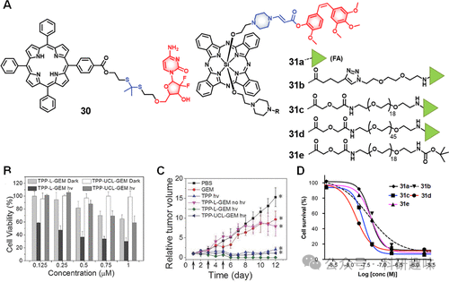

 

#  【化疗探针】其他ROS响应治疗诊断探针 
 

‍
‍

**诊疗一体化荧光探针**

Theranostic Fluorescent Probes

**其他ROS响应性治疗诊断探针**

除过氧化氢（H₂O₂）之外，其他活性氧物种（ROS），包括单线态氧（¹O₂）和羟基自由基（-OH），因其高度反应性，亦被视为潜在的药物释放激活因子。-OH以其广泛的反应性著称，能与氨基酸、碳水化合物、脂质及核酸等多种生物分子无选择性地发生作用。相比之下，¹O₂作为氧气的激发状态，氧化能力更为强劲。在生物体系内，-OH通常经由过渡金属离子（如Cu(I)或Fe(II)）催化的H₂O₂分解过程，即芬顿反应产生，而¹O₂主要由光敏剂（PSs）生成，详情参见后续2.2节。值得注意的是，¹O₂与-OH在生理环境中的半衰期均较H₂O₂短暂。Zhang及其团队设计了一种治疗探针30（图13），通过ROS响应性的硫代金属连接方式，将吉西他滨与红光激活的荧光光敏剂（间-四苯基卟啉，TPP）相结合，旨在实现荧光成像引导的治疗策略。此探针中，药物的5′-OH末端经修饰以暂时抑制其抗癌活性。鉴于¹O₂的超短半衰期（≈40纳秒）及有限的扩散距离（20-200nm），在非光照条件下，细胞内微量的¹O₂不足以引发明显的细胞毒性。然而，在658nm光照射（280mW/cm）下，TPP作为光敏剂生成¹O₂，触发硫代金属键断裂，继而释放药物。释放的药物不仅在光照区域自由扩散，还在邻近未直接光照的细胞中引起毒性。诊疗试剂30在光照下对HeLa细胞展现出了浓度依赖的毒性（IC50=0.25μM），优于对照组（TPP、TPP-UCL-GEM）。在H22小鼠肿瘤模型中，PEG2000-PLA2000修饰的30经静脉注射后，能富集于肿瘤并经低功率光照抑制肿瘤生长，且利用TPP的自然荧光追踪了体内分布情况。相似地，Wang等人在乳腺癌小鼠模型中实现了Dox的有效递送，且副作用微乎其微。图13.(A)ROS响应性治疗诊断探针的化学结构（30和31）及其效果这方面的研究还涉及利用¹O₂反应激活其他治疗药物，如采用氨基丙烯酸酯类连接方式桥接光敏剂与药物本身。这一策略便于含羟基药物通过羧酸与氨基丙烯酸酯偶联，或通过氨基丙烯酸酯的氨基端与PS相连，构建多样化治疗载体。据此方法，研发团队已开发出多种装载SN-38、康维司汀、紫杉醇、以及非甾体抗炎药（如布洛芬和萘普生）的递送系统。You等人开发的一系列诊疗试剂31a-e（图13），这些共轭物包含远红外激活的光敏剂（硅酞菁，Pc），通过氨基丙烯酸酯与紫杉醇在2′-OH关键位置共价结合，该位置涉及与微管蛋白的相互作用，对于药物功能至关重要。这些共轭物进一步与不同分子量的聚乙二醇（PEG，1kDa至5kDa）和叶酸偶联，以增强靶向性和溶解度。研究确认，中等长度的PEG链（1k至3.5kDa）最适于促进叶酸受体介导的摄取。实验显示，与长链PEG或无PEG修饰的共轭物相比，这类中链PEG化共轭物展现出更强的细胞毒性。在Colon-26细胞的实验中，共轭物31b（携带2kDaPEG）在690nm光照下展现出最高的细胞毒性（IC50=1.65nM），优于其他共轭物（IC50=2.71至4.85nM）(图13)。  

**点击蓝字 关注我们**
‍
‍

预览时标签不可点

素材来源官方媒体/网络新闻

  继续滑动看下一个 

 轻触阅读原文 

    

