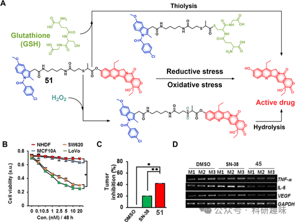
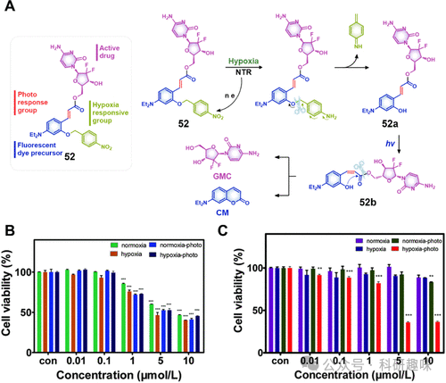

## **双刺激响应治疗诊断探针**

如前文所述，针对单一刺激（如pH值、谷胱甘肽（GSH）、过氧化氢（H₂O₂）、酶等）响应性的治疗探针，已成为提升药物效能并降低副作用的可行策略。鉴于肿瘤微环境等复杂病理条件的需求，发展基于双激活机制的治疗探针显得尤为重要，以实现治疗效果与特异性的双重提升。这类探针设计策略既可以涵盖顺序激活机制，以应对不同微环境的梯度变化，也可以实现同步激活，即在同一病灶同时触发多个响应。本章节将概述这两种策略的最新研究进展。

考虑到癌细胞内部的高度异质性，其既可能形成GSH水平升高的还原性微环境，也可能因氧化应激而转变为氧化性状态。这些对立的氧化还原特性不仅在不同肿瘤类型间存在差异，甚至在同一肿瘤的不同部位或单个细胞的不同时间点上交替出现。基于此，Kim及其团队创新性地设计了诊疗试剂51（见图21），旨在通过SN-38的氧化还原敏感传递，实现对这种双面微环境的精准响应。该复合物通过硫醚键将SN-38与COX-2抑制剂吲哚美辛桥接，不仅实现了对癌细胞的定向治疗，还潜在地激发了免疫治疗效应。实验结果显示，在GSH富集的还原环境下，诊疗试剂51经硫醇介导的水解作用释放药物；而在氧化压力下（如H₂O₂存在时），则形成更稳定的砜/亚砜结构，进而水解脱去活性药物。在体外实验中，51在COX-2阳性的LoVo和SW620细胞系中的摄取和毒性均优于COX-2阴性的细胞（如NHDFs、MCF10A）。动物实验进一步验证，51对结肠癌小鼠模型（SW620）具有显著的肿瘤抑制效果，并伴随着主要炎症标志物（如IL-6、TNF-α、VEGF）的下降，这与诊疗试剂中吲哚美辛的加入密切相关。此外，其他研究亦证实，采用硫醚型氧化还原敏感链接的策略为开发高效治疗药物提供了有力的工具。

图21.(A)治疗诊断探针51在还原和氧化应激条件下的化学结构和拟议的激活模式。(B)在与不同浓度孵育后观察正常细胞系和癌细胞系中探针51的细胞活力。(C)在SW620异种移植小鼠模型中，DMSO以及等浓度的SN-38和探针51提供的肿瘤抑制作用（n=5，\*p&lt;0.05，\*\*p&lt;0.01）。(D)在用DMSO、SN-38和51处理的小鼠组织中观察到的抗炎细胞因子mRNA水平（M1、M2和M3定义了三只小鼠）。
光敏疗法虽以光为媒介调控药物释放与激活提供了契机，但受限于光毒性对周围正常组织的潜在影响，以及日光诱发的非特异性药物泄露问题。为了克服这些限制，Feng及其团队创造性地设计了具有乏氧和光双重响应特性的治疗探针52（图22），通过结合两种激活机制，显著提升了治疗的精准度和安全性。

探针52的设计巧妙运用了4-硝基苄基基团作为其结构的一部分。在常氧条件下（如正常细胞和缺氧的肿瘤微环境），这一基团呈惰性，对光激活无响应。然而，在肿瘤细胞常见的乏氧环境中，4-硝基苄基能够通过硝基还原酶的还原作用转化为中间体52a。此中间态对紫外光高度敏感，经照射后转化为中间体52b，并随后释放活性药物。此过程同时伴随自巯基环化反应，生成发出蓝色荧光的香豆素衍生物。

在MCF-7细胞实验中，当细胞处于模拟的2%氧气缺氧环境中6小时后，经过365nm紫外光照射10分钟，可观察到明显的蓝色荧光发射和增强的细胞毒性。相反，在标准氧浓度（20%氧气）下，未观察到任何荧光信号或细胞毒性反应，这证明了探针52能够精确响应目标癌细胞内的乏氧环境，并实现实时追踪。此外，该设计实现了药物释放的高度空间和时间控制，从而显著提高了治疗的靶向性。

尽管这一设计展现出了巨大的潜力，但将其应用于临床实践仍需进一步的研究和探索。特别是，开发探针52的衍生物，以集成更长波长的光触发机制和红色光谱范围内的荧光报告团，将有助于减少组织穿透障碍并优化生物兼容性。

图22。(A)由缺氧和连续光照射控制的治疗诊断探针52的化学结构和激活模式。在存在和不存在光照的常氧和乏氧条件下，用(B)药物本身GEM和(C)不同浓度的治疗诊断探针52处理后，MCF-7细胞的细胞活力。  
