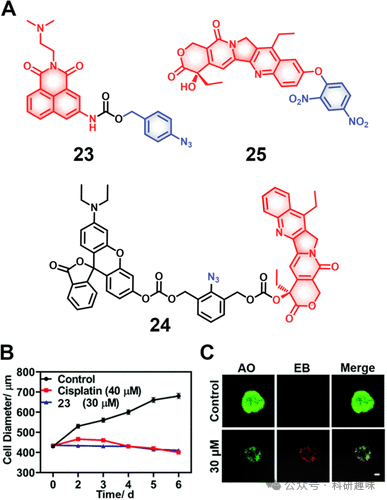

 

#  【化疗探针】硫化氢响应治疗诊断探针 
 

‍
‍

**诊疗一体化荧光探针**

Theranostic Fluorescent Probes

**硫化氢响应治疗诊断探针**

硫化氢（H₂S），以其易燃性、标志性臭鸡蛋气味及腐蚀特性而著称，是一种具有潜在毒性的气体。类似于一氧化碳（CO）和一氧化氮（NO），内源性H₂S作为气体信号分子，在调控生理活动如细胞分化、增殖、存活/凋亡及代谢过程中扮演关键角色。H₂S的代谢失衡与多种疾病状态紧密相关，涵盖了癌症、阿尔茨海默病及糖尿病等重大健康挑战。H₂S可以通过提升谷胱甘肽（GSH）水平以对抗氧化应激，间接参与清除自由基（ROS），保护神经元免受损害。这一独特属性激励科学家们探索H₂S响应型药物的设计，视其为癌症治疗的新型策略。值得注意的是，H₂S不仅展示出明显的亲核性和还原性——特别是在其脱质子形态下——还能特异性催化叠氮化物转换为胺类化合物，此胺类的高度电子富集状态可触发荧光团或药物的有效释放。在此背景下，Qian等人设计了一种新的H₂S响应性诊疗试剂23（图11），该诊疗试剂整合了抗肿瘤药物氨酰胺，用于胶质母细胞瘤的精确治疗。氨酰胺的自然荧光因PET效应而被抑制，然而在遇到H₂S后，其携带的叠氮基团经还原转化为胺，随后通过1,6-消除机制经由硫醇连接方式断裂释放出活性药物。荧光成像技术表明了该药物在进入细胞内后首先进入了溶酶体，并进一步转移至细胞核，通过诱导DNA损伤和线粒体功能障碍机制展现细胞毒性。在U87MG三维细胞球模型中，该诊疗试剂即便在低剂量（30μM，处理两天）下也能表现出显著疗效，其破坏肿瘤球体完整性的能力优于传统化疗药物顺铂（40μM，处理两天）。相似的策略还应用于构建探针24（图11）。  
图11.(A)硫化氢响应治疗诊断探针23-25的化学结构及其效果鉴于硫化氢（H₂S）的固有亲核性，Li及其研究团队创新性地设计了诊疗试剂25（图11），该分子巧妙地将抗癌活性成分SN-38与一个强吸电子基团——二硝基苯（DNP）通过醚基团链接，形成了一个智能型前药结构。在未触发状态下，诊疗试剂25因分子内电荷转移（ICT）效应被抑制而不具备活性。然而，在H₂S的环境下，稳定的醚键断裂，伴随这一过程的是荧光信号显著增强，同时SN-38得以释放，恢复其生物活性。实验研究证明，诊疗试剂25能在H₂S浓度升高的HCT116与4T1肿瘤细胞系中实现选择性摄取与激活，展现出高效细胞杀伤效果。尤为值得一提的是，SN-38固有的荧光特性使药物的动态激活过程得以实时可视化监控，为疗效评估提供了直接证据。该策略巧妙利用H₂S的亲核性作为激活开关，为前药活化领域提供了一个新的模式。未来研究需深入探讨在多种亲核物质共存条件下，如何保持H₂S激活路径的高度选择性，这是优化此类设计的关键。尽管目前文献报道显示该方向前景乐观，但仍需注意，基于H₂S亲核性激活机制的治疗药物开发尚属新兴领域，其潜力和局限性有待进一步探索和明确。  

**点击蓝字 关注我们**
‍
‍

预览时标签不可点

素材来源官方媒体/网络新闻

  继续滑动看下一个 

 轻触阅读原文 

    

