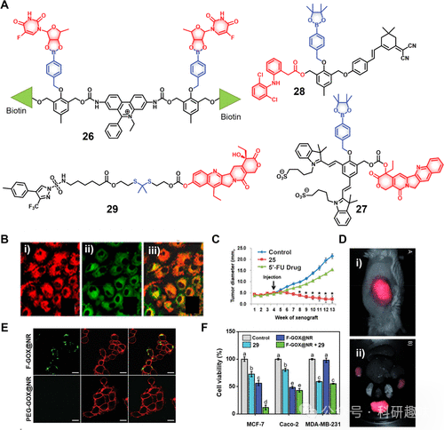

 

#  【化疗探针】过氧化氢响应治疗诊断探针 
 

‍
‍

**诊疗一体化荧光探针**

Theranostic Fluorescent Probes

**过氧化氢响应治疗诊断探针**

"ROS"这一术语指的是由分子氧（O2）还原形成的相对不稳定的分子和自由基集合，主要包括过氧化氢（H₂O₂）、超氧阴离子（O2-）、单线态氧（¹O₂）和羟基自由基（·OH）。细胞内ROS主要源自线粒体呼吸链活动和NADPH氧化酶催化的反应过程。此外，外部因素如紫外线照射和异生物质也可诱导ROS的生成。适量ROS对于维持细胞稳态至关重要，它们作为信号分子参与调控细胞生长、增殖、迁移及凋亡等基本生命活动。ROS通过调节特定蛋白质活性，还与血管功能、氧感应、免疫反应和基因表达调控等生理过程紧密相关。然而，ROS过量可引发氧化应激，导致核酸、脂质及蛋白质损伤，与多种疾病如衰老、癌症、心血管疾病、糖尿病及神经退行性疾病的发生发展密切相关。线粒体中，H₂O₂由超氧阴离子通过超氧化物歧化酶（SOD）转化生成，其在炎症细胞和癌细胞中的产生速率（约0.5nmol/104cells/h）显著高于正常细胞（约0.050±0.004nmol/104cells/h）。作为其他高活性ROS前体，H₂O₂以其较长的半衰期（t1/2=1ms）和在氧化应激情境下累积的特性，成为了ROS响应型递药系统中备受瞩目的激活因子，尤其考虑到大多数ROS半衰期极短（t1/2&lt;1μs）。在设计癌症特异性探针方面，多种化学基团如芳基硼酸酯、硫醚/硫酮、氨基丙烯酸酯、硒/碲化合物及聚脯氨酸等，已被探索用于响应H₂O₂。本节综述了在氧化应激（特别是H₂O₂触发下）激活的治疗探针进展。Kim等人开发的探针26（图12）是一个双药单元系统，其中5′-脱氧-5-氟尿苷（5-FU的前药）通过双苯基硼酸与乙脒荧光基团（作为线粒体凋亡指示剂）相连。由于乙脒部分带正电，诊疗试剂26在A549肺癌细胞中优先内化并富集于线粒体中。肿瘤细胞内较高的H₂O₂水平促使5′-脱氧-5-氟尿苷释放，进一步被胸苷磷酸化酶转化为活性药物5-FU。伴随乙脒与DNA的插入，释放出的自由乙脒和荧光增强共同作为荧光报告信号，实现实时监测细胞凋亡过程。在A549异种移植小鼠模型中，26通过尾静脉注射后，其在肿瘤组织中的荧光信号增强，与H₂O₂介导的探针激活相符。注射脂多糖（LPS）进一步增强荧光输出，进一步验证了氧化应激触发的机制。与对照组（PBS处理）和其他实验组（5′-FU直接处理）相比，治疗探针26显示了肿瘤特异性聚集和显著的肿瘤抑制效果。图12.(A)H₂O₂响应性治疗诊断探针的化学结构(26–29)与效果Shabat及其团队运用了一种近红外荧光探针Cy7，以实现药物活化与定位的精准监测。他们构建了诊疗试剂27（见图12），该分子由硼酸酯基团与氰基荧光基团及喜树碱(CPT)共价结合而成。在H₂O₂环境下，硼酸酯结构发生断裂，继而引发一连串反应，在约90分钟内逐步释放出游离的活性CPT与Cy7，同时在720nm波长处出现增强的荧光信号。实验结果显示，在U87细胞系中，27在H₂O₂作用下表现出较高的细胞毒性(IC50=40nM)，而在无H₂O₂条件下则毒性大减(IC50=250nM)。尽管27相对于药物本身CPT（IC50=20nM）的直接毒性来说有所降低，但因其减少了非特异性毒副作用，故被视为个性化医疗策略中的潜在策略。另一个与之相近的近红外探针28被设计用于H₂O₂介导的双氯芬酸（一种非甾体抗炎药物）在炎症环境下的巨噬细胞释放与监测。尽管苯基硼酸酯作为H₂O₂响应链接子被广泛应用，其在酸性条件下的不稳定性却可能限制了应用范围，导致药物在溶酶体等酸性细胞器中的非特异性激活。为解决此稳定性难题，YanLi和Nam团队创新性地引入了硫酮基链接体，该链接体在不同pH环境下均表现出增强的稳定性，其氧化裂解产物——硫醇和酮，成为药物递送体系研究的焦点。鉴于H₂O₂主要在线粒体中生成，治疗药物若无法有效聚集于此，则可能减弱抗癌效果。Landfester等人的研究提出了一种新颖策略：直接在癌细胞线粒体中原位生成H₂O₂。他们设计了复合型治疗探针29（图12），由塞来昔布修饰的SN-38通过H₂O₂敏感的硫酮连接方式相连，并封装于叶酸修饰的二氧化硅纳米颗粒内，该颗粒表面固定有葡萄糖氧化酶(GOX)，形成了所谓的纳米反应器F-GOX@NR。此纳米反应器经叶酸受体介导的内吞作用进入癌细胞后，GOX能催化葡萄糖转化为H₂O₂，进而诱导塞来昔布-SN-38共轭体中硫酮键断裂，释放出活性SN-38。随后，SN-38作为抑制剂引发细胞凋亡。对比实验揭示，F-GOX@NR+29nm反应器体系在叶酸和COX-2双阳性的MCF-7细胞中表现出显著增强的协同治疗效果（IC50=0.14μM，24小时），远优于单独使用SN-38（IC50=1.2μM，24小时）或塞来昔布-SN-38偶联物（IC50=2.8μM，24小时）。此外，SN-38固有的荧光变化（在H₂O₂作用下，最大发射峰由452nm移至560nm）提供了实时监测药物活化与分布的便利途径。  

**点击蓝字 关注我们**
‍
‍

预览时标签不可点

素材来源官方媒体/网络新闻

  继续滑动看下一个 

 轻触阅读原文 

    

