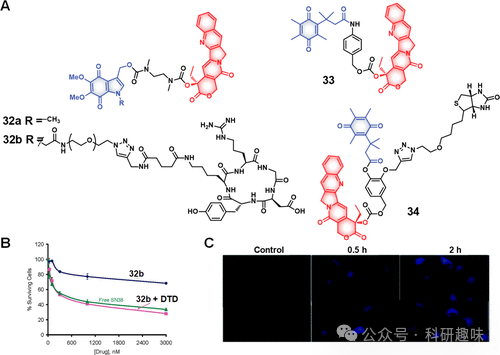
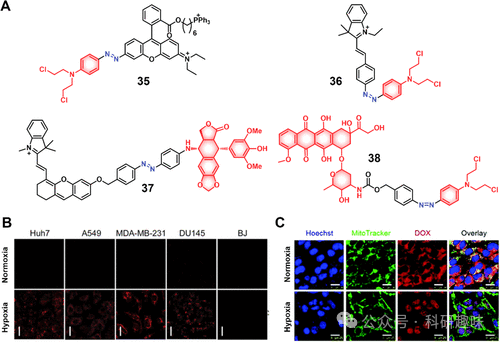
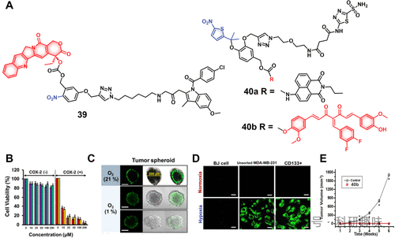
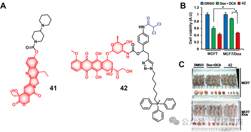
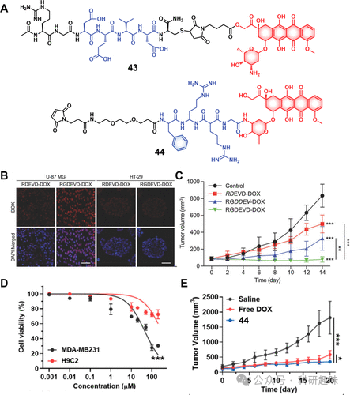
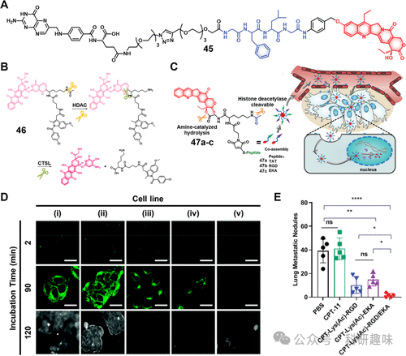
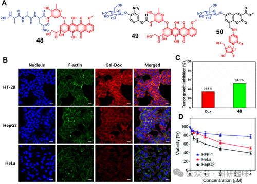

## **酶响应治疗诊断探针**

酶，作为生物催化剂的杰出代表，主要是由复杂蛋白质结构构成的大分子，它们在细胞内外催化各类化学反应，极大地促进了生命过程的速率。这些生物酶凭借其卓越的底物专一性、高效的催化活力以及对特定细胞环境的适应性，展现了作为精细化学反应调控工具的巨大潜力。事实上，关键酶活性的异常调节已成为诸如炎症、癌症及神经退行性疾病等多种疾病发病机制的核心环节。

鉴于此，通过精巧设计酶的特异识别底物，科研人员能够巧妙地封装或伪装抗癌药物，从而打造出一类崭新的治疗探针。此类探针不仅能够确保药物仅在目标位点被特异性酶激活，增强了治疗的精准性，还有效提升了药物的体内稳定性，并且在激活后展现出更为显著的治疗效果。以下内容将概述在这一创新领域中所取得的研究进展与成就。
### **DT-黄酶响应治疗诊断探针**
醌是一类在多种天然产物及合成或半合成化合物中频繁出现的核心结构单元，这类化合物包括但不限于抗癌药物、抗菌剂、染料、维生素K以及酶辅因子等。醌类化合物因其还原性特点，在氧化还原循环中扮演着核心角色。醌还原酶1（NQO1），又名DT-二磷酸还原酶，是一种主要分布于细胞质，且在线粒体和内质网中少量存在的双电子转移酶。该酶参与解毒机制，与肿瘤发生的早期阶段紧密相关，在卵巢癌、甲状腺癌、乳腺癌、结直肠癌和胰腺癌等多种癌症类型中发现其表达水平显著升高。正是由于在癌组织中NQO1的高表达，与正常组织形成鲜明对比，使得该酶成为肿瘤特异性药物递送系统中极具吸引力的内源性激活因子。

鉴于吲哚醌作为NQO1的已知底物，Nishimoto等人设计了诊疗试剂32a（图14），旨在利用这一特性向癌细胞输送细胞毒性药物SN-38，并利用DT-二磷酸酶介导的反应实现药物的可控释放，同时伴随荧光信号的变化。为了进一步增强对癌细胞的靶向性，研发了诊疗试剂32b，该分子结合了SN-38与吲哚醌，并通过整合素特异性肽序列作为靶向模块。诊疗试剂32b在表达αvβ3整合素的癌细胞中显示出优先吸收能力，其机制推测为通过NQO1介导的还原反应释放活性SN-38，并在人宫颈癌KB细胞株中产生了50-70%的生长抑制作用。释放的SN-38形成的烯酰亚胺中间体对DNA的烷基化活性被认为是引起细胞毒性的关键机制。

图14.(A)DT-心肌黄酶响应治疗诊断探针的化学结构。(B)治疗诊断探针32b、SN-38和32b+DTD在KB细胞中的细胞活力。(C)在不存在和存在治疗诊断探针33（10μM，2小时）的情况下，在不同时间点记录的A549细胞的荧光图像。

此外，一些研究工作聚焦于基于醌的前药设计，以期优化药物释放特性。Wang等人开发的一种含有“三烷基锁”的醌衍生物尤其引人注目，该结构在DT-二磷酸酶还原作用下转化为对苯二酚，通过内酯化形成稳定的六元环结构，从而促进连接于对苯二酚羰基上的药物有效负载的释放。这一设计理念在Wu等人报道的诊疗试剂33中得到应用，该药物递送系统旨在向癌细胞输送SN-38，且SN-38的内在荧光特性使药物释放和治疗效果的实时监测成为可能（图14）。Kim等人则在诊疗试剂34中引入了额外的功能性标记——生物素，作为癌症靶向基团，该系统展现出对癌细胞的优先摄取能力，并在假设的药物激活后增强了治疗效率。
### **偶氮还原酶响应治疗诊断探针**

偶氮还原酶，作为黄素依赖性酶家族的一员，在真核生物和细菌中普遍存在，多数定位于细胞膜，对于维持生物体内环境的稳态发挥着不可或缺的作用。这些酶通过利用NADH或NADPH作为电子供体，催化特定底物的还原反应。值得注意的是，偶氮还原酶在多种癌症（如肺癌、乳腺癌及胰腺癌）中呈现异常高表达，这一特性启发了科研人员探索以偶氮还原酶为靶点的治疗药物开发。

Kim等人设计的诊疗试剂35（图15）巧妙地利用偶氮连接策略，旨在将化疗药物精确递送至癌细胞线粒体中。该诊疗试剂由罗丹明123类似物与氮芥类似物N,N′-双(2-氯乙基)-1,4-苯二胺通过偶氮键桥接，并融入亲脂性三苯基膦基团以导向线粒体。在偶氮还原酶作用下，偶氮键断裂，同步释放出活性化疗药物与荧光示踪分子，为在乏氧肿瘤微环境中药物活化和定位提供了可视化的手段。尽管如此，35的多步骤合成复杂且溶解性不佳，限制了其转化应用潜力。针对这些问题，Xie等人推出了诊疗试剂36（图15），通过在结构中整合带正电荷的荧光团以确保线粒体靶向性，并减小极性表面积以改善水溶性，从而优化了设计。

图15.(A)偶氮还原酶响应治疗诊断探针的化学结构(35–38)。(B)不同细胞系中常氧(21%)和乏氧(3%)条件下治疗诊断探针35的荧光图像（比例尺=10μm，激发=555nm，发射=585nm）。(C)使用Hoechst33342和MitoTrackerGreen染色后，在常氧和乏氧条件下用治疗诊断探针38(20μM)处理后记录的4T1癌细胞共聚焦图像（比例尺=20μm）。

沿袭相似思路，Shi团队开发的诊疗试剂37（图15）采用了Cy作为近红外荧光探针，适用于活体药物跟踪。另一方面，Yu等人设计的治疗系统38（图15）将氮芥与阿霉素（Dox）通过偶氮键相连，在还原性条件下，两者得以释放，伴随Dox释放产生的荧光增强，为药物活化及细胞内分布提供了实时监测指标。基于4T1细胞模型的体内外研究表明，诊疗试剂38相比对照组（PBS或游离Dox）展现出更强的细胞毒性与更低的副作用，凸显了其在癌症治疗中的潜力。
### **硝基还原酶响应治疗诊断探针**
硝基还原酶（NTR），一种富含黄素单核苷酸（FMN）的酶，在多种肿瘤类型中过表达，其表达量与实体瘤内部的缺氧状态紧密相关，后者主要由血管发育不良或供血不足引起，常见于约50%-60%实体瘤的核心区域，尤其是快速增殖导致的血氧供应受限情况。针对缺氧微环境响应型药物递送系统（DDS）的深入探索已在诸多文献中得到体现。下面，我们将概述分子治疗领域内，乏氧敏感DDS的最新研究进展。

在开发乏氧敏感配方时，面临的首要挑战在于肿瘤的血管生成机制，因其能提升肿瘤区域的氧合水平，进而削弱疗法效果。因此，融合血管生成抑制策略与乏氧响应递药体系，成为提升DDS效能的关键路径。

硝基芳烃化合物作为NTR的理想底物，能够经由NTR催化转化为羟胺与胺类衍生物，且在自催化分解过程中促使芳香环电子重排，释放结合的药物分子。基于此，Kim等人设计了诊疗试剂39（图16），该分子通过硝基苯甲醇连接非甾体抗炎药物吲哚美辛与SN-38。此设计不仅利用COX-2过表达实现肿瘤靶向，还通过吲哚美辛抑制血管生成，增强治疗效果。在模拟缺氧（1%O2）条件下，诊疗试剂39对COX-2阳性A549和HeLa细胞展现浓度依赖性毒性，并在不同尺寸的A549多细胞肿瘤球中显示出与游离SN-38相应的强烈荧光信号，表明其能有效穿透组织并激活药物，可能得益于抗血管生成作用。

图16.(A)硝基还原酶响应治疗诊断探针的化学结构（39和40）。(B)治疗诊断探针39在不同浓度的COX-2阳性（A549、HeLa）和COX-2阴性（WI-38、BJ）细胞中的细胞活力。(\*p&lt;0.05)。(C)用探针39(25μM)处理后，常氧和乏氧条件下HeLa细胞肿瘤球体的荧光图像（第4天）(D)在常氧和乏氧条件（3%氧气）下用40a处理后记录的不同细胞群的荧光图像（比例尺=50μm）。(E)CD+133MDA-MB-231细胞在用DMSO或40b（5.0nM，24小时）处理然后施用于小鼠以测量肿瘤发生后的肿瘤体积与时间图。

同一团队进一步研发了针对癌症干细胞（CSCs）的诊疗剂对40a和40b（图16），采用二甲基硝基噻吩替换对硝基苄基作为乏氧响应触发元件，以期凭借其更优的还原电势促进药物释放。治疗部分采用具有抗癌潜能的3,4-二氟亚苄基姜黄素，并借助碳酸酐酶IX（CAIX）抑制剂乙酰唑胺实现对CSCs的选择性靶向。成像方面，则采用萘胺基荧光团。尽管40a和40b在药物释放单元上有所差异，但保留了相似的靶向和乏氧响应机制，故推测两者在细胞摄取和激活特性上具有相似性。通过CD+133MDA-MB-231乳腺癌细胞实验，确认了两者的乏氧敏感激活性能及抗肿瘤活性。特别是，诊疗试剂40b在异种移植小鼠模型中，通过尾静脉注射方式，显著抑制了CD+133MDA-MB-231肿瘤的生长，对比未经治疗的对照组，展现了其治疗潜力。
### **酯酶响应治疗诊断探针**

羧酸酯酶（CES）家族作为一类普遍存在于生物体内的水解酶，专注于催化酯键、酰胺键以及氨基甲酸酯键的水解过程，构成了生物体抵御外来有害物质入侵的重要防线。其中，CES1和CES2这两种同工酶尤为引人注目，受到了科研领域的广泛研究。研究结果表明，与正常组织相比，CES2在病理组织中的表达水平显著升高，特别是在肿瘤组织中尤为明显。

在癌细胞中，过度表达的CES被认为能够显著增强癌细胞的侵袭力、迁移能力、生存能力以及促进肿瘤增殖。例如，在恶性结直肠癌的案例中，CES的活性水平相较于正常组织有显著提升，其中男性患者的CES活性约为正常水平的2-4倍（0.45±0.25U/L对比0.17±0.09U/L），女性患者也呈现出类似的增长趋势（0.45±0.35U/L对比0.12±0.07U/L）。

基于这些发现，科研人员已经开发出了多种针对CES的响应型诊疗试剂，以实现对肿瘤组织的特异性成像和治疗效果的强化。例如，Kunimoto及其团队设计的诊疗试剂41，便是一种通过δ-内酯结构与SN-38经由氨基甲酸酯桥接形成的CES响应性化合物（如图17所示）。这种设计使得在CES的作用下，能够特异性地释放SN-38，从而实现对肿瘤细胞的精准打击。

图17.(A)酯酶响应性治疗诊断探针41和42的化学结构。(B)用DMSO、Dox+DCA(1:1)处理后，Dox敏感MCF7和Dox抗性MCF7/Dox细胞的细胞活力或治疗诊断探针42。(C)分别用DMSO对照、Dox+DCA(1:1)或治疗诊断探针42治疗后MCF7和MCF/Dox异种移植肿瘤模型的代表性图像。

在临床应用中，化疗面临的主要挑战之一是多药耐药性（MDR）的形成，这种耐药性使肿瘤细胞能在多种化疗药物的作用下存活。据统计，近九成的癌症死亡案例与MDR有密切关系。MDR的形成机制相当复杂，涵盖了药物摄取减少、药物外排泵活性的增强、DNA损伤修复效率的提升、异生物质代谢的加速以及遗传变异（如基因扩增、突变及表观遗传变化）等多种因素。

为了克服这一难题，Kim等人开发了一种新型的诊疗试剂42（如图17所示）。该试剂巧妙地结合了二氯乙酸（DCA）、通过酰胺键连接的阿霉素（Dox）以及疏水性三苯基膦（TPP）线粒体定位基团。其设计原理在于通过恢复癌细胞中异常的糖酵解途径至正常的线粒体氧化磷酸化过程，进而增强癌细胞对化疗药物的敏感性。

DCA作为丙酮酸脱氢酶激酶（PDK）的有效抑制剂，在诊疗试剂42中起到了关键作用。它能够促使癌细胞的糖代谢由糖酵解转向氧化磷酸化，这不仅有助于减少乳酸的积累、降低ATP水平，还能帮助恢复线粒体功能。此外，由于42分子在设计时即考虑到了线粒体定位，因此能够有效规避ATP驱动的ABC转运蛋白介导的初期药物外排，确保药物在细胞内的持久作用。

随着时间的推移，Dox在诊疗试剂42的引导下逐渐转移至细胞核，发挥其抗癌效应。细胞实验显示，诊疗试剂42在A549和HepG2癌细胞中的吸收效果优于正常细胞（如NHDF、IMR90），并且在治疗效果上显著优于单独使用Dox或DCA与Dox的联合使用。

在进一步的研究中，无论是在MCF敏感株、MCF/Dox耐药株还是相应的异种移植小鼠模型中，诊疗试剂42均展现出了显著的治疗活性。这一发现充分证明了其在克服耐药性方面的巨大潜力，为化疗提供了新的治疗策略和方向。
### **蛋白酶响应治疗诊断探针**
蛋白酶，作为催化肽键断裂的核心酶类，在蛋白质降解、消化吸收以及细胞信号转导等生物学过程中占据关键地位。其活性的异常变化与多种病理状态如炎症、肿瘤、心血管疾病以及神经退行性疾病密切相关。鉴于蛋白酶的重要性，近年来科研人员对蛋白酶抑制剂及蛋白酶响应型诊断与治疗探针的研发投入了大量精力。

其中，Caspase家族，特别是caspase-3，作为参与炎症反应、肿瘤发展及细胞程序性死亡调控的关键蛋白酶，备受关注。caspase-3作为一种半胱氨酸-天冬氨酸特异性蛋白酶，可由细胞内在途径或外源性治疗手段（如放化疗）激活，进而引发细胞凋亡。

Byun等人设计了一种创新的Caspase-3响应性抗癌药物43（如图18所示）。这种药物巧妙地将癌症靶向配体Arg-Gly-Asp三肽、Caspase-3识别序列DEVD四肽、酯类敏感连接方式以及化疗药物Dox融为一体。Dox不仅能直接激活caspase-3，而且在caspase-3激活后，通过酯键的水解释放自身，形成正反馈循环，从而显著增强治疗效果。

实验结果显示，该诊疗试剂在整合素阳性的U-87MG胶质瘤细胞中展现出了极高的细胞摄入与毒性，这主要归因于整合素介导的内吞作用。然而，在整合素阴性的HT-29细胞中，其毒性则相对温和。这一自增强凋亡策略在细胞水平上使Caspase-3活性提升了约154倍，并在U-87MG肿瘤小鼠模型中显著抑制了肿瘤的生长，展现了其巨大的应用潜力。

图18.(A)治疗诊断探针43和44的化学结构。(B)用RDEVD-DOX（对照）和RGDEVD-DOX治疗时记录的U-87MG和HT-29癌细胞的共焦图像。红色归因于阿霉素荧光，而蓝色表示细胞核（比例尺=50μm）。(C)分别用盐水、RDEVD-DOX、RGDDEV-DOX或43(RGDEVD-DOX)治疗后U-87MG异种移植小鼠的肿瘤抑制(n=6)(±SD\*p&lt;0.05,p&lt;0.01，\*p&lt;0.001（与对照相比）。(D)治疗诊断探针44在MDA-MB-231和H9C2细胞中的细胞活力 (E)用盐水、游离Dox或治疗诊断探针44治疗后MDA-MB-231荷瘤小鼠的肿瘤抑制(p&lt;0.05，\*p&lt;0.001)。
凝血酶，作为溶酶体蛋白酶家族的重要成员，在蛋白质代谢、免疫调节及细胞生命活动的调控中扮演着关键角色。其表达异常与多种疾病，特别是癌症的不良进展密切相关。特别是Cathepsin B，它在促进细胞外基质降解、加速肿瘤血管生成、侵袭和转移方面发挥着核心作用。Kim等人研发的诊疗试剂44（如图18所示），通过巧妙利用Cathepsin B响应肽序列FRRG，将Dox通过马来酰亚胺分子与白蛋白偶联，实现了药物的稳定化（半衰期显著延长至3.1小时）。在肿瘤微环境中，Cathepsin B的激活能够释放Dox，展现出对MDA-MB231乳腺癌细胞的高选择性毒性。

此外，Tian等人开发的诊疗试剂45（如图19所示）采用了叶酸靶向策略，通过Cathepsin B介导的SN-38递送系统，专一性地针对叶酸受体阳性的癌细胞（如SK-Hep-1、HeLa和Siha细胞）。在细胞内，该系统能够激活并释放活性药物，同时增强细胞核内荧光信号，显著增强了对这些癌细胞的杀伤效果（IC50约2-3μM）。而对正常细胞（如16-HBE）和FR阴性的A549肺癌细胞的毒性有限（IC50=20μM），表明了45在减少SN-38非特异性毒副作用方面的潜力。

组蛋白去乙酰化酶（HDACs）作为核心的表观遗传调节因子，对调控细胞内蛋白质活性与基因表达至关重要。研究指出，HDAC活性的异常增高与多种恶性肿瘤的发生发展，如神经母细胞瘤、胃癌、卵巢癌、结直肠癌及多发性骨髓瘤等存在显著相关性，并常预示患者预后较差。因此，构建针对HDAC的响应性药物递送系统成为了研究热点。Kim等人设计的诊疗试剂46结合了乙酰赖氨酸、Dox和吲哚美辛，旨在靶向COX-2阳性的肿瘤细胞。实验证实，该诊疗试剂在经历HDAC和CTSL的双重酶切后，能有效释放Dox并伴随荧光增强。细胞实验进一步揭示，不同细胞系对46的响应与各自的HDAC、CTSL活性及COX-2表达水平紧密相关，其中HeLa和HepG2细胞展现出最强的治疗效果，并在相应的肿瘤异种移植模型中呈现良好的肿瘤靶向性。

另一方面，Zheng等人提出了一套基于喜树碱（CPT）的HDAC响应型诊疗试剂库47a-c，通过采用多种肽序列如CRGDK、CREKA和TAT，实现对肿瘤的多级靶向策略。这些肽序列分别靶向αvβ3整合素、肿瘤血管和细胞核。实验数据显示，这些诊疗试剂在与HDAC1孵育时，药物释放效率高且快速（如47a在1小时内释放44.1%的CPT），且在无酶条件下保持高度稳定性，体现了高度的酶选择性释放机制。在细胞毒性评估中，所有诊疗试剂在表达HDAC1的癌细胞系中均展示出显著毒性，其中47b在4T1和MDA-MB-231细胞系中表现尤为突出。动物实验进一步证实，这些诊疗试剂能够有效抑制乳腺肿瘤生长，特别是双重组合策略在原位及转移性乳腺癌模型中展现了卓越的抗肿瘤活性。

豆豆蛋白酶（Legumain），作为一种溶酶体/血管天冬酰胺内肽酶，最初在植物中发现，而在哺乳动物体内则主要参与溶酶体功能。它在多种实体瘤中过度表达并与肿瘤进展密切相关，尤其是在前列腺癌、乳腺癌等多种癌症中观察到其活性增强。针对豆豆蛋白酶的活性，Riu等人设计了诊疗试剂48，通过特定的三肽序列Ala-Ala-Asn与Dox偶联，该序列能够被豆豆蛋白酶特异性识别和切割。研究发现，在模拟肿瘤酸性环境（pH 5.5和6.5）下，诊疗试剂48能够高效释放Dox，而中性环境下则几乎无药物释放。共聚焦显微镜分析证实了48通过内吞途径进入癌细胞，实现了增强的细胞毒性和减小的副作用，并通过“旁观者效应”对肿瘤及其周围微环境产生广泛影响。

图19.(A)治疗诊断探针45-47的化学结构。(B)示意图显示治疗诊断探针46的激活和药物释放。(C)治疗诊断探针47a-c的化学结构和激活模式，以及它们通过主动和被动肿瘤靶向和细胞核积聚以释放特定药物有效负载而在肿瘤组织中优先积聚。(D)治疗诊断探针46在(i)HeLa、(ii)HepG2、(iii)HCT116、(iv)MIAPaCa-2和(v)Caco-2细胞中的时间依赖性荧光图像。(E)47和对照的抗转移活性显示在实验终点有许多肺转移结节(n=5)。

半乳糖苷酶，作为酶学领域的重要成员，在分解代谢过程中扮演着不可或缺的角色，对生物体的正常运作至关重要。其中，β-半乳糖苷酶（β-gal）作为一种关键的溶酶体水解酶，其主要职责在于从糖共轭物中精准裂解末端半乳糖苷残基，这一独特功能在生物体的代谢调控网络中占据核心地位。

特别值得注意的是，β-gal在多种癌症中呈现异常高表达的现象，这一发现为癌症的靶向成像和药物研发提供了新的策略。近年来，β-gal在癌症诊断与治疗领域的应用研究取得了显著进展。

在诊疗学领域，Kim等人成功研制了一种新型β-gal响应性药物49。该药物通过自巯基连接技术将抗癌药物与半乳糖苷酶分子共价结合，实现了药物的高度稳定性和靶向性。在制备过程中，49在PBS中保持稳定，且不与非特异性受体结合；然而，一旦与β-gal相遇，半乳糖苷酶分子会迅速水解，从而释放出活性药物，并伴随荧光信号的显著增强。

细胞实验结果显示，49能够通过过表达的Asialoglycoprotein（ASGP）受体被高效吸收进入HT-29和HepG2细胞，而在ASGP表达水平较低的HeLa细胞中，其吸收率显著降低。此外，在HT-29和HepG2细胞系中，49展现了浓度依赖性的抗癌效果，显示了其优异的抗肿瘤潜力。

在动物模型中，使用HT-29癌症异种移植小鼠进行的肿瘤抑制研究证实，与单独使用Dox相比，49治疗后肿瘤生长受到显著抑制，这一结果为49作为潜在抗癌药物的开发提供了强有力的实验支持。

此外，Buniya等人也研发了一种新型诊疗试剂50。该试剂将β-gal响应的半乳糖苷酶分子与香豆素荧光团相连，并进一步与吉西他滨耦合。在β-gal的作用下，半乳糖苷酶分子发生水解反应，触发香豆素支架的分子内电子重排，从而释放出吉西他滨，并在短时间内产生强烈的荧光信号。由于细胞内酶对吉西他滨的快速代谢，其半衰期较短；因此，50的策略有望通过减少吉西他滨的不良代谢来提高其治疗效果。

细胞毒性实验表明，与游离吉西他滨相比，50在HepG2细胞中的毒性更高，而在正常HFF-1细胞中的毒性显著降低。这一结果进一步验证了50作为一种新型抗癌药物的潜力和优势。

综上所述，科研人员通过巧妙利用半乳糖苷酶在癌症中的高度表达特性，成功开发出具有靶向性和高效性的抗癌药物，为癌症的治疗领域注入了新的活力，并提供了宝贵的思路和方法。

图20.(A)治疗诊断探针48-50的化学结构。(B)用治疗诊断探针49(10μM)处理后的HT-29、HepG2和HeLa细胞的共焦图像。(C)用Dox和探针49处理后HT-29异种移植物（小鼠模型）的肿瘤生长抑制 (D)使用不同浓度的治疗诊断探针50处理后HepG2、HeLa和HFF-1细胞的细胞活力。  
