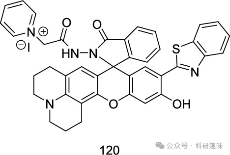
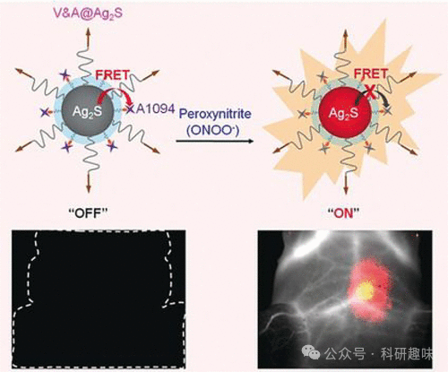
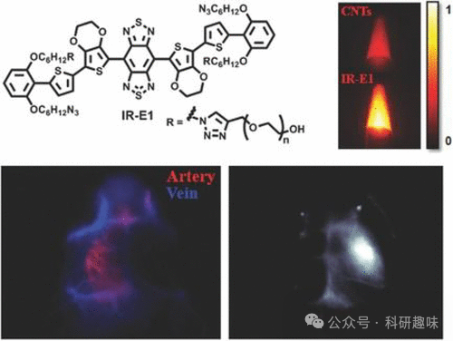
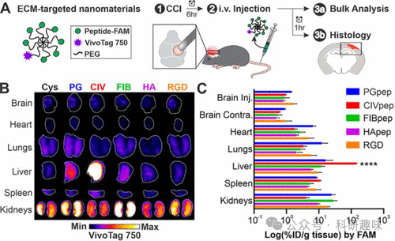
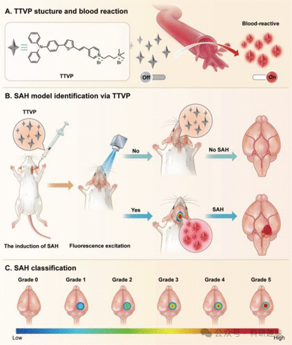
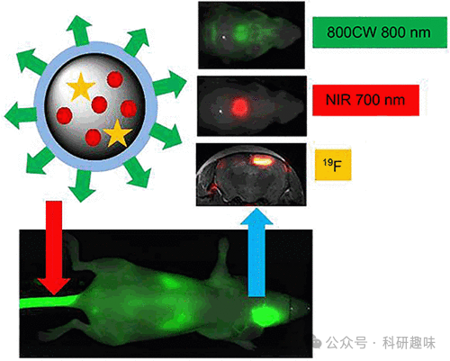

 

#  【器官损伤荧光探针】治疗脑外伤的荧光探针 
 

Grenemal

读完需要

9

全文字数 2800 字

**疾病诊断荧光探针**

Fluorescent Probes for Disease Diagnosis

**治疗脑外伤的荧光探针**

创伤性脑损伤（TBI），作为由长时间血流不畅或暴力创伤诱发的严重病理状态，是导致高致残率和致死率的关键因素之一。这种损伤常伴随不同程度的脑功能损害，包括感觉、运动、认知、行为及心理等方面的障碍。TBI后常伴有的继发性损伤，诸如炎症、血脑屏障（BBB）破坏、氧化应激、缺氧和缺血等，其初期阶段往往难以察觉，这迫切要求发展高效的诊断与治疗方法以实现实时早期的干预。

传统的创伤性脑损伤诊断方法，如CT和MRI，主要侧重于解剖与功能变化的检测，而对早期分子层面的波动响应不够敏感。因此，开发高灵敏度的诊断工具，以实现对TBI的早期原位实时诊断与治疗评估，显得尤为重要。

线粒体次氯酸（HOCl）与线粒体的氧化还原稳态紧密相关，其异常水平可诱导线粒体功能受损和细胞凋亡。2020年，Liu等人报道了一种结合ESIPT苯并噻唑和rhodol结构的比率型双光子荧光探针120（图50），用于实时监测线粒体中的HOCl水平。在该探针中，改性的rhodol染料作为荧光团，二肼作为反应位点，而阳离子季铵化吡啶则作为线粒体靶向基团。当加入NaOCl后，探针在453纳米处的荧光强度变化微小，而在595纳米处的荧光强度显著增强，实现了NaOCl的比率荧光成像。两个波长下的荧光强度之比（I595/I453）与NaOCl浓度呈线性关系，最高可达174 μM，检测下限（LOD）计算为55.4 nM。探针120展现出优异的性能，包括快速响应、高灵敏度和高选择性，同时其双光子激发特性赋予了其在深层组织（达270 μm）中成像的能力。因此，该探针为活细胞和组织中内源性HOCl的监测提供了有力的工具。

图 50.用于创伤性脑损伤线粒体次氯酸成像的探针120。

2020年，Li研究团队成功开发了一种名为V&A@Ag2S（探针121）的近红外-II纳米探针，旨在实现创伤性脑损伤（TBI）早期生物标志物的实时活体成像（如图51所示）。 Ag2S量子点因其独特的宽吸收光谱和尖锐的近红外-II发射光谱而备受关注。当与近红外吸收剂A1094结合后，A1094在1094 nm处呈现出强烈的吸收峰，这与Ag2S的发射窗口存在广泛的重叠，从而有效促进了量子点（QDs）与A1094之间的荧光共振能量转移（FRET）。这种能量转移导致了荧光的显著淬灭，使探针处于“关闭”状态。值得一提的是，探针121对过氧亚硝酸根（ONOO-）展现出高度的特异性，其在1050纳米波长处的荧光强度与ONOO-的浓度呈现出良好的线性关系。因此，探针121在小鼠创伤性脑损伤模型中成功实现了内源性ONOO-的实时监测。

图 51.用于观察 TBI 区域 ONOO 触发荧光反应的探针 121。

2016年，Dai等人设计了一种创新型的NIR-II荧光染料，旨在实现创伤性脑损伤小鼠的脑成像。该染料的结构灵感来源于大型OLED型发光体（如图52所示），并被命名为IR-E1（探针122）。探针122基于经典的供体-受体-受体结构，采用苯并[1，2-c:4，5-c′]-双（[1，2，5]噻二唑）作为受体，以噻吩基单元为供体，构建了一个具有较窄带隙的荧光团。此外，为了保护共轭骨架免受分子间和分子内相互作用的影响，该结构还引入了大分子3，4-乙氧基二氧噻吩作为桥基。

为了提升探针122的水溶性，研究者巧妙地在其结构中嵌入了PEG链。在808纳米波长的激发下，探针在水、PBS以及胎牛血清中均展现出1071纳米的发射波长，这充分证明了探针在不同溶剂和介质中均能保持优异的稳定性。

更重要的是，探针122成功用于监测小鼠创伤性脑损伤模型中的动态血管变化，包括最初的短暂低灌注现象。脑成像研究显示，这些病理变化不仅具有潜力成为药物试验或临床研究的生物标志物，还可作为治疗创新的潜在靶点。

图 52.用于对创伤性脑损伤进行无创评估的 122 号探头。

创伤性脑损伤（TBI）是儿童和青少年死亡与残疾的主要元凶之一，然而，目前尚无有效治疗手段能阻止初次损伤后引发的继发性损伤。这种慢性发展的继发性损伤部分归因于活性氧物种（ROS）向周边正常脑组织的释放。

在TBI的生物标志物中，异位蛋白酶活性的变化尤为显著，它们直接参与细胞死亡、细胞外基质分解以及炎症反应。2021年，Kwon及其研究团队成功研发出一种荧光活性纳米传感器（即123号探针），该传感器能特异性地聚集在大脑受损区域的损伤血管中，并在钙蛋白-1（Calpain-1）激活时发出荧光信号。这一创新技术为实时监测TBI相关的Calpain-1蛋白酶活性提供了可能（如图53所示）。

为提升123号探针的递送效率和生物利用率，研究者对基质靶向肽进行了深入评估。实验结果表明，透明质酸靶向肽能显著增强探针在受损脑组织中的分布，尤其是在病变区域及海马神经元内。这种透明质酸靶向肽涂层的探针通过配体价依赖的方式显著提高了其激活度，相较于非靶向纳米传感器，在受损皮层中的激活度最高提升了6.6倍。

图 53.（A） ECM 靶向探针 123 的示意图和实验设计概述。（B） 主要器官的 VivoTag 750 表面成像。（C） 基于 FAM 荧光的每克组织纳米材料注射剂量百分比（% ID/g）的批量定量（n = 3，平均值 ± SEM；\*\*\*\*，p ≤ 0.0001，双向方差分析，以及每个器官组内的 Tukey 多重比较事后检验）。

蛛网膜下腔出血（SAH）作为脑血管破裂所致的中风严重类型，对其出血程度的精确评估对于深入理解脑损伤机制和制定治疗策略至关重要。在2023年，戴氏研究小组基于AIE（聚集诱导发光）原理，利用生物探针TTVP（探针124）开发了一种新型的出血评估系统（如图54所示）。

探针124由4-溴-N，N-二苯基苯胺AIE核心单元与吡啶鎓基团构成，其激发波长（λex）为480纳米，发射波长（λem）为645纳米。由于其独特的分子转子状结构，探针124在水溶液中因其分子高度旋转而几乎不发光。然而，当加入四氢呋喃形成纳米聚集体时，探针的光致发光性质显著增强。

借助这些AIE特性、细胞膜亲和性以及白蛋白靶向能力，探针124能够在出血区域产生高信噪比的特异性荧光信号。该探针已成功应用于小鼠脑部蛛网膜下腔出血的检测，显示出其在SAH及其他出血性疾病出血程度分析中的巨大潜力，有望成为灵敏且高效的诊断工具。

图 54.探针 124 用于 SAH 检测和分类的示意图。（A） 124 号探针的结构及其与血液的反应。（B） 在小鼠模型中使用 124 号探针。（C） 根据在大脑中观察到的荧光强度对 SAH 进行分类。

创伤性脑损伤的一个显著后续影响是组织细胞的死亡或坏死现象。在2016年，Löwik、Cruz及其团队报告了一项创新研究，即利用PEG化聚乳甘酸（PLGA）纳米粒子（探针125）来实现对创伤性脑损伤坏死区域的双模检测与监测（如图55所示）。该探针的表面经过PEG脂质层的修饰，有效降低了非特异性结合，确保了特异性配体仅针对坏死区域进行作用。探针内部封装了IRDye 800CW等青色荧光染料，不仅作为荧光团发挥作用，还特异性地靶向失去膜完整性的细胞内蛋白质。

为了实现对创伤性脑损伤中坏死组织的串联光学成像和19F MRI成像，研究团队在探针125中引入了全氟化碳和NIR700两种物质。这两种模式均能够准确检测坏死组织，但光学成像方法在灵敏度方面表现更为出色。利用探针125，可以快速地对创伤性脑损伤状态进行定性光学监测，同时，通过定量三维核磁共振成像分析，还能够深入评估深层组织的病变程度。这一成果凸显了探针125在脑损伤坏死诊断领域的巨大临床应用潜力。

图 55.双模（近红外 + 19F MRI）探针 125（近红外 700 + PFCE）与 800CW 配体针对死亡细胞的示意图。

**点击蓝字 关注我们**

预览时标签不可点

素材来源官方媒体/网络新闻

  继续滑动看下一个 

 轻触阅读原文 

    

