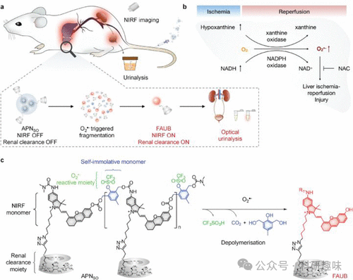

 

#  【器官损伤荧光探针】肝损伤荧光探针 
 

Grenemal

读完需要

18

全文字数 5000 字

**疾病诊断荧光探针**

Fluorescent Probes for Disease Diagnosis

**肝损伤荧光探针**

肝损伤，这一复杂且多发的疾病，主要由药物性肝炎、慢性病毒性肝炎或外伤等因素引发。然而，由于公众对于肝损伤早期症状的忽视和缺乏足够认识，许多病例在初期并未得到应有的关注。肝损伤的类型繁多，包括但不限于急性肝损伤、药物性肝损伤、肝缺血再灌注损伤等，每一种类型都需要我们进行详尽的研究和精准的诊断。

在这一背景下，关键生物标志物的研究显得尤为重要。这些生物标志物，如活性氧、金属离子、肝酶和ATP等（如图34所示），在肝损伤的诊断和监测中发挥着至关重要的作用。它们不仅能帮助我们更好地理解肝损伤的发生机制，还能为疾病的预防、治疗和康复提供科学依据。因此，对这些生物标志物的深入研究，将有助于我们更好地应对肝损伤这一全球性的健康问题。

图 34.部分肝损伤荧光探针。

作为氧化应激的显著标记物，ONOO-（过氧亚硝酸盐）在成像和研究肝损伤中备受关注，文献已报道了多种针对ONOO-的荧光探针。其中，Wang及其团队在2023年设计的探针95，基于萘胺结构，旨在精确测量急性肝损伤模型小鼠溶酶体中ONOO-的水平。在无ONOO-的环境中，探针95在450纳米波长处呈现微弱吸收；然而，一旦ONOO-氧化裂解硼酸酯，其吸收显著增强，同时555纳米波长处的荧光响应也相应增加。该探针不仅对ONOO-具有高选择性，还拥有快速响应时间（约70秒）、优异的LOD（0.13 μM）和极低的细胞毒性。在光甘油-12-肉豆蔻酸-13-乙酸酯（PMA）或脂多糖（LPS）诱导的LX-2细胞中共聚焦荧光成像实验中，探针95成功捕捉到了内源性ONOO-水平的上升，并在检测急性肝损伤小鼠体内ONOO-浓度升高方面展现了出色的性能。

ONOO-对ATP合成的有害影响，特别是通过ATP合成酶的失活，已引起广泛关注。鉴于ATP在细胞过程中的核心地位，ONOO-（及更广泛的氧化应激）可能导致严重的系统性问题。为了深入探究ONOO-与ATP之间的关系，2022年开发的探针96能够同时监测对乙酰氨基酚（APAP）诱导的肝毒性中ATP和ONOO-的浓度变化。这种基于双罗丹明-萘二甲酰亚胺的探针在初始状态下荧光微弱，但遇到ONOO-时，其4-BPin功能团被氧化为苯酚，从而触发ICT过程，导致荧光开启（λex = 450/488 nm，λem = 562/568 nm）。在ATP存在下，罗丹明荧光团通过可逆的非共价键合（π-堆叠和H键合）发生环形打开，形成荧光形式，进而增强587纳米波长处的荧光强度。这种双模式荧光策略允许同时监测ONOO-的增加和ATP的耗竭。探针96以其高选择性、pH稳定性和低生物毒性，在APAP诱导的HL-7702细胞损伤成像中表现优异。这种市售探针为监测药物诱导肝损伤（DILI）系统以及其他疾病/器官中的ATP和ONOO-浓度提供了强有力的工具。

2023年，Zhang等人针对氧化应激，设计了一种基于硫醇-色素“点击”反应的新型近红外荧光探针97，用于观察DILI中的硫醇通量（涉及ROS/硫醇平衡，详见第2.2节）。 探针97由色烯-硫醇识别基团和二氰异佛尔酮荧光团构成，荧光团上连有α、β-不饱和酯。硫醇与探针97反应后，经历一系列转化，首先丢失色烯分子，生成中间酚类，随后与不饱和酯进行环状连接，生成香豆素单车。这一过程不仅产生以540纳米为中心的新吸收，还降低了原有二氰异佛尔酮部分的400纳米吸收，并激发以705纳米为中心的新发射。探针97的荧光强度与Cys浓度线性相关，检测限低至33 nM，对Hcy和GSH的检测限分别为100 nM和40 nM。在生理条件下，探针97表现出卓越的选择性和对硫醇的快速响应能力，可用于细胞和斑马鱼体内硫醇波动的观察，以及DILI小鼠体内硫醇水平变化的监测。

同年，Tang等人开发了一种粘度激活的近红外-II荧光探针98，用于检测肝细胞和小鼠在肝缺血再灌注损伤（HIRI）过程中溶酶体的粘度变化。探针98融合了吲哚青绿（ICG）和IR-783的结构特点，产生红移近红外-II荧光发射。在低粘度水中，其仅在694纳米处显示微弱吸收；然而，随着介质粘度的增加，该吸收带几乎消失，同时820纳米为中心的吸收显著增强。当粘度从3.0 cP增加至46.00 cP时，864 nm处的荧光发射强度增加了13倍。荧光强度（log F864）与介质粘度呈现良好的线性关系（线性系数0.997），在甘油中的量子产率为0.34，比ICG高出2.6倍。探针98对粘度具有高度特异性，不同溶剂的极性变化对其荧光强度无显著影响。Tang等人利用探针98在HIRI中成功揭示了ROS-丙二醛-护肝素B信号通路。

2022年，Ye等人成功设计了一种名为探针99的多功能荧光探针，该探针能够同时检测APAP DILI（对乙酰氨基酚药物性肝损伤）和HIRI（肝缺血再灌注损伤）过程中溶酶体内的ATP（腺苷三磷酸）和H2S（硫化氢）。该探针的构建基于罗丹明6G与1，8-萘二甲酰亚胺的混合物，并结合二乙烯三胺和叠氮基团，分别作为ATP和H2S的活性识别位点。在ATP存在时，探针99在560纳米波长处的荧光发射显著增强，这是由于结合和开环反应导致的，如之前所述。而当存在H2S时，探针99在530纳米波长处的荧光发射迅速上升，这是由于叠氮功能的降低所引发的。探针99在酸性pH值范围（4.0-5.5）内对ATP表现出良好的响应，而对H2S的检测则具有更宽的pH工作范围（4.0-8.0），对这两种分析物均显示出极高的选择性（ATP的LOD为25.9 μM，H2S的LOD为0.628 μM）。借助探针99，可以精确地监测DILI和HIRI期间溶酶体中ATP和H2S浓度的动态变化。

同年，Yuan及其团队开发了一种新型NIR-II（近红外二区）荧光支架，即探针100，通过在氰型三甲基框架的两端引入富电子端基（如呫吨和苯并吡喃）来实现。 探针100的吸收和荧光发射均位于NIR-II区域（938/1001 nm、956/1005 nm、962/1015 nm 和 988/1058 nm）。该探针能与ROS（活性氧物种）和二硫化物产生可逆反应。在HClO（次氯酸）的氧化作用下，探针在三级氨基位点生成N-氧化物，而不经历进一步的重排或降解，导致980纳米波长处吸收和1040纳米波长处发射的减少，并在824纳米波长附近出现新的蓝移吸收带。当加入还原性活性硫后，氧化的探针恢复到原始状态，980纳米波长处的吸收和1040纳米波长处的发射重新增强，探针回到“NIR-II导通”状态。研究表明，探针100具有出色的光稳定性，能够在急性炎症和肝损伤/修复模型的氧化微环境中可逆地检测HClO。

Tang小组于2019年报道了探针101，该探针能够协同双选择性识别O2-（超氧阴离子）和ONOO-（过氧亚硝酸盐）。探针的设计基于咖啡酸，这是一种超氧化物的有效识别位点。在与O2-反应时，咖啡酸中的儿茶酚基团被氧化成邻苯醌，从而发出蓝色荧光。同时，探针另一侧的近红外荧光团Cy5与ONOO-反应，导致多甲基链的裂解和Cy5荧光的淬灭。通过这些反应，ONOO-关闭了近红外荧光，而超氧化物则开启了蓝色荧光信号。因此，该探针允许对两种ROS进行独立的多通道测量。该探针对O2-和ONOO-均表现出极高的灵敏度、选择性和特异性，O2-的检测限为6.38 nM，ONOO-的检测限为6.09 nM，且分析物之间无相互干扰。有趣的是，该探针还能对O2-进行可逆荧光成像，因为与内源或添加的还原剂反应后，非荧光的儿茶酚基团得以再生。利用探针101，研究人员成功监测了HIRI模型中线粒体的O2-和ONOO-水平，揭示了O2--ONOO--精氨酸酶1介导的红外损伤信号通路，以及精氨酸酶1硝化对红外损伤的不利影响，为治疗HIRI提供了潜在的新策略。

2021年，Zeng等人开发了一种基于H2S激活的比率纳米探针NaYF4:Gd/Yb/Er@NaYF4:Yb@SiO2（探针102），该探针具有高效的正交NIR-II发射，可用于二甲双胍诱导的肝毒性的原位高度特异性可视化。探针102以NaYF4:Gd/Yb/Er@NaYF4:Yb@SiO2为核心，表面覆盖有Ag纳米点，形成类似红花酢浆草的结构，尺寸为75纳米。探针102主要被肝脏吸收，随后在损伤肝脏组织中过量表达的内源性H2S的触发下，通过原位硫化转化为NaYF4:Gd/Yb/Er@NaYF4:Yb@SiO2@Ag2S，从而产生以1053 nm（808 nm激光照射）和1525 nm（980 nm照射）为中心的正交发射。探针102对H2S展现出卓越的选择性和特异性，其LOD值低至0.7 nM。

利用探针102的活化正交特性，研究人员成功实现了对二甲双胍肝毒性的原位高特异性比率测定近红外成像。这一创新技术为监测药物性肝损伤及其机制提供了新的视角，并有可能促进肝脏疾病诊断和治疗策略的发展。通过精确地测量和分析在特定生物过程中H2S的波动，我们能够更深入地理解其在生理和病理过程中的作用，为药物研发和疾病治疗提供重要的科学依据。

图 35.使用探针 102 观察 H2S 二甲双胍诱导的肝毒性示意图。

2022年，Liu等研究者成功开发了一种可逆氧化还原探针103，该探针由稀土离子掺杂的纳米颗粒（RENPs）和基于钼的聚氧化金属盐纳米团簇（Mo-POMs）共同构建，旨在实时成像肝缺血再灌注损伤（HIRI）过程中的活性氧物种（ROS）波动（如图36所示）。通过吸收竞争诱导发射（ACIE）效应，RENPs作为发光分子发挥作用，而Mo-POMs则扮演了竞争者和ROS识别单元的角色。RENPs中掺杂的钕和镱元素使得探针在808纳米（钕激发）和980纳米（镱激发）的激光照射下产生比率发光信号，这一特性显著减少了生物组织的自发荧光干扰。当Mo-POM层经历氧化过程（MoV转变为MoVI）时，Mo-POMs的吸光能力增强，导致与RENPs之间的发光竞争减弱，进而以RENPs为中心的发射增强。这种氧化状态可以通过接触如谷胱甘肽（GSH）等还原剂来实现可逆还原。基于这一创新平台，探针103展现出了对-OH和GSH的可逆检测能力，其荧光强度比F808/F980与-OH浓度在1.0至9.0 μM范围内呈线性关系，检测限低至0.46 μM，从而有效实现了对HIRI期间ROS波动的实时监测。

图 36.探针 103 对 HIRI 中 ROS 的近红外-II 成像。

2022年，Wang和Pu等人成功研发了一种名为探针104的聚合物基纳米探针（APNSO），该探针具备O2激活的近红外荧光响应特性和肾脏清除开关机制，旨在应用于HIRI（缺氧缺血再灌注损伤）的无创活体成像以及肾脏代谢的深入分析（如图37所示）。

探针104由四大核心单元构成：氧气敏感反应单元、自裂解单元、笼式荧光团单元以及肾脏清除单元。荧光团单元与自裂解单元紧密相连，共同构筑了探针的聚合主体结构。随后，通过引入O2敏感的三酸酯基团和肾清除型羟丙基β-环糊精单元，对探针进行功能化修饰。所得聚合物因其两亲性特性，能够在水介质中自主自组装成纳米颗粒。

在无氧环境下，探针104保持非荧光状态。然而，一旦环境中存在氧气，ROS（活性氧物种）将触发三酸酯的裂解反应，导致探针104的主体结构自我解聚，并释放出肾脏可清除的近红外荧光片段，即荧光人工尿液生物标记物（FAUBs）。因此，在全身给药后，探针104在肝脏中累积，随后通过超氧化物诱导的裂解过程释放FAUBs，为实时近红外荧光成像及肾脏代谢分析提供了有效手段。

图 37.用于近红外荧光成像和 HIRI 尿液分析的探针 104 的设计、合成和机制。

2019年，Yuan和Peng等人精心设计了两种高选择性比率荧光探针——UCNPs@PEI@E-CC（探针105）和UCNPs@PEI@H-CC（探针106），旨在追踪肝炎关键指标ONOO-（图38）。这两种探针的构建基于上转换纳米粒子（UCNPs）和两种创新的吡啶基发色团E-CC或H-CC。最初，UCNPs在540纳米和660纳米处的上转换发光（保持810纳米发射不变）被发色团有效淬灭。随后，当发色团暴露于ONOO-时，它们经历氧化并“解体”，从而释放出发光信号。这一机制使得探针能够精准实现ONOO-的比率检测（通过I540/I660或I660/I810的比值）。

尤为令人振奋的是，探针105和106展现出对ONOO-的高度选择性，有效排除了如HOCl和SO32-等其他漂白活性分子的干扰，显著降低了潜在竞争者带来的风险。此外，探针105和106的检测限分别达到了154 nM和241 nM，呈现出令人瞩目的纳摩尔级检测灵敏度。这些具备高选择性和高灵敏度的探针已成功应用于新型CCl4诱导的肝损伤小鼠模型的成像研究。

图 38.基于探针 105 和 106 的 ONOO- 比率检测。（a）作用机制。（b，c） 含发色团 E-CC （105） （b） 和 H-CC （106） （c） 的探针的紫外/可见光谱，以及在 980 纳米激发下，UCNPs 在修饰前后的上转换发射光谱。

在医学和临床领域，与癌症一样，GGT（γ-谷氨酰转肽酶）被视为药物性肝损伤（DILI）的关键生物标志物，对于严重DILI病例的诊断具有不可或缺的价值。在2016年，Wu和Zeng等人取得了一项突破性的成果，他们成功开发了首个用于可视化GGT的TP（双光子）荧光探针——探针107。

该探针巧妙地运用了一种源自DCM（二氰基甲烯基）的荧光团作为TP荧光报告物，同时以谷氨酸作为ICT（分子内电荷转移）荧光淬灭剂和识别单元。当探针暴露于GGT时，谷氨酸单元经历裂解过程，释放出具有高电子负载的苯胺，这一变化在635纳米波长处引发以ICT为中心的强烈荧光发射带。

值得一提的是，探针107在GGT检测中展现出优异的性能。在暴露于GGT后30分钟，其荧光强度达到最大值，且在0-35 U/L的GGT浓度范围内呈现出良好的线性响应，检测限低至0.057 U/L。此外，探针107还具备出色的光稳定性和选择性，使其在实际应用中具有广泛的潜力。

作为验证其实际应用价值的实例，探针107已成功应用于药物诱导斑马鱼肝损伤的成像研究，为药物性肝损伤的诊断和监测提供了有力的工具。

**点击蓝字 关注我们**

预览时标签不可点

素材来源官方媒体/网络新闻

  继续滑动看下一个 

 轻触阅读原文 

    

