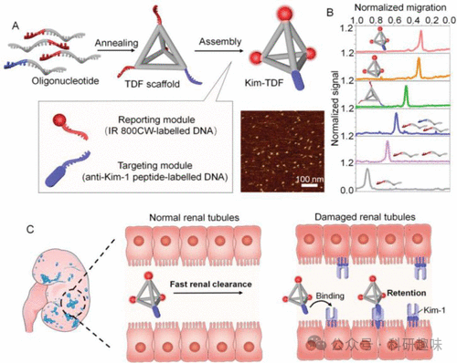

 

#  【器官损伤荧光探针】肾损伤荧光探针 
 

Grenemal

读完需要

18

全文字数 4900 字

**疾病诊断荧光探针**

Fluorescent Probes for Disease Diagnosis

**肾损伤荧光探针**

急性肾损伤（AKI），作为一种肾功能急剧丧失或严重下降的病症，因其高发病率和死亡率，已成为全球范围内亟待解决的健康问题。AKI的诱因多样，包括但不限于败血症、低血压、器官衰竭、肾结石、身体创伤以及药物过量。然而，在预防可能导致生命威胁或致命的AKI方面，一个关键挑战在于实现准确的早期诊断。遗憾的是，当前临床诊断主要依赖于血清肌酐和血尿素氮的检测，这些方法在AKI早期诊断中的灵敏度尚显不足。

为了弥补这一不足，高灵敏度、低成本的分子光学成像技术为AKI早期诊断带来了新的希望。该技术能够检测O2-、ONOO-、HClO等生物标志物，以及与细胞凋亡密切相关的caspase-3等关键分子。

在2022年，Kim及其合作者开发了一种名为融入式余辉纳米传感器（MANS）的多功能元件，即探针108，旨在实现顺铂诱导的肾损伤的超氧化物反应性可激活余辉成像（图39）。这一创新性的设计将荧光探针Ir-OTf与具备余辉底物和发光体双重功能的rubrene相结合，并巧妙地嵌入到聚合物胶束纳米粒子中。探针108的运作机制基于一个简单的“关-开”可激活系统，其中超氧化物能够长时间（超过11分钟）激活余辉发光。这一激活过程通过裂解Ir-OTf中的三酸酯实现，进而触发系统的发射。

在实际应用中，探针108成功应用于小鼠模型中顺铂诱导的肾损伤分子成像。其独特的余辉功能使得能够成像病理状态下过度产生的超氧化物，且不受自发荧光的干扰，为AKI的早期诊断和治疗提供了有力的工具。

图 39.IrOTf （探针 108）的分子结构和 O2 激活的磷光。

2021年，Zhang等人提出并验证了一种创新的策略，该策略基于肽介导的近红外-II荧光团递送，旨在实现肾脏中的长期累积（超过48小时）。他们观察到，通过在如吲哚菁绿等小型有机荧光分子上引入亲水性多肽，这些分子的生物代谢路径得到了显著改变，从而减少了它们在体内的捕获、清除和降解过程，最终实现了在肾脏中的长期靶向成像。

基于这一发现，Zhang及其研究团队精心设计了ROS激活的肾脏靶向纳米探针GNP-KTPs-ICG（探针109）。这一纳米探针由三个关键部分构成：吲哚菁绿（ICG）作为荧光标记物，金纳米粒子（GNPs）作为载体，以及肾脏靶向肽（KTP）作为导航分子（如图40所示）。探针109在注入体内后，能够高效地积聚在肾脏组织中，并在与活性氧物种（ROS）发生特异性反应后，促使荧光标记的ICG-KTP基团从金纳米粒子上释放，从而触发出强烈的近红外-II荧光信号。这一特性使得探针109能够实现对体外或体内肾脏损伤的高灵敏度成像。

图 40.（A） 不同染料-KTP 结合物在体内的代谢途径示意图，以及在近红外-II 窗口的无创肾脏监测。（B） 用于检测肾功能障碍的 ROS 响应探针 109 的设计。

在2020年，Pu团队成功合成了两种近红外化学发光报告物（NCRs）探针110和111，这些探针在肾脏清除率方面表现出色，适用于实时成像肾脏内的活性氧物种（ROS）和活性氮物种（RNS）（如图41所示）。这些NCRs的核心结构包括一个β-环糊精清除单元和一个包含Schaap's二氧杂环丁烷的化学发光修饰的DCM分子。特别地，探针110（NCR1）被设计为特异性响应超氧阴离子（O2-•），而探针111（NCR2）则针对过氧亚硝酸根（ONOO-）进行识别。这两种探针的发光体上分别连接了不同的生物标记特异性反应单元，即三氯酸盐（针对探针110）和醛（针对探针111）。

这些NCRs展现了纳摩尔级别的灵敏度，以及高效的肾脏清除能力，能够灵敏地检测细胞内ROS和RNS浓度的细微变化，进而监测肾病肾脏中生物标记物的水平。值得注意的是，研究结果显示探针110比探针111更早地被激活，这暗示了O2-•和ONOO-在病理过程中是依次增加的，其中O2-•在急性肾损伤（AKI）中首先增加。此外，通过检测尿液中分泌的荧光NCRs，可以实现AKI的尿液分析比传统组织学分析提前24小时，为早期诊断和干预提供了可能。

图 41.（a） 110 和 111 这两种探针的总体作用机制。（b） 110 和 111 的化学结构，用于检测 AKI 中的 O2- 和 ONOO-。R = H 或 CHO。

造影剂诱导的急性肾损伤（CIAKI）作为一种医学并发症，显著特点在于使用造影剂后肾功能的急剧下降。在2019年，Pu等人精心设计了双功能探针112，通过实时监测氧化应激（特别是超氧阴离子O2-•）和溶酶体损伤（由N-乙酰-β-d-葡萄糖苷酶，NAG作为指标），实现了对CIAKI的体内实时成像（如图42所示）。

该探针112融合了化学发光和近红外荧光两种信号通道，前者在O2-•的触发下发光，后者则在NAG的激活下显现荧光。尤为值得一提的是，探针112拥有极高的肾清除率（高达80%），这意味着它能够有效地检测活体小鼠肾脏中超氧阴离子和NAG的升高，从而在肾小球滤过率下降或组织损伤通过传统检测方法显现之前，就实现对CIAKI的诊断。

这一创新的设计使得探针112有望超越现有的临床检测方法，为急性临床环境下的肾功能实时无创监测提供一种全新的工具，从而为患者提供更及时、更有效的治疗策略。

图 42.具有开启化学发光和近红外荧光功能的光学探针 112，用于检测 O2 和 NAG。

纳米粒子因其尺寸特性，通常会被肾小球迅速滤过并清除，这限定了它们与肾脏的相互作用时间，但同时也为精确传感提供了便利。然而，这一特性与超声波信号通常较弱的问题相结合，使得基于纳米粒子的平台在直接成像和诊断肾脏疾病时面临重大挑战。

针对这一问题，Liu和Wu在2021年取得了显著的进展。他们开发出了一类新型的超小、肾脏清除型发光金纳米粒子（PMIZ-AuNPs，探针113）。这些纳米粒子表面涂覆有pH响应的齐聚酰亚胺唑基团，这些基团在特定pH值下能诱导电荷反转和聚集。具体而言，当pH值为7.4时，探针113的尺寸为3.5纳米，而在pH值降低至5.5的酸性环境中，其尺寸显著增大至1048纳米，这归因于氢键的强烈作用导致的显著聚集。

这种pH响应性聚集不仅显著增强了超声波信号，而且在探针113通过肾小球过滤被清除后，其会在肾小管的酸性环境中发生聚集，从而增加了重吸收、在肾脏内的停留时间以及荧光和超声信号的强度。这一特性使得探针113在成像肾脏损伤方面比之前的纳米探针更为有效。

此项研究揭示了通过调节发光探针113的体内清除途径，可以实现一种荧光-超声合作成像策略，这一策略在未来有望用于早期肾损伤的诊断，并提供更为精确的解剖信息。

图 43.具有 pH 值诱导电荷反转和聚集特性的探针 113，可通过受伤肾小管细胞的重吸收和原位聚集，进行早期肾损伤的协同荧光和超声诊断。

在2021年，Ye团队通过创新的“一锅顺序点击反应”策略，成功设计并合成了磷脂酰丝氨酸（PS）靶向且能被Caspase-3激活的近红外荧光探针1-DPA2（简称探针114）。该探针在药物诱导的急性肾损伤（AKI）早期阶段，展现出了对肾脏细胞进行无创实时成像的卓越能力（如图44所示）。

探针114的构造精妙，它结合了三唑取代的IR780荧光团、Caspase-3可识别的多肽（G-DEVD-G）、两个PS靶向配体（DPA-Zn）以及一个近红外荧光淬灭剂（QC-1）。在没有Caspase-3存在的环境下，QC-1与IR780的相互接近会导致近红外荧光的淬灭。然而，当引入Caspase-3后，DEVD链接器被特异性裂解，从而释放荧光团，导致在808 nm处的荧光发射显著增强。这种荧光增强与0.01-0.2 μg/mL范围内的Caspase-3浓度呈现出良好的线性关系。

通过应用探针114，研究人员实现了对小鼠肾脏中荧光信号的实时成像，观察到探针主要在小鼠肾脏中积累。这一发现使得在顺铂刺激诱导的小鼠AKI早期过程中，能够实时监测caspase-3的活性变化。此外，该探针还能够用于监测小鼠在接受N-乙酰-L-半胱氨酸治疗后AKI的恢复情况，为药物疗效评估和疾病治疗进展的监测提供了新的有力工具。

图 44.Caspase-3 介导的探针 114 水解为荧光产物 2-DPA2。

在2020年，Pu小组成功合成了一种新颖的荧光声学聚合物肾脏报告探针FPRR（探针115），旨在实现药物诱导性急性肾损伤（AKI）的实时成像（如图45所示）。 探针115的构造精妙，由三个关键分子组成：首先是聚合物葡聚糖，作为肾清除促进剂（已在先前研究中提及），其次是近红外荧光/光声（NIRF/PA）信号产生用的半氰基分子，最后是生物标志物响应分子γ-谷氨酰基。

类似上述提及的探针设计，半氰胺的羟基部分被γ-谷氨酰基分子所掩盖，这一设计巧妙地抑制了探针的荧光发射。然而，一旦探针暴露于γ-谷氨酰转肽酶（GGT）环境中，γ-谷氨酰基分子将被特异性裂解并消除，进而解除对荧光发射的抑制，导致近红外荧光和光声信号的显著增强。
这项创新研究不仅首次验证了活化型光声探针在分子水平上对肾功能进行实时、灵敏成像的可行性，而且进一步突出了高肾清除率聚合物探针在生物医学成像领域的广泛应用前景。
图 45.用于 AKI 实时近红外荧光和 PA 成像的 115 号探针的示意图和分子机制。

2022年，Xia及其研究团队报道了一种基于四面体DNA框架（TDF）的纳米装置Kim-TDF（探针116），该装置被设计用于早期急性肾损伤（AKI）的体内近红外成像（如图46所示）。探针116的构建融合了三个核心功能模块：首先，尺寸可调的TDF纳米结构作为肾脏靶向载体，确保探针能够精准定位；其次，引入了生物标志物肾损伤分子-1（Kim-1）的特异性结合模块，以实现对受损肾脏组织的精准识别；最后，搭载了商用近红外信号模块（IR CW800），以产生强烈的近红外荧光信号。

该探针能够选择性地聚集在Kim-1含量较高的受损肾脏组织中，从而释放出强烈的近红外荧光信号。由于探针的大小设计得当，它能在健康肾脏中迅速清除，从而显著降低了背景信号的干扰。在Kim-1尿液分析前6小时和血尿素氮检测前12小时，通过使用Kim-TDF探针（探针116），研究人员成功地实现了对AKI的早期诊断，这为临床上AKI的早期干预和治疗提供了有力的技术支持。

图 46.（A） 第 116 号探针的合成。（B） 通过原生 PAGE 凝胶电泳鉴定探针 116。（C） 利用探针 116 对 Kim-1 进行荧光成像的示意图。

2019年，Pu研究小组成功合成了一种近红外-II荧光分子半导体CDIR2（探针117），旨在实现对活体小鼠肾功能障碍的实时成像（如图47所示）。探针117的构造精妙，由两部分组成：一是独特的近红外-II荧光团，二是肾脏清除使能分子（（2-羟基丙基）-β-环糊精）。该NIR-II荧光团采用了典型的“屏蔽单元-供体-受体-供体-屏蔽单元”设计，其中苯并[1，2-c:4，5-c′]-双（[1，2，5]噻二唑）作为受体，3，4-乙氧基二氧噻吩作为供体，而二烷基芴则担任屏蔽单元的角色。

在活体小鼠全身给药后，探针117通过肾小球滤过作用迅速清除，且不被肾小管重吸收，最终分泌至尿液中。相较于其他同类探针，探针117展现出了显著的优势：其高信噪比确保了成像的清晰度，极高的肾脏清除率（24小时后约90%）保证了探针的快速代谢和排出，同时极低的体内代谢减少了潜在的生物毒性。这些特点使得探针117成为无创监测肾功能障碍和开发其他肾脏相关探针的理想选择。

图 47.用于肾功能障碍实时近红外-II 荧光成像的探头 117。

2022年，Tang及其研究团队成功开发了近红外AIE探针AIE-4PEG550 NPs（探针118），这是一种先进的水溶性系统，旨在通过双模式荧光和光声成像技术来诊断小鼠肾脏纤维化（如图48所示）。探针118是一种电子供体-受体-供体（D-A-D）构型的AIEgen（聚集诱导发光基团），通过与0.55 kDa的PEG-NH2进行PEG化修饰，显著提高了其水溶性。

这种水溶性近红外荧光团不仅展现出优异的光稳定性和生物相容性，而且能够精准地识别早期肾脏纤维化。其较小的分子量（约26 nm）使得探针118能够轻松通过肾脏滤过（3.3 kDa），并在24小时内实现高达93%的肾脏清除率。这些特性赋予了探针118卓越的成像性能和良好的生物相容性，使其成为未来开发临床诊断测定的极具潜力的候选材料。

图 48.（A） 自组装超小探针 118 的设计和光物理过程。（B） 利用探针 118 对小鼠肾脏纤维化的进展进行双模成像。

在肾损伤研究领域中，最后一个值得关注的例子是张氏研究小组于2022年研制的一系列刷状荧光探针（如图49所示）。这些探针，如FBP912和119，以偶氮-BODIPY为核心结构，展现出优异的肾脏清除特性。这些探针的发射波长可通过调整取代基来实现精准调控，覆盖从725纳米至1025纳米的宽广范围（如图49所示）。 其中，探针119是通过原子转移自由基聚合（ATRP）技术，在氮杂-BODIPY基单体和低聚（乙二醇）二甲基丙烯酸酯之间合成的水溶性探针。这一设计显著延长了其在体内的循环时间（t1/2 &gt; 6小时）。经过优化后，探针119的近红外-II荧光强度超过了先前报道的所有可清除近红外-II探针的10倍以上，并且在12小时内表现出65%的清除率，为高效、灵敏地检测HIRI（缺氧/再灌注损伤）提供了有力工具。

图 49.近红外-II 刷大分子荧光团。

**点击蓝字 关注我们**

预览时标签不可点

素材来源官方媒体/网络新闻

  继续滑动看下一个 

 轻触阅读原文 

    

