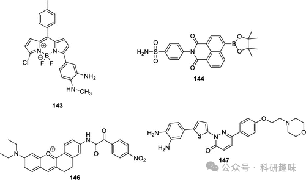
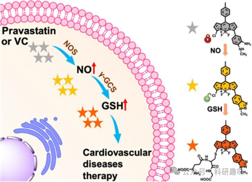
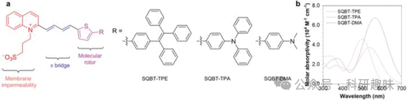
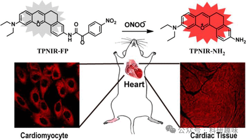
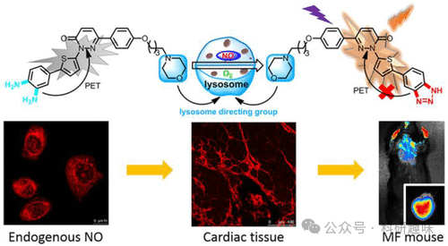

## **其他心血管疾病的荧光探针**

内皮细胞在心血管系统中扮演着守门人的角色，它们构成了一道选择性的屏障，调控血液与血管壁之间大分子的交互。研究表明，氧化应激可导致内皮功能障碍，这是心血管疾病发病的重要因素之一。因此，明确与NO（一种重要的血管扩张剂）和GSH（NO的还原剂）相关的信号通路，对于预防心血管疾病及深入理解ROS（活性氧物种）介导的内皮损伤下游效应至关重要。

在这一背景下，2021年Yang等人开发了一种基于BODIPY的荧光探针143，用于特异性检测NO和GSH（如图71和图72所示）。该探针在NO存在时表现出荧光开启的特性，随后在GSH的作用下发生红移发射。这种独特的顺序激活机制在药物处理的内皮细胞和斑马鱼模型中首次被观察到，揭示了NO诱导的GSH上调现象，进而揭示了一种新的NO/γ-谷氨酰半胱氨酸合成酶/GSH信号通路。这一发现对于心血管疗法的开发具有重要的潜在价值。
图 71.部分心血管疾病探针。
图 72.用 143 号探针监测人脐静脉内皮细胞中 NO 和 GSH 的连续生成，治疗心血管疾病。

高尔基体相关的氧化应激，特别是H2O2的水平，与高血压的进展紧密相关，直接反映了高尔基体的氧化应激程度。2019年，Tang研究团队成功设计了一种新型的高尔基体靶向探针144，用于在生物体内原位检测H2O2水平。这款探针的结构设计精巧，由萘二甲酰亚胺荧光团、过氧化氢响应官能团以及高尔基体靶向苯磺酰胺分子三部分组成。其合成和修饰过程简便，预示着该基础结构框架在传感领域具有广泛的应用前景。Tang团队利用探针144深入研究了高血压小鼠肾脏中高尔基体H2O2的产生情况，发现其水平显著升高。

到了2022年，Tang团队再次取得突破，报道了一系列用于高脂血症诊断的智能近红外荧光探针（图73，探针145），进一步丰富了该领域的研究成果。这些探针基于分子转子供体-齐聚物单元受体模板，展现出独特的扭曲ICT特性，使其在水环境中荧光微弱，但在高粘度介质中聚集时发出强烈荧光。由于这些探针能够根据环境可逆地切换聚集状态和荧光状态，无需发生化学反应或结构变化，因此被称为“智能聚集体”。令人兴奋的是，这些发光物质同时具备近红外-II和近红外-III发光特性，并展现出较大的斯托克斯偏移（950纳米），预示着它们在开发“超组织透明”成像剂方面具有巨大的潜力。在小鼠模型中，这些探针成功实现了低血脂症（HLP）的体外检测和体内成像，并且其发射强度与HLP患者血液样本中的多个关键病理参数呈良好的线性关系。

图 73.（a） 探针 145 的分子设计和制备。（b） 探针 145 在二甲基亚砜中的吸收光谱。

心脏毒性在新药研发及临床应用过程中常构成严峻挑战，以蒽环类抗癌药为例，其高效治疗能力伴随显著的心脏毒性，为临床应用带来极大困扰。为精准评估这一风险，Tang研究团队于2018年成功研发了一种新型TP近红外荧光探针——146号探针，专门用于线粒体中ONOO-（过氧亚硝酸根离子）过度表达的成像检测（如图74所示）。

通过该探针的应用，研究团队在心肌细胞及小鼠模型中观察到，蒽环类药物心脏毒性早期阶段线粒体ONOO-水平显著上调。这一发现表明，146号探针可作为药物诱发心脏毒性的早期生物标志物，为新药研发过程中的药物筛选提供重要参考，并有助于在治疗过程中预防心脏不良事件的发生。

图 74.用于 ONOO- 成像的 146 号探针示意图。

在2020年，Xu小组研发了一种新型探针147，专门用于心肌纤维化的成像研究（图 75所示）。这款探针在接触到内源性和外源性NO时，其特有的三嗪基团会迅速发生裂解反应，从而有效抑制了PeT（光诱导电子转移）引起的荧光淬灭现象。此外，由于探针147具备高效的吗啉溶酶体靶向能力，它成功应用于追踪和研究动物组织中NO的产生，特别是溶酶体内一氧化氮的生成情况。

在小鼠心肌纤维化模型中，探针147展现出了优异的体内成像性能。通过这一研究，我们得以深入阐明心肌一氧化氮产生与心肌纤维化之间的动态关联和渐进过程，为心血管疾病的研究提供了新的视角和工具。

图 75.147 NO 成像示意图。

   

