## **动脉粥样硬化荧光探针**

动脉粥样硬化是一种复杂的病理过程，涉及脂肪、胆固醇以及其他物质在动脉内壁的逐渐累积。这些累积物被医学界统称为“斑块”，它们随时间的推移会逐步增大，导致动脉管腔的狭窄，进而阻碍血液的正常流动。更为严重的是，这些斑块可能因内部压力过大而发生破裂，进而损伤血管壁，为血栓形成提供了条件。

动脉粥样硬化斑块的形成是众多心血管疾病的始作俑者。为了实现对这一病理过程的精准监测和有效干预，近年来，科学家们致力于研发基于活性分子变化的荧光探针技术。这些荧光探针能够特异性地响应动脉粥样硬化过程中的关键分子变化，并通过荧光信号的强弱和变化来反映斑块的生成和发展情况（如图60所示），为动脉粥样硬化的早期诊断和干预提供了新的策略。
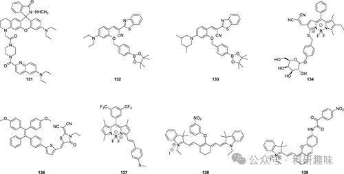图 60.部分动脉粥样硬化荧光探针。
在2021年，Canary小组展示了一种新颖的荧光探针131的开发及其在生物学领域的应用，该探针旨在准确测量体外和体内过氧亚硝酸根（ONOO-）的浓度（如图61所示）。 探针131作为一种基于反应的比率测量工具，具备100纳米的显著红移发射光谱，这使得它能够灵敏地响应ONOO-浓度的微小变化。

在细胞和小鼠模型的研究中，发现巨噬细胞内的ONOO-水平与精氨酸酶-1的活性呈负相关。进一步地，在动脉粥样硬化小鼠体内，探针131能够实时追踪进展斑块和退化斑块中ONOO-的动态变化，揭示了动脉粥样硬化过程中活性氧（ROS）水平的上升。

这些实验结果支持了一个重要假说：在动脉粥样硬化的消退阶段，高表达精氨酸酶-1的M2样巨噬细胞逐渐富集，通过降低ONOO-水平，进而发挥抗动脉粥样硬化的作用。鉴于ONOO-在动脉粥样硬化过程中的有害影响，利用探针131来揭示精氨酸酶-1潜在的抗动脉粥样硬化机制，对于未来开发针对动脉粥样硬化的新型疗法具有极其重要的指导意义。
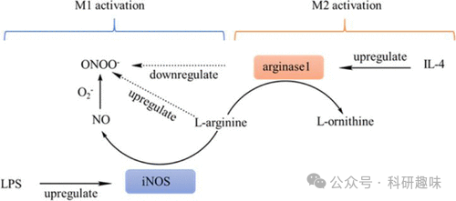
图 61.精氨酸酶 1 下调 ONOO-

2023年，Zheng等人报道了一种先进的双分析荧光报告系统132，该系统基于逻辑顺序激活机制，能够精准地以过氧亚硝酸根（ONOO-）和脂滴为靶标，实现对体内动脉粥样硬化斑块的准确识别（如图62所示）。此探针设计为双锁荧光系统，首先通过与ONOO-发生特异性反应，去除对苄基宾ROS识别基团，进而释放出一个酚官能团。这一官能团随后与邻近的丙烯腈发生闭环反应，生成一种具有显著荧光特性的香豆素衍生物。

值得注意的是，探针132的荧光特性强烈依赖于其所处的溶剂环境，使其能够区分水滴和脂滴，并仅在脂滴的环境中展现出强烈的荧光信号。这一特性使得探针132无需额外的二级靶向或反应单元，即能凭借对脂质（高度非极性）环境的固有选择性实现精准检测。尤为值得一提的是，当探针132进入脂滴时，其荧光增强率高达365倍，相较于典型的商用探针，展现了更优异的选择性和信噪比，为动脉粥样硬化的早期诊断和监测提供了强有力的工具。
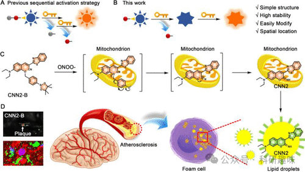
图 62.ONOO-/LD 序列激活的荧光探针 132 的设计。（A、B）先前工作（A）和探针 132（B）所采用的设计策略。（C） 探针 132 的机制。（D） 探针 132 的术中成像。

"AND"分子逻辑门正日益受到研究人员的青睐，为通过优化荧光增强（F/F0）以最大化信噪比提供了一种高效策略。以探针132为例，其中脂滴作为可控背景输入，目标分析物作为可变输入。这种双重锁定机制实现了荧光的完全淬灭，从而为目标分析物提供了极高的F/F0比值。同一研究团队进一步利用此原理，对探针进行了重新设计，得到了新型探针133（如图63所示）。遵循相同的反应机理、检测方法和荧光歧管技术，这款改进型探针在受到ONOO-激活并进入液滴后，展现出了惊人的2600倍荧光增强。这一框架为新型高信噪比、显著荧光增强技术的开发提供了一个高效且创新的平台。
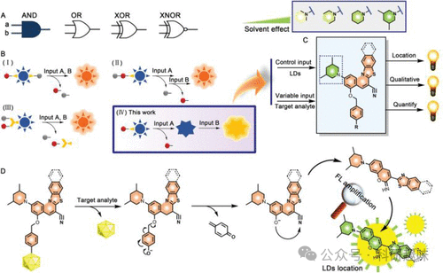
图 63."AND" 分子逻辑门探针 133。（A） 分子逻辑门。（B，C） "AND" 分子逻辑门的设计原理。（D） 探针 133 的荧光激活机制。

最新的研究成果揭示了衰老细胞，包括血管内皮细胞、平滑肌细胞和巨噬细胞，在动脉粥样硬化形成和发展过程中的关键作用。为了对衰老进行成像，科学家们开发了一种针对衰老相关β-半乳糖苷酶（SA-β-Gal）的成像技术。具体而言，通过将134封装在聚乳酸-羟基乙酸共聚物（PLGA）纳米颗粒的内核中，成功制备了SA-β-Gal传感纳米颗粒（如图64所示）。研究表明，这些纳米探针在动脉中表现出良好的聚集性，进而实现对动脉粥样硬化小鼠体内衰老细胞的高效成像。
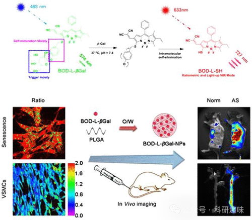
图 64.探针 134 的 β-Gal 传感机制。

在动脉粥样硬化等进展性疾病的治疗中，手术切除病变和斑块通常是一种有效且有时是唯一的治疗手段。在此过程中，对动脉粥样硬化斑块进行可视化对于实现积极疗效至关重要。正如之前所讨论的案例，荧光成像技术为达成此目标展现了巨大的潜力，目前荧光引导下的动脉粥样硬化手术新方法正处于研发阶段。

例如，一种可能的方法是，在动脉外侧应用含有类似于上述135号探针类型的荧光探针的脂质激活贴片。这种贴片能够促进探针在组织中的扩散，从而在动脉粥样硬化小鼠的手术过程中迅速且准确地定位斑块（如图65所示）。通过快速识别泡沫细胞中脂滴的异常积聚，斑块成像可在5分钟内完成。斑块与正常组织的荧光比值高达4.3，使得斑块与非斑块组织之间的区分变得轻而易举，从而实现对颈动脉粥样硬化的精准诊断。

利用脂质激活探针的可见荧光生物成像技术，能够精确识别直径小至0.5毫米的斑块。这种在手术过程中对斑块进行原位术中荧光成像的开发，为未来的临床评估和图像引导下的手术干预提供了新的视角，同时也为荧光探针在斑块识别中的应用开辟了新的前景。
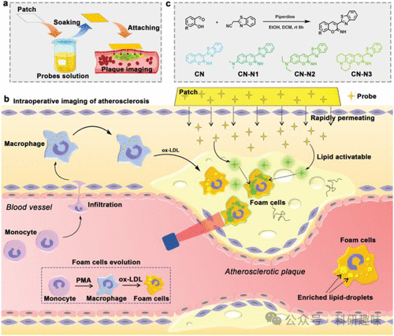
图 65.利用原位斑块对动脉粥样硬化斑块进行术中成像的脂质可激活荧光探针 135。

2022年，丁氏研究团队成功研发了一种基于聚集诱导发光（AIE）原理的纳米探针136，其核心成分源于罗丹宁衍生物。该探针以其高精度、高灵敏度和快速响应的特性，在动脉粥样硬化斑块的早期检测以及药物筛选中展现出了显著优势。相较于典型的参考探针，探针136在摩尔消光系数、光致发光量子产率方面表现出色，同时拥有理想的吸收/发射光谱红移。这款纳米探针采用两亲性共聚物作为封装基质，并通过表面功能化处理结合抗CD47抗体，实现对动脉粥样硬化斑块中过度表达CD47的特异性识别。实验证实，探针136能够有效区分缺乏载脂蛋白E的小鼠（动脉粥样硬化模型）中不同阶段的斑块。尤为值得一提的是，探针136能在动脉粥样硬化早期阶段识别斑块，这一能力远超传统的CT或MRI成像技术。因此，探针136在评估阿托伐他汀和GW3965等抗斑块药物的潜力时发挥了关键作用，其研究结果与这些药物已知的临床效果相吻合。

同年，刘氏研究团队也报道了一种名为探针137的双靶向序列荧光系统。该系统采用了一种名为序列内高特异性双报告器解锁（iSHERLOCK）的技术，实现了对动脉粥样硬化斑块在体内和体外的精确识别（图66）。iSHERLOCK能够同时检测HClO和脂滴，这两种物质均为动脉粥样硬化的典型标志物。与前文提到的探针类似，探针137在水介质中不显示荧光，但进入非极性脂滴时即被“激活”，随后HClO触发的氧化作用进一步引发荧光信号的转变，实现双重输出的功能。
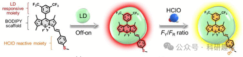
图 66.iSHERLOCK 探针 137 的示意图，用于 LD 和 HClO 的 "关-开 "和比率检测。FY 和 FR 分别代表黄色和红色通道中的荧光强度 （FI）。

22019年，Tang研究团队发表了关于两种近红外荧光探针138和139的研究，这些探针被设计为用于动脉粥样硬化斑块脆弱性的光声成像，特别关注于斑块的氧化应激/炎症活动。这些探针能够检测与氧化应激密切相关的GSH/H2O2氧化还原偶联物，并通过与牛血清白蛋白（BSA）的结合，形成BSA-Cy-Mito纳米探针（如图67所示）。这种基于BSA的自组装结构展现出了优异的生物相容性和延长的血液循环时间，有效增强了其在生物体内的渗透性和保留性。在765纳米和680纳米波长下，该纳米探针能够产生强烈且特异的GSH和H2O2响应信号。

BSA-Cy-Mito纳米探针在氧化低密度脂蛋白激活的巨噬细胞以及高脂饮食导致的载脂蛋白E缺乏小鼠模型中，成功用于GSH/H2O2的检测，从而能够准确诊断与氧化还原相关的炎症过程。通过全身给药，BSA-Cy-Mito纳米探针能够基于不同的氧化还原状态，有效区分易损斑块和稳定斑块。这种高灵敏度的氧化还原反应型光声纳米探针，有望成为早期识别易损斑块的有力工具，为实施成功的预防性治疗策略提供有力支持。
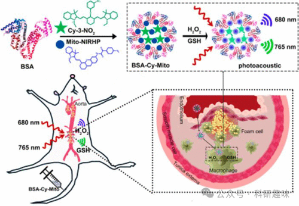
图 67.基于荧光探针 138 和 139 的 GSH/H2O2- 响应型 BSA-Cy-Mito 纳米探针的结构，用于体内 PA 氧化还原状态成像，以评估动脉粥样硬化斑块的脆弱性。

在炎症和胁迫环境中，pH值的变化通常是一个重要的生物标志物，动脉粥样硬化疾病中也不例外。针对这一现象，Tang及其合作者于2023年研发了一种基于MOF（金属有机框架）的双检测荧光纳米传感器PCN-NP-HPZ（如图68所示，探针140），并成功应用于动脉粥样硬化斑块的成像研究。该传感器通过结合pH敏感基团哌嗪和磷酸盐与ZrIV，实现了对pH值和磷酸化的同时高灵敏检测与成像。

Tang等人利用探针140监测了动脉粥样硬化小鼠在斑块形成不同阶段血液pH值和磷酸化水平的变化。实验结果显示，动脉粥样硬化小鼠主动脉内壁的酸度明显增加，这一变化与血管内皮炎症紧密相关。同时，与正常小鼠相比，磷酸化水平也显著升高。这些发现为深入理解动脉粥样硬化斑块的形成机制以及动脉粥样硬化早期阶段的病理环境提供了重要的实验数据和理论支持。
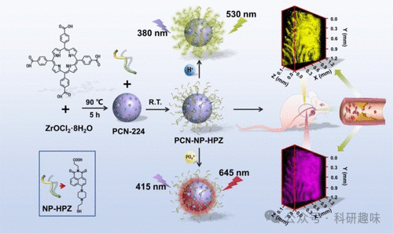
图 68.探针 140 的合成及其在动脉粥样硬化小鼠荧光检测和双光子荧光成像中的应用。

2023年，唐氏研究小组在动脉粥样硬化研究领域取得了新的突破，他们开发了一种基于MOF（金属有机框架）的动脉粥样硬化传感器，该传感器旨在监测斑块形成前的关键生物标志物。这款名为I3--RhB@PCN-224（探针141）的探针，被设计用于同时监测磷酸化和葡萄糖水平（如图69所示）。

探针141的制备过程采用了对MOF进行后修饰的方法，通过引入碘（I3-）-罗丹明B复合物来实现。该探针能够利用ZrIV与磷酸盐的特异性相互作用来监测磷酸化水平，同时，其I-RhB成分则对葡萄糖展现出高度选择性识别能力。

唐氏研究小组利用探针141对早期非斑块阶段的动脉粥样硬化进行了深入研究，以评估这两种目标分析物在病变过程中的变化。通过TP成像技术，他们发现早期动脉粥样硬化小鼠的蛋白质磷酸化和葡萄糖水平均显著高于正常小鼠。这一发现为未来的动脉粥样硬化治疗策略和研究提供了新的视角，可能对疾病的早期诊断和干预产生重要影响。
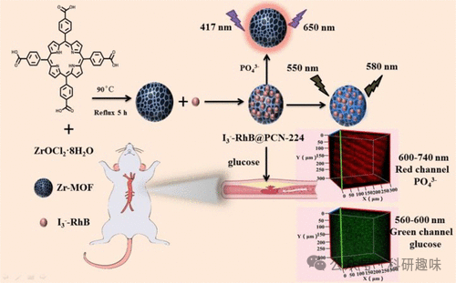
图 69.纳米探针 141 的合成及其在早期动脉粥样硬化模型中磷酸化和葡萄糖水平的检测和成像应用。

2021年，张研究小组成功研制出一种新型比率计量半导体聚合物纳米粒子（RSPN，探针142），旨在针对缺乏载脂蛋白E的肺炎小鼠模型中的易损斑块进行精准的光声成像。这一创新方法针对肺炎这一显著加剧斑块破裂风险的因素，提供了有效的成像策略（如图70所示）。

探针142具有独特的化学性质，能够与氧气发生反应，并在690纳米附近产生显著增强的光声信号。同时，其在800纳米的发射作为内部不变的参照，确保了测量的准确性和可靠性。通过比率测量法，探针142能够精确量化主动脉粥样硬化内的O2--水平，从而帮助研究人员评估易损斑块的氧化应激程度。

值得特别注意的是，探针142在实验中展现出卓越的性能，能够明确区分有斑块的小鼠、有斑块且患有肺炎的小鼠以及健康小鼠。这一发现充分证明了探针142在预测斑块易损性方面的巨大潜力和实用价值，为未来的动脉粥样硬化研究提供了新的工具和方法。
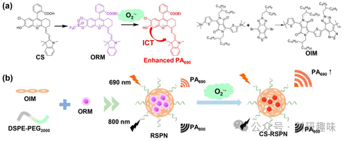
图 70.（a） 荧光探针 142 的结构和开启机制。（b） RSPN 的一步式自组装。

   

