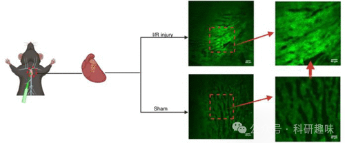
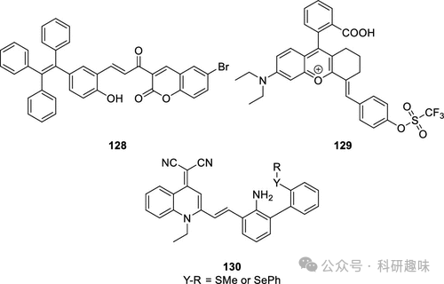
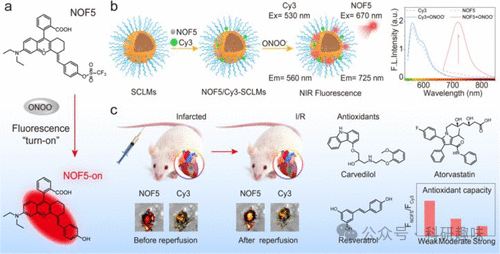
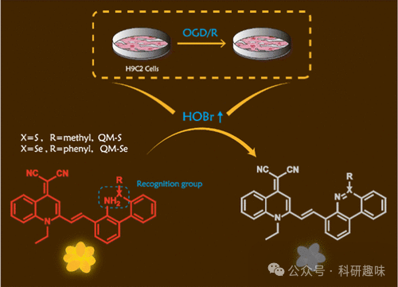

## **缺血再灌注损伤的荧光探针**

缺血性心脏病是一系列心脏问题的总称，这些问题源于心脏动脉的狭窄或堵塞，导致心脏缺氧（缺血），进而引发急性心肌梗塞（MI，俗称心脏病发作），对心脏造成广泛且难以逆转的损害。尽管及时的再灌注治疗可以通过恢复缺血组织的冠状动脉血流来减缓疾病进程，但这一过程也伴随着心肌缺血再灌注损伤（MI/RI）的风险。MI/RI是一个复杂的过程，涉及氧化损伤、线粒体功能障碍、细胞凋亡、炎症、能量代谢紊乱和钙超载等多种因素和机制。

其中，氧化应激是MI/RI的重要诱因之一，它在再灌注后持续造成损伤。超氧阴离子是这一过程中的关键分子，作为氧化应激的典型生物标志物，因其是多种活性氧（ROS）的最终来源而备受关注。超氧阴离子（O2-）由线粒体电子传递链和烟酰胺腺嘌呤二核苷酸磷酸（NADPH）氧化酶等多种酶产生，并通过与超氧化物歧化酶作用生成H2O2，进而引发一系列ROS的生成。

2023年，Li小组成功设计与合成了基于活性的传感探针126和127，用于在活细胞中对O2-进行高特异性成像（图 56）。研究发现，1，2，4，5-四嗪（Tz）作为超特异性的O2-反应触发器，与其他ROS无交叉反应。Tz本身具有荧光淬灭特性，其降解会导致荧光”点亮”，当暴露于O2-时，荧光强度显著增强。通过微调探针结构，可以实现探针反应性和发射波长的变化，从而在不同颜色/波长下以出色的空间分辨率对细胞内的O2-进行成像。基于探针设计的通用性，Li小组进一步开发了一个高通量药物筛选模型，从223种天然产品中筛选出coprostanone，该物质能有效减轻氧化应激引起的损伤。这一研究不仅揭示了一种新的超氧化物特异性反应单元，还展示了其在ROS选择性荧光探针中的有效应用，为ROS探针设计提供了新的功能模式。

图 56.心肌损伤时超氧化物生成的体内外成像。

超氧阴离子（O2-）作为所有活性氧（ROS）的源头，是过氧亚硝酸根（ONOO-）生物生成的关键前驱体，ONOO-则是NO与O2-反应的产物。在再灌注损伤中，ONOO-含量异常丰富，其ROS/RNS双重反应性赋予其相较于其他ROS或自由基更强的细胞毒性，从而可能导致心肌细胞的丧失。为了深入探究这一过程，Tang小组于2019年设计并合成了荧光探针128，专门用于实时监测ONOO-的动态变化。该探针对ONOO-展现出高灵敏度和特异性，因此能够精准捕捉并确认缺血期间细胞内ONOO-的累积情况。

进一步地，通过将探针128（图57）与硫化氢（H2S）特异性探针结合使用，Tang小组实现了对H2S和ONOO-浓度的同步成像。当用能够上调H2S的雌二醇E2处理细胞时，实验结果显示探针128的荧光信号显著下降，而H2S探针的信号则明显增强，这有力证明了H2S浓度的增加确实伴随着ONOO-浓度的降低。这一发现不仅证实了H2S在降低ONOO-浓度方面的作用，进而减少氧化应激，还暗示了雌二醇E2在缺血事件中可能具有保护心肌细胞的潜力。

图 57.用于 MI/RI 的荧光探针。

图 58.（a） 129（NOF5）的荧光开启机制。（b） 以 Cy3 为内参构建比率传感器。（c） 心脏中的荧光比率 FNOF5/FCy3 可用于实时监测心脏中 ONOO- 的水平，并就地评估药物的抗氧化能力。

Tang等人在2023年成功研发了两种具备聚集诱导发光（AIE）特性的荧光探针130，旨在监测心肌缺血再灌注损伤（MI/RI）过程中的次溴酸（HOBr）动态（如图59所示）。与多数现有探针的设计不同，这两种探针采用了“关闭”机制，即当HOBr与探针发生氧化反应时，探针的荧光发射被有效抑制。

这些探针的测试结果显示，在H9C2心脏细胞中，HOBr的浓度在MI/RI过程中显著上升，这一发现进一步证实了HOBr与先前已确认的活性氧（ROS）共同参与了MI/RI中的氧化应激过程。鉴于MI/RI同时涉及炎症和铁离子迁移等复杂生物过程，Tang团队利用抗氧化剂（如N-乙酰半胱氨酸NAC、雌二醇E2）、环氧化酶-2（COX-2）抑制剂（如吲哚美辛、舒利迭酸）以及铁离子迁移抑制剂（如Fer-1）来降低氧糖剥夺/再灌注（OGD/R）期间H9C2细胞中HOBr的水平，并通过监测荧光强度的变化来评估其效果。

在这项研究中，探针130作为一种高效的成像工具，被用于揭示OGD/R与H9C2细胞中HOBr水平之间的潜在关联，为深入理解MI/RI的分子机制提供了有力的实验支持。

图 59.在 MI/RI 期间使用 130 号探针对 HOBr 进行细胞内观察。

   

